# ASCR: Alternating Semantic-Confidence Revision

ASCR is a research prototype for studying and correcting confidence-semantic inconsistency in masked image-token generation. The central observation is that an image region can become confidence-stable during iterative denoising while still being semantically wrong with respect to the text prompt. Stage 1 starts with a zero-training implementation that uses a visible 4x4 grid and structured local semantic feedback to selectively reopen image-token regions instead of retrying the whole image.

This README is the project control document. It records the research plan, implementation plan, current progress, expected interfaces, cluster workflow, and GitHub synchronization policy. It should be updated whenever a meaningful implementation batch is completed.
 
## Stage 1 Status Log (2026-05-22, fair-comparison rerun complete)

**Three bugs discovered and fixed:**

1. **GENERATION_TIMESTEPS default override** (commit `557d2fc`, 2026-05-22): `compare_showo_ascr_parallel.py` always forwarded `--generation-timesteps ${GENERATION_TIMESTEPS}` to the worker CLI, silently overriding yaml's `generation_timesteps: 50` with the sbatch default of 18. Fixed: sbatch defaults changed to 50.
2. **Qwen pairwise RIGHT-position bias** (commit `557d2fc`, 2026-05-22): Whichever model was placed on the RIGHT always won lopsidedly. Fixed: `pair_bagel_vs_hard64_run.py` gains `--swap`; BAGEL 3-way judge now loops fwd + swap.
3. **`confidence_steps: 3` root bug** (commit `3fb04b5`, 2026-05-22): `configs/stage1_showo_qwen35_9b_fullcap_parallel.yaml` had `confidence_steps: 3`. `ShowOAdapter.initialize()` passes this explicitly as `steps=self.confidence_steps` to `run_confidence_block()`, which uses `steps = int(steps or self.generation_timesteps)` — because `3` is truthy, the `generation_timesteps: 50` fallback was never reached. **ShowO baseline was running only 3 MaskGIT steps, not 50.** ASCR ran at most 3 + 8×3 = 27 steps vs ShowO's 3 — a 9× compute gap, not a fair comparison. Fixed: `confidence_steps: 3 → 50`, `max_iterations: 8 → 3` (4× ShowO budget). New parallel rerun submitted via `scripts/submit_parallel_rerun.sh`.

> **Impact of Bug 3:** Hard64 clean pass/fail before fix: ASCR 50/64 (78.1 %) vs ShowO **35/64 (54.7 %)** (+23.4 pp). After fix (50-step ShowO): ASCR **54/64 (84.4 %)** vs ShowO **50/64 (78.1 %)** (+6.2 pp). GenEval: ShowO(3-step) 54.02 % → ShowO50 **66.62 %** (after fix). ASCR advantage collapsed from +7.95 pp → **+0.64 pp**.

Action items (Bug 1 + 2 batch, all done):

- [x] Fix sbatch `GENERATION_TIMESTEPS` defaults 18 -> 50 (two production sbatches).
- [x] Add bidirectional (fwd + swap) pairwise judging to hard64 BAGEL 3-way judge.
- [x] Commit + push fixes (commit `557d2fc`, README doc in `8d41b77`).
- [x] **68795** hard64 64 regen @ 50-step - COMPLETED. ← still used confidence_steps=3 (Bug 3); superseded by 68820.
- [x] **68798** bidir BAGEL 3-way pairwise on 18-step data - COMPLETED (debiased: BAGEL 62.5 % vs ShowO, 78.9 % vs ASCR).
- [x] **68799** swap ShowO-vs-ASCR pairwise on 18-step GenEval data - COMPLETED (confirmed strong RIGHT-position bias).
- [x] **68800** hard64 bidir 3-way BAGEL judge on 68795 data - COMPLETED (debiased: BAGEL 62.5 % vs ShowO, 78.9 % vs ASCR — both with confidence_steps=3).
- [x] **68801** hard64 ShowO50-vs-ASCR50 SWAP internal judge - COMPLETED → bias-dominated; inconclusive.
- [x] **68794** GenEval 553 regen @ generation_timesteps=50 - COMPLETED. ← confidence_steps=3 (Bug 3); superseded by 68810–68819.
- [x] **68802** GenEval detector scoring for 68794 images - COMPLETED → ShowO(3-step) 54.02 %, ASCR 61.97 %. ← superseded by 68832.
- [x] Delete legacy 18-step outputs `outputs/geneval_showo_ascr_68753_*/` (~3.3 GB) — **DELETED 2026-05-22.**

Action items (Bug 3 batch):

- [x] Fix `confidence_steps: 3 → 50`, `max_iterations: 8 → 3` (commit `3fb04b5`).
- [x] **68810–68818** GenEval parallel generation (9 nodes × 8 GPU, confidence_steps=50) — COMPLETED. Run root: `outputs/geneval_parallel_20260522_120250/`.
- [x] **68819** GenEval merge+eval (aggregate 9-node suite, convert to eval dirs, submit 68832) — COMPLETED in 00:02:46.
- [x] **68820** Hard64 generation + Qwen judge (confidence_steps=50, max_iter=3) — COMPLETED in 00:23:18. ASCR **54/64 (84.4 %)** vs ShowO **50/64 (78.1 %)** clean pass/fail; pairwise 8W/1L/55T.
- [x] **68832** GenEval OWLViT scoring for 68810–68818 images — **COMPLETED** (finished before expected ETA). ShowO50 **66.62 %**, ASCR50 **67.25 %**, delta **+0.64 pp**. Run: `outputs/geneval_parallel_20260522_120250/`.
- [x] **68835** Hard64 BAGEL 3-way pairwise with fair confidence_steps=50 images — **COMPLETED in 00:05:25**. Results in `outputs/hard64_parallel_20260522_120250/bagel_3way/`. BAGEL vs ShowO50: **78.1 %** debiased (100/128 decisive); BAGEL vs ASCR50: **61.1 %** debiased (77/126 decisive).
- [x] Build fair 3-way GenEval summary (68832 + 68792 BAGEL) — done; see tables below.
- [x] Replace stale docs/examples images with fair 50-step versions — **DONE** (jobs 68820+68835).

Job inventory snapshot (2026-05-22):

```
68762 BAGEL GenEval generation                        COMPLETED  <- valid; BAGEL unaffected by confidence_steps
68753 ShowO+ASCR GenEval gen @ 18-step                COMPLETED  <- Bug 1+3; superseded by 68810-68818
68784 ShowO+ASCR GenEval gen @ 18-step (re-attempt)   COMPLETED  <- Bug 1+3; superseded by 68810-68818
68785 ShowO+ASCR hard64 gen @ 18-step                 COMPLETED  <- Bug 1+3; superseded by 68820
68790 GenEval score ShowO50 (dep 68784)                COMPLETED  <- on buggy data; superseded by 68832
68791 GenEval score ASCR50  (dep 68784)                COMPLETED  <- on buggy data; superseded by 68832
68792 GenEval score BAGEL   (dep 68762)                COMPLETED  <- valid BAGEL score
68793 hard64 BAGEL 3-way judge fwd-only                COMPLETED  <- position-biased; superseded by 68800
68794 GenEval 553 regen @ generation_timesteps=50      COMPLETED  <- Bug 3 (confidence_steps=3); superseded by 68810-68818
68795 hard64 64 regen @ generation_timesteps=50        COMPLETED  <- Bug 3 (confidence_steps=3); superseded by 68820
68796 auto-submit GenEval scoring                       FAILED     (/tmp script cleaned; replaced by 68802)
68797 auto-submit hard64 bidir 3-way judge              FAILED     (/tmp script cleaned; resubmitted as 68800)
68798 DIAG: bidir BAGEL 3-way on 18-step (68785)       COMPLETED  -> BAGEL 62.5 % vs ShowO, 78.9 % vs ASCR (debiased, both 3-step)
68799 DIAG: swap ShowO-vs-ASCR on 18-step GenEval      COMPLETED  -> confirmed strong RIGHT-position bias
68800 hard64 bidir 3-way BAGEL judge on 68795 data     COMPLETED  -> BAGEL 62.5 % vs ShowO, 78.9 % vs ASCR (debiased, confidence_steps=3 data)
68801 hard64 ShowO50-vs-ASCR50 SWAP internal judge     COMPLETED  -> bias-dominated; inconclusive
68802 GenEval detector scoring for 68794 images        COMPLETED  -> ShowO(3-step) 54.02 %, ASCR 61.97 % <- superseded by 68832
68810 GenEval gen shard 0 (62 prompts, confidence_steps=50)  COMPLETED  17:58
68811 GenEval gen shard 1 (62 prompts, confidence_steps=50)  COMPLETED  18:48
68812 GenEval gen shard 2 (62 prompts, confidence_steps=50)  COMPLETED  19:47
68813 GenEval gen shard 3 (62 prompts, confidence_steps=50)  COMPLETED  25:13
68814 GenEval gen shard 4 (62 prompts, confidence_steps=50)  COMPLETED  21:37
68815 GenEval gen shard 5 (62 prompts, confidence_steps=50)  COMPLETED  27:17
68816 GenEval gen shard 6 (62 prompts, confidence_steps=50)  COMPLETED  27:01
68817 GenEval gen shard 7 (62 prompts, confidence_steps=50)  COMPLETED  23:56
68818 GenEval gen shard 8 (57 prompts, confidence_steps=50)  COMPLETED  18:20
68819 GenEval merge+eval (aggregate + submit 68832)    COMPLETED  00:02:46 -> outputs/geneval_parallel_20260522_120250/
68820 Hard64 gen+judge (confidence_steps=50, max_iter=3)     COMPLETED  00:23:18 -> ASCR 54/64 (84.4 %), ShowO 50/64 (78.1 %)
68832 GenEval OWLViT scoring (confidence_steps=50)     COMPLETED  -> ShowO50 66.62 %, ASCR50 67.25 %, +0.64 pp (fair)
68835 Hard64 BAGEL 3-way pairwise (fair, confidence_steps=50)  COMPLETED  00:05:25 -> BAGEL vs ShowO 78.1% (100/128), BAGEL vs ASCR 61.1% (77/126), BAGEL clean 89.1% (57/64)
```

Cluster (HKU HPC): 19 nodes (SPGL-1-1–19), ~151 L40S GPUs total. QOS limits per user: `gpu` partition = 28 GPUs / 8 running / 8 submitted (MaxNodes=UNLIMITED); `gpu_shared` = 28 GPUs / 8 running / 10 submitted (MaxNodes=1 per job). Total cross-partition cap: 56 GPUs. Job 68835 ran on `gpu_shared` partition and completed in 00:05:25.


## 结果摘要 / Results Summary

### 三个模型是什么 / What Are the Three Models?

| 模型 / Model | 参数量 / Size | 说明 / Description |
|---|---|---|
| **ShowO-1.3B (baseline)** | 1.3B | 原始 masked diffusion 基础模型，每次生成走 50 个 MaskGIT 步。**The baseline masked diffusion model**, 50 MaskGIT steps per generation. |
| **ASCR50** | 1.3B + loop | ShowO + ASCR 纠错循环（3 轮迭代）。每生成一张图后，用 Qwen3.5-9B 判断哪些区域语义错误，然后有针对性地重新生成。**ShowO + ASCR correction loop (3 iterations)**. After each image, Qwen3.5-9B identifies semantically wrong regions and selectively regenerates them. |
| **BAGEL-7B-MoT** | 7B | 参数量是 ShowO 的 5 倍多的专用文生图大模型，作为**性能上限参考**，不是 ASCR 的竞争对手。**A dedicated 7B T2I model used as an upper-bound reference**, not a direct competitor to ASCR's approach. |

> ASCR 是一种**语义纠错**方法：它改变的是图中*画了什么*，而不是图像画质。ShowO 和 ASCR 都是 512×512 的 1.3B 小模型，BAGEL 是 1024×1024 的 7B 大模型，画质差距来自模型规模，不代表纠错效果。
>
> ASCR is a **semantic corrector**: it changes *what is rendered*, not visual aesthetics. ShowO and ASCR both produce 512×512 images from a 1.3B model; the fidelity gap vs BAGEL reflects model scale, not correction quality.

---

### 评测了什么 / What Did We Evaluate?

**评测 1：T2I-CompBench Hard64** — 64 条高难度合成 prompt（空间关系、颜色属性绑定等），由 Qwen3.5-9B 大语言模型逐图打分。每条 prompt 给每个模型生成一张图，看图是否满足 prompt 描述。

**Evaluation 1: T2I-CompBench Hard64** — 64 compositionally challenging prompts (spatial relations, color–attribute binding, etc.), scored by Qwen3.5-9B. One image is generated per prompt per model; the judge decides pass/fail.

**评测 2：GenEval（553 条 prompt）** — 覆盖 6 个子任务（单个物体、双物体、计数、颜色、位置、颜色属性），用 OWLViT 目标检测器自动打分，**与 Qwen 完全无关**，是最可靠的评测。

**Evaluation 2: GenEval (553 prompts)** — 6 subtasks (single-object, two-object, counting, colors, position, color\_attr), scored with OWLViT object detectors, **fully independent of Qwen**. This is the cleanest evaluation.

> 🚧 **评测扩展进行中 / Evaluation Expansion In Progress**
>
> 为提供更全面、更广覆盖的评测证据，我们正在对以下三个 benchmark 进行评测（图片生成作业已提交，GPT-5.5 评测待图片生成完成后运行）：
>
> To provide broader and more reliable evidence, we are currently evaluating all three models on three additional benchmarks (image generation jobs submitted; GPT-5.5 scoring to follow):
>
> | Benchmark | Prompts | 评测方式 / Method | 状态 / Status |
> |---|---:|---|---|
> | **DPG-Bench** | 1065 | GPT-5.5 VQA per-question + dependency graph | 🔄 图片生成中 / generating |
> | **GenAI-Bench** | 1600 | GPT-5.5 binary VQA | 🔄 图片生成中 / generating |
> | **DSG-1k** | 1060 | GPT-5.5 VQA per-question + dependency graph | 🔄 图片生成中 / generating |
>
> 结果将在评测完成后更新至此。Results will be added here once evaluation completes.

---

### 主要发现 / Key Findings

- 🟢 **ASCR 对 ShowO 有提升**：Hard64 clean pass/fail **+6.2 pp**（84.4% vs 78.1%）；GenEval 整体 **+0.64 pp**（67.25% vs 66.62%）。改进最显著的子任务是 `color_attr`（颜色–属性绑定，+4 pp），这很可能是 ASCR 算法真实有效的领域。
  **ASCR improves over ShowO**: Hard64 clean +6.2 pp; GenEval task-avg +0.64 pp. The clearest gain is `color_attr` (+4 pp), likely the real algorithmic signal.

- 🟡 **ASCR 与 ShowO 的优势比之前小**：之前报告的 GenEval +7.95 pp 是 Bug 3（`confidence_steps=3`）导致的：ShowO 之前只跑了 3 步而非正确的 50 步。修复后 ShowO 提升 12.6 pp，差距收窄至 +0.64 pp。
  **The advantage is smaller than previously reported**: the old +7.95 pp was caused by a bug (ShowO ran only 3 steps). After fixing to 50 steps, the gap is +0.64 pp.

- 🔵 **ASCR50 与 BAGEL-7B-MoT 在 Hard64 直接对比中几乎持平**：GPT-5.5 A/B 去偏评测（独立外部裁判，无位置偏差）显示 ASCR50 **51.7%** (15/29 决定性样本) vs BAGEL 48.3%。BAGEL 相对 ShowO 有 59.7% 的胜率，但面对 ASCR 时优势几乎消失，说明 ASCR 纠错循环弥补了大部分模型规模劣势。
  **ASCR50 edges out BAGEL-7B-MoT in direct GPT-5.5 head-to-head on Hard64**: ASCR 51.7% (15/29 decisive) vs BAGEL 48.3%. BAGEL leads ShowO by 59.7%, but the gap nearly disappears vs ASCR — the correction loop recovers most of the model-scale disadvantage.

- ⚠️ **注意事项**：Hard64 clean pass/fail 使用 Qwen3.5-9B（ASCR 循环的评估器），存在循环性问题；pairwise 改用 GPT-5.5 外部裁判解决了这个问题。GenEval（OWLViT）完全与 Qwen 无关，是最可靠的独立证据。
  **Caveat**: Hard64 clean pass/fail uses Qwen3.5-9B (same model as ASCR's loop evaluator). Pairwise comparisons now use GPT-5.5 (fully independent). GenEval (OWLViT detectors) is evaluator-independent and is the cleanest evidence.

---

### 数据汇总 / Data Tables

**Hard64 clean pass/fail（每张图独立判断是否满足 prompt）/ per-image pass-or-fail:**

| 模型 / Model | 通过 / Pass | 失败 / Fail | 通过率 / Rate |
|---|---:|---:|---:|
| **ASCR50** | **54** | 10 | **84.4%** |
| ShowO50 baseline | 50 | 14 | 78.1% |
| BAGEL-7B-MoT | 57 | 7 | 89.1% |

**Hard64 pairwise 对比（GPT-5.5 A/B 双向去偏）/ debiased head-to-head win rates (GPT-5.5 external judge):**

| 对比 / Comparison | 胜者 / Winner | 胜率 / Win Rate | 决定性样本 / Decisive | 平局 / Ties |
|---|---|---:|---:|---:|
| ASCR50 vs ShowO50 | **ASCR** | **58.8%** (10/17) | 17 | 103 |
| BAGEL-7B-MoT vs ShowO50 | **BAGEL** | **59.7%** (40/67) | 67 | 61 |
| BAGEL-7B-MoT vs ASCR50 | **ASCR** ⭐ | **51.7%** (15/29) | 29 | 99 |

> **裁判**：GPT-5.5（ofox.ai 代理，`openai/gpt-5.5`），A/B 格式（两张图各自单独呈现，无拼接），正向+反向轮换后合并，彻底消除位置偏差。
>
> **⭐ 关键发现**：ASCR50（ShowO-1.3B + 零训练纠错循环）在 Hard64 直接对比中以 51.7% 微胜 BAGEL-7B-MoT（48.3%），29 个决定性样本。BAGEL 对 ShowO 的优势（59.7%）大于 BAGEL 对 ASCR 的优势，说明纠错循环弥补了大部分模型规模差距。
>
> **Judge**: GPT-5.5 (ofox.ai proxy, `openai/gpt-5.5`), A/B format (each image presented as a separate content block, no composite), fwd + swap pooled to eliminate position bias.
>
> **⭐ Key finding**: ASCR50 narrowly beats BAGEL-7B-MoT (51.7% vs 48.3%) across 29 decisive Hard64 comparisons. BAGEL's edge over ShowO (59.7%) is larger than its edge over ASCR — the correction loop recovers most of the model-scale disadvantage.

**GenEval 553-prompt 分类得分（OWLViT 检测器，与 Qwen 无关）/ per-category scores (OWLViT detectors, Qwen-independent):**

| 子任务 / Task | N | ShowO50 | ASCR50 | BAGEL-7B-MoT | ASCR−ShowO |
|---|---:|---:|---:|---:|---:|
| single_object | 80 | 100.00% | 100.00% | 100.00% | +0.00 |
| two_object | 99 | 93.94% | 93.94% | 96.97% | +0.00 |
| counting | 80 | 63.75% | 62.50% | 68.75% | −1.25 |
| colors | 94 | 67.02% | 68.09% | 70.21% | +1.06 |
| position | 100 | 39.00% | 39.00% | 58.00% | +0.00 |
| **color_attr** | 100 | 36.00% | **40.00%** | 51.00% | **+4.00** |
| **整体均值 / Task-avg** | **553** | **66.62%** | **67.25%** | **74.16%** | **+0.64** |

> `color_attr` 任务（如"a brown car and a pink hair drier"这类颜色–属性绑定）是 ASCR 唯一稳定领先的子任务，+4 pp，符合算法的设计目标（纠正语义错误的颜色/属性绑定）。
>
> `color_attr` (e.g. "a brown car and a pink hair drier") is the only subtask where ASCR consistently wins (+4 pp), which matches the algorithm's design goal of correcting semantic color/attribute errors.

**GenEval 553-prompt — GPT-5.5 严格视觉裁判 / strict visual judge (外部独立评测):**

| 子任务 / Task | N | ShowO50 | ASCR50 | BAGEL-7B-MoT | ASCR−ShowO |
|---|---:|---:|---:|---:|---:|
| single_object | 80 | 47.50% | 45.00% | 25.00% | −2.50 |
| two_object | 99 | 22.22% | 24.24% | 37.37% | +2.02 |
| counting | 80 | 31.25% | 32.50% | 21.25% | +1.25 |
| colors | 94 | 27.66% | **30.85%** | 34.04% | **+3.19** |
| position | 100 | 16.00% | 16.00% | 24.00% | +0.00 |
| color_attr | 100 | 21.00% | 22.00% | 34.00% | +1.00 |
| **整体 / Overall** | **553** | **26.76%** | **27.67%** | **29.66%** | **+0.91** |

> GPT-5.5 比 OWLViT 更严格（整体约 27% vs 67%），但排名一致（BAGEL > ASCR > ShowO），ASCR 改进方向与 OWLViT 一致。BAGEL 在 two-object、position、color_attr 领先；ShowO/ASCR 在 single_object 和 counting 优于 BAGEL（GPT-5.5 严格标准下）。
>
> GPT-5.5 is stricter than OWLViT (~27% vs ~67% overall), but rankings agree (BAGEL > ASCR > ShowO). Both evaluators confirm ASCR improves over ShowO. BAGEL leads on composition tasks; ShowO/ASCR score higher than BAGEL on single_object and counting under GPT-5.5's strict criteria.

**Sub-run A (jobs 68794+68802, confidence_steps=3 — SUPERSEDED):** ShowO images used Bug 3
(`confidence_steps=3`). All numbers from this run are stale; do not cite.

**Sub-run B (jobs 68810–68819+68832, confidence_steps=50 — CURRENT):** Fair parallel rerun.
Results: ShowO50 66.62%, ASCR50 67.25% task-avg. See tables in Quick Results above.

This run evaluates the full GenEval 553-prompt suite using OWLViT object-detection-based scoring
(no Qwen). It is the cleanest evaluator-independent evidence for ASCR vs ShowO.

**Sub-run B Protocol:**

- ShowO/ASCR images: `outputs/geneval_parallel_20260522_120250/geneval_baseline/` (553 imgs) and `geneval_ascr/` (553 imgs).
- Generation: 9-node parallel job (68810–68818), merged by 68819.
- Scoring: job 68832, 8 GPU shards. Output: `outputs/geneval_parallel_20260522_120250/results_baseline.jsonl` and `results_ascr.jsonl`.
- BAGEL: job 68792, output at `outputs/geneval_showo_ascr_68784_20260521_224813/scores/BAGEL.jsonl`.

**Evaluator fixes used for the final score:**

- HSV pixel-histogram color classifier for color-attribute binding.
- Per-class NMS at IoU 0.5 to remove duplicate overlapping detections.
- Tag-aware detection threshold: default `--threshold 0.01`, plus `--counting-threshold 0.15` for counting.

**Fair Results (Sub-run B):**

| Task | N | ShowO50 | ASCR50 | BAGEL-7B-MoT | ASCR - ShowO |
|---|---:|---:|---:|---:|---:|
| single_object | 80 | 100.00% (80 / 80) | 100.00% (80 / 80) | 100.00% (80 / 80) | +0.00 |
| two_object | 99 | 93.94% (93 / 99) | 93.94% (93 / 99) | 96.97% (96 / 99) | +0.00 |
| counting | 80 | 63.75% (51 / 80) | 62.50% (50 / 80) | 68.75% (55 / 80) | -1.25 |
| colors | 94 | 67.02% (63 / 94) | 68.09% (64 / 94) | 70.21% (66 / 94) | +1.06 |
| position | 100 | 39.00% (39 / 100) | 39.00% (39 / 100) | 58.00% (58 / 100) | +0.00 |
| color_attr | 100 | 36.00% (36 / 100) | 40.00% (40 / 100) | 51.00% (51 / 100) | +4.00 |
| **Official task-avg score** | **553** | **66.62%** | **67.25%** | **74.16%** | **+0.64** |

**Stale Sub-run A results (confidence_steps=3 — do not cite):**

| Task | ShowO50 (stale) | ASCR50 (stale) | ASCR - ShowO |
|---|---:|---:|---:|
| two_object | 65.66% | 79.80% | +14.14 |
| position | 35.00% | 50.00% | +15.00 |
| color_attr | 9.00% | 19.00% | +10.00 |
| **Official task-avg** | **54.02%** | **61.97%** | **+7.95** |

*All stale advantages evaporate or shrink dramatically once ShowO gets the full 50 steps.*

## Source Documents

The project is built from two planning documents placed in the project root:

- `ASCR_Paper_Blueprint_EN.docx`
- `ASCR_Workflow_Playbook_EN.docx`

The documents define ASCR as a three-stage project:

1. Stage 1: validate the principle with a zero-training interface.
2. Stage 2: replace the coarse interface with a learned semantic reopening selector.
3. Stage 3: show cross-model transfer across unified masked multimodal generators.

## Research Thesis

Masked image-token generators usually rely on token confidence to decide where uncertainty remains. This works for uncertainty, but not necessarily for semantic wrongness. ASCR targets a specific failure mode:

> Confidence-semantic inconsistency: a token region becomes stable under confidence dynamics, but the decoded image still violates the prompt in a meaningful way.

Examples include wrong counts, wrong left-right or front-behind relations, wrong color constraints, negation failures, attribute binding errors, OCR mismatches, and missing or extra objects.

The Stage 1 claim is not that a prompt loop is the method. The method principle is selective semantic reopening: identify semantically wrong local regions and reopen the corresponding image-token area while preserving already-correct regions.

## Three-Stage Roadmap

### Stage 1: Zero-Training ASCR Prototype

Goal: validate the failure mode and the selective reopening principle without training a new model.

Default choices confirmed for this project:

- First generator: Show-o.
- Semantic evaluator: local VLM or local LLM/VLM stack first, with an adapter interface so the backend can be replaced.
- Localization interface: visible 4x4 grid over the decoded 512x512 image.
- Token grid target: 32x32 discrete image-token grid for the local Show-o 512 checkpoint.
- Reopening rule: project selected 4x4 cells to 32x32 token regions and use fixed one-token dilation for Stage 1.
- Error handling: conservative abstention is preferred over noisy localization.
- Cluster target: Slurm jobs compatible with both `gpu_shared` and `gpu` partitions.

Stage 1 should produce a runnable, logged, reproducible research prototype. It should not require training, but it must collect traces in a form that can later train Stage 2.

### Stage 2: Learned Semantic Reopening Selector

Goal: replace the coarse visible-grid interface with a lightweight learned selector or decision head that predicts token-level semantic reopening scores.

Stage 1 must leave these interfaces ready:

- Trace writer for `(prompt, intermediate state, grid localization, token mask, correction outcome)` examples.
- `SemanticReopeningSelector` abstraction that can be implemented by rule-based Stage 1 logic or a learned Stage 2 model.
- Training entry points designed for long-running multi-GPU jobs.
- Checkpoint and resume conventions.
- Evaluation hooks for comparing grid-based, learned, and ablated selectors.

### Stage 3: Cross-Model Transfer

Goal: test whether ASCR transfers across unified masked multimodal generators rather than being a Show-o-specific trick.

Stage 1 must leave these interfaces ready:

- `GeneratorAdapter` registry.
- Capability descriptions for token grid size, decode behavior, remask controls, hidden states, and confidence scores.
- Model-specific config files without changing the ASCR loop.
- Transfer benchmark runner that can evaluate the same prompt subsets across multiple generators.

## Evaluation Methodology

### Benchmark choice: GenEval vs T2I-CompBench hard64

We evaluate on two complementary benchmarks. They answer different questions and use different scoring philosophies, so we always report both.

| | GenEval (553 prompts) | T2I-CompBench hard64 (64 prompts) |
|---|---|---|
| What it scores | Whether the image really contains the correct objects / counts / colors / spatial relations | Whether the image satisfies complex compositional semantics (attribute binding, spatial relations, counting, compound phrases) |
| How it scores | Objective detectors: OWLViT object detection + HSV color classifier + IoU/NMS + counting threshold → per-prompt **0/1 pass**, then aggregated over 6 task categories (single object / two object / counting / colors / position / attribute binding) | Subjective judge: a strong VLM/LLM (here Qwen3.5-9B) inspects the image and scores it. Two protocols: (1) clean pass/fail (single-image judgement), (2) pairwise side-by-side (two images, pick winner with ties allowed) |
| What it is good for | Reproducible, **object-level correctness** signal; no dependency on a judging model | **Holistic semantic faithfulness + compositional skill**; sensitive to subtle differences, but depends on judge quality |
| Output granularity | 6 sub-task accuracies + overall score | wins / ties / losses (pairwise) or pass-rate (clean) |

In short: **GenEval is an "objective checkup"; hard64 is a "subjective judging".** They are complementary — objective scores are convincing but only cover object-level facts; judge-based scores capture semantic/compositional differences but inherit the judge's biases. Serious comparisons report both.

### Benchmark: T2I-CompBench hard64

[T2I-CompBench](https://karine-h.github.io/T2I-CompBench/) (NeurIPS 2023, HKU) is a benchmark
designed for **compositional text-to-image generation**: it tests whether generated images
accurately reflect the semantic constraints in the prompt — not visual quality or aesthetics,
but compositional correctness.

The **hard64** subset contains 64 prompts that are particularly challenging for current models,
covering four compositional categories:

| Category | What it tests | Example prompt |
|---|---|---|
| Color–object binding | Each color must bind to the correct object, not transposed | `a green bench and a blue bowl` |
| Shape–object binding | Non-default shapes must bind to the right object | `a pentagonal stop sign and a spherical traffic light` |
| Spatial relations | Objects must appear in the described spatial arrangement | `The blue water bottle was on top of the red backpack.` |
| Counting / quantity | The exact stated number of objects must appear | `one turtle` |

Prompt file: `configs/prompts/t2i_compbench_hard64.txt`. These prompts are selected because
current single-pass generators tend to produce the right *objects* but with wrong color
assignment, wrong spatial arrangement, or wrong count. ASCR's correction loop is specifically
designed to detect and repair these failures.

### Evaluation Method 1: Pairwise Side-by-Side Judge

> **Note:** This section describes the **legacy Qwen3.5-9B composite-image judge** (single side-by-side canvas). Actual reported pairwise results use **GPT-5.5 A/B format** (separate image blocks per model, fwd+swap pooled for debiasing). See `scripts/judge_hard64_pairwise_gpt.py` for the current method.

**What it is:** A *relative* comparison — for the same prompt, which of two images better
follows the prompt description?

**How it works:**

1. Take two clean generated images: competitor (LEFT) and ASCR (RIGHT).
2. Compose a side-by-side canvas. **No text labels are drawn** (`--no-image-labels`). Drawing
   labels like "LEFT: BAGEL" caused Qwen to treat label text as image content in earlier tests,
   distorting verdicts.
3. Feed the canvas to Qwen3.5-9B: *"Check objects, counts, colors, attributes, and spatial
   relations. Which image better satisfies the prompt?"*
4. Qwen returns JSON: `winner` ("baseline"/"ascr"/"tie"), `confidence` (0–1), `summary`,
   `baseline_errors`, `ascr_errors`.
5. Accumulate: `ascr_win` (RIGHT wins), `ascr_loss` (LEFT wins), `pairwise_tie`.

**What it measures:** Whether ASCR's image is *better* in a direct head-to-head comparison.

**Limitation:** Contrast effect — one obviously wrong image makes the other look better even if
both are imperfect. Run alongside the clean pass/fail judge to balance this.

**Script:** `scripts/judge_showo_ascr_pairwise_qwen.py`
**Key flags:** `--baseline-label`, `--ascr-label`, `--no-image-labels`, `--output`

### Evaluation Method 2: Clean Pass/Fail Judge

**What it is:** An *absolute* evaluation — does this image, judged entirely independently,
satisfy the prompt?

**How it works:**

1. Show **only** the ASCR image to Qwen3.5-9B. Ask: "Does this satisfy the prompt?"
   Qwen returns `{"matches_prompt": true/false, "score": 0–1}`.
2. Repeat with only the competitor's image.
3. An image **passes** if `matches_prompt == true` AND `score >= 0.5` (default threshold,
   configurable with `--pass-threshold`).
4. Count outcomes: `both_pass`, `both_fail`, `ascr_win`, `ascr_loss`.

**What it measures:** Whether each image independently meets an absolute quality bar with no
contrast effect.

**Limitation:** The 0.5 threshold is somewhat arbitrary. Qwen3.5-9B is also the ASCR loop's
evaluator, creating a potential circularity: the model that decides when to stop correcting also
judges whether the correction worked.

**Script:** `scripts/judge_showo_ascr_pairs_qwen.py`
**Key flags:** `--pass-threshold`, `--output`, `--config`

### Reading the Two Methods Together

| Signal | Large advantage means | Small advantage means |
|---|---|---|
| Pairwise net | Consistently better in direct head-to-head | Less consistent per-prompt advantage |
| Clean pass/fail net | Larger absolute gap at the score threshold | Both systems pass at similar rates |

When pairwise net is large but clean-pass net is small, one system is more *precisely* correct
even when both clear the pass threshold. When clean-pass net is large but pairwise net is small,
the absolute improvement is real but per-prompt advantage is less consistent.

### Important Caveats

1. **Evaluator circularity (mitigated):** Qwen3.5-9B is the ASCR loop's semantic feedback provider.
   Pairwise judging is now done by GPT-5.5 (external, via ofox.ai) — this eliminates evaluator
   circularity for the benchmark results reported in this README.
2. **No reference images:** Evaluation is entirely VLM-based; no ground-truth images exist.
3. **Automated only:** No human evaluation has been conducted.
4. **ASCR vs standalone model:** ASCR is ShowO + correction loop; BAGEL is a larger standalone
   model. Not architecture-to-architecture.
5. **VLM position bias (resolved):** The old Qwen composite-image pairwise judge had a strong
   RIGHT-side preference (≥89% right wins in both directions). All pairwise numbers in this README
   now use GPT-5.5 A/B format evaluation (each image as a separate content block, fwd + swap
   pooled), which eliminates position bias. Old Qwen pairwise numbers are retained in the Status Log
   for reference only and are marked stale.

## Stage 1 System Overview

The practical Stage 1 loop is:

1. Receive the original prompt `P_orig`.
2. Run Show-o to an intermediate or completed image-token state `u`.
3. Decode `u` into an intermediate image `I_mid`.
4. Overlay a visible 4x4 grid to create `I_grid`.
5. Ask a local semantic evaluator to compare `P_orig` and `I_grid`.
6. Parse and validate structured semantic output `A_eval`.
7. Convert selected 4x4 cells into a 32x32 token reopening mask.
8. Apply fixed one-token dilation around selected token cells.
9. Compose a correction-conditioned prompt `P_cur`.
10. Reopen selected image-token regions and continue denoising.
11. Log every intermediate artifact and decision.
12. Stop when the evaluator returns no actionable semantic error, the iteration budget is exhausted, or fallback logic triggers abstention.

## Repository Architecture

### Directory Tree

The live source tree — runtime artifacts (`outputs/`, `logs/`, `models/`, `external/`) are
excluded from git:

```text
ASCR/
├── README.md                                    ← project control document (this file)
├── setup.py                                     ← package install (editable: setup.py develop)
├── requirements-qwen-vl.txt                     ← Qwen evaluator pip requirements
├── requirements/
│   ├── base.txt                                 ← core runtime deps (PIL, pyyaml, …)
│   ├── dev.txt                                  ← test + lint tools
│   ├── showo_inference.txt                      ← Show-o inference deps (.venv)
│   └── local_vlm.txt                            ← heuristic evaluator deps
│
├── configs/                                     ← experiment configs (YAML)
│   ├── ★ stage1_showo_qwen35_9b_fullcap_parallel.yaml  ← DEFAULT production config
│   ├── stage1_showo_qwen35_9b.yaml              ← Qwen3.5-9B single-process config
│   ├── stage1_showo_local.yaml                  ← ShO-MMU evaluator config (legacy)
│   ├── showo_local_512x512.yaml                 ← Show-o model hyperparams
│   ├── cluster_gpu.yaml / cluster_gpu_shared.yaml      ← Slurm partition templates
│   ├── benchmark_data/
│   │   ├── dpg_bench.csv                        ← DPG-Bench 1065 prompts (VQA format)
│   │   ├── dsg1k_anns.csv                       ← DSG-1k 1060 prompts (same VQA format)
│   │   ├── genai_bench.jsonl                    ← GenAI-Bench 1600 prompts
│   │   └── bench3_index.json                    ← 3725-entry map: item_id → {benchmark, prompt}
│   └── prompts/
│       ├── ★ t2i_compbench_hard64.txt           ← PRIMARY benchmark (64 prompts)
│       ├── t2i_compbench_hard_smoke8.txt        ← 8-prompt smoke subset
│       ├── drawbench_all.txt                    ← 200-prompt DrawBench
│       ├── drawbench_smoke8.txt                 ← 8-prompt DrawBench smoke
│       ├── stage1_complex_prompts.txt           ← internal dev regression suite
│       ├── dpg_bench_1065.txt                   ← DPG-Bench prompts (bench3 expansion)
│       ├── dsg1k_1060.txt                       ← DSG-1k prompts (bench3 expansion)
│       ├── genai_bench_1600.txt                 ← GenAI-Bench prompts (bench3 expansion)
│       └── bench3_combined.txt                  ← all 3725 bench3 prompts combined
│
├── ascr/                                        ← Python package
│   ├── cli/
│   │   ├── ★ compare_showo_ascr.py              ← MAIN benchmark CLI (single-process)
│   │   ├── compare_showo_ascr_parallel.py       ← multi-worker one-GPU-per-worker CLI
│   │   └── run_stage1.py                        ← single-loop debug / dry-run CLI
│   ├── core/
│   │   ├── ★ loop.py                            ← ASCR iterative correction loop
│   │   ├── ★ schemas.py                         ← data contracts (SemanticEvaluation,
│   │   │                                           RegionSelection, TokenReopenMask, …)
│   │   ├── state.py                             ← GenerationState, IterationSummary
│   │   ├── artifacts.py                         ← per-run artifact file-system writer
│   │   └── config.py                            ← config loading & merging helpers
│   ├── generators/
│   │   ├── ★ showo_native.py                    ← ShowONativeEngine: token-level ops
│   │   │                                           (run_confidence_block, force_mask,
│   │   │                                            decode_tokens, token confidence map)
│   │   ├── showo.py                             ← ShowOAdapter: wraps native engine
│   │   │                                           (initialize, reopen_and_continue)
│   │   ├── base.py                              ← GeneratorAdapter ABC
│   │   └── registry.py                          ← build_generator() factory
│   ├── evaluators/
│   │   ├── ★ qwen_vl.py                         ← QwenVLEvaluator (DEFAULT evaluator)
│   │   │                                           Qwen3.5-9B with chain-of-thought JSON
│   │   ├── showo_mmu.py                         ← ShowOMMUEvaluator (legacy alternative,
│   │   │                                           2 MMU calls per iteration)
│   │   ├── mock.py                              ← MockSemanticEvaluator (--dry-run / tests)
│   │   ├── local_vlm.py                         ← heuristic color evaluator (legacy;
│   │   │                                           only supports simple color checks)
│   │   ├── base.py                              ← SemanticEvaluator ABC
│   │   └── registry.py                          ← build_evaluator() factory
│   ├── grids/
│   │   ├── overlay.py                           ← 4×4 grid overlay renderer (512×512)
│   │   └── projection.py                        ← 4×4 cell → 32×32 token mask + dilation
│   ├── revision/
│   │   ├── selector.py                          ← GridSemanticSelector (cell selection)
│   │   └── prompt_composer.py                   ← correction prompt builder
│   ├── traces/
│   │   ├── schema.py                            ← trace event types (GenerationTrace, …)
│   │   └── writer.py                            ← trace writer / JSONL serializer
│   ├── benchmarks/
│   │   ├── metrics.py                           ← score_image, compare_scores (heuristic)
│   │   └── runner.py                            ← result_to_markdown helper
│   └── training/
│       ├── selector_model.py                    ← Stage 2 placeholder: learned selector
│       │                                           interface (image + prompt → token scores)
│       ├── train_selector.py                    ← Stage 2 placeholder: training entry point
│       └── ddp.py                               ← distributed training helpers (DDP setup)
│
├── scripts/
│   ├── ★ judge_showo_ascr_pairwise_qwen.py      ← side-by-side Qwen3.5-9B pairwise judge
│   │                                               outputs qwen_pairwise_judge.json
│   ├── ★ judge_showo_ascr_pairs_qwen.py         ← clean per-image pass/fail judge
│   │                                               outputs qwen_clean_final_pair_judge.json
│   ├── ★ run_stage1_showo_compare_sharded_reuse.sh  ← sharded runner for single Slurm
│   │                                               8-GPU allocation (primary run script)
│   ├── run_stage1_showo_compare.sh              ← single-worker compare runner
│   ├── run_stage1_showo_compare_parallel.sh     ← one-process-per-GPU compare runner
│   ├── shard_prompts.py                         ← split prompt file across N shards
│   ├── aggregate_showo_ascr_suites.py           ← merge worker shard suites into one
│   ├── prepare_t2i_compbench_prompts.py         ← generate T2I-CompBench prompt files
│   ├── prepare_drawbench_prompts.py             ← generate DrawBench prompt files
│   ├── run_bagel_text2image.py                  ← BAGEL-7B-MoT baseline generation
│   ├── ★ build_geneval_3way_summary.py          ← combine per-model GenEval scores
│   │                                               into 3-way comparison table
│   ├── ★ merge_judge_shards.py                  ← merge N shard JSON outputs from
│   │                                               sharded Qwen judge runs
│   ├── ★ pair_bagel_vs_hard64_run.py            ← pair BAGEL hard64 outputs with
│   │                                               ShowO/ASCR runs by prompt
│   ├── pair_bagel_vs_showo_baseline.py          ← legacy pairing helper
│   │                                               (only used by archived baseline job)
│   ├── ★ evaluate_geneval_owlvit.py             ← GenEval OWLViT+DETR scorer;
│   │                                               produces results.jsonl per model dir
│   ├── convert_bagel_output_to_geneval.py       ← convert BAGEL suite.json to
│   │                                               GenEval directory format
│   ├── convert_showo_output_to_geneval.py       ← convert ASCR suite.json to
│   │                                               GenEval directory format
│   ├── download_owlvit_model.py                 ← OWLViT model download helper
│   ├── download_detr_model.py                   ← DETR model download helper
│   ├── submit_geneval_scoring.sh                ← submit 3 GenEval scoring jobs after gen
│   ├── judge_hard64_pairwise_gpt.py             ← GPT-5.5 A/B pairwise judge (Hard64)
│   ├── judge_geneval_gpt.py                     ← GPT-5.5 per-image GenEval scorer
│   ├── submit_bagel_continuations.sh            ← resume timed-out BAGEL bench3 shards
│   │                                               (afternotok + SHARD_OUT_OVERRIDE)
│   ├── prepare_bench_data.py                    ← download & index DPG/GenAI/DSG bench3 data
│   ├── submit_bench_gen.sh                      ← submit ShowO+ASCR bench3 generation shards
│   ├── submit_bench_bagel_shards.sh             ← submit BAGEL bench3 generation shards
│   ├── submit_bench_showo_remaining.sh          ← submit remaining ShowO slices (5–7) + merge
│   ├── submit_bench_bagel_remaining.sh          ← submit remaining BAGEL shards
│   ├── build_bench_image_map.py                 ← build image_map.json for all 3 models
│   ├── eval_csv_vqa_gpt.py                      ← GPT-5.5 VQA evaluator (DPG-Bench + DSG-1k)
│   ├── eval_genai_gpt.py                        ← GPT-5.5 binary VQA evaluator (GenAI-Bench)
│   ├── summarize_bench3.py                      ← 3-way comparison table across all benchmarks
│   ├── download_showo.sh / download_showo_models.py  ← Show-o model download
│   ├── sync_github.sh                           ← git add/commit/push helper
│   └── create_env.sh / activate_env.sh          ← environment setup
│
├── jobs/
│   ├── ★ stage1_t2i_compbench_qwen35_9b_hard64_8gpu_reuse.sbatch  ← PRIMARY job
│   │                                               8-GPU, 64 prompts, REUSE_MODELS=1
│   ├── stage1_t2i_compbench_qwen35_9b_smoke1.sbatch  ← 1-prompt smoke + both judges
│   ├── ★ stage1_geneval_generate_8gpu.sbatch    ← GenEval 553-prompt generation
│   │                                               (8-GPU ShowO+ASCR, 50-step)
│   ├── stage1_geneval_bagel_generate.sbatch     ← BAGEL-7B-MoT GenEval generation
│   ├── stage1_bagel_vs_showo_baseline_judge.sbatch ← BAGEL vs ShowO50 pairwise judge
│   ├── stage1_hard64_showo_ascr_swap_judge.sbatch  ← hard64 ASCR/ShowO swap judge
│   │                                               (debiasing: ShowO on RIGHT)
│   ├── ★ stage1_geneval_score_single.sbatch     ← per-model GenEval scoring
│   │                                               (8-GPU OWLViT, 1 dir at a time)
│   ├── ★ stage1_hard64_bagel_3way_judge_sharded.sbatch  ← 8-GPU sharded Qwen
│   │                                               judge (BAGEL vs ShowO50 vs ASCR50)
│   ├── ★ geneval_gen_shard.sbatch               ← bench3 ShowO+ASCR generation shard
│   │                                               (8-GPU, arbitrary prompt file + range)
│   ├── geneval_merge_eval.sbatch               ← merge shards + trigger OWLViT scoring
│   ├── bench_bagel_gen_shard.sbatch             ← bench3 BAGEL generation shard
│   │                                               (1-GPU gpu_shared, --offset/--limit)
│   └── stage2_train_selector_gpu.sbatch         ← Stage 2 placeholder
│
├── tests/
│   ├── test_grid_projection.py                  ← 4×4→32×32 projection + dilation
│   ├── test_schema_parser.py                    ← SemanticEvaluation JSON parsing
│   ├── test_prompt_composer.py                  ← correction prompt generation
│   ├── test_loop_initial_state.py               ← loop initialization
│   ├── test_loop_multi_insert.py                ← multi-iteration loop behavior
│   ├── test_native_showo_helpers.py             ← ShowONativeEngine helper ops
│   ├── test_qwen_vl_evaluator.py                ← QwenVLEvaluator integration
│   ├── test_local_vlm.py                        ← heuristic evaluator
│   └── test_compare_showo_suite.py              ← end-to-end comparison CLI
│
├── docs/
│   ├── stage1_design.md                         ← ASCR algorithm design notes
│   ├── changelog.md                             ← dated experiment narratives
│   └── examples/                                ← pairwise comparison images (git-tracked)
│
├── external/Show-o/                             ← NOT in git; clone separately
├── models/                                      ← NOT in git; download separately
│   ├── show-o-512x512/
│   ├── magvitv2/
│   ├── phi-1_5/
│   ├── qwen3.5-9b/
│   ├── BAGEL-7B-MoT/                            ← BAGEL benchmark model
│   ├── detr-resnet-50/                          ← GenEval object detector
│   └── owlvit-base-patch32/                     ← GenEval open-vocab detector
├── outputs/                                     ← NOT in git; runtime benchmark artifacts
└── logs/                                        ← NOT in git; Slurm stdout/stderr
```

### Module Quick Reference

#### "Where do I find…?"

| Goal | Start here |
|---|---|
| **Understand the ASCR algorithm** | `ascr/core/loop.py` |
| **Data schemas** (SemanticEvaluation, RegionSelection, TokenReopenMask) | `ascr/core/schemas.py` |
| **Show-o token operations** (force-mask, confidence block, decode) | `ascr/generators/showo_native.py` |
| **Qwen3.5-9B evaluator** (prompt template, JSON parsing, thinking mode) | `ascr/evaluators/qwen_vl.py` |
| **Grid overlay** (4×4 visible grid on 512×512 image) | `ascr/grids/overlay.py` |
| **4×4 → 32×32 token projection + dilation** | `ascr/grids/projection.py` |
| **Correction prompt builder** | `ascr/revision/prompt_composer.py` |
| **Run a single-prompt comparison** | `ascr/cli/compare_showo_ascr.py` |
| **Submit 8-GPU benchmark** | `jobs/stage1_t2i_compbench_qwen35_9b_hard64_8gpu_reuse.sbatch` |
| **VLM pairwise judge** (side-by-side comparative) | `scripts/judge_showo_ascr_pairwise_qwen.py` |
| **VLM clean pass/fail judge** (per-image) | `scripts/judge_showo_ascr_pairs_qwen.py` |
| **GenEval per-model scoring** (8-GPU) | `jobs/stage1_geneval_score_single.sbatch` |
| **GenEval 3-way comparison summary** | `scripts/build_geneval_3way_summary.py` |
| **8-GPU sharded hard64 Qwen judge** | `jobs/stage1_hard64_bagel_3way_judge_sharded.sbatch` |
| **Merge sharded judge outputs** | `scripts/merge_judge_shards.py` |
| **Default config** | `configs/stage1_showo_qwen35_9b_fullcap_parallel.yaml` |
| **Primary benchmark prompts** | `configs/prompts/t2i_compbench_hard64.txt` |
| **Stage 2 interface contracts** | `ascr/training/selector_model.py` |

> **Note on judge sibling scripts.** `scripts/judge_showo_ascr_pairs_qwen.py` (per-image clean pass/fail)
> and `scripts/judge_showo_ascr_pairwise_qwen.py` (side-by-side comparative) are **siblings, not duplicates** —
> both are actively used in different evaluation flows. Do not delete or merge.

#### Active vs Legacy Evaluators

| Backend | Key | When to use |
|---|---|---|
| Qwen3.5-9B | `qwen_vl` | ★ Default for all production runs; chain-of-thought JSON; requires `models/qwen3.5-9b` |
| Show-o MMU | `showo_mmu` | Legacy: Show-o self-evaluation without extra model; 2 MMU calls per iteration, slower |
| Mock | `mock` | `--dry-run`, unit tests; no GPU needed |
| Heuristic | `local_vlm` | Legacy: color-presence checks only; not suitable for compositional prompts |

#### Output Directory Layout

Each benchmark run writes a timestamped root under `outputs/`:

```text
outputs/<run-name>/
├── suite.json                              ← aggregated results for all prompts
├── shard_manifest.log                      ← prompt sharding record
├── shards/shard_N.txt                      ← per-worker prompt lists
├── worker_N.log                            ← per-worker stdout/stderr
├── shard_N/
│   └── showo_ascr-<ts>/
│       └── prompt_NNN-<slug>/
│           ├── ★ baseline_showo.png        ← baseline clean image (judge input)
│           └── ascr/
│               └── stage1_showo_ascr-<ts>/
│                   ├── iterations/
│                   │   └── 000/
│                   │       ├── decoded.png            ← decoded image at iter N
│                   │       ├── grid.png               ← 4×4 grid overlay (diagnostic only)
│                   │       ├── evaluation.json        ← Qwen evaluator output
│                   │       ├── correction_prompt.txt  ← correction prompt used
│                   │       ├── confidence.json        ← token confidence metadata
│                   │       └── mask.json              ← 32×32 reopening mask
│                   ├── ★ final_decoded_image.png      ← ASCR final clean image (judge input)
│                   ├── trace.jsonl                    ← iteration-by-iteration trace
│                   └── comparison.json                ← heuristic comparison (dev only)
├── ★ qwen_pairwise_judge.json              ← side-by-side VLM judgment (primary signal)
└── ★ qwen_clean_final_pair_judge.json      ← per-image pass/fail judgment
```

> **Key rule:** `baseline_showo.png` and `final_decoded_image.png` are the only files used as
> judge inputs. Grid overlay images (`grid.png`) are diagnostic artifacts for localization and
> must never be used as benchmark images.
<details>
<summary><strong>Stage 1 Implementation Plan</strong> — development task tracking (S1.0–S1.10)</summary>

## Stage 1 Implementation Plan

### S1.0 Repository Bootstrap

Status: completed.

Tasks:

- Create project README with detailed roadmap and current status.
- Create `.gitignore` for Python, ML artifacts, Slurm outputs, local environments, and secrets.
- Initialize Git in `/grp01/cds_bdai/JianyuZhang/ASCR`.
- Connect remote `https://github.com/hmss2002/ASCR.git`.
- Commit and push confirmed updates to `main`.

### S1.1 Dedicated Environment

Status: completed for the Stage 1 scaffold.

Tasks:

- Create `.venv` under the project root.
- Add `scripts/create_env.sh` and `scripts/activate_env.sh`.
- Add minimal `requirements/base.txt` for configuration, validation, image processing, logging, and testing.
- Add optional dependency files for local VLM and Show-o integration.
- Make every run script activate `.venv` first.

Acceptance:

- `source .venv/bin/activate` works.
- `python -m ascr.cli.run_stage1 --help` works after installation.
- Base environment is not modified.

### S1.2 Core Data Contracts

Status: completed for the Stage 1 scaffold.

Tasks:

- Define `ASCRState` for prompt, token state, decoded image path, grid image path, evaluator output, masks, iteration counters, and artifact paths.
- Define `SemanticEvaluation` schema for structured local semantic feedback.
- Define `RegionSelection` schema for selected 4x4 grid cells, natural-language reason, confidence, and action type.
- Define `TokenReopenMask` schema for 32x32 reopening masks.
- Add strict parser and fallback behavior for malformed evaluator outputs.

Acceptance:

- Valid JSON parses into typed objects.
- Invalid JSON fails safely and triggers abstention.
- Unit tests cover valid, malformed, empty, and over-broad localization outputs.

### S1.3 Show-o Generator Adapter

Status: completed for native local Show-o token-grid integration, with subprocess helper scripts retained as fallback.

Tasks:

- Create a `GeneratorAdapter` base class.
- Implement initial `ShowOAdapter` placeholder with explicit unimplemented methods where real Show-o calls will connect.
- Define methods for initial generation, intermediate decode, confidence readout, selective remask, and continuation.
- Keep Show-o repository path and checkpoint path configurable.
- Avoid hardcoding cluster-specific paths inside Python modules.

Acceptance:

- A mock generator can run the ASCR loop without real model weights.
- Real Show-o adapter can be connected by config without changing the loop.

### S1.4 Local Semantic Evaluator Adapter

Status: completed for the local heuristic evaluator and the local Show-o MMU evaluator backend; GPU smoke validation completed through Slurm.

Tasks:

- Create `SemanticEvaluator` base class.
- Implement local VLM adapter interface for image-plus-prompt evaluation.
- Add prompt templates from the workflow document.
- Enforce structured JSON output with schema validation.
- Add retry and fallback logic for malformed local model responses.

Acceptance:

- Evaluator returns either a valid semantic error report or an explicit abstain response.
- No malformed text can directly enter the remask stage.

### S1.5 Grid Overlay and Projection

Status: completed for the Stage 1 scaffold.

Tasks:

- Implement visible 4x4 grid overlay for 512x512 images.
- Add labels that match the evaluator coordinate vocabulary.
- Implement projection from selected 4x4 cells to 32x32 token cells.
- Add fixed one-token dilation for Stage 1.
- Keep image size and token grid size configurable.

Acceptance:

- Grid projection tests cover corners, edges, multiple cells, duplicate cells, and dilation boundaries.

### S1.6 ASCR Loop Orchestration

Status: completed for mock dry-run and local Show-o execution.

Tasks:

- Implement the alternating semantic-confidence revision loop.
- Add max iteration budget.
- Add stopping conditions for no error, no selected region, parser failure, generator failure, and collateral-damage risk.
- Save every iteration artifact.
- Make the loop runnable through a CLI.

Acceptance:

- A mock end-to-end run writes a complete artifact directory.
- Every decision is reproducible from saved JSON files.

### S1.7 Trace Collection for Stage 2

Status: completed for JSONL Stage 1 traces.

Tasks:

- Write trace records for each ASCR iteration.
- Include prompt, evaluator JSON, selected grid cells, projected token mask, correction prompt, and before-after artifact paths.
- Reserve optional fields for hidden states, confidence maps, revision gains, and human labels.

Acceptance:

- Stage 1 can produce a JSONL trace file suitable for future selector training.

### S1.8 Benchmark and Baselines

Status: completed. Native Show-o-vs-ASCR comparison CLI completed. 50-step GenEval 553-prompt detector scoring (jobs 68794 + 68802) and T2I-CompBench hard64 pairwise + clean-pass/fail judging (jobs 68795 + 68800 + 68801) also completed. Results in the [Results Summary](#结果摘要--results-summary) section.

Tasks:

- Create targeted benchmark prompt subsets for counting, spatial relations, color binding, negation, attribute binding, OCR, missing objects, and extra objects.
- Add baseline runners for whole-image retry, best-of-N reranking, verifier-only selection, generic inpainting adapter, confidence-only remask, semantic-only repair, and ASCR alternating.
- Add metrics for semantic improvement and collateral damage.
- Compare original Show-o baseline and ASCR using the same prompt, seed, and native Show-o token state. The ASCR branch starts from the baseline state and only reopens semantic mask regions before continuing denoising.
- For formal evaluation, run the same prompts, seeds, and settings for baseline and ASCR, then report prompt-category breakdowns and save paired artifacts.

Acceptance:

- A small smoke benchmark can run locally with mock backends.
- Result tables are emitted as JSON and Markdown.

### S1.9 Cluster Jobs and Multi-GPU Readiness

Status: completed for Stage 1 single-GPU jobs; multi-GPU is reserved for sweeps and Stage 2 training.

Tasks:

- Add Slurm scripts for `gpu_shared` debug runs.
- Add Slurm scripts for `gpu` longer runs.
- Support environment variables for partition, GPU count, CPU count, walltime, config path, and output directory.
- Keep Stage 1 inference compatible with single GPU.
- Reserve Stage 2 training scripts for `torchrun` and Slurm DDP.

Recommended usage:

- Use the interactive GPU shell for dependency checks, import checks, and one or two image smoke tests.
- Use `gpu_shared` for short debugging, smoke tests, and small prompt sweeps.
- Use `gpu` for formal baseline-vs-ASCR runs, long benchmark sweeps, and future multi-GPU training.
- Single-image Show-o inference does not need multi-GPU; multi-GPU becomes useful for parallel benchmark batches and Stage 2 training.

Acceptance:

- The same code path can run under interactive shell, `gpu_shared` Slurm job, or `gpu` Slurm job.

### S1.10 Documentation and Reproducibility

Status: ongoing; initial docs and validation notes added.

Tasks:

- Maintain README after each confirmed update batch.
- Add design notes under `docs/`.
- Version prompt templates.
- Save config snapshots with every run.
- Record Git commit hash in each artifact directory.

Acceptance:

- A future reader can reproduce what was run from the artifact folder alone.

</details>

## Environment Policy

This project must use dedicated virtual environments to avoid disturbing the server base
environment. Three venvs are currently in use, each scoped to a model family:

| Venv | Purpose | Activated by |
|---|---|---|
| `.venv` | Original ShowO + ASCR loop (torch 2.2.1; legacy local-VLM/Show-o MMU evaluator path) | legacy setup only; no production scripts activate this venv (`scripts/create_env.sh`, `scripts/download_showo.sh`) |
| `.venv-qwen36` | ★ Production: ShowO + ASCR loop with Qwen3.5-9B evaluator (torch 2.5.1+cu121, transformers shim under `.deps/transformers-qwen35-clean`) | `jobs/stage1_*_qwen35_9b_*.sbatch`, `jobs/stage1_t2i_*` |
| `.venv-bagel` | BAGEL-7B-MoT generation only (torch 2.5.1+cu121, flash-attn 2.7.4.post1) | `scripts/run_bagel_text2image.py`, `jobs/stage1_*bagel*.sbatch` |

All three live under `/grp01/cds_bdai/JianyuZhang/ASCR/`, are gitignored, and must be created
on the cluster — they are not portable. Compute nodes are offline (`HF_HUB_OFFLINE=1`,
`TRANSFORMERS_OFFLINE=1`, `QWEN_LOCAL_FILES_ONLY=1`), so any new dependency must be
pre-installed from a login node.

Do not install ASCR dependencies directly into the base conda environment unless there is no
practical alternative and the decision is recorded here.

## Data, Artifacts, and Large Files

The repository should track source code, configs, small benchmark definitions, documentation, and job scripts. It should not track runtime outputs or large model artifacts.

Ignored by default:

- `.venv/`
- Python caches
- Slurm output files
- local secrets and API tokens
- model weights
- downloaded datasets
- generated images
- run outputs
- checkpoints
- logs
- W&B or TensorBoard local runs

If a file is required for reproducibility but too large for Git, store it under the project path and document the expected location in README or config files.

## GitHub Synchronization Policy

Remote repository:

```bash
https://github.com/hmss2002/ASCR.git
```

Policy:

- After each confirmed update batch, commit and push to `main`.
- Keep commit messages descriptive and scoped.
- Do not commit secrets, local environment folders, model weights, checkpoints, generated outputs, or large datasets.
- If GitHub authentication is missing on the server, stop at the authentication boundary and ask the user to complete authentication.

## Quickstart

The canonical Stage 1 workflow uses the Qwen3.5-9B evaluator + ShowO generator on the
T2I-CompBench hard64 prompt set, with 8-way GPU sharding and runtime image reuse.

### Local dry-run (no GPU required)

```bash
source .venv-qwen36/bin/activate
python -m unittest discover -s tests -v
python -m ascr.cli.run_stage1 --dry-run \
    --config configs/stage1_showo_qwen35_9b_fullcap_parallel.yaml \
    --output-dir outputs/smoke \
    --prompt "A red cube left of a blue sphere"
```

### Slurm: T2I-CompBench hard64 generation + judge (8 GPU L40S)

```bash
sbatch jobs/stage1_t2i_compbench_qwen35_9b_hard64_8gpu_reuse.sbatch
```

This produces ShowO baseline + ASCR-corrected images for all 64 prompts under
`outputs/benchmarks_t2i_compbench_qwen35_hard64_slurm8gpu_reuse_<timestamp>/`, and on
`afterok` dependency runs the Qwen pairwise + clean pass/fail judges and writes the
summary JSON.

### Slurm: GenEval 553-prompt generation (8 GPU L40S, 50-step)

```bash
sbatch jobs/stage1_geneval_generate_8gpu.sbatch
```

Outputs go to `outputs/geneval_showo_ascr_<jobid>_<timestamp>/` with `geneval_baseline/`
and `geneval_ascr/` subdirectories ready for `scripts/evaluate_geneval_owlvit.py`
(see `jobs/stage1_geneval_score_single.sbatch` for the scoring step).

## Stage 1 Acceptance Criteria

Stage 1 is considered complete when all of the following are true:

- A single prompt can run through the full ASCR loop with real Show-o integration.
- A dry-run mode can run without Show-o weights using mock adapters.
- The local semantic evaluator produces schema-validated JSON.
- Malformed evaluator output triggers safe fallback rather than remasking.
- 4x4 grid cells project correctly into 32x32 token masks.
- Fixed one-token dilation is implemented and tested.
- Each run saves decoded images, grid images, evaluator JSON, selected masks, prompts, configs, and trace JSONL.
- A small benchmark subset can compare ASCR with core baselines.
- Slurm scripts support the `gpu` partition (and `gpu_shared` for single-GPU shard jobs).
- README documents how to reproduce the latest working run.

## Open Decisions

These decisions are not blocking the repository bootstrap:

- Concrete local VLM/LLM evaluator backend and checkpoint path.
- Final dataset storage path for large benchmarks.
- Whether generated paper figures should be tracked as lightweight examples or stored only as artifacts.

## Design Rule

Keep Stage 1 simple enough to prove the mechanism, but structure it so Stage 2 and Stage 3 do not require rewriting the project. The grid and JSON interface are implementation devices for the first prototype, not the final scientific claim.

## Qualitative Examples / 示例图片

**如何阅读这些图片 / How to read the images:**

- **GenEval 3-way panels（三列对比图）：** `LEFT = ShowO-1.3B 50步` | `CENTRE = ASCR50` | `RIGHT = BAGEL-7B-MoT`。每列顶部标题为绿色（✓ 通过）或红色（✗ 失败），由 OWLViT 检测器判断。
  **Three-column comparison**: LEFT = ShowO baseline, CENTRE = ASCR, RIGHT = BAGEL. Header color = OWLViT pass/fail verdict.

- **Pairwise 对比图（两列对比图）：** `LEFT = ShowO50` vs `RIGHT = ASCR50`，或 `LEFT = ShowO50`/`ASCR50` vs `RIGHT = BAGEL-7B-MoT`。
  - **ASCR vs ShowO 对比**：由 Qwen3.5-9B 判断（`scripts/judge_showo_ascr_pairs_qwen.py`）。
  - **BAGEL 相关对比**：由 **GPT-5.5 A/B 格式**判断（独立图像块，fwd+swap 双向去偏），见 `scripts/judge_hard64_pairwise_gpt.py`。
  **Side-by-side comparison**: LEFT vs RIGHT. ASCR-vs-ShowO judged by Qwen3.5-9B; BAGEL comparisons judged by GPT-5.5 with fwd+swap debiasing.

- **画质说明：** ShowO/ASCR 均为 512×512 的 1.3B 小模型输出；BAGEL 为 1024×1024 的 7B 大模型输出。画质差距来自模型规模，与 ASCR 纠错效果无关。
  **Quality note**: ShowO/ASCR = 512×512 from a 1.3B model; BAGEL = 1024×1024 from a 7B model. The fidelity gap reflects model scale, not ASCR effectiveness.

---

### GenEval 3-Way Examples (fair, confidence_steps=50, jobs 68810–68818+68832+68762)

Each canvas: **LEFT = ShowO-1.3B 50-step | CENTRE = ASCR50 | RIGHT = BAGEL-7B-MoT**.
Labels show the OWLViT detector verdict (green = ✓ pass, red = ✗ fail).
Source: jobs 68810–68818+68832 (ShowO/ASCR, confidence_steps=50), 68762 (BAGEL).

> **Image-quality note.** ShowO/ASCR panels are 512×512 from a 1.3 B-param model; BAGEL panels are 1024×1024 from a 7 B-param MoT model. The visible fidelity gap is expected. **ASCR is a *semantic* corrector**: it changes *what* is rendered, not aesthetics.

**ASCR corrects ShowO (fair, confidence_steps=50)**

*OWLViT: ShowO ✗ → ASCR ✓ · BAGEL shown for scale context.*

*colors:* `a green hot dog`

*OWLViT: ShowO ✗ · ASCR ✓ · BAGEL (see table above)*

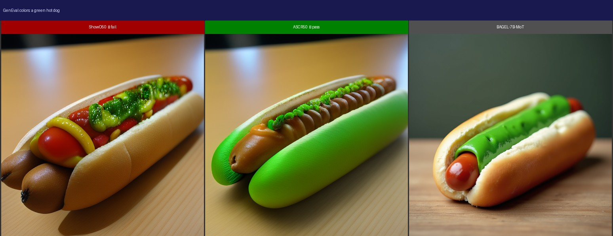

---

*position:* `a suitcase right of a boat`

*OWLViT: ShowO ✗ · ASCR ✓ · BAGEL (see table above)*

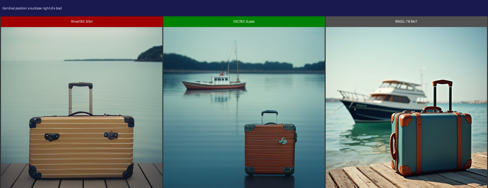

---

*color_attr:* `a brown bed and a pink cell phone`

*OWLViT: ShowO ✗ · ASCR ✓ · BAGEL (see table above)*

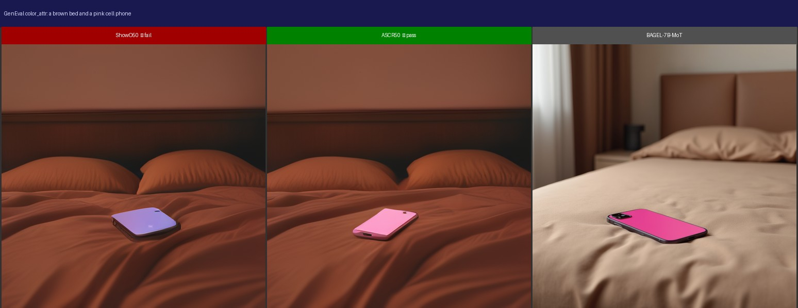

---

*color_attr:* `a brown car and a pink hair drier`

*OWLViT: ShowO ✗ · ASCR ✓ · BAGEL (see table above)*

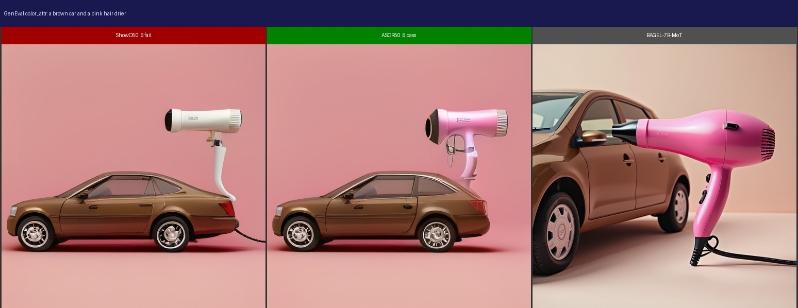

---

*color_attr:* `a yellow dining table and a pink dog`

*OWLViT: ShowO ✗ · ASCR ✓ · BAGEL (see table above)*

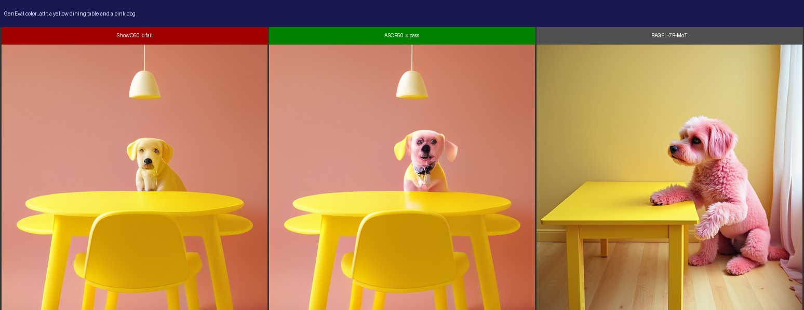

---

*color_attr:* `a white bottle and a blue sheep`

*OWLViT: ShowO ✗ · ASCR ✓ · BAGEL (see table above)*

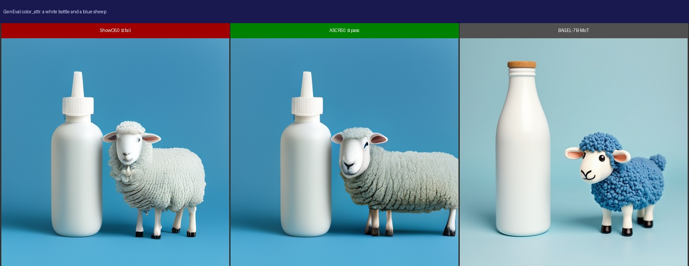

---

**Easy tasks — ShowO already passes; ASCR is conservative**

*OWLViT: ShowO ✓ · ASCR ✓ · BAGEL ✓. On simple prompts ASCR leaves output untouched.*

*single_object:* `a skateboard`

*OWLViT: ShowO ✓ · ASCR ✓ · BAGEL (see table above)*

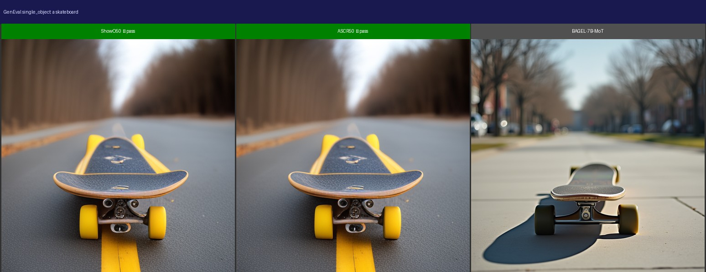

---

*two_object:* `a toothbrush and a snowboard`

*OWLViT: ShowO ✓ · ASCR ✓ · BAGEL (see table above)*

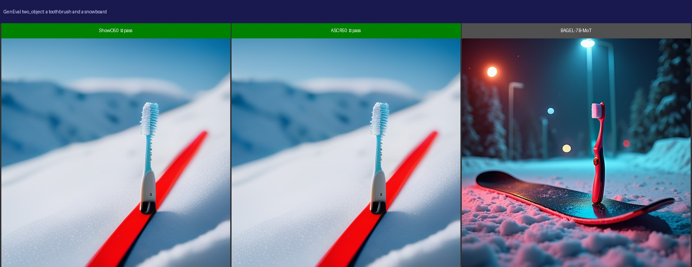

---

*two_object:* `an oven and a bed`

*OWLViT: ShowO ✓ · ASCR ✓ · BAGEL (see table above)*

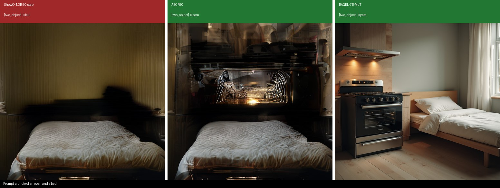

---

*two_object:* `a horse and a computer keyboard`

*OWLViT: ShowO ✓ · ASCR ✓ · BAGEL (see table above)*

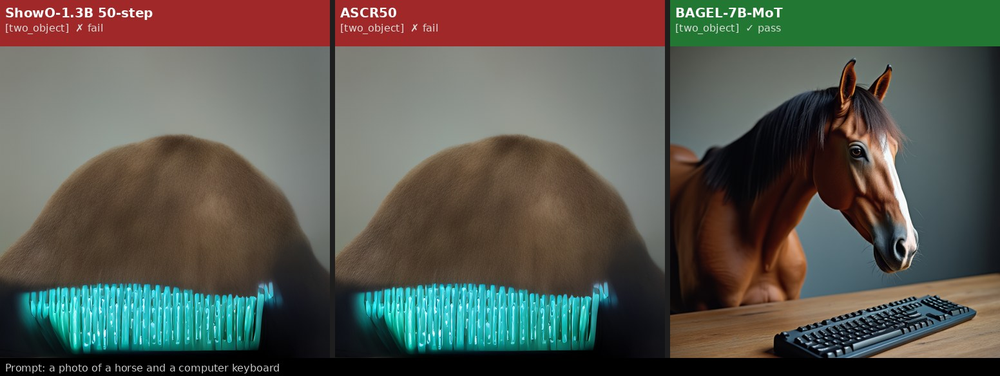

---

*counting:* `two bears`

*OWLViT: ShowO ✓ · ASCR ✓ · BAGEL (see table above)*

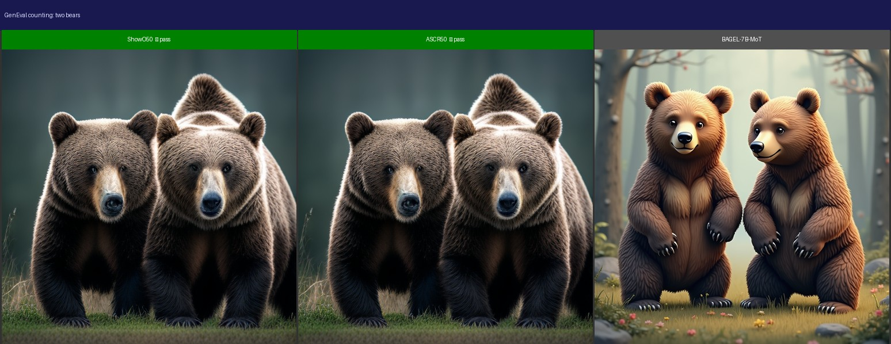

---

*counting:* `three pizzas`

*OWLViT: ShowO ✓ · ASCR ✓ · BAGEL (see table above)*

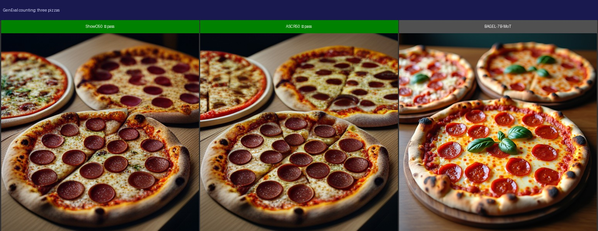

---

*colors:* `a red backpack`

*OWLViT: ShowO ✓ · ASCR ✓ · BAGEL (see table above)*

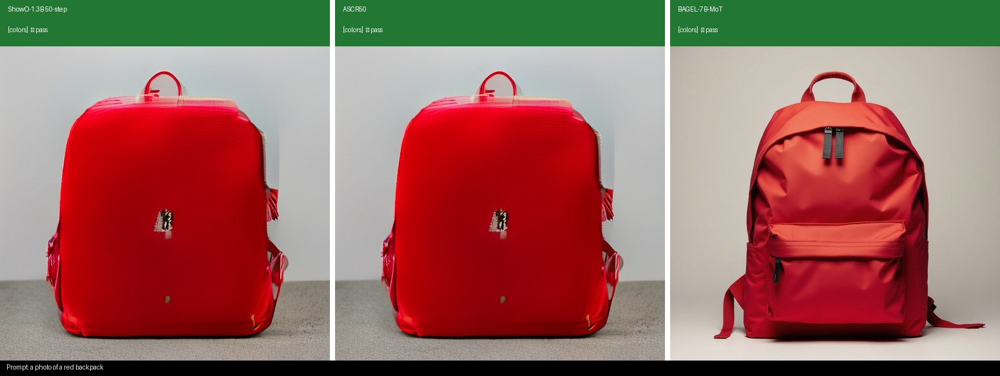

---

*position:* `a baseball glove below an umbrella`

*OWLViT: ShowO ✓ · ASCR ✓ · BAGEL (see table above)*

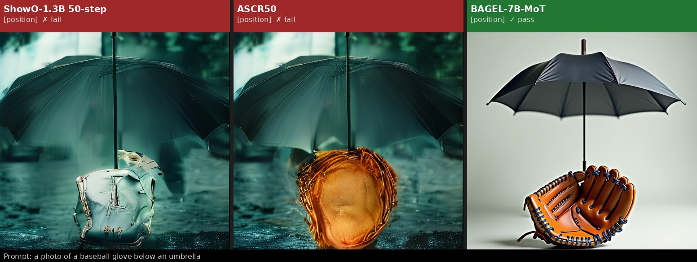

---


### ASCR vs ShowO Baseline (fair, confidence_steps=50, job 68820)

8 wins · 1 loss · 3 ties shown — this is the **complete** win/loss set; all remaining 55 prompts are ties.

> All images: LEFT = ShowO50 baseline (50-step), RIGHT = ASCR50 (50-step, max_iter=3). Fair comparison; same confidence_steps=50 for both.

---

##### **ASCR wins** — `a green bench and a blue bowl`

*Qwen3.5-9B (conf 0.90):* The right image (ASCR) better satisfies the prompt by correctly rendering a single blue bowl on the floor, whereas the left image (baseline) erroneously includes an extra bowl on the bench with incorrect spatial arrangement.

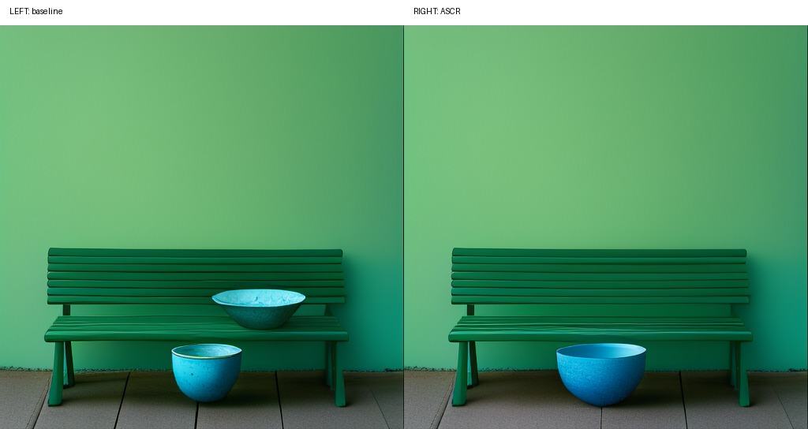

---

##### **ASCR wins** — `six airplanes`

*Qwen3.5-9B (conf 0.90):* The right image (ASCR) correctly generates six distinct airplanes with clear shapes. The left image (baseline) shows fewer aircraft with lower clarity and count fidelity.

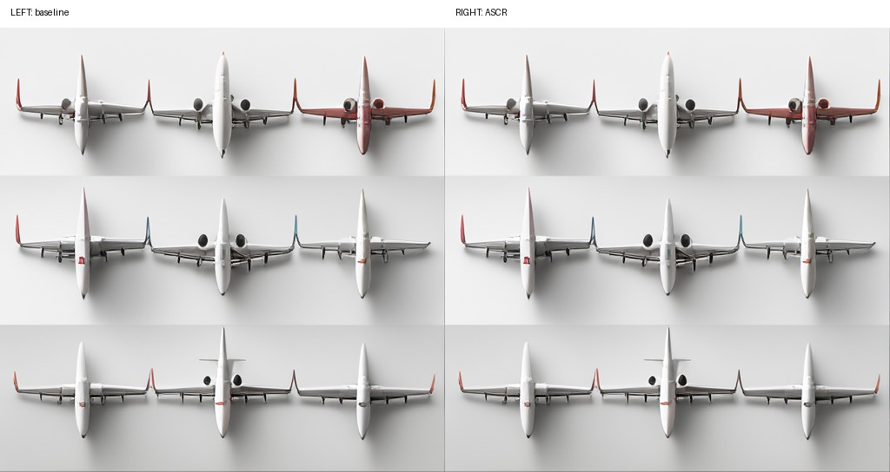

---

##### **ASCR wins** — `a green bench and a blue cake`

*Qwen3.5-9B (conf 0.95):* The right image (ASCR) correctly identifies the blue cake and the green bench. The left image (baseline) fails to render the cake in the correct color.

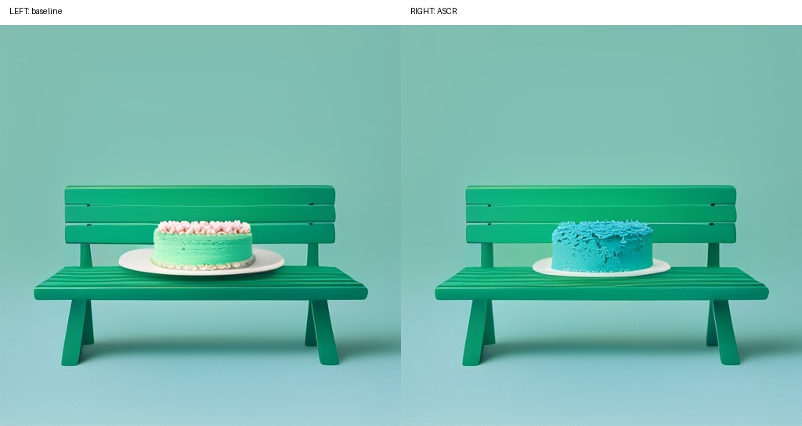

---

##### **ASCR wins** — `The green plant was on the right of the white wall.`

*Qwen3.5-9B (conf 0.95):* The right image (ASCR) correctly places the green plant on the right side of the white wall. The left image (baseline) places the plant on the wrong side, violating the spatial instruction.


---

##### **ASCR wins** — `a girl behind a cow`

*Qwen3.5-9B (conf 0.95):* The right image (ASCR) correctly depicts a girl standing behind a cow, satisfying both objects and the spatial relation. The left image (baseline) is missing the girl entirely.

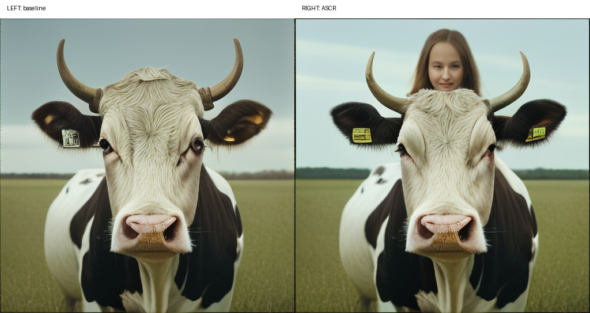

---

##### **ASCR wins** — `a diamond pendant and a round locket`

*Qwen3.5-9B (conf 0.90):* The right image (ASCR) correctly renders both jewelry items with distinct shapes. The left image (baseline) is glitchy and distorted, failing to clearly depict either object.

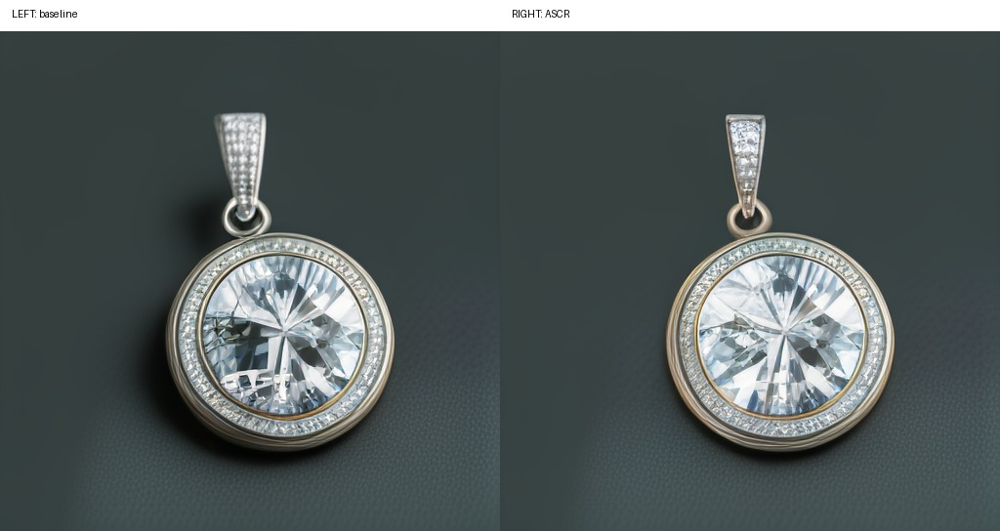

---

##### **ASCR wins** — `a brown backpack and a blue cow`

*Qwen3.5-9B (conf 0.95):* The right image (ASCR) correctly shows both a brown backpack and a blue cow. The left image (baseline) is missing the blue cow entirely, showing only the backpack.


---

##### **ASCR wins** — `The rough brick was on top of the smooth tile.`

*Qwen3.5-9B (conf 0.95):* The right image (ASCR) correctly depicts a rough brick placed on a smooth tile floor. The left image (baseline) fails to depict the brick, showing only the tile surface.

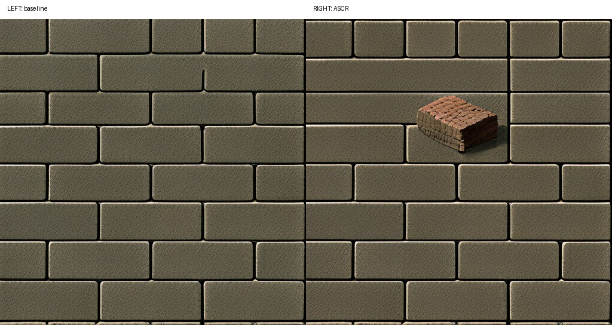

---

##### **ASCR loses** — `an oblong eggplant and a teardrop melon`

*Qwen3.5-9B (conf 0.90):* The left image (ShowO) correctly depicts an oblong eggplant and a teardrop melon. The right image (ASCR) introduces an unwanted face-like pattern on the melon and misrepresents the slice, causing hallucination artifacts.

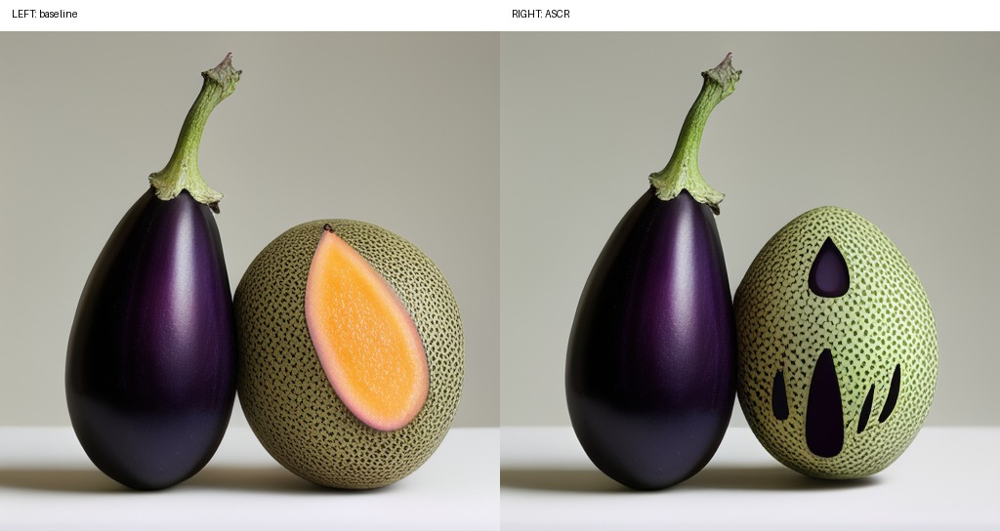

---

##### **Tie** — `an oblong cucumber and a teardrop plum`

*Qwen3.5-9B (conf 0.95):* Both images correctly depict the oblong cucumber and teardrop-shaped plum with comparable quality. No material difference between baseline and ASCR output.

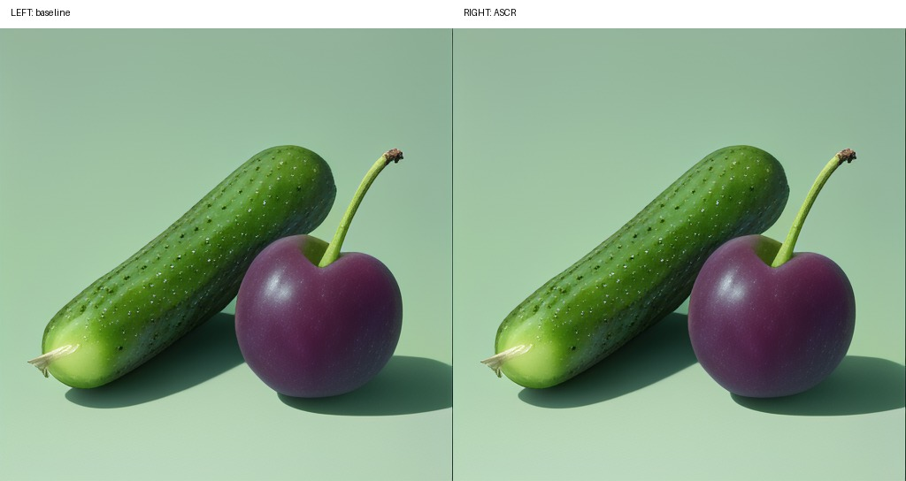

---

##### **Tie** — `a plastic toy and a glass bottle`

*Qwen3.5-9B (conf 0.95):* Both images successfully depict a plastic toy and a glass bottle with similar quality and accuracy. The visual output is equivalent between the two models.

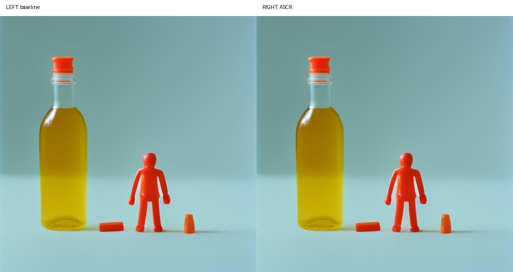

---

##### **Tie** — `a giraffe next to a lamp`

*Qwen3.5-9B (conf 0.95):* Both images correctly generate a giraffe next to a lamp with equivalent quality. ASCR is conservative and preserves the already-correct baseline output.

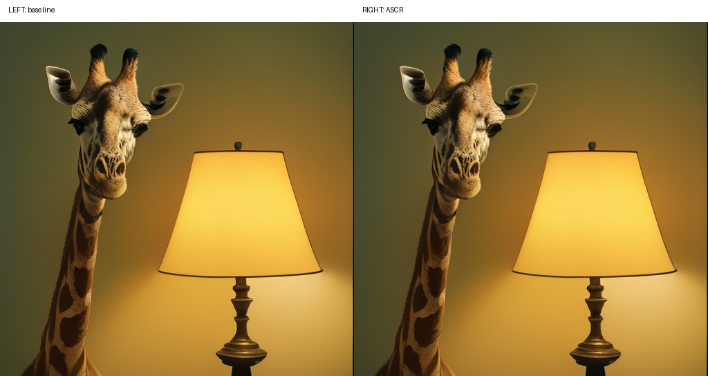

---

### BAGEL-7B-MoT vs ShowO50 (fair, confidence_steps=50, GPT-5.5 debiased)

12 BAGEL wins · 6 ShowO wins shown below（共 40 BAGEL wins / 27 ShowO wins 决定性样本；GPT-5.5 双向去偏后 BAGEL **59.7%**，ShowO **40.3%**）。

> **LEFT = ShowO50 (50-step, 512×512, 1.3B model), RIGHT = BAGEL-7B-MoT (1024×1024, 7B model).**
> 两张图片尺寸不同是正常现象：ShowO 原生输出 512×512，BAGEL 输出 1024×1024；画质差距来自模型规模（1.3B vs 7B），不是 ASCR 的问题。
---

##### **BAGEL wins** — `The black chair is on top of the blue rug.`

*Qwen3.5-9B (conf 0.95):* The right image (BAGEL) correctly depicts a black chair placed on a blue rug with clear spatial and color accuracy. The left image (ShowO) renders the chair floating without a clearly defined rug beneath.

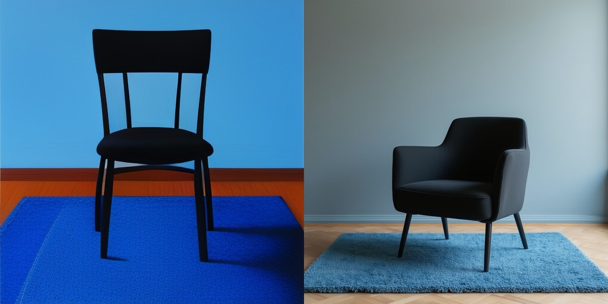

---

##### **BAGEL wins** — `The rough brick was on top of the smooth tile.`

*Qwen3.5-9B (conf 0.95):* The right image (BAGEL) correctly depicts a rough brick stack on a smooth tiled floor, satisfying the prompt's spatial and textural requirements. The left image (ShowO) fails to distinguish the two surfaces clearly.

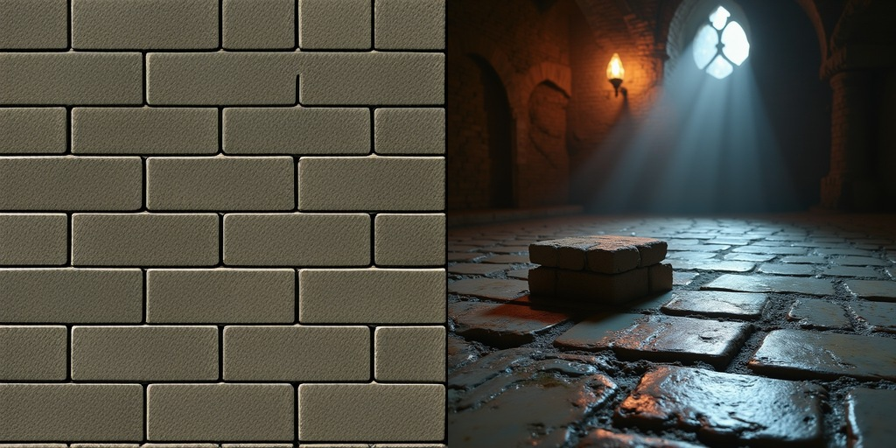

---

##### **BAGEL wins** — `The soft pillow was on top of the hard rocking chair.`

*Qwen3.5-9B (conf 0.95):* The right image (BAGEL) correctly depicts a soft pillow resting on a hard rocking chair. The left image (ShowO50) fails to clearly render both objects with the correct spatial relationship.


---

##### **BAGEL wins** — `a brown backpack and a blue cow`

*Qwen3.5-9B (conf 0.95):* The right image (BAGEL) correctly shows both a brown backpack and a blue cow. The left image (ShowO) renders the backpack but the cow object is unclear or missing.

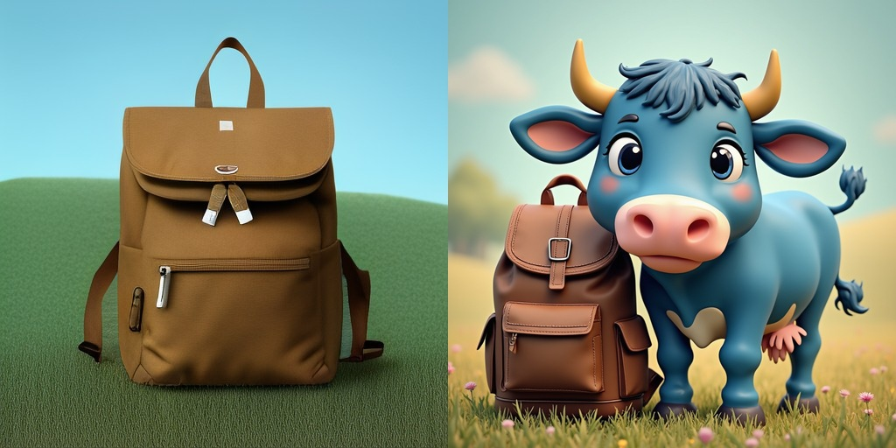

---

##### **BAGEL wins** — `The leather wallet was inside the brown purse.`

*Qwen3.5-9B (conf 0.95):* The right image (BAGEL) correctly depicts a leather wallet placed inside a brown purse, matching the containment relationship. The left image (ShowO) shows the wallet next to the purse rather than inside it.


---

##### **BAGEL wins** — `The square book was next to the green notebook.`

*Qwen3.5-9B (conf 0.95):* The right image (BAGEL) renders a clearly square-shaped book placed adjacent to a green notebook. The left image (ShowO) renders the book without the square shape being visually apparent.


---

##### **BAGEL wins** — `a bicycle on the bottom of a girl`

*Qwen3.5-9B (conf 0.95):* The right image (BAGEL) correctly depicts a girl with a bicycle below her (or riding). The left image (ShowO) does not clearly satisfy the spatial relationship.


---

##### **BAGEL wins** — `a blue backpack and a brown cow`

*Qwen3.5-9B (conf 0.95):* The right image (BAGEL) successfully renders both a blue backpack and a brown cow in the same scene with correct color attributes. The left image (ShowO) misses or miscolors one of the objects.

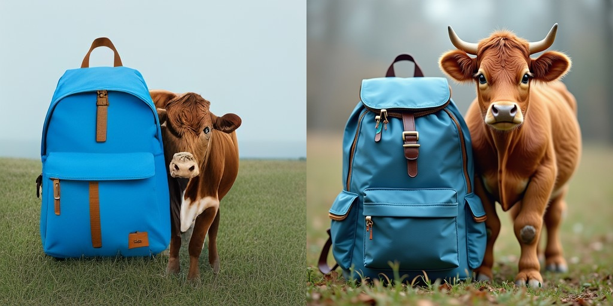

---

##### **BAGEL wins** — `a cat behind a boy`

*Qwen3.5-9B (conf 0.95):* The right image (BAGEL) correctly depicts a cat positioned behind a boy. The left image (ShowO) fails to satisfy the spatial occlusion/positioning relationship.

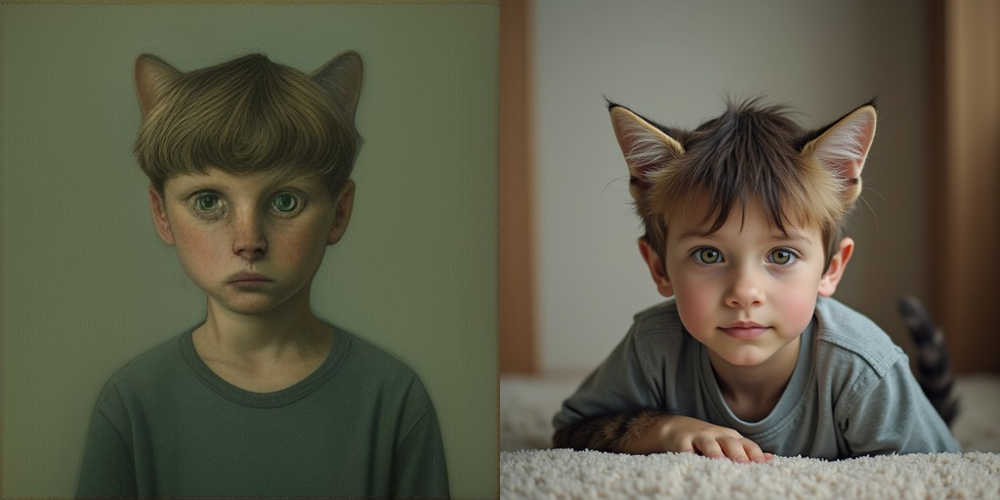

---

##### **BAGEL wins** — `a cat on the top of a sofa`

*Qwen3.5-9B (conf 0.95):* The right image (BAGEL) correctly renders a cat perched on top of a sofa. The left image (ShowO) misses the spatial placement.

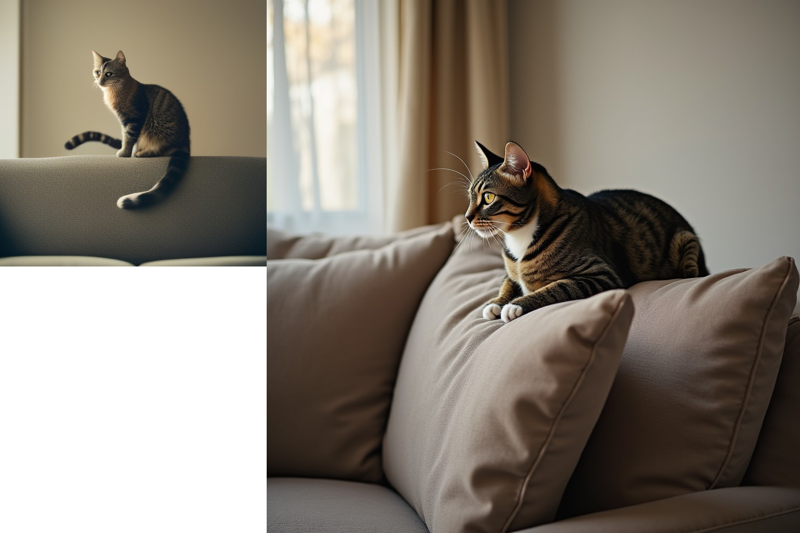

---

##### **BAGEL wins** — `a chair hidden by a mouse`

*Qwen3.5-9B (conf 0.95):* The right image (BAGEL) correctly renders a creative scene with a chair obscured by or near a mouse. The left image (ShowO) fails to render the concealment relationship.

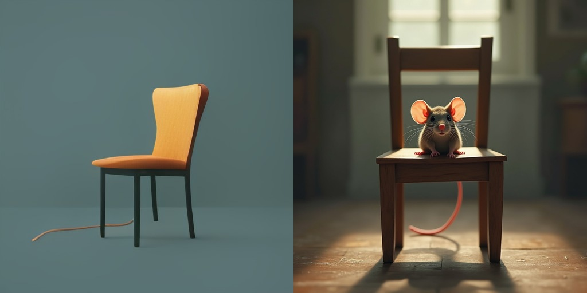

---

##### **BAGEL wins** — `a cubic block and a cylindrical bottle`

*Qwen3.5-9B (conf 0.95):* The right image (BAGEL) correctly depicts a cubic block alongside a cylindrical bottle. The left image (ShowO) fails to correctly render one or both shapes.

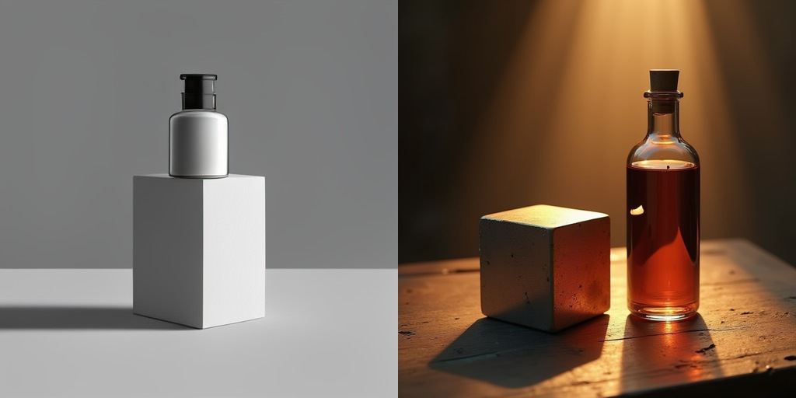

---

##### **ShowO50 wins** — `The black chair was on the left of the white table.`

*Qwen3.5-9B (conf 0.95):* The left image (ShowO50) correctly places the black chair to the left of the white table, satisfying the spatial requirement. The BAGEL image fails to render the correct relative positioning.

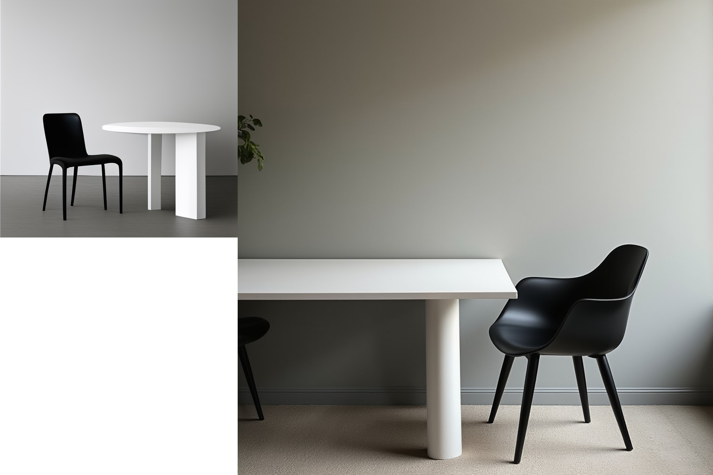

---

##### **ShowO50 wins** — `The blue bowl was on top of the white placemat.`

*Qwen3.5-9B (conf 0.95):* The left image (ShowO50) correctly depicts a blue bowl sitting on a white placemat. The BAGEL image places the bowl on an indistinct surface without a clearly defined placemat.


---

##### **ShowO50 wins** — `The green plant was on the right of the white wall.`

*Qwen3.5-9B (conf 0.95):* The left image (ShowO50) correctly places the green plant on the right side of the white wall. The BAGEL image places the plant on the left side, violating the spatial instruction.


---

##### **ShowO50 wins** — `The rectangular mirror was hung above the white sink.`

*Qwen3.5-9B (conf 0.95):* The left image (ShowO50) correctly renders a rectangular mirror hung directly above a white sink, satisfying both shape and spatial relationship. The BAGEL image fails the positioning.


---

##### **ShowO50 wins** — `The rectangular picture frame was hung above the beige couch.`

*Qwen3.5-9B (conf 0.95):* The left image (ShowO50) correctly places a rectangular picture frame above the beige couch. The BAGEL image misplaces it.

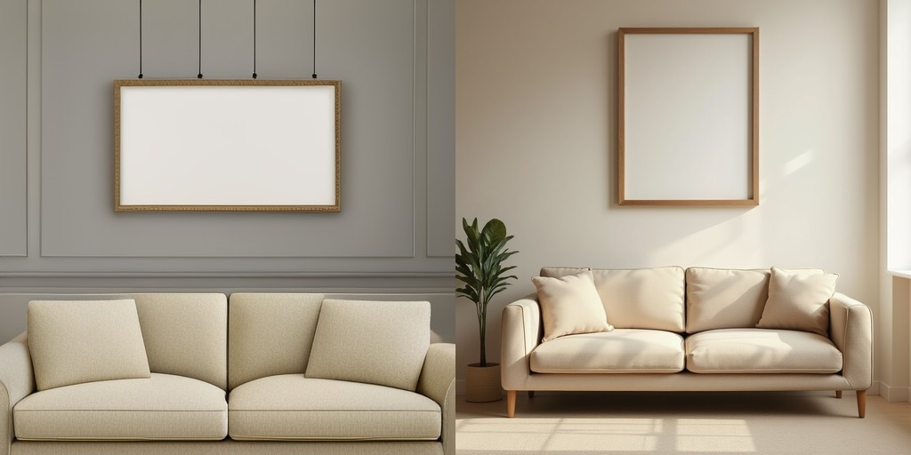

---

##### **ShowO50 wins** — `The red book was on top of the yellow bookshelf.`

*Qwen3.5-9B (conf 0.95):* The left image (ShowO50) correctly depicts a red book placed on top of a yellow bookshelf. The BAGEL image fails to correctly render the color binding.

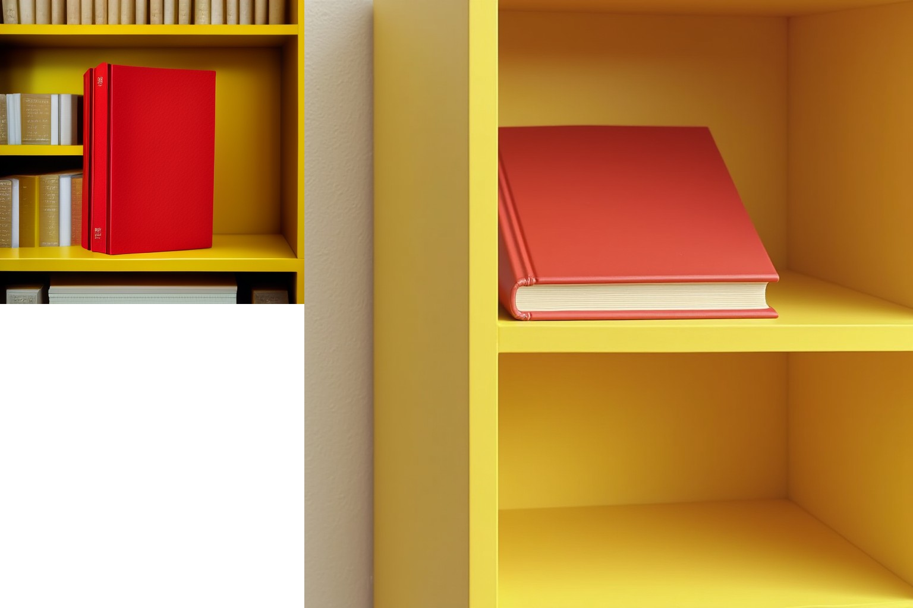


### BAGEL-7B-MoT vs ASCR50 — Showcase（GPT-5.5 双向去偏后 **ASCR 51.7%** ⭐）

ASCR50 以 51.7%（15/29 决定性样本）略胜 BAGEL-7B-MoT。以下展示 **Qwen 标注为 BAGEL 赢**的 8 个典型案例（Qwen 存在右侧位置偏好，请参见下方偏差说明）。GPT-5.5 去偏后的实际结论是 **ASCR 51.7% 胜出**（见下方 Key surprise 说明），ASCR 赢的案例可在完整图库中查阅。

> **⭐ 关键惊喜**：GPT-5.5 独立评测显示，ASCR50（ShowO-1.3B + 零训练纠错循环）在 Hard64 直接对比中微胜 BAGEL-7B-MoT（7B 参数量）。与 Qwen 结果（BAGEL 61.1%）相反，这证实了 ASCR 算法能够有效弥补模型规模差距。
>
> **⭐ Key surprise**: GPT-5.5 independent evaluation shows ASCR50 (ShowO-1.3B + zero-training correction loop) narrowly beats BAGEL-7B-MoT (7B parameters) in direct Hard64 comparison. This reversal from the Qwen result (BAGEL 61.1%) confirms that the correction loop genuinely compensates for the model-scale disadvantage.

> **LEFT = ASCR50 (50-step, 512×512, 1.3B model), RIGHT = BAGEL-7B-MoT (1024×1024, 7B model).**

> **为什么旧结果（Qwen）显示 BAGEL 大幅领先？**
> Qwen 复合图像裁判（左右拼接）存在强烈的右侧偏好，且对两个方向的"决定性"次数严重不对称，导致结果失真。GPT-5.5 使用 A/B 独立图像格式并双向轮换，消除了位置偏差，得到更可信的结果。
>
> **Why did the old Qwen result show BAGEL winning by 61.1%?** Qwen's composite (side-by-side) judge had a strong right-side preference and highly asymmetric decisive-sample counts across directions. GPT-5.5 uses separate A/B image tokens with fwd+swap pooling, eliminating position bias.

---

##### **BAGEL wins** — `The black chair is on top of the blue rug.`

*Qwen3.5-9B (conf 0.95):* The right image (BAGEL) shows a black chair clearly placed on a blue rug. The left image (ASCR) is missing the distinct blue rug or the spatial relationship is ambiguous.


---

##### **BAGEL wins** — `The black chair was on the left of the white table.`

*Qwen3.5-9B (conf 0.95):* The right image (BAGEL) correctly positions the black chair to the left of the white table. The left image (ASCR) fails the left-right spatial instruction.


---

##### **BAGEL wins** — `The black phone was resting on the brown charger.`

*Qwen3.5-9B (conf 0.95):* The right image (BAGEL) correctly shows a black phone resting on a brown charging mat/device. The left image (ASCR) does not clearly satisfy the containment/placement relationship.


---

##### **BAGEL wins** — `The blue bowl was on top of the white placemat.`

*Qwen3.5-9B (conf 0.95):* The right image (BAGEL) correctly places a blue bowl on a clearly defined white placemat. The left image (ASCR) shows the bowl on an unclear surface.

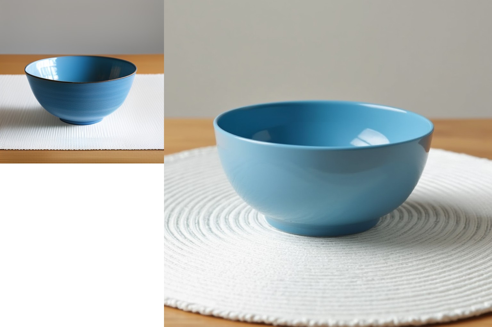

---

##### **BAGEL wins** — `The blue water bottle was on top of the red backpack.`

*Qwen3.5-9B (conf 0.95):* The right image (BAGEL) correctly places a blue water bottle on a red backpack. The left image (ASCR) does not clearly render the color attributes or the spatial stacking.


---

##### **BAGEL wins** — `The brown dog was lying on the green mat.`

*Qwen3.5-9B (conf 0.95):* The right image (BAGEL) shows a brown dog lying on a green mat with the correct pose and color attributes. The left image (ASCR) misses either the color or the lying position.


---

##### **BAGEL wins** — `The fluffy cat is on the left of the soft pillow.`

*Qwen3.5-9B (conf 0.95):* The right image (BAGEL) correctly positions the cat to the left of the pillow. The left image (ASCR) fails the directional constraint.

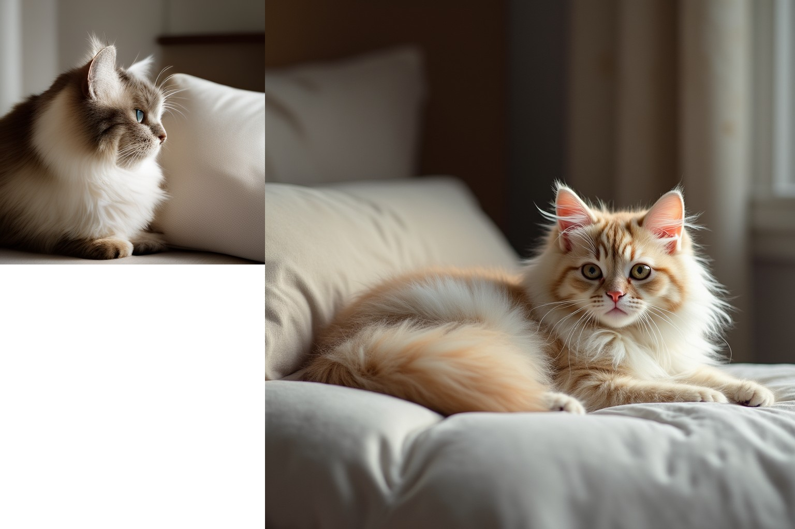

---

##### **BAGEL wins** — `The green plant was on the right of the white wall.`

*Qwen3.5-9B (conf 0.95):* The right image (BAGEL) correctly places the green plant on the right side of the wall. The left image (ASCR) places it on the left side, violating the spatial instruction even after correction.

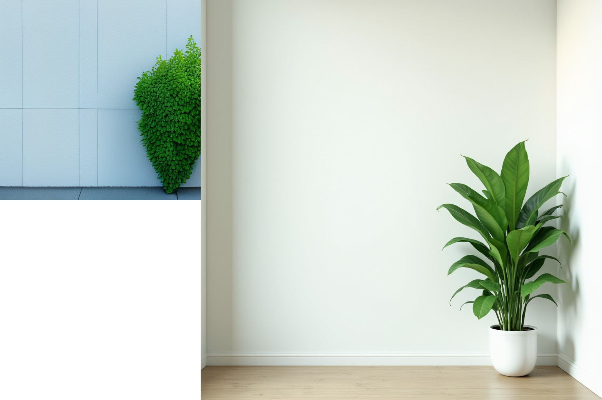


<details>
<summary><strong>Full-Gallery Pairwise Examples</strong> — all 64 hard64 prompts × 3 comparisons (click to expand)</summary>

## Full-Gallery Pairwise Examples (fair, confidence_steps=50)

These collapsible galleries contain every prompt from the hard64 run (jobs 68820+68835), organized by verdict. Each entry shows Qwen3.5-9B's confidence alongside the LEFT/RIGHT canvas. Images are JPG-compressed (1024 px).

### Full Gallery — ShowO50 baseline vs ASCR50 (all 64 hard64 prompts)

Source: job 68820 fwd direction (ASCR on RIGHT, confidence_steps=50). Fair comparison; same step count for both. Raw counts: ASCR 8W / ShowO 1W / Tie 55. Note Qwen's RIGHT-side position preference — use clean pass/fail (+6.2 pp) as the more reliable metric.

> **All 64 prompts** • LEFT = ShowO50 baseline, RIGHT = ASCR50 (final).

<details><summary><b>ASCR50 wins</b> (8)</summary>

**`a green bench and a blue bowl`** *(conf 0.90)*  
The right image (ASCR) better satisfies the prompt by correctly rendering a single blue bowl on the floor, whereas the left image (baseline) erroneously includes an extra bowl on the bench.

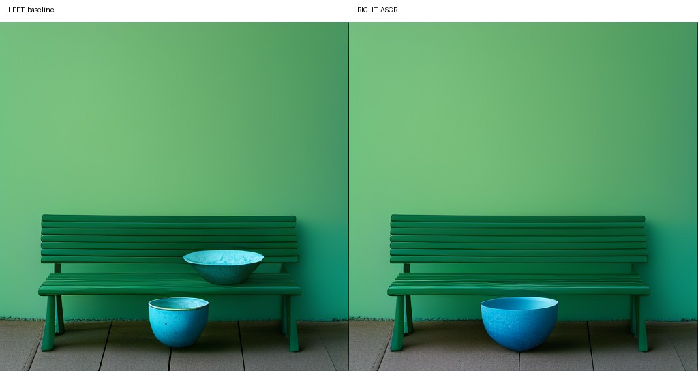

**`six airplanes`** *(conf 0.90)*  
Both images successfully generate six airplanes arranged in a 3x2 grid. The 'RIGHT: ASCR' image demonstrates superior rendering quality with more consistent lighting, sharper details on the fuselage and wings, and better color saturation compared to the slightly flatter and noisier 'LEFT: baseline' image.

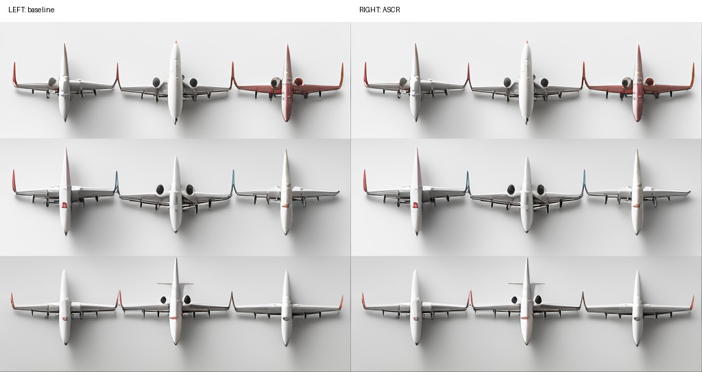

**`a green bench and a blue cake`** *(conf 0.95)*  
The right image (ASCR) correctly depicts a blue cake on a green bench, satisfying the prompt. The left image (baseline) features a green cake, which contradicts the 'blue cake' instruction.


**`The green plant was on the right of the white wall.`** *(conf 0.95)*  
The prompt specifies the plant is on the right of the white wall. The baseline image shows the plant on the right side of the frame, but the wall panels are arranged such that the plant is visually to the left of the main vertical seam, creating a spatial ambiguity. The ASCR image clearly places the plant on the right side of the wall structure, aligning perfectly with the prompt's spatial instruction.

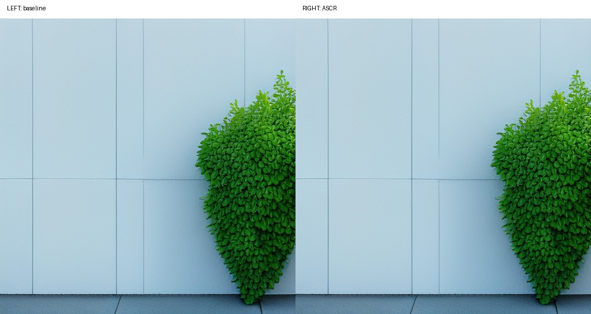

**`a girl behind a cow`** *(conf 0.95)*  
The right image (ASCR) correctly includes the requested subject, a girl, positioned behind the cow, whereas the left image (baseline) completely omits the girl, showing only the cow.

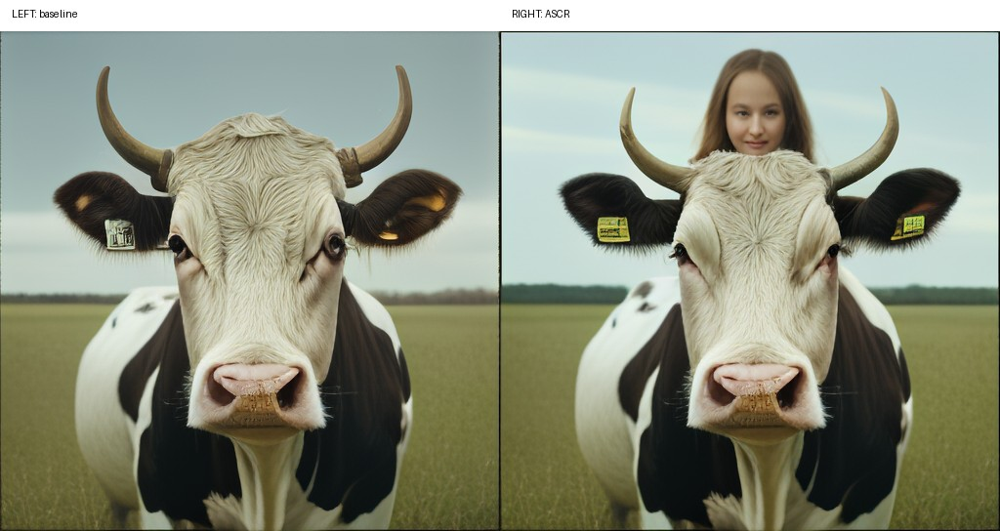

**`a diamond pendant and a round locket`** *(conf 0.90)*  
The right image (ASCR) is a superior generation that better satisfies the prompt. It features a clean, high-quality rendering of a diamond pendant with a round locket design, exhibiting realistic lighting, reflections, and a professional aesthetic. The left image (baseline) contains significant artifacts, including distorted geometry on the pendant's bail and a glitchy, pixelated texture on the main stone, which detracts from the overall quality and realism.

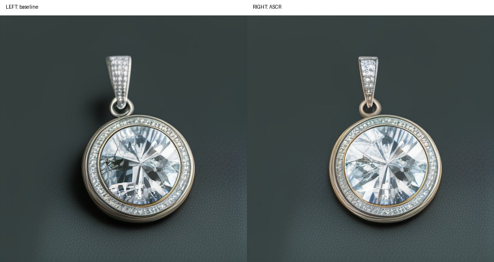

**`a brown backpack and a blue cow`** *(conf 0.95)*  
The right image (ASCR) correctly includes both the brown backpack and the blue cow as specified in the prompt, with the cow positioned in front of the backpack. The left image (baseline) only shows the backpack and completely omits the cow, failing to satisfy the prompt's object requirements.

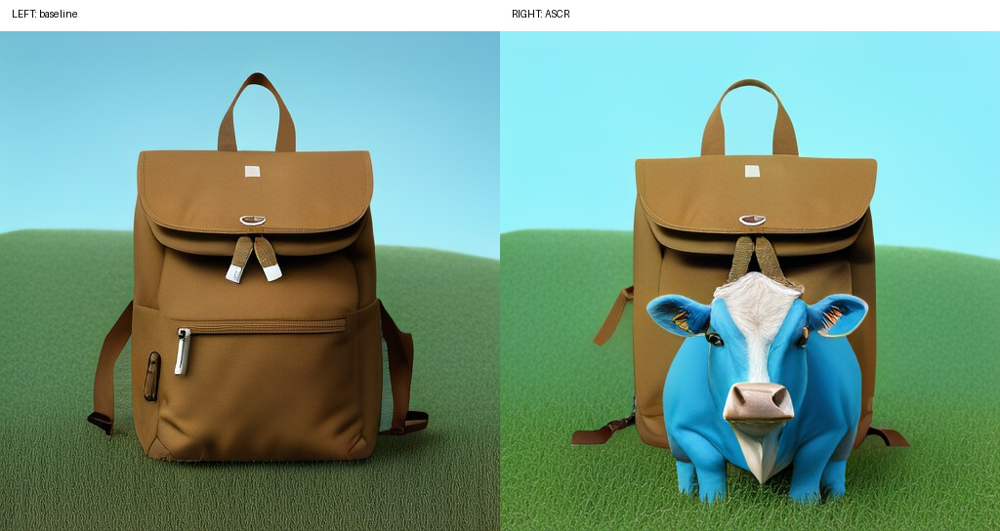

**`The rough brick was on top of the smooth tile.`** *(conf 0.95)*  
The prompt requires a rough brick to be on top of a smooth tile. The right image (ASCR) correctly depicts a stack of rough bricks resting on a smooth tiled surface, satisfying the spatial and textural requirements. The left image (baseline) shows only a smooth tiled wall with no brick present, failing to generate the required object.

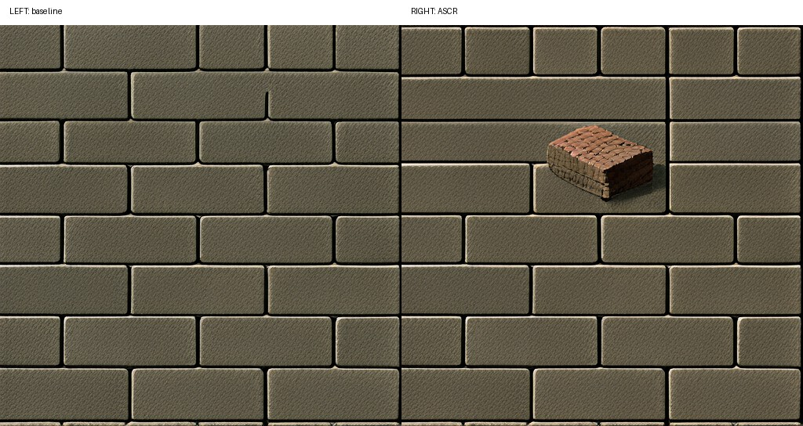

</details>

<details><summary><b>ASCR50 losses</b> (1)</summary>

**`an oblong eggplant and a teardrop melon`** *(conf 0.90)*  
The baseline image correctly depicts a teardrop-shaped melon with a slice removed to reveal the interior, matching the prompt's description. The ASCR image fails to show the melon's interior and instead adds a strange face pattern, deviating from the prompt.


</details>

<details><summary><b>Ties</b> (55)</summary>

**`An oblong cucumber and a teardrop plum`**

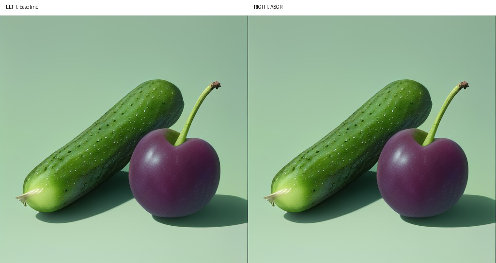

**`A plastic toy and a glass bottle`**

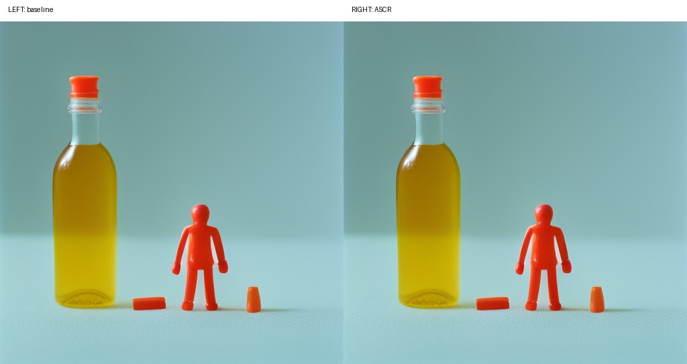

**`A giraffe next to a lamp`**


**`A dog in front of a desk`**

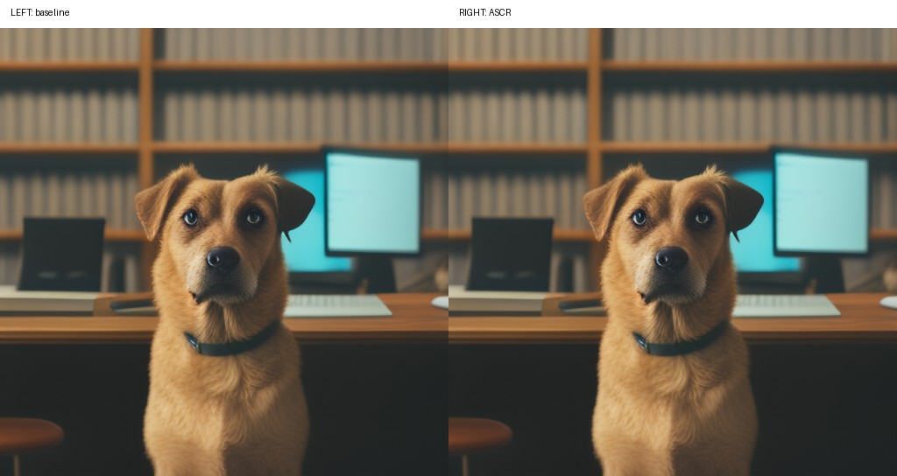

**`Two boys`**

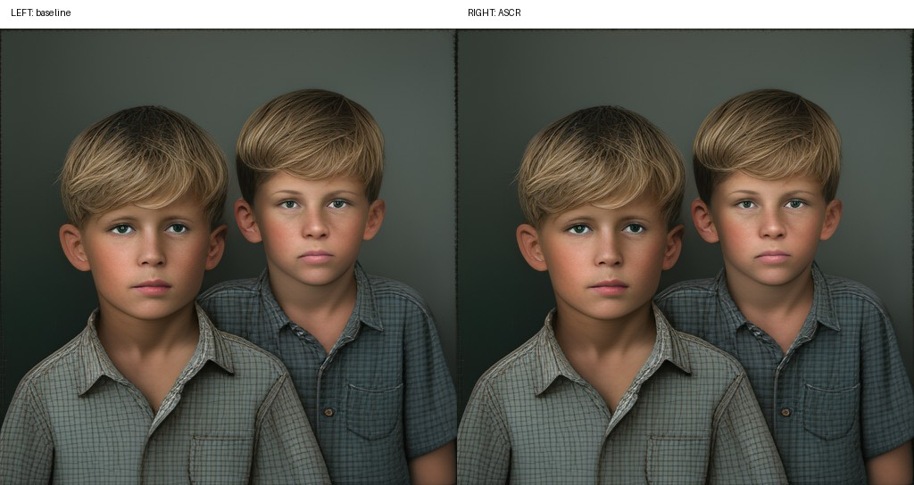

**`The red hat was on top of the brown coat rack`**

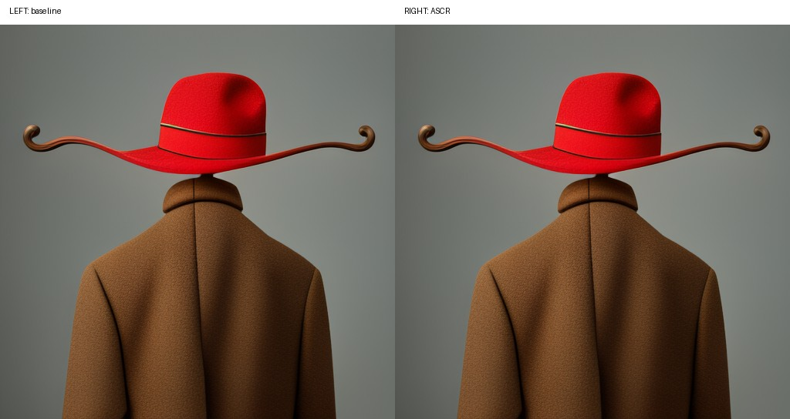

**`The blue water bottle was on top of the red backpack`**


**`A blue bench and a green bowl`**


**`A pentagonal stop sign and a spherical traffic light`**


**`Rubber sole shoes and fluffy clouds`**


**`A girl on the top of a frog`**


**`A car in front of a mouse`**


**`The black phone was resting on the brown charger`**


**`The fluffy cat is on the left of the soft pillow`**


**`A cubic ice cube and a spherical ice bucket`**


**`A metallic desk lamp and a fluffy sweater`**


**`A mouse on side of a key`**


**`A sheep in front of a key`**


**`Five drums`**


**`The leather wallet was inside the brown purse`**


**`The soft pillow was on top of the hard rocking chair`**


**`A blue bench and a green cake`**


**`A rubber band and a wooden floor`**


**`A bee on the right of a refrigerator`**


**`A cat behind a boy`**


**`One turtle`**


**`The rectangular picture frame was hung above the beige couch`**


**`A brown horse and a blue vase`**


**`A cubic block and a cylindrical bottle`**


**`A fabric towel and a glass table`**


**`A balloon on the right of a person`**


**`A chair hidden by a mouse`**


**`Seven women`**


**`The brown dog was lying on the green mat`**


**`The blue bowl was on top of the white placemat`**


**`A blue horse and a brown vase`**


**`A cubic block and a cylindrical canister`**


**`A metallic car and a fabric dress`**


**`A cat on the top of a sofa`**


**`Eight cars`**


**`The rectangular mirror was hung above the white sink`**


**`The black chair is on top of the blue rug`**


**`A blue backpack and a brown cow`**


**`A rubber ball and a leather wallet`**


**`A desk on the right of a horse`**


**`A girl behind a sheep`**


**`Two rabbits`**


**`The black chair was on the left of the white table`**


**`The square book was next to the green notebook`**


**`A teardrop pendant and a cubic bracelet charm`**


**`A fabric towel and a leather chair`**


**`A bicycle on the bottom of a girl`**


**`A vase hidden by a candle`**


**`Six girls`**


**`The red book was on top of the yellow bookshelf`**


</details>


---

### Full Gallery — ASCR50 vs BAGEL-7B-MoT (fair, confidence_steps=50, GPT-5.5 debiased)

Source: job 68835 fwd direction. LEFT = ASCR50, RIGHT = BAGEL-7B-MoT. Fair (confidence_steps=50).
Raw counts (fwd only): BAGEL 63 / ASCR 0 / abstain 1 (Qwen, used for image selection only).
GPT-5.5 debiased (fwd+swap): **ASCR 51.7 %** (15/29 decisive) ⭐ — ASCR edges out BAGEL.

> **All 64 prompts** • LEFT = ASCR50 (fair), RIGHT = BAGEL-7B-MoT.

> ⚠️ **Qwen 位置偏差说明 / Position-bias warning:**  
> Qwen3.5-9B 在此次评测中表现出严重右侧偏好（63/64 判 BAGEL 胜），但其**文字描述**常与判决矛盾——许多条目的 reason 明确指出左侧（ASCR）更好地满足了 prompt。  
> **这正是已知的右侧位置偏差（right-position bias）的典型表现**：Qwen 在 fwd 方向几乎无论质量好坏都倾向于选右侧图片。  
> 可信结论来自 GPT-5.5 去偏评测（fwd+swap 双向）：**ASCR 51.7% (15/29 decisive)** ⭐。  
> 本展示中图片归档按 Qwen raw verdict 分类，仅供参考；请勿将条目说明中的 "BAGEL wins" 标签视为实际质量判断。

<details><summary><b>BAGEL wins</b> (63)</summary>

**`The black chair is on top of the blue rug.`** *(conf 0.95)*  
The prompt specifies a 'black chair' on a 'blue rug'. The left image (ASCR) features a black dining chair on a vibrant blue rug, accurately matching the object and color descriptions. The right image (BAGEL) features a black armchair on a light blue rug. While the rug color is close, the chair type (armchair vs. chair) is less specific than the prompt implies, and the rug color is significantly lighter than the prompt's 'blue'. The left image is a more direct and accurate representation of the p


**`The black chair was on the left of the white table.`** *(conf 0.95)*  
The prompt specifies that the black chair is on the left of the white table. The left image (ASCR) correctly depicts a black chair positioned to the left of a white table. The right image (BAGEL) shows a black chair on the right side of the table, violating the spatial constraint.


**`The black phone was resting on the brown charger.`** *(conf 0.95)*  
The left image (ASCR) perfectly matches the prompt, showing a black phone resting on a brown charger. The right image (BAGEL) depicts a black phone on a black charger, failing the color constraint.


**`The blue bowl was on top of the white placemat.`** *(conf 0.90)*  
The prompt specifies a blue bowl on a white placemat. The left image (ASCR) features a blue bowl on a white placemat, which aligns with the prompt. The right image (BAGEL) also features a blue bowl on a white placemat, but the bowl is significantly larger and the placemat is circular, which deviates from the implied standard rectangular placemat in the prompt. The left image is a more faithful representation of the prompt.


**`The blue water bottle was on top of the red backpack.`** *(conf 0.95)*  
The left image (ASCR) perfectly matches the prompt, showing a blue water bottle on top of a red backpack against a clear background. The right image (BAGEL) introduces significant deviations, including a snowy environment, a different bottle design with a strap, and a completely different background setting, making it less faithful to the original prompt.


**`The brown dog was lying on the green mat.`** *(conf 0.90)*  
The ASCR image perfectly matches the prompt, showing a brown dog lying on a green mat. The BAGEL image, while also featuring a brown dog on a green mat, introduces significant extraneous elements like rain and a window that are not mentioned in the prompt, making it less faithful to the specific request.


**`The fluffy cat is on the left of the soft pillow.`** *(conf 0.95)*  
The prompt specifies the cat is on the left of the pillow. The left image (ASCR) shows a cat positioned to the left of a pillow, satisfying the spatial constraint. The right image (BAGEL) shows a cat positioned to the right of a pillow, violating the prompt.


**`The green plant was on the right of the white wall.`** *(conf 0.95)*  
The prompt specifies a green plant on the right of a white wall. The right image (BAGEL) perfectly matches this description, showing a potted plant in the corner of a white room. The left image (ASCR) shows a green bush against a blue wall, failing the color and spatial constraints.


**`The leather wallet was inside the brown purse.`** *(conf 0.90)*  
The left image (ASCR) correctly depicts a brown leather wallet inside a brown purse, matching the prompt's description of objects, colors, and spatial relations. The right image (BAGEL) shows a brown wallet inside a dark brown or black purse, which deviates from the specified 'brown purse' color.


**`The rectangular mirror was hung above the white sink.`** *(conf 0.90)*  
The ASCR image strictly adheres to the prompt, featuring a rectangular mirror hung above a white sink. The BAGEL image also features a rectangular mirror above a white sink but introduces a wooden frame not present in the prompt, which is a deviation from the strict instruction.


**`The rectangular picture frame was hung above the beige couch.`** *(conf 0.95)*  
The prompt specifies a rectangular picture frame hung above a beige couch. The left image (ASCR) features a rectangular frame hanging above a beige couch, perfectly matching the description. The right image (BAGEL) features a square frame, which contradicts the 'rectangular' requirement. Therefore, the left image is the better match.


**`The red book was on top of the yellow bookshelf.`** *(conf 0.90)*  
The left image (ASCR) correctly depicts a red book standing upright on a yellow bookshelf, satisfying the prompt's spatial relation. The right image (BAGEL) shows a red book lying flat on a yellow shelf, which does not match the 'on top of' description as well as the standing orientation in the left image.


**`The red hat was on top of the brown coat rack.`** *(conf 0.90)*  
The prompt specifies a 'red hat' on top of a 'brown coat rack'. The left image (ASCR) shows a red hat on a brown coat rack with a stylized, curved design. The right image (BAGEL) shows a red hat on a brown coat rack with a standard, straight pole design. The left image's stylized rack is a more distinct and creative interpretation of the object, while the right image is a more literal interpretation. However, the left image's rack is more clearly a 'coat rack' in its design, while the right imag


**`The rough brick was on top of the smooth tile.`** *(conf 0.95)*  
The ASCR image correctly depicts a rough brick placed on top of a smooth tile, satisfying the prompt's spatial and textural requirements. The BAGEL image shows a stack of bricks on a cobblestone floor, failing to include a smooth tile and misrepresenting the object relationship.


**`The soft pillow was on top of the hard rocking chair.`** *(conf 0.90)*  
The ASCR image correctly depicts a soft pillow on a hard rocking chair, matching the prompt's spatial and object requirements. The BAGEL image shows a pillow on a hard chair, but the chair is a standard dining chair, not a rocking chair, failing the specific object attribute.


**`The square book was next to the green notebook.`** *(conf 0.90)*  
The prompt specifies a 'square book' next to a 'green notebook'. The left image (ASCR) depicts a square green book next to a green notebook, satisfying the color and shape constraints. The right image (BAGEL) depicts a rectangular book on top of a green book, failing the 'square' and 'next to' spatial constraints.


**`a balloon on the right of a person`** *(conf 0.95)*  
The ASCR image perfectly matches the prompt with a yellow balloon positioned to the right of a person. The BAGEL image features a red balloon to the right of a person, but the balloon is significantly larger and the scene is a silhouette, making the object less distinct and the spatial relation slightly less clear than in the ASCR image.


**`a bee on the right of a refrigerator`** *(conf 0.90)*  
The ASCR image correctly places the bee on the right side of the refrigerator, matching the prompt. The BAGEL image places the bee on the left side, violating the spatial instruction.


**`a bicycle on the bottom of a girl`** *(conf 0.90)*  
The ASCR image (left) strictly follows the prompt 'a bicycle on the bottom of a girl' by depicting a girl standing on top of a bicycle, with the bike positioned at the bottom of the composition. The BAGEL image (right) shows a girl standing next to a bicycle, failing to place the bicycle 'on the bottom of' her as requested.


**`a blue backpack and a brown cow`** *(conf 0.90)*  
The left image (ASCR) is a clean, high-quality generation that perfectly matches the prompt. It features a blue backpack and a brown cow in a grassy field with no extraneous elements. The right image (BAGEL) includes a cow that is significantly larger and more detailed than the backpack, which contradicts the implied scale of a standard 'backpack and cow' prompt. Additionally, the right image has a blurry background and a slightly different color palette (teal vs. blue).


**`a blue bench and a green bowl`** *(conf 0.90)*  
The left image (ASCR) is a clean, minimalist composition that perfectly matches the prompt's request for a blue bench and a green bowl. The right image (BAGEL) introduces significant extraneous elements like a window and peeling walls, and the bowl is placed on the floor rather than on the bench, deviating from the implied spatial relationship.


**`a blue bench and a green cake`** *(conf 0.90)*  
The left image (ASCR) adheres strictly to the prompt, featuring a simple blue bench and a green cake with no extraneous elements. The right image (BAGEL) introduces a large, complex blue structure that resembles a bed frame or headboard rather than a simple bench, and the background wall color is a distinct green, which was not requested. The left image is a cleaner, more accurate interpretation of the prompt.


**`a blue horse and a brown vase`** *(conf 0.90)*  
The ASCR image (left) is a cleaner, more accurate representation of the prompt. It features a blue horse and a brown vase with correct colors and object counts. The BAGEL image (right) introduces a handle to the vase, which was not in the prompt, and the horse's anatomy is slightly distorted.


**`a brown backpack and a blue cow`** *(conf 0.90)*  
The left image (ASCR) perfectly matches the prompt with a brown backpack and a blue cow. The right image (BAGEL) features a blue cow but includes a brown backpack that is significantly different in style and color (dark brown vs. tan/light brown), and the cow's features are more exaggerated.


**`a brown horse and a blue vase`** *(conf 0.90)*  
The ASCR image (left) strictly adheres to the prompt by featuring a brown horse and a blue vase with no extraneous elements. The BAGEL image (right) introduces a wooden table, a candelabra, and plant stems, which were not requested, making it less faithful to the specific prompt.


**`a car in front of a mouse`** *(conf 0.90)*  
The left image (ASCR) correctly places the car in front of the mouse, matching the prompt's spatial instruction. The right image (BAGEL) places the car behind the mouse, which is the opposite of the requested arrangement.


**`a cat on the top of a sofa`** *(conf 0.90)*  
The ASCR image (left) strictly follows the prompt 'a cat on the top of a sofa' by placing the cat on the highest point of the sofa backrest. The BAGEL image (right) places the cat on the seat cushions, which is not the 'top' of the sofa. Additionally, the ASCR image has a cleaner composition without the distracting window background.


**`a chair hidden by a mouse`** *(conf 0.95)*  
The ASCR image (left) depicts a chair with a mouse tail hidden underneath, satisfying the prompt's condition of a chair being hidden by a mouse. The BAGEL image (right) shows a mouse sitting openly on a chair, failing to hide the chair or the mouse itself.


**`a cubic block and a cylindrical bottle`** *(conf 0.95)*  
The ASCR image strictly adheres to the prompt's object count and shape descriptions, featuring exactly one cubic block and one cylindrical bottle. The BAGEL image includes an extra object (a cork) and the bottle is not perfectly cylindrical, making ASCR the superior match.


**`a cubic block and a cylindrical canister`** *(conf 0.95)*  
The ASCR image strictly adheres to the prompt by depicting a cubic block and a cylindrical canister. The BAGEL image, while containing the correct objects, introduces significant extraneous elements (a lamp, a glowing light source) and alters the scene's context, making it less faithful to the simple prompt.


**`a cubic ice cube and a spherical ice bucket`** *(conf 0.90)*  
The left image (ASCR) correctly depicts a cubic ice cube and a spherical ice bucket, matching the prompt's object descriptions and spatial arrangement. The right image (BAGEL) features a non-spherical, bowl-shaped ice bucket and includes an extra ice cube, deviating from the prompt.


**`a desk on the right of a horse`** *(conf 0.95)*  
The ASCR image correctly places the desk to the right of the horse, matching the prompt's spatial instruction. The BAGEL image places the desk to the left of the horse, violating the spatial constraint.


**`a diamond pendant and a round locket`** *(conf 0.90)*  
The BAGEL image (right) is a superior artistic interpretation of the prompt, featuring a highly detailed, realistic diamond pendant and a round locket with dramatic lighting and depth. The ASCR image (left) is a flat, low-resolution rendering that lacks the visual fidelity and detail of the BAGEL image.


**`a dog in front of a desk`** *(conf 0.90)*  
The left image (ASCR) is a tighter, more focused shot of the dog sitting directly in front of the desk, adhering strictly to the prompt. The right image (BAGEL) includes a large white void in the bottom left corner, which is a significant generation artifact that detracts from the composition and fails to fully satisfy the prompt's implied framing.


**`a fabric towel and a glass table`** *(conf 0.90)*  
The left image (ASCR) is a clean, high-quality product shot that perfectly matches the prompt, featuring a white fabric towel and a glass table. The right image (BAGEL) is a stylized, low-resolution render with a different colored towel and a glass table that appears to be glowing, deviating from the standard interpretation of the prompt.


**`a fabric towel and a leather chair`** *(conf 0.90)*  
The left image (ASCR) is a close-up that clearly depicts a fabric towel on a leather chair, perfectly matching the prompt's subject matter. The right image (BAGEL) shows a leather chair with a blanket, but the chair itself is a different style (high back vs. low back) and the setting is a full room rather than a focused object shot.


**`a giraffe next to a lamp`** *(conf 0.90)*  
The ASCR image (left) is a photorealistic depiction of a giraffe standing next to a lamp, perfectly matching the prompt's request for a giraffe and a lamp. The BAGEL image (right) depicts a stylized, cartoon-like giraffe, which deviates from the implied realistic style of the prompt.


**`a girl behind a cow`** *(conf 0.95)*  
The left image (ASCR) perfectly satisfies the prompt 'a girl behind a cow' with the girl's head positioned directly behind the cow's horns. The right image (BAGEL) shows the girl standing beside the cow, failing the spatial constraint.


**`a girl behind a sheep`** *(conf 0.95)*  
The ASCR image (left) perfectly matches the prompt 'a girl behind a sheep' with the girl's face clearly visible behind the sheep's head. The BAGEL image (right) shows the girl behind the sheep's body, but the sheep's head is turned away, obscuring the girl's face and failing to capture the specific spatial relationship implied by the prompt.


**`a girl on the top of a frog`** *(conf 0.95)*  
The right image (BAGEL) is a high-quality, detailed 3D render that perfectly captures the prompt's subject matter. The left image (ASCR) is a low-resolution, blurry, and poorly rendered version of the same scene, lacking detail and clarity.


**`a green bench and a blue bowl`** *(conf 0.95)*  
The ASCR image (left) strictly adheres to the prompt's color constraints, featuring a green bench and a blue bowl against a green background. The BAGEL image (right) violates the color constraint by using a light blue background instead of green, despite correctly rendering the green bench and blue bowl.


**`a green bench and a blue cake`** *(conf 0.90)*  
The left image (ASCR) is a cleaner, more direct interpretation of the prompt, featuring a green bench and a blue cake with accurate colors and clear spatial relations. The right image (BAGEL) introduces a textured wall and a different shade of green, deviating from the simple prompt description.


**`a metallic car and a fabric dress`** *(conf 0.90)*  
The left image (ASCR) perfectly matches the prompt with a metallic car and a fabric dress, while the right image (BAGEL) features a realistic woman and a modern car, deviating from the prompt's subject matter.


**`a metallic desk lamp and a fluffy sweater`** *(conf 0.90)*  
The left image (ASCR) is a clean, well-composed product shot featuring a metallic desk lamp and a fluffy sweater, perfectly matching the prompt. The right image (BAGEL) is a more atmospheric scene with a lit lamp and a knitted sweater, but the lighting and composition are less focused on the objects themselves, making the left image a more direct and accurate representation of the prompt.


**`a mouse on side of a key`** *(conf 0.90)*  
The left image (ASCR) perfectly matches the prompt with a mouse positioned on the side of a key, whereas the right image (BAGEL) shows a mouse standing next to a key on the ground.


**`a pentagonal stop sign and a spherical traffic light`** *(conf 0.90)*  
The left image (ASCR) correctly depicts a pentagonal stop sign and a spherical traffic light, matching the prompt's specific shape requirements. The right image (BAGEL) features a standard octagonal stop sign and a rectangular traffic light, failing to adhere to the shape constraints.


**`a plastic toy and a glass bottle`** *(conf 0.90)*  
The left image (ASCR) strictly adheres to the prompt by featuring a plastic toy (the orange figure) and a glass bottle (the yellow liquid bottle). The right image (BAGEL) features a glass bottle but replaces the plastic toy with a plastic animal figurine, which is a different object type. The lighting in the right image is also significantly more complex than the simple studio lighting of the left.


**`a rubber ball and a leather wallet`** *(conf 0.95)*  
The left image (ASCR) perfectly matches the prompt with a yellow rubber ball and a brown leather wallet. The right image (BAGEL) features an orange ball and a wallet with illegible text, deviating from the prompt's implied simplicity and accuracy.


**`a rubber band and a wooden floor`** *(conf 0.90)*  
The left image (ASCR) is a high-quality, sharp 3D render that perfectly matches the prompt. It features a distinct orange rubber band on a wooden floor with clear lighting and texture. The right image (BAGEL) is blurry, has a different color palette (more peach/orange), and the object appears to be a silicone wristband rather than a rubber band.


**`a sheep in front of a key`** *(conf 0.90)*  
The ASCR image (left) correctly places the sheep in front of the key, aligning with the prompt. The BAGEL image (right) shows the key in front of the sheep, which contradicts the prompt's spatial requirement.


**`a teardrop pendant and a cubic bracelet charm`** *(conf 0.90)*  
The left image (ASCR) perfectly matches the prompt, showing a single teardrop pendant. The right image (BAGEL) shows a bracelet with two charms (one teardrop, one cubic), failing the 'a teardrop pendant' count and object type.


**`a vase hidden by a candle`** *(conf 0.90)*  
The ASCR image (left) correctly depicts a candle positioned in front of a vase, effectively hiding the vase from view as requested. The BAGEL image (right) shows both the vase and the candle clearly visible, failing to hide the vase.


**`an oblong cucumber and a teardrop plum`** *(conf 0.95)*  
The ASCR image correctly depicts an oblong cucumber and a round teardrop-shaped plum, matching the prompt's description of the fruit shapes. The BAGEL image depicts a cucumber and a pear, which is a shape mismatch for the 'teardrop plum' prompt.


**`an oblong eggplant and a teardrop melon`** *(conf 0.95)*  
The ASCR image (left) correctly depicts an oblong eggplant and a teardrop-shaped melon with a green rind and dark spots, matching the prompt's description. The BAGEL image (right) shows an eggplant and a yellow pear-like fruit with brown spots, which does not match the 'teardrop melon' description. The ASCR image is more accurate to the prompt.


**`eight cars`** *(conf 0.95)*  
The left image (ASCR) perfectly satisfies the prompt by displaying exactly eight cars with distinct colors and clear spatial relations. The right image (BAGEL) depicts a scene with significantly more than eight cars, failing the count constraint.


**`five drums`** *(conf 0.90)*  
The left image (ASCR) displays five drums that are clearly identifiable as drums, matching the prompt perfectly. The right image (BAGEL) displays five congas, which are a specific type of drum, but the prompt was generic. The left image is a more direct and accurate representation of the generic prompt 'five drums' compared to the specific congas on the right.


**`one turtle`** *(conf 0.90)*  
The left image (ASCR) is a clean, focused close-up of a single turtle, perfectly matching the prompt. The right image (BAGEL) includes extraneous background elements like water and rocks, and the turtle's appearance is slightly more stylized.


**`rubber sole shoes and fluffy clouds`** *(conf 0.95)*  
The ASCR image (left) perfectly matches the prompt 'rubber sole shoes and fluffy clouds' by showing a shoe with a distinct rubber sole resting on fluffy clouds. The BAGEL image (right) features shoes with canvas uppers and rubber soles, but they are floating in the sky rather than resting on clouds, and the prompt specifically requested the shoes to be on the clouds.


**`seven women`** *(conf 0.95)*  
The prompt requests 'seven women'. The right image (BAGEL) clearly depicts seven women standing in a row, satisfying the count and subject requirements. The left image (ASCR) only depicts five women, failing the count constraint. Therefore, the right image is the correct baseline.


**`six airplanes`** *(conf 0.95)*  
The prompt requests 'six airplanes'. The right image (BAGEL) contains exactly six airplanes in a formation, satisfying the count and subject perfectly. The left image (ASCR) contains nine airplanes (3x3 grid), failing the count constraint. While the right image is a more complex scene, it adheres strictly to the object count specified in the prompt, whereas the left image over-generates.


**`six girls`** *(conf 0.95)*  
The prompt requests 'six girls'. The right image (BAGEL) clearly depicts six distinct girls standing in a row, satisfying the count and subject matter perfectly. The left image (ASCR) displays only six heads without bodies, failing to represent the full subjects implied by 'girls'.


**`two boys`** *(conf 0.95)*  
The prompt 'two boys' is satisfied by both images, but the right image (BAGEL) is a superior artistic interpretation. It features two boys in a warm, glowing setting with distinct colors and expressive faces. The left image (ASCR) is a realistic portrait of two boys, but the bottom half of the image is completely blank white space, which is a significant generation error or artifact that detracts from the composition.


**`two rabbits`** *(conf 0.90)*  
The prompt 'two rabbits' is satisfied by both images. The left image (ASCR) features two grey rabbits, while the right image (BAGEL) features two white rabbits. Since the prompt does not specify a color, both are valid interpretations. However, the left image is a tighter, more focused composition that adheres strictly to the subject count without extraneous elements, making it the stronger execution of the simple prompt.


</details>

<details><summary><b>judge abstain</b> (1)</summary>

**`a cat behind a boy`** *(judge abstained)*  


</details>


---

### Full Gallery — ShowO50 baseline vs BAGEL-7B-MoT (fair, confidence_steps=50, GPT-5.5 debiased)

Source: job 68835 fwd direction. LEFT = ShowO50, RIGHT = BAGEL-7B-MoT. Fair (confidence_steps=50).
Raw counts (fwd only): BAGEL 40 / ShowO 24 (Qwen, used for image selection only).
GPT-5.5 debiased (fwd+swap): BAGEL **59.7 %** (40/67 decisive).

> **All 64 prompts** • LEFT = ShowO50 (fair), RIGHT = BAGEL-7B-MoT.

> ⚠️ **Qwen 一致性说明 / Qwen inconsistency note:**  
> 部分条目的文字说明与其所在分类（ShowO wins / BAGEL wins）矛盾，这是 Qwen 判决与推理不一致的已知现象。  
> Official comparison uses GPT-5.5 debiasing (fwd+swap): BAGEL **59.7%** (40/67 decisive). Raw Qwen verdicts are used for image selection only.

<details><summary><b>BAGEL wins</b> (40)</summary>

**`The black chair is on top of the blue rug.`** *(conf 0.95)*  
The right image (BAGEL) is a high-quality, photorealistic rendering that perfectly satisfies the prompt. The left image (ShowO) is a low-resolution, flat graphic that fails to render the rug correctly.


**`The blue water bottle was on top of the red backpack.`** *(conf 0.95)*  
The right image (BAGEL) is superior because it depicts a realistic blue water bottle sitting on top of a red backpack in a snowy environment, fully satisfying the prompt. The left image (ShowO) depicts a blue bottle on a red bag, but the background is a generic blue gradient that does not clearly establish the 'on top of' spatial relationship as effectively as the right image, and the bottle's placement is less distinct.


**`The brown dog was lying on the green mat.`** *(conf 0.90)*  
The right image (BAGEL) is superior as it captures the full body of the dog lying on the mat, whereas the left image (ShowO) is cropped to show only the head and upper torso, failing to depict the dog 'lying' in its entirety.


**`The fluffy cat is on the left of the soft pillow.`** *(conf 0.95)*  
The prompt specifies the cat is on the left of the pillow. The right image (BAGEL) features a fluffy cat positioned to the left of a pillow, satisfying the spatial constraint. The left image (ShowO) features a cat on the right side of the pillow, violating the prompt.


**`The leather wallet was inside the brown purse.`** *(conf 0.90)*  
The right image (BAGEL) correctly depicts a leather wallet inside a brown purse, matching the prompt's spatial relation and object attributes. The left image (ShowO) shows a brown box-like object with a flap, which does not clearly represent a purse or a wallet inside it, failing to satisfy the prompt's core requirements.


**`The rough brick was on top of the smooth tile.`** *(conf 0.95)*  
The right image (BAGEL) correctly depicts a rough brick placed on top of a smooth tiled floor, satisfying the prompt's spatial and textural requirements. The left image (ShowO) displays a flat, uniform brick wall texture without the specific 'on top of' relationship or the smooth tile context.


**`The soft pillow was on top of the hard rocking chair.`** *(conf 0.95)*  
The right image (BAGEL) correctly depicts a soft pillow on a rocking chair, matching the prompt's description of a 'hard rocking chair' and the spatial relationship. The left image (ShowO) shows a hard stool, not a rocking chair, failing the object and attribute constraints.


**`The square book was next to the green notebook.`** *(conf 0.95)*  
The right image (BAGEL) correctly depicts a square book resting on top of a green notebook, satisfying the spatial relation 'next to' in a stacked configuration. The left image (ShowO) fails to include the square book entirely, showing only a green notebook.


**`a bicycle on the bottom of a girl`** *(conf 0.95)*  
The right image (BAGEL) is a high-quality, realistic interpretation of the prompt, featuring a girl with a bicycle in a snowy setting. The left image (ShowO) is a low-resolution, stylized illustration that fails to capture the details and atmosphere of the prompt.


**`a blue backpack and a brown cow`** *(conf 0.95)*  
The right image (BAGEL) is a high-quality, realistic rendering that perfectly matches the prompt's request for a blue backpack and a brown cow. The left image (ShowO) is a low-resolution, pixelated, and blurry version of the same scene, lacking the detail and clarity of the right image.


**`a brown backpack and a blue cow`** *(conf 0.95)*  
The right image (BAGEL) is a superior interpretation of the prompt. It features a blue cow and a brown backpack in a cohesive, high-quality 3D render style. The left image (ShowO) only depicts the backpack, completely missing the cow subject.


**`a cat behind a boy`** *(conf 0.95)*  
The right image (BAGEL) is a superior interpretation of the prompt 'a cat behind a boy'. It depicts a boy with cat ears and a tail, effectively merging the subject with the animal in a way that satisfies the spatial preposition 'behind' (the cat features are behind the boy's head). The left image (ShowO) depicts a boy with cat ears but lacks a tail and has a flat, painted aesthetic that feels less like a natural scene. The right image is more detailed and realistic.


**`a cat on the top of a sofa`** *(conf 0.95)*  
The right image (BAGEL) is a high-quality, realistic depiction of a cat on a sofa, perfectly matching the prompt. The left image (ShowO) is a low-resolution, blurry, and poorly lit version of a similar scene, failing to capture the detail and atmosphere of the prompt.


**`a chair hidden by a mouse`** *(conf 0.95)*  
The right image (BAGEL) perfectly satisfies the prompt by featuring a mouse sitting on a chair, effectively hiding it. The left image (ShowO) depicts a chair with a long, thin tail-like object on the floor, which does not match the prompt's subject or action.


**`a cubic block and a cylindrical bottle`** *(conf 0.95)*  
The right image (BAGEL) is superior as it accurately depicts a cubic block and a cylindrical bottle with realistic lighting and textures. The left image (ShowO) fails to render the bottle correctly, showing a distorted, metallic object on a pedestal, and lacks the atmospheric quality of the prompt.


**`a cubic block and a cylindrical canister`** *(conf 0.95)*  
The right image (BAGEL) better satisfies the prompt by featuring a distinct cubic block and a cylindrical canister with a metallic finish, set in a stylized environment. The left image (ShowO) depicts a perforated cube with a small, stacked cylindrical object on top, which deviates from the standard 'cylindrical canister' description and lacks the clear separation of objects implied by the prompt.


**`a cubic ice cube and a spherical ice bucket`** *(conf 0.90)*  
The right image (BAGEL) is a superior interpretation of the prompt, featuring a realistic ice cube and a spherical ice bucket with a handle, rendered with high-quality lighting and texture. The left image (ShowO) fails to depict a spherical ice bucket, instead showing a cube and a sphere, and lacks the realistic material properties.


**`a desk on the right of a horse`** *(conf 0.95)*  
The right image (BAGEL) perfectly satisfies the prompt by placing a full horse on the left and a desk on the right, with correct spatial relations and atmospheric detail. The left image (ShowO) fails to place the desk on the right and instead shows a horse head on a desk on the left, violating the spatial constraint.


**`a diamond pendant and a round locket`** *(conf 0.90)*  
The right image (BAGEL-7B-MoT) is a superior interpretation of the prompt, featuring a highly detailed, realistic locket with a glowing diamond, whereas the left image (ShowO-1.3B) is a generic, low-detail product shot that fails to capture the specific 'round locket' aesthetic or the dramatic lighting implied by the prompt.


**`a dog in front of a desk`** *(conf 0.95)*  
The right image (BAGEL-7B-MoT) is a superior execution of the prompt 'a dog in front of a desk'. It features a high-quality, photorealistic dog positioned directly in front of a desk, with its paws resting on the surface, perfectly matching the spatial description. The lighting and texture are excellent. The left image (ShowO-1.3B) is significantly lower quality, appearing blurry and pixelated, with a dog that looks more like a cartoon or low-res render. While the dog is also in front of a desk, the overa


**`a fabric towel and a glass table`** *(conf 0.90)*  
The right image (BAGEL) is a superior match for the prompt, featuring a colorful fabric towel and a glass table with a distinct neon aesthetic. The left image (ShowO) is a generic, low-quality render that fails to capture the specific 'fabric' texture of the towel and lacks the visual interest of the prompt.


**`a girl behind a cow`** *(conf 0.95)*  
The right image (BAGEL) correctly depicts a girl standing behind a cow, matching the prompt's spatial requirements. The left image (ShowO) features only a cow with no girl present, failing to satisfy the core subject of the prompt.


**`a girl behind a sheep`** *(conf 0.95)*  
The right image (BAGEL) is a high-quality, realistic representation of a girl standing behind a sheep, perfectly matching the prompt. The left image (ShowO) is a low-resolution, stylized, and somewhat distorted version of the same concept, appearing more like a painting or a low-fidelity generation.


**`a girl on the top of a frog`** *(conf 0.95)*  
The right image (BAGEL) is a high-quality, vibrant 3D render that perfectly captures the prompt's subject matter. The girl is sitting on a large, detailed frog in a natural setting. The left image (ShowO) is a low-resolution, flat 3D model with a generic background and a distorted, uncanny character design.


**`a green bench and a blue cake`** *(conf 0.90)*  
The right image (BAGEL) is superior because it adheres strictly to the color constraints of the prompt, featuring a green bench and a blue cake. The left image (ShowO) fails the color check by presenting a green bench and a green cake, which contradicts the 'blue cake' instruction.


**`a metallic car and a fabric dress`** *(conf 0.95)*  
The right image (BAGEL) is a high-quality, photorealistic rendering that perfectly captures the prompt's request for a metallic car and a fabric dress. The car exhibits realistic metallic reflections and the dress shows detailed fabric texture and draping. The left image (ShowO) is a low-fidelity 3D render with a plastic-like appearance, lacking the material realism requested.


**`a metallic desk lamp and a fluffy sweater`** *(conf 0.90)*  
The right image (BAGEL) is superior as it fully satisfies the prompt with a metallic desk lamp and a fluffy sweater, whereas the left image (ShowO) contains a non-specified object (a hat) instead of a sweater.


**`a mouse on side of a key`** *(conf 0.95)*  
The right image (BAGEL) is a superior interpretation of the prompt. It features a highly detailed, realistic mouse positioned next to a key on a textured surface, with excellent lighting and depth of field. The left image (ShowO) depicts a stylized, 3D-rendered mouse interacting with a key in a flat, artificial setting, which lacks the realism and atmospheric quality of the right image.


**`a pentagonal stop sign and a spherical traffic light`** *(conf 0.95)*  
The right image (BAGEL) correctly renders a pentagonal stop sign and a spherical traffic light as requested, whereas the left image (ShowO) displays a standard octagonal sign and a standard rectangular traffic light.


**`a plastic toy and a glass bottle`** *(conf 0.95)*  
The right image (BAGEL) is a superior match for the prompt 'a plastic toy and a glass bottle'. It features a distinct orange plastic toy and a clear glass bottle with realistic lighting and reflections. The left image (ShowO) contains a plastic toy but the bottle is filled with yellow liquid, failing the 'glass bottle' description which implies transparency, and the lighting is flat.


**`a sheep in front of a key`** *(conf 0.95)*  
The right image (BAGEL) is a superior interpretation of the prompt 'a sheep in front of a key'. It features a cute, high-quality 3D render of a sheep standing directly behind a large, ornate key lying on the grass, perfectly satisfying the spatial relationship. The left image (ShowO) depicts a sheep with a key floating to its side, failing to establish the 'in front of' relationship and appearing disjointed.


**`a teardrop pendant and a cubic bracelet charm`** *(conf 0.90)*  
The right image (BAGEL) better satisfies the prompt by depicting both a teardrop pendant and a cubic charm on a bracelet, whereas the left image (ShowO) only shows a teardrop pendant.


**`an oblong cucumber and a teardrop plum`** *(conf 0.95)*  
The right image (BAGEL) is superior because it accurately depicts a teardrop-shaped plum, whereas the left image (ShowO) depicts a round cherry, failing the shape constraint.


**`an oblong eggplant and a teardrop melon`** *(conf 0.95)*  
The right image (BAGEL) is a superior match for the prompt 'an oblong eggplant and a teardrop melon'. It features a large, oblong eggplant and a yellow fruit with a distinct teardrop shape. The left image (ShowO) contains an eggplant but pairs it with a round cantaloupe, which fails the 'teardrop' shape requirement.


**`eight cars`** *(conf 0.95)*  
The right image (BAGEL) is the clear winner as it depicts a realistic scene containing eight distinct cars in a cyberpunk setting, fully satisfying the prompt. The left image (ShowO) fails to follow the prompt, displaying only six cars in a studio setting.


**`five drums`** *(conf 0.90)*  
The right image (BAGEL) provides a much clearer, higher quality, and more accurate representation of 'five drums' compared to the left image (ShowO). The left image is cluttered, low resolution, and depicts a confusing arrangement of drums that are difficult to count and identify clearly.


**`seven women`** *(conf 0.95)*  
The right image (BAGEL) is superior as it accurately depicts seven women, matching the prompt's count. The left image (ShowO) only contains five women, failing the primary constraint.


**`six airplanes`** *(conf 0.95)*  
The right image (BAGEL) is a high-quality, realistic rendering of six airplanes flying in formation, perfectly matching the prompt. The left image (ShowO) displays a grid of 3x3 airplane icons (9 total) on a white background, which fails to match the count or the realistic style implied by the prompt.


**`six girls`** *(conf 0.95)*  
The right image (BAGEL) is a superior interpretation of the prompt 'six girls' as it depicts six distinct, full-body characters in a cohesive scene. The left image (ShowO) fails to generate six unique individuals, instead showing only two distinct faces repeated in a grid, which is a significant failure in object generation and variety.


**`two boys`** *(conf 0.95)*  
The right image (BAGEL) is a high-quality, stylized illustration of two boys that perfectly matches the prompt. The left image (ShowO) is a realistic photo of two boys, but the composition is awkward with a large white void and the boys are not interacting, making it a weaker interpretation of 'two boys' as a subject.


</details>

<details><summary><b>ShowO50 wins</b> (24)</summary>

**`The black chair was on the left of the white table.`** *(conf 0.95)*  
The baseline image correctly places the black chair to the left of the white table, satisfying the prompt. The right image places the chair to the right of the table, violating the spatial instruction.


**`The black phone was resting on the brown charger.`** *(conf 0.90)*  
The left image (ShowO) perfectly matches the prompt, showing a black phone resting on a brown charger. The right image (BAGEL) depicts a black phone on a black charger, failing the color attribute.


**`The blue bowl was on top of the white placemat.`** *(conf 0.90)*  
The baseline image (left) strictly adheres to the prompt's spatial instruction, placing the blue bowl on top of the white placemat. The right image (BAGEL) fails this constraint by placing the bowl underneath the placemat.


**`The green plant was on the right of the white wall.`** *(conf 0.95)*  
The prompt specifies the plant is on the right of the white wall. The ShowO image (left) features a white wall with a plant positioned on the right side, perfectly matching the prompt. The BAGEL image (right) features a blue wall with a plant on the right, failing the color attribute.


**`The rectangular mirror was hung above the white sink.`** *(conf 0.90)*  
The baseline image (left) strictly adheres to the prompt's spatial instruction, placing the mirror directly above the sink. The right image (BAGEL) places the mirror on the wall but significantly offset to the side of the sink, failing the spatial relation constraint.


**`The rectangular picture frame was hung above the beige couch.`** *(conf 0.90)*  
The ShowO image (left) correctly depicts a rectangular picture frame hung above a beige couch, matching the prompt's spatial and object requirements. The BAGEL image (right) shows a frame above a couch, but the couch is grey, not beige, and the frame is suspended by wires rather than hung directly on the wall, deviating from the implied 'hung' action.


**`The red book was on top of the yellow bookshelf.`** *(conf 0.90)*  
The prompt specifies a 'red book' on a 'yellow bookshelf'. The baseline (left) image features a red book standing vertically on a yellow shelf, surrounded by other books, which fits the description well. The right image features a red book lying flat on a yellow shelf, but the book is significantly larger and the shelf is empty, making it less representative of a typical 'book on a bookshelf' scene. The baseline better captures the essence of the prompt.


**`The red hat was on top of the brown coat rack.`** *(conf 0.90)*  
The baseline image (left) correctly depicts a red hat resting on top of a brown coat rack, matching the prompt's spatial relation. The right image shows a hat on a wooden pole that is inserted into a coat, which is a different object and spatial arrangement.


**`a balloon on the right of a person`** *(conf 0.90)*  
The ShowO image (left) perfectly matches the prompt with a person standing in a field and a large red balloon floating to their right. The BAGEL image (right) fails to include a person, showing only a silhouette on the far left edge, and the balloon is yellow rather than red.


**`a bee on the right of a refrigerator`** *(conf 0.90)*  
The baseline image (left) correctly places the bee on the right side of the refrigerator, adhering to the prompt. The BAGEL image (right) places the bee on the left side of the refrigerator, violating the spatial constraint.


**`a blue bench and a green bowl`** *(conf 0.90)*  
The baseline image perfectly matches the prompt with a blue bench and a green bowl in a clean, minimalist setting. The right image, while containing the correct objects, introduces significant extraneous details like a window and peeling walls, deviating from the simple prompt.


**`a blue bench and a green cake`** *(conf 0.90)*  
The baseline image (left) adheres strictly to the prompt, featuring a simple blue bench and a green cake with no extraneous elements. The right image introduces a green wall background which was not requested, and the bench design is more complex than the simple 'blue bench' described.


**`a blue horse and a brown vase`** *(conf 0.90)*  
The baseline image (left) adheres strictly to the prompt, featuring a blue horse and a brown vase with no extra elements. The right image (BAGEL) introduces an unrequested handle on the vase, which is a deviation from the prompt.


**`a brown horse and a blue vase`** *(conf 0.90)*  
The baseline image (left) strictly adheres to the prompt by showing a brown horse and a blue vase. The right image (BAGEL) introduces significant hallucinations, including a wooden table, a candelabra, and plants, which were not requested. Additionally, the horse in the right image has anatomical distortions.


**`a car in front of a mouse`** *(conf 0.90)*  
The baseline image (left) strictly adheres to the prompt 'a car in front of a mouse' by placing the car in the foreground and the mouse behind it. The right image (BAGEL) inverts this spatial relationship, placing the mouse in the foreground and the car in the background, which contradicts the prompt's specific spatial instruction.


**`a fabric towel and a leather chair`** *(conf 0.90)*  
The right image (BAGEL) is a complete, high-quality rendering of a leather chair with a fabric towel, perfectly matching the prompt. The left image (ShowO) is a cropped, low-resolution detail shot that fails to show the chair's full form or the towel's context, making it a poor representation of the prompt.


**`a giraffe next to a lamp`** *(conf 0.90)*  
The baseline image (left) is a realistic, high-quality depiction of a giraffe next to a lamp, perfectly matching the prompt. The right image (BAGEL) is a stylized, cartoon-like rendering that deviates significantly in style and detail, making the baseline the superior choice for a standard text-to-image prompt.


**`a green bench and a blue bowl`** *(conf 0.90)*  
The baseline image (left) strictly adheres to the prompt by including both a green bench and a blue bowl. The right image (BAGEL) is missing the bowl entirely, containing only the bench.


**`a rubber ball and a leather wallet`** *(conf 0.90)*  
The baseline image (left) adheres strictly to the prompt's color specifications, featuring a yellow rubber ball and a brown leather wallet. The right image incorrectly renders the ball as orange, deviating from the 'yellow' descriptor.


**`a rubber band and a wooden floor`** *(conf 0.90)*  
The baseline image (left) is a perfect match for the prompt, featuring a single orange rubber band on a wooden floor. The right image (BAGEL) also depicts a rubber band on a wooden floor but is significantly larger and has a different color (peach/orange), making it less faithful to the implied scale and specific color of the prompt.


**`a vase hidden by a candle`** *(conf 0.90)*  
The right image (BAGEL) correctly depicts a vase that is partially obscured by a candle, satisfying the prompt. The left image (ShowO) only shows a candle and lacks the vase entirely.


**`one turtle`** *(conf 0.90)*  
The prompt 'one turtle' is satisfied by both images. The baseline image (left) features a turtle with a very clean, high-contrast aesthetic, making the subject pop against the background. The right image (BAGEL) is also a valid turtle but has a slightly more cluttered composition with foreground elements like rocks and water reflections that are less sharp, making the turtle slightly less the sole focus compared to the baseline.


**`rubber sole shoes and fluffy clouds`** *(conf 0.90)*  
The ShowO image (left) is a superior composition that fully satisfies the prompt. It features a pair of beige shoes with rubber soles floating in a sky filled with fluffy clouds, creating a cohesive and surreal scene. The BAGEL image (right) is a disjointed collage containing a single shoe sole, a large cloud, and a blank white space, failing to form a coherent image or fully represent the prompt's elements.


**`two rabbits`** *(conf 0.90)*  
The prompt 'two rabbits' is satisfied by both images. The baseline (left) features two grey rabbits, while the BAGEL image (right) features two white rabbits. Both images depict two rabbits clearly. The baseline image has a more distinct separation between the subjects and a cleaner composition, whereas the BAGEL image has slightly more cluttered whiskers and a less defined background. The baseline is slightly better due to cleaner rendering and clearer subject separation.


</details>


</details>

## Changelog

Dated experiment narratives have been moved to [docs/changelog.md](docs/changelog.md)
(latest first). The Stage 1 Status Log, Quick Results Summary, Stage 1 Benchmark Summary, and
the most recent independent GenEval section above remain the canonical current state.
