# ASCR: Alternating Semantic-Confidence Revision

ASCR is a research prototype for studying and correcting confidence-semantic inconsistency in masked image-token generation. The central observation is that an image region can become confidence-stable during iterative denoising while still being semantically wrong with respect to the text prompt. Stage 1 starts with a zero-training implementation that uses a visible 4x4 grid and structured local semantic feedback to selectively reopen image-token regions instead of retrying the whole image.

This README is the project control document. It records the research plan, implementation plan, current progress, expected interfaces, cluster workflow, and GitHub synchronization policy. It should be updated whenever a meaningful implementation batch is completed.
 
## Stage 1 Status Log (all complete, 2026-05-22)

**Two bugs discovered and fixed in commit `557d2fc` (2026-05-22):**

1. **GENERATION_TIMESTEPS default override:** `compare_showo_ascr_parallel.py` always forwarded `--generation-timesteps ${GENERATION_TIMESTEPS}` to the worker CLI, silently overriding yaml's `generation_timesteps: 50` with the sbatch default of 18. md5 comparison confirmed 68784 == 68753 baseline images are byte-identical (both 18-step). Fixed: sbatch defaults changed to 50.
2. **Qwen pairwise RIGHT-position bias:** Cross-checking four pairwise comparisons found that whichever model was placed on the RIGHT always won lopsidedly, regardless of actual quality. Fixed: `pair_bagel_vs_hard64_run.py` gains `--swap`; `stage1_hard64_bagel_3way_judge_sharded.sbatch` now loops over `fwd` + `swap` directions.

Action items:

- [x] Fix sbatch `GENERATION_TIMESTEPS` defaults 18 -> 50 (two production sbatches).
- [x] Add bidirectional (fwd + swap) pairwise judging to hard64 BAGEL 3-way judge.
- [x] Commit + push fixes (commit `557d2fc`, README doc in `8d41b77`).
- [x] **68795** hard64 64 regen @ 50-step - COMPLETED. Run root: `outputs/benchmarks_t2i_compbench_qwen35_hard64_8gpu_reuse_68795/`.
- [x] **68798** bidir BAGEL 3-way pairwise on 18-step data - COMPLETED (debiased: BAGEL 62.5 % vs ShowO, 78.9 % vs ASCR).
- [x] **68799** swap ShowO-vs-ASCR pairwise on 18-step GenEval data - COMPLETED (confirmed strong RIGHT-position bias).
- [x] **68800** hard64 bidir 3-way BAGEL judge on 50-step data - COMPLETED (debiased: BAGEL 62.5 % vs ShowO50, 78.9 % vs ASCR50 - same as 18-step).
- [x] **68801** hard64 ShowO50-vs-ASCR50 SWAP internal judge - COMPLETED (combined with 68795 fwd: ASCR 37 / ShowO 53 / Tie 38; bias-dominated, **inconclusive**).
- [x] **68794** GenEval 553 regen @ 50-step - COMPLETED in 03:47:57. Run root: `outputs/geneval_showo_ascr_68794_20260522_042410/`.
- [x] **68796** auto-submit GenEval scoring - FAILED because `/tmp/submit_geneval_scoring.sh` was cleaned; replaced by **68802**.
- [x] **68802** GenEval detector scoring for ShowO50 + ASCR50 - COMPLETED in 00:01:45, exit `0:0`.
- [x] Build 3-way GenEval summary with ShowO50 + ASCR50 + BAGEL and update this README with verified 50-step numbers.
- [x] Close the proposed 50-step GenEval Qwen pairwise diagnostic for now: the detector-based GenEval result is evaluator-independent and is the stronger ASCR-vs-ShowO evidence.
- [x] Delete legacy 18-step outputs `outputs/geneval_showo_ascr_68753_*/` (~3.3 GB) — **DELETED 2026-05-22.**

Job inventory snapshot (2026-05-22, post-run):

```
68762 BAGEL GenEval generation                       COMPLETED
68753 ShowO+ASCR GenEval gen @ 18-step               COMPLETED  <- BUG (should be 50-step); superseded by 68794
68784 ShowO+ASCR GenEval gen @ 18-step (re-attempt)  COMPLETED  <- BUG (same bug); superseded by 68794
68785 ShowO+ASCR hard64 gen @ 18-step                COMPLETED  <- BUG (same bug); superseded by 68795
68790 GenEval score ShowO50 (dep 68784)               COMPLETED  <- on buggy 18-step data; superseded by 68802
68791 GenEval score ASCR50  (dep 68784)               COMPLETED  <- on buggy 18-step data; superseded by 68802
68792 GenEval score BAGEL   (dep 68762)               COMPLETED  <- valid BAGEL 50-step score
68793 hard64 BAGEL 3-way judge fwd-only               COMPLETED  <- position-biased; superseded by 68800
68794 GenEval 553 regen @ 50-step                     COMPLETED  -> 553 ShowO50 + 553 ASCR50 images
68795 hard64 64 regen @ 50-step                       COMPLETED  <- 50-step run root in use by all 6880x judges below
68796 auto-submit GenEval scoring                      FAILED     (/tmp script cleaned; replaced by 68802)
68797 auto-submit hard64 bidir 3-way judge             FAILED     (/tmp script cleaned; resubmitted as 68800)
68798 DIAG: bidir BAGEL 3-way on 18-step (68785)      COMPLETED  -> BAGEL 62.5 % vs ShowO, 78.9 % vs ASCR (debiased)
68799 DIAG: swap ShowO-vs-ASCR on 18-step GenEval     COMPLETED  -> confirmed strong RIGHT-position bias
68800 hard64 bidir 3-way BAGEL judge on 68795 data    COMPLETED  -> BAGEL 62.5 % vs ShowO50, 78.9 % vs ASCR50 (debiased)
68801 hard64 ShowO50-vs-ASCR50 SWAP internal judge    COMPLETED  -> bias-dominated; inconclusive (see Quick Results)
68802 GenEval detector scoring ShowO50 + ASCR50       COMPLETED  -> ShowO50 0.54021, ASCR50 0.61972
```

Cluster constraints (HKU HPC `gpu` partition): max 28 GPUs/user, <=2 nodes/job, 5 running jobs, 8 submitted. Visible GPU pool: 19 L40S nodes, 151 GPUs total. Current Slurm queue for this account is empty.


## Quick Results Summary

The current top-level evidence combines Qwen3.5-9B judged T2I-CompBench hard64 results
with an independent 50-step GenEval object-checking run. See [Evaluation Methodology](#evaluation-methodology)
for method details and [Qualitative Examples](#qualitative-examples) for side-by-side image comparisons.

**T2I-CompBench hard64 - Debiased results (64 compositional prompts, Qwen3.5-9B judge, 50-step, 2026-05-22):**

| Comparison | Judge Method | Model A | Model B | N | Notes |
|---|---|---:|---:|---:|---|
| ASCR50 vs ShowO baseline | Clean pass/fail | ASCR **57/64 (89.1 %)** | ShowO 53/64 (82.8 %) | 64 | Absolute; no position bias |
| ASCR50 vs ShowO baseline | Pairwise debiased | ⚠ inconclusive | ⚠ inconclusive | 64 x 2 | RIGHT-side bias dominates (see note) |
| BAGEL-7B-MoT vs ShowO50 | Pairwise debiased | BAGEL **80/128 (62.5 %)** | ShowO 48/128 (37.5 %) | 128 | Bidirectional; reliable |
| BAGEL-7B-MoT vs ASCR50 | Pairwise debiased | BAGEL **101/128 (78.9 %)** | ASCR 27/128 (21.1 %) | 128 | Bidirectional; reliable |

> **Why pairwise ShowO vs ASCR is inconclusive:** Bidirectional judging (fwd + swap, 64 prompts
> each, job 68795 fwd + job 68801 swap) reveals that the RIGHT side wins >= 90 % of non-tie
> decisions in *both* directions regardless of which model occupies it. Debiased non-tie tally:
> ASCR 37 / ShowO 53 / 90 total - but these numbers are noise-dominated; the positional effect
> is larger than any quality signal. The BAGEL comparisons are more robust because BAGEL's
> quality gap is large enough to survive the positional noise (BAGEL wins 63/64 on LEFT vs 17/64
> on RIGHT - directionally consistent and much larger than the ~23-vote position bonus).
>
> **Reliable ASCR vs ShowO evidence:** (1) Clean pass/fail shows ASCR +6.3 pp on hard64.
> (2) 50-step GenEval detector scoring (no Qwen) shows ASCR +7.95 pp over ShowO on the
> official task-average score (+8.32 pp raw prompt/image accuracy). See the GenEval section below.
>
> **Note:** Qwen3.5-9B is both the ASCR correction loop's evaluator and the hard64 judge.
> Clean pass/fail may include ~4-8 pp same-evaluator bias. GenEval uses OWLViT detectors and
> is evaluator-independent. No human evaluation has been conducted.

**GenEval full 553 prompts - 50-step detector-based 3-way summary (jobs 68794, 68802, 68792):**

| Task | N | ShowO50 | ASCR50 | BAGEL-7B-MoT | ASCR - ShowO |
|---|---:|---:|---:|---:|---:|
| single_object | 80 | 100.00% | 100.00% | 100.00% | +0.00 |
| two_object | 99 | 65.66% | 79.80% | 96.97% | +14.14 |
| counting | 80 | 40.00% | 47.50% | 68.75% | +7.50 |
| colors | 94 | 74.47% | 75.53% | 70.21% | +1.06 |
| position | 100 | 35.00% | 50.00% | 58.00% | +15.00 |
| color_attr | 100 | 9.00% | 19.00% | 51.00% | +10.00 |
| **Official task-avg score** | **553** | **54.02%** | **61.97%** | **74.15%** | **+7.95** |
| Raw prompt/image accuracy | 553 | 52.62% | 60.94% | 73.42% | +8.32 |

ASCR improves the ShowO50 baseline most strongly on **two_object**, **position**, **color_attr**,
and **counting**. BAGEL remains the strongest overall model, especially on two-object and
color-attribute binding; this is expected because BAGEL is a larger dedicated T2I model.

**GenEval health check:** each of the three score files contains 553 valid JSONL records, no
malformed rows, no missing `correct` field, and the scoring logs contain no `error`, `traceback`,
`exception`, `nan`, or `inf`. Failure reasons are normal detector outcomes such as missing
objects, wrong counts, wrong colors, inverted spatial relations, and failed attribute binding.

## Stage 1 Benchmark Summary — Three-Way Comparison (50-step, Debiased, 2026-05-22)

All pairwise hard64 runs use **bidirectional judging** (fwd + swap, 64 prompts each direction)
to cancel Qwen3.5-9B's confirmed RIGHT-side position preference. GenEval uses detector-based
OWLViT scoring and is independent of Qwen.

**Performance ordering:**

> **GenEval:** BAGEL-7B-MoT > ASCR50 > ShowO50<br>
> **Hard64 pairwise:** BAGEL-7B-MoT >> ASCR50 ~= ShowO50<br>
> **Hard64 clean pass/fail:** ASCR50 > BAGEL-7B-MoT > ShowO50

BAGEL is a 7B dedicated T2I model - the GenEval and pairwise gap reflects model scale, not a
failure of the correction loop. ASCR's advantage over ShowO is clearest in detector-based
GenEval (+7.95 pp official task-average score) and clean pass/fail (+6.3 pp); pairwise comparison
between ASCR and ShowO is unreliable due to extreme position bias.

### Debiased Pairwise Win/Loss Summary (50-step)

| Comparison | Winner | Debiased Wins | Debiased Losses | Total Non-Tie | Win Rate |
| --- | --- | ---: | ---: | ---: | ---: |
| **BAGEL-7B-MoT vs ShowO50** | **BAGEL** | **80** | 48 | 128 | **62.5 %** |
| **BAGEL-7B-MoT vs ASCR50** | **BAGEL** | **101** | 27 | 128 | **78.9 %** |
| **ASCR50 vs ShowO50** | ⚠ inconclusive | - | - | - | - |

> ShowO vs ASCR debiased breakdown: fwd (ASCR RIGHT) ASCR 37 / ShowO 1 / Tie 26;
> swap (ShowO RIGHT) ShowO 52 / ASCR 0 / Tie 12. RIGHT side wins >= 90 % of non-ties in both
> directions - position bias larger than quality signal; numbers not interpretable.

### Clean Pass/Fail Summary (50-step, Qwen independent per-image)

| Model | Pass | Fail | Rate |
| --- | ---: | ---: | ---: |
| **ASCR50** | **57** | 7 | **89.1 %** |
| BAGEL-7B-MoT | 54 | 10 | 84.4 % |
| ShowO50 baseline | 53 | 11 | 82.8 % |

### GenEval Detector Summary (50-step, 553 prompts)

| Task | N | ShowO50 | ASCR50 | BAGEL-7B-MoT | ASCR - ShowO |
| --- | ---: | ---: | ---: | ---: | ---: |
| single_object | 80 | 100.00% | 100.00% | 100.00% | +0.00 |
| two_object | 99 | 65.66% | 79.80% | 96.97% | +14.14 |
| counting | 80 | 40.00% | 47.50% | 68.75% | +7.50 |
| colors | 94 | 74.47% | 75.53% | 70.21% | +1.06 |
| position | 100 | 35.00% | 50.00% | 58.00% | +15.00 |
| color_attr | 100 | 9.00% | 19.00% | 51.00% | +10.00 |
| **Official task-avg score** | **553** | **54.02%** | **61.97%** | **74.15%** | **+7.95** |
| Raw prompt/image accuracy | 553 | 52.62% | 60.94% | 73.42% | +8.32 |

### Key Takeaways

- **BAGEL-7B-MoT is the strongest model overall**, beating ShowO50 and ASCR50 in debiased
  hard64 pairwise comparisons and in GenEval official task-average score. This reflects model
  scale (7B dedicated T2I vs 1.3B ShowO + loop), not a surprising result.
- **ASCR50 consistently improves over ShowO50** on independent detector-based GenEval (+7.95 pp
  official score; +8.32 pp raw prompt/image accuracy) and Qwen clean pass/fail (+6.3 pp).
- **The main ASCR gains are compositional:** two-object (+14.14 pp), position (+15.00 pp),
  color-attribute binding (+10.00 pp), and counting (+7.50 pp).
- **Pairwise ShowO vs ASCR cannot be resolved by Qwen:** Extreme RIGHT-side position bias
  (>= 90 % right-side win rate regardless of model) overwhelms any quality signal. Do not
  interpret the raw pairwise counts as evidence of model quality in either direction.
- **50-step vs 18-step:** Debiased BAGEL vs ASCR numbers are identical at both step counts
  (BAGEL 78.9 % both runs), suggesting more diffusion steps do not close the ASCR-BAGEL gap.
- **Evaluator circularity:** Qwen3.5-9B is the ASCR loop's semantic feedback provider and the
  judge for all hard64 evaluations. The GenEval run uses OWLViT detectors and is circularity-free;
  it independently confirms ASCR improves over ShowO.

## 2026-05-22 GenEval — Independent Full 553-Prompt Evaluation (50-step)

This run evaluates the full GenEval 553-prompt suite for ShowO50 baseline, ASCR50, and
BAGEL-7B-MoT using a non-Qwen, object-detection-based scorer. It is the cleanest evaluator-
independent evidence for ASCR vs ShowO because it does not use the Qwen model that provides
ASCR's semantic feedback.

**Protocol:**

- ShowO50/ASCR50 images: `outputs/geneval_showo_ascr_68794_20260522_042410/`.
- BAGEL images: `outputs/geneval_bagel_68762_20260521_175812/geneval_bagel/`.
- Evaluator: `scripts/evaluate_geneval_owlvit.py` with local `models/owlvit-base-patch32`.
- ShowO50/ASCR50 scoring job: 68802, 8 GPU shards, completed in 00:01:45.
- BAGEL scoring job: 68792, completed successfully.
- Output files: `outputs/geneval_showo_ascr_68794_20260522_042410/results_baseline.jsonl`,
  `outputs/geneval_showo_ascr_68794_20260522_042410/results_ascr.jsonl`, and
  `outputs/geneval_showo_ascr_68784_20260521_224813/scores/BAGEL.jsonl`.
- Generated 3-way summary: `outputs/geneval_showo_ascr_68794_20260522_042410/geneval_3way_summary.md`.

**Evaluator fixes used for the final score:**

- HSV pixel-histogram color classifier for color-attribute binding, replacing unreliable
  OWLViT/CLIP pooler color similarities.
- Per-class NMS at IoU 0.5 to remove duplicate overlapping detections.
- Tag-aware detection threshold: default `--threshold 0.01` for recall-sensitive tasks, plus
  `--counting-threshold 0.15` for counting to suppress low-confidence false positives.

**Results:**

| Task | N | ShowO50 | ASCR50 | BAGEL-7B-MoT | ASCR - ShowO |
|---|---:|---:|---:|---:|---:|
| single_object | 80 | 100.00% (80 / 80) | 100.00% (80 / 80) | 100.00% (80 / 80) | +0.00 |
| two_object | 99 | 65.66% (65 / 99) | 79.80% (79 / 99) | 96.97% (96 / 99) | +14.14 |
| counting | 80 | 40.00% (32 / 80) | 47.50% (38 / 80) | 68.75% (55 / 80) | +7.50 |
| colors | 94 | 74.47% (70 / 94) | 75.53% (71 / 94) | 70.21% (66 / 94) | +1.06 |
| position | 100 | 35.00% (35 / 100) | 50.00% (50 / 100) | 58.00% (58 / 100) | +15.00 |
| color_attr | 100 | 9.00% (9 / 100) | 19.00% (19 / 100) | 51.00% (51 / 100) | +10.00 |
| **Official task-avg score** | **553** | **54.02%** | **61.97%** | **74.15%** | **+7.95** |
| Raw prompt/image accuracy | 553 | 52.62% (291 / 553) | 60.94% (337 / 553) | 73.42% (406 / 553) | +8.32 |

**Sanity checks:**

- All three result files contain exactly 553 records, matching the GenEval prompt count.
- JSONL parsing is clean: no malformed rows and no missing `correct` fields.
- Scoring logs show no `error`, `traceback`, `exception`, `nan`, `inf`, or similar failure signal.
- Failure reasons are ordinary detector outcomes: missing objects, wrong counts, wrong colors,
  inverted spatial relations, or incorrect color-attribute binding.

**Interpretation:**

The 50-step GenEval run confirms the same direction as the Qwen hard64 comparisons: ASCR
substantially improves compositional prompt following over the ShowO50 baseline. The largest
improvements are in two-object composition, spatial position, color-attribute binding, and
counting. BAGEL remains ahead overall, especially on two-object and color-attribute tasks,
which is consistent with its larger dedicated T2I model scale.

## Source Documents

The project is built from two planning documents placed in the project root:

- `ASCR_Paper_Blueprint_EN.docx`
- `ASCR_Workflow_Playbook_EN.docx`

The documents define ASCR as a three-stage project:

1. Stage 1: validate the principle with a zero-training interface.
2. Stage 2: replace the coarse interface with a learned semantic reopening selector.
3. Stage 3: show cross-model transfer across unified masked multimodal generators.

## Research Thesis

Masked image-token generators usually rely on token confidence to decide where uncertainty remains. This works for uncertainty, but not necessarily for semantic wrongness. ASCR targets a specific failure mode:

> Confidence-semantic inconsistency: a token region becomes stable under confidence dynamics, but the decoded image still violates the prompt in a meaningful way.

Examples include wrong counts, wrong left-right or front-behind relations, wrong color constraints, negation failures, attribute binding errors, OCR mismatches, and missing or extra objects.

The Stage 1 claim is not that a prompt loop is the method. The method principle is selective semantic reopening: identify semantically wrong local regions and reopen the corresponding image-token area while preserving already-correct regions.

## Three-Stage Roadmap

### Stage 1: Zero-Training ASCR Prototype

Goal: validate the failure mode and the selective reopening principle without training a new model.

Default choices confirmed for this project:

- First generator: Show-o.
- Semantic evaluator: local VLM or local LLM/VLM stack first, with an adapter interface so the backend can be replaced.
- Localization interface: visible 4x4 grid over the decoded 512x512 image.
- Token grid target: 32x32 discrete image-token grid for the local Show-o 512 checkpoint.
- Reopening rule: project selected 4x4 cells to 32x32 token regions and use fixed one-token dilation for Stage 1.
- Error handling: conservative abstention is preferred over noisy localization.
- Cluster target: Slurm jobs compatible with both `gpu_shared` and `gpu` partitions.

Stage 1 should produce a runnable, logged, reproducible research prototype. It should not require training, but it must collect traces in a form that can later train Stage 2.

### Stage 2: Learned Semantic Reopening Selector

Goal: replace the coarse visible-grid interface with a lightweight learned selector or decision head that predicts token-level semantic reopening scores.

Stage 1 must leave these interfaces ready:

- Trace writer for `(prompt, intermediate state, grid localization, token mask, correction outcome)` examples.
- `SemanticReopeningSelector` abstraction that can be implemented by rule-based Stage 1 logic or a learned Stage 2 model.
- Training entry points designed for long-running multi-GPU jobs.
- Checkpoint and resume conventions.
- Evaluation hooks for comparing grid-based, learned, and ablated selectors.

### Stage 3: Cross-Model Transfer

Goal: test whether ASCR transfers across unified masked multimodal generators rather than being a Show-o-specific trick.

Stage 1 must leave these interfaces ready:

- `GeneratorAdapter` registry.
- Capability descriptions for token grid size, decode behavior, remask controls, hidden states, and confidence scores.
- Model-specific config files without changing the ASCR loop.
- Transfer benchmark runner that can evaluate the same prompt subsets across multiple generators.

## Evaluation Methodology

### Benchmark choice: GenEval vs T2I-CompBench hard64

We evaluate on two complementary benchmarks. They answer different questions and use different scoring philosophies, so we always report both.

| | GenEval (553 prompts) | T2I-CompBench hard64 (64 prompts) |
|---|---|---|
| What it scores | Whether the image really contains the correct objects / counts / colors / spatial relations | Whether the image satisfies complex compositional semantics (attribute binding, spatial relations, counting, compound phrases) |
| How it scores | Objective detectors: OWLViT object detection + HSV color classifier + IoU/NMS + counting threshold → per-prompt **0/1 pass**, then aggregated over 6 task categories (single object / two object / counting / colors / position / attribute binding) | Subjective judge: a strong VLM/LLM (here Qwen3.5-9B) inspects the image and scores it. Two protocols: (1) clean pass/fail (single-image judgement), (2) pairwise side-by-side (two images, pick winner with ties allowed) |
| What it is good for | Reproducible, **object-level correctness** signal; no dependency on a judging model | **Holistic semantic faithfulness + compositional skill**; sensitive to subtle differences, but depends on judge quality |
| Output granularity | 6 sub-task accuracies + overall score | wins / ties / losses (pairwise) or pass-rate (clean) |

In short: **GenEval is an "objective checkup"; hard64 is a "subjective judging".** They are complementary — objective scores are convincing but only cover object-level facts; judge-based scores capture semantic/compositional differences but inherit the judge's biases. Serious comparisons report both.

### Benchmark: T2I-CompBench hard64

[T2I-CompBench](https://karine-h.github.io/T2I-CompBench/) (NeurIPS 2023, HKU) is a benchmark
designed for **compositional text-to-image generation**: it tests whether generated images
accurately reflect the semantic constraints in the prompt — not visual quality or aesthetics,
but compositional correctness.

The **hard64** subset contains 64 prompts that are particularly challenging for current models,
covering four compositional categories:

| Category | What it tests | Example prompt |
|---|---|---|
| Color–object binding | Each color must bind to the correct object, not transposed | `a green bench and a blue bowl` |
| Shape–object binding | Non-default shapes must bind to the right object | `a pentagonal stop sign and a spherical traffic light` |
| Spatial relations | Objects must appear in the described spatial arrangement | `The blue water bottle was on top of the red backpack.` |
| Counting / quantity | The exact stated number of objects must appear | `one turtle` |

Prompt file: `configs/prompts/t2i_compbench_hard64.txt`. These prompts are selected because
current single-pass generators tend to produce the right *objects* but with wrong color
assignment, wrong spatial arrangement, or wrong count. ASCR's correction loop is specifically
designed to detect and repair these failures.

### Evaluation Method 1: Pairwise Side-by-Side Judge

**What it is:** A *relative* comparison — for the same prompt, which of two images better
follows the prompt description?

**How it works:**

1. Take two clean generated images: competitor (LEFT) and ASCR (RIGHT).
2. Compose a side-by-side canvas. **No text labels are drawn** (`--no-image-labels`). Drawing
   labels like "LEFT: BAGEL" caused Qwen to treat label text as image content in earlier tests,
   distorting verdicts.
3. Feed the canvas to Qwen3.5-9B: *"Check objects, counts, colors, attributes, and spatial
   relations. Which image better satisfies the prompt?"*
4. Qwen returns JSON: `winner` ("baseline"/"ascr"/"tie"), `confidence` (0–1), `summary`,
   `baseline_errors`, `ascr_errors`.
5. Accumulate: `ascr_win` (RIGHT wins), `ascr_loss` (LEFT wins), `pairwise_tie`.

**What it measures:** Whether ASCR's image is *better* in a direct head-to-head comparison.

**Limitation:** Contrast effect — one obviously wrong image makes the other look better even if
both are imperfect. Run alongside the clean pass/fail judge to balance this.

**Script:** `scripts/judge_showo_ascr_pairwise_qwen.py`
**Key flags:** `--baseline-label`, `--ascr-label`, `--no-image-labels`, `--output`

### Evaluation Method 2: Clean Pass/Fail Judge

**What it is:** An *absolute* evaluation — does this image, judged entirely independently,
satisfy the prompt?

**How it works:**

1. Show **only** the ASCR image to Qwen3.5-9B. Ask: "Does this satisfy the prompt?"
   Qwen returns `{"matches_prompt": true/false, "score": 0–1}`.
2. Repeat with only the competitor's image.
3. An image **passes** if `matches_prompt == true` AND `score >= 0.5` (default threshold,
   configurable with `--pass-threshold`).
4. Count outcomes: `both_pass`, `both_fail`, `ascr_win`, `ascr_loss`.

**What it measures:** Whether each image independently meets an absolute quality bar with no
contrast effect.

**Limitation:** The 0.5 threshold is somewhat arbitrary. Qwen3.5-9B is also the ASCR loop's
evaluator, creating a potential circularity: the model that decides when to stop correcting also
judges whether the correction worked.

**Script:** `scripts/judge_showo_ascr_pairs_qwen.py`
**Key flags:** `--pass-threshold`, `--output`, `--config`

### Reading the Two Methods Together

| Signal | Large advantage means | Small advantage means |
|---|---|---|
| Pairwise net | Consistently better in direct head-to-head | Less consistent per-prompt advantage |
| Clean pass/fail net | Larger absolute gap at the score threshold | Both systems pass at similar rates |

When pairwise net is large but clean-pass net is small, one system is more *precisely* correct
even when both clear the pass threshold. When clean-pass net is large but pairwise net is small,
the absolute improvement is real but per-prompt advantage is less consistent.

### Important Caveats

1. **Evaluator circularity:** Qwen3.5-9B is both the ASCR loop's semantic feedback provider and
   the final evaluation judge. Results may reflect Qwen's preference patterns.
2. **No reference images:** Evaluation is entirely VLM-based; no ground-truth images exist.
3. **Automated only:** No human evaluation has been conducted.
4. **ASCR vs standalone model:** ASCR is ShowO + correction loop; BAGEL is a larger standalone
   model. Not architecture-to-architecture.
5. **VLM position bias in pairwise judging:** Qwen3.5-9B exhibits a strong RIGHT-side preference
   in side-by-side comparisons — cross-checking four pairwise comparisons found that whichever
   model was placed on the RIGHT always won lopsidedly, regardless of actual image quality
   (confirmed 2026-05-22, commit `557d2fc`). Pairwise numbers in this README were obtained with
   ASCR always on the RIGHT and should be treated as **pre-debiasing estimates**. The corrected
   protocol (running both forward and swapped directions, then averaging) is now implemented in
   `jobs/stage1_hard64_bagel_3way_judge_sharded.sbatch`; debiased results are confirmed —
   see [Stage 1 Benchmark Summary](#stage-1-benchmark-summary--three-way-comparison-50-step-debiased-2026-05-22).

## Stage 1 System Overview

The practical Stage 1 loop is:

1. Receive the original prompt `P_orig`.
2. Run Show-o to an intermediate or completed image-token state `u`.
3. Decode `u` into an intermediate image `I_mid`.
4. Overlay a visible 4x4 grid to create `I_grid`.
5. Ask a local semantic evaluator to compare `P_orig` and `I_grid`.
6. Parse and validate structured semantic output `A_eval`.
7. Convert selected 4x4 cells into a 32x32 token reopening mask.
8. Apply fixed one-token dilation around selected token cells.
9. Compose a correction-conditioned prompt `P_cur`.
10. Reopen selected image-token regions and continue denoising.
11. Log every intermediate artifact and decision.
12. Stop when the evaluator returns no actionable semantic error, the iteration budget is exhausted, or fallback logic triggers abstention.

## Repository Architecture

### Directory Tree

The live source tree — runtime artifacts (`outputs/`, `logs/`, `models/`, `external/`) are
excluded from git:

```text
ASCR/
├── README.md                                    ← project control document (this file)
├── setup.py                                     ← package install (editable: setup.py develop)
├── requirements-qwen-vl.txt                     ← Qwen evaluator pip requirements
├── requirements/
│   ├── base.txt                                 ← core runtime deps (PIL, pyyaml, …)
│   ├── dev.txt                                  ← test + lint tools
│   ├── showo_inference.txt                      ← Show-o inference deps (.venv)
│   └── local_vlm.txt                            ← heuristic evaluator deps
│
├── configs/                                     ← experiment configs (YAML)
│   ├── ★ stage1_showo_qwen35_9b_fullcap_parallel.yaml  ← DEFAULT production config
│   ├── stage1_showo_qwen35_9b.yaml              ← Qwen3.5-9B single-process config
│   ├── stage1_showo_local.yaml                  ← ShO-MMU evaluator config (legacy)
│   ├── showo_local_512x512.yaml                 ← Show-o model hyperparams
│   ├── cluster_gpu.yaml / cluster_gpu_shared.yaml      ← Slurm partition templates
│   ├── prompts/
│   │   ├── ★ t2i_compbench_hard64.txt           ← PRIMARY benchmark (64 prompts)
│   │   ├── t2i_compbench_hard_smoke8.txt        ← 8-prompt smoke subset
│   │   ├── drawbench_all.txt                    ← 200-prompt DrawBench
│   │   ├── drawbench_smoke8.txt                 ← 8-prompt DrawBench smoke
│   │   └── stage1_complex_prompts.txt           ← internal dev regression suite
│   └── experiments/
│       └── qwen36/                              ← Qwen3.6 full-precision (67 GiB, inactive)
│
├── ascr/                                        ← Python package
│   ├── cli/
│   │   ├── ★ compare_showo_ascr.py              ← MAIN benchmark CLI (single-process)
│   │   ├── compare_showo_ascr_parallel.py       ← multi-worker one-GPU-per-worker CLI
│   │   └── run_stage1.py                        ← single-loop debug / dry-run CLI
│   ├── core/
│   │   ├── ★ loop.py                            ← ASCR iterative correction loop
│   │   ├── ★ schemas.py                         ← data contracts (SemanticEvaluation,
│   │   │                                           RegionSelection, TokenReopenMask, …)
│   │   ├── state.py                             ← GenerationState, IterationSummary
│   │   └── artifacts.py                         ← per-run artifact file-system writer
│   ├── generators/
│   │   ├── ★ showo_native.py                    ← ShowONativeEngine: token-level ops
│   │   │                                           (run_confidence_block, force_mask,
│   │   │                                            decode_tokens, token confidence map)
│   │   ├── showo.py                             ← ShowOAdapter: wraps native engine
│   │   │                                           (initialize, reopen_and_continue)
│   │   ├── base.py                              ← GeneratorAdapter ABC
│   │   └── registry.py                          ← build_generator() factory
│   ├── evaluators/
│   │   ├── ★ qwen_vl.py                         ← QwenVLEvaluator (DEFAULT evaluator)
│   │   │                                           Qwen3.5-9B with chain-of-thought JSON
│   │   ├── showo_mmu.py                         ← ShowOMMUEvaluator (legacy alternative,
│   │   │                                           2 MMU calls per iteration)
│   │   ├── mock.py                              ← MockSemanticEvaluator (--dry-run / tests)
│   │   ├── local_vlm.py                         ← heuristic color evaluator (legacy;
│   │   │                                           only supports simple color checks)
│   │   ├── base.py                              ← SemanticEvaluator ABC
│   │   ├── schema_parser.py                     ← JSON extraction + repair helpers
│   │   └── registry.py                          ← build_evaluator() factory
│   ├── grids/
│   │   ├── overlay.py                           ← 4×4 grid overlay renderer (512×512)
│   │   └── projection.py                        ← 4×4 cell → 32×32 token mask + dilation
│   ├── revision/
│   │   ├── selector.py                          ← GridSemanticSelector (cell selection)
│   │   └── prompt_composer.py                   ← correction prompt builder
│   ├── benchmarks/
│   │   ├── metrics.py                           ← score_image, compare_scores (heuristic)
│   │   └── runner.py                            ← result_to_markdown helper
│   └── training/
│       ├── selector_model.py                    ← Stage 2 placeholder: learned selector
│       │                                           interface (image + prompt → token scores)
│       └── train_selector.py                    ← Stage 2 placeholder: training entry point
│
├── scripts/
│   ├── ★ judge_showo_ascr_pairwise_qwen.py      ← side-by-side Qwen3.5-9B pairwise judge
│   │                                               outputs qwen_pairwise_judge.json
│   ├── ★ judge_showo_ascr_pairs_qwen.py         ← clean per-image pass/fail judge
│   │                                               outputs qwen_clean_final_pair_judge.json
│   ├── ★ run_stage1_showo_compare_sharded_reuse.sh  ← sharded runner for single Slurm
│   │                                               8-GPU allocation (primary run script)
│   ├── run_stage1_showo_compare.sh              ← single-worker compare runner
│   ├── run_stage1_showo_compare_parallel.sh     ← one-process-per-GPU compare runner
│   ├── shard_prompts.py                         ← split prompt file across N shards
│   ├── aggregate_showo_ascr_suites.py           ← merge worker shard suites into one
│   ├── prepare_t2i_compbench_prompts.py         ← generate T2I-CompBench prompt files
│   ├── prepare_drawbench_prompts.py             ← generate DrawBench prompt files
│   ├── run_bagel_text2image.py                  ← BAGEL-7B-MoT baseline generation
│   ├── ★ build_geneval_3way_summary.py          ← combine per-model GenEval scores
│   │                                               into 3-way comparison table
│   ├── ★ merge_judge_shards.py                  ← merge N shard JSON outputs from
│   │                                               sharded Qwen judge runs
│   ├── ★ pair_bagel_vs_hard64_run.py            ← pair BAGEL hard64 outputs with
│   │                                               ShowO/ASCR runs by prompt
│   ├── pair_bagel_vs_showo_baseline.py          ← legacy pairing helper
│   │                                               (only used by archived baseline job)
│   ├── ★ evaluate_geneval_owlvit.py             ← GenEval OWLViT+DETR scorer;
│   │                                               produces results.jsonl per model dir
│   ├── convert_bagel_output_to_geneval.py       ← convert BAGEL suite.json to
│   │                                               GenEval directory format
│   ├── convert_showo_output_to_geneval.py       ← convert ASCR suite.json to
│   │                                               GenEval directory format
│   ├── download_owlvit_model.py                 ← OWLViT model download helper
│   ├── download_detr_model.py                   ← DETR model download helper
│   ├── submit_geneval_scoring_after_68794.sh    ← submit 3 scoring jobs after gen
│   ├── run_stage1_debug.sh                      ← mock dry-run (no GPU needed)
│   ├── run_showo_t2i_local.sh                   ← Show-o T2I subprocess (fallback path)
│   ├── run_showo_inpaint_local.sh               ← Show-o inpaint subprocess (fallback)
│   ├── download_showo.sh / download_showo_models.py  ← Show-o model download
│   ├── download_qwen35_9b_snapshot.sh           ← Qwen3.5-9B snapshot download
│   ├── download_qwen36_snapshot.sh              ← Qwen3.6 snapshot (inactive; 67 GiB)
│   ├── sync_github.sh                           ← git add/commit/push helper
│   └── create_env.sh / activate_env.sh          ← environment setup
│
├── jobs/
│   ├── ★ stage1_t2i_compbench_qwen35_9b_hard64_8gpu_reuse.sbatch  ← PRIMARY job
│   │                                               8-GPU, 64 prompts, REUSE_MODELS=1
│   ├── stage1_drawbench_qwen35_9b_smoke8.sbatch ← DrawBench 8-prompt smoke (8 GPU)
│   ├── stage1_t2i_compbench_qwen35_9b_smoke1.sbatch  ← 1-prompt smoke + both judges
│   ├── stage1_qwen35_9b_smoke1gpu.sbatch        ← single-GPU full-flow smoke
│   ├── stage1_qwen35_9b_parallel8.sbatch        ← 8-GPU parallel (dev suite)
│   ├── ★ stage1_geneval_generate_8gpu.sbatch    ← GenEval 553-prompt generation
│   │                                               (8-GPU ShowO+ASCR, 50-step)
│   ├── stage1_geneval_bagel_generate.sbatch     ← BAGEL-7B-MoT GenEval generation
│   ├── stage1_bagel_vs_showo_baseline_judge.sbatch ← BAGEL vs ShowO50 pairwise judge
│   ├── stage1_hard64_showo_ascr_swap_judge.sbatch  ← hard64 ASCR/ShowO swap judge
│   │                                               (debiasing: ShowO on RIGHT)
│   ├── ★ stage1_geneval_score_single.sbatch     ← per-model GenEval scoring
│   │                                               (8-GPU OWLViT, 1 dir at a time)
│   ├── ★ stage1_hard64_bagel_3way_judge_sharded.sbatch  ← 8-GPU sharded Qwen
│   │                                               judge (BAGEL vs ShowO50 vs ASCR50)
│   ├── stage1_geneval_evaluate.sbatch           ← DEPRECATED: pairwise; use score_single
│   ├── stage1_hard64_bagel_3way_judge.sbatch    ← DEPRECATED: 1-GPU; use *_sharded
│   ├── stage2_train_selector_gpu.sbatch         ← Stage 2 placeholder
│   ├── archived/                                ← legacy ShO-MMU evaluator jobs
│   │                                               (superseded by Qwen3.5-9B path)
│   └── experiments/
│       └── qwen36/                              ← Qwen3.6 full-precision experiment jobs
│
├── tests/
│   ├── test_grid_projection.py                  ← 4×4→32×32 projection + dilation
│   ├── test_schema_parser.py                    ← SemanticEvaluation JSON parsing
│   ├── test_prompt_composer.py                  ← correction prompt generation
│   ├── test_loop_initial_state.py               ← loop initialization
│   ├── test_loop_multi_insert.py                ← multi-iteration loop behavior
│   ├── test_native_showo_helpers.py             ← ShowONativeEngine helper ops
│   ├── test_qwen_vl_evaluator.py                ← QwenVLEvaluator integration
│   ├── test_local_vlm.py                        ← heuristic evaluator
│   └── test_compare_showo_suite.py              ← end-to-end comparison CLI
│
├── docs/
│   ├── stage1_phase1_summary_20260519.md        ← T2I-CompBench hard64 benchmark summary
│   ├── stage1_design.md                         ← ASCR algorithm design notes
│   ├── benchmark_plan.md                        ← evaluation plan
│   ├── cluster_notes.md                         ← HKU AI cluster usage notes
│   ├── project_status.md                        ← current status snapshot
│   └── examples/                                ← pairwise comparison images (git-tracked)
│
├── external/Show-o/                             ← NOT in git; clone separately
├── models/                                      ← NOT in git; download separately
│   ├── show-o-512x512/
│   ├── magvitv2/
│   ├── phi-1_5/
│   └── qwen3.5-9b/
├── outputs/                                     ← NOT in git; runtime benchmark artifacts
└── logs/                                        ← NOT in git; Slurm stdout/stderr
```

### Module Quick Reference

#### "Where do I find…?"

| Goal | Start here |
|---|---|
| **Understand the ASCR algorithm** | `ascr/core/loop.py` |
| **Data schemas** (SemanticEvaluation, RegionSelection, TokenReopenMask) | `ascr/core/schemas.py` |
| **Show-o token operations** (force-mask, confidence block, decode) | `ascr/generators/showo_native.py` |
| **Qwen3.5-9B evaluator** (prompt template, JSON parsing, thinking mode) | `ascr/evaluators/qwen_vl.py` |
| **Grid overlay** (4×4 visible grid on 512×512 image) | `ascr/grids/overlay.py` |
| **4×4 → 32×32 token projection + dilation** | `ascr/grids/projection.py` |
| **Correction prompt builder** | `ascr/revision/prompt_composer.py` |
| **Run a single-prompt comparison** | `ascr/cli/compare_showo_ascr.py` |
| **Submit 8-GPU benchmark** | `jobs/stage1_t2i_compbench_qwen35_9b_hard64_8gpu_reuse.sbatch` |
| **VLM pairwise judge** (side-by-side comparative) | `scripts/judge_showo_ascr_pairwise_qwen.py` |
| **VLM clean pass/fail judge** (per-image) | `scripts/judge_showo_ascr_pairs_qwen.py` |
| **GenEval per-model scoring** (8-GPU) | `jobs/stage1_geneval_score_single.sbatch` |
| **GenEval 3-way comparison summary** | `scripts/build_geneval_3way_summary.py` |
| **8-GPU sharded hard64 Qwen judge** | `jobs/stage1_hard64_bagel_3way_judge_sharded.sbatch` |
| **Merge sharded judge outputs** | `scripts/merge_judge_shards.py` |
| **Default config** | `configs/stage1_showo_qwen35_9b_fullcap_parallel.yaml` |
| **Primary benchmark prompts** | `configs/prompts/t2i_compbench_hard64.txt` |
| **Stage 2 interface contracts** | `ascr/training/selector_model.py` |

> **Note on judge sibling scripts.** `scripts/judge_showo_ascr_pairs_qwen.py` (per-image clean pass/fail)
> and `scripts/judge_showo_ascr_pairwise_qwen.py` (side-by-side comparative) are **siblings, not duplicates** —
> both are actively used in different evaluation flows. Do not delete or merge.

#### Active vs Legacy Evaluators

| Backend | Key | When to use |
|---|---|---|
| Qwen3.5-9B | `qwen_vl` | ★ Default for all production runs; chain-of-thought JSON; requires `models/qwen3.5-9b` |
| Show-o MMU | `showo_mmu` | Legacy: Show-o self-evaluation without extra model; 2 MMU calls per iteration, slower |
| Mock | `mock` | `--dry-run`, unit tests; no GPU needed |
| Heuristic | `local_vlm` | Legacy: color-presence checks only; not suitable for compositional prompts |

#### Output Directory Layout

Each benchmark run writes a timestamped root under `outputs/`:

```text
outputs/<run-name>/
├── suite.json                              ← aggregated results for all prompts
├── shard_manifest.log                      ← prompt sharding record
├── shards/shard_N.txt                      ← per-worker prompt lists
├── worker_N.log                            ← per-worker stdout/stderr
├── shard_N/
│   └── showo_ascr-<ts>/
│       └── prompt_NNN-<slug>/
│           ├── ★ baseline_showo.png        ← baseline clean image (judge input)
│           └── ascr/
│               └── stage1_showo_ascr-<ts>/
│                   ├── iterations/
│                   │   └── 000/
│                   │       ├── decoded.png            ← decoded image at iter N
│                   │       ├── grid.png               ← 4×4 grid overlay (diagnostic only)
│                   │       ├── evaluation.json        ← Qwen evaluator output
│                   │       ├── correction_prompt.txt  ← correction prompt used
│                   │       ├── confidence.json        ← token confidence metadata
│                   │       └── mask.json              ← 32×32 reopening mask
│                   ├── ★ final_decoded_image.png      ← ASCR final clean image (judge input)
│                   ├── trace.jsonl                    ← iteration-by-iteration trace
│                   └── comparison.json                ← heuristic comparison (dev only)
├── ★ qwen_pairwise_judge.json              ← side-by-side VLM judgment (primary signal)
└── ★ qwen_clean_final_pair_judge.json      ← per-image pass/fail judgment
```

> **Key rule:** `baseline_showo.png` and `final_decoded_image.png` are the only files used as
> judge inputs. Grid overlay images (`grid.png`) are diagnostic artifacts for localization and
> must never be used as benchmark images.
<details>
<summary><strong>Stage 1 Implementation Plan</strong> — development task tracking (S1.0–S1.10)</summary>

## Stage 1 Implementation Plan

### S1.0 Repository Bootstrap

Status: completed.

Tasks:

- Create project README with detailed roadmap and current status.
- Create `.gitignore` for Python, ML artifacts, Slurm outputs, local environments, and secrets.
- Initialize Git in `/grp01/cds_bdai/JianyuZhang/ASCR`.
- Connect remote `https://github.com/hmss2002/ASCR.git`.
- Commit and push confirmed updates to `main`.

### S1.1 Dedicated Environment

Status: completed for the Stage 1 scaffold.

Tasks:

- Create `.venv` under the project root.
- Add `scripts/create_env.sh` and `scripts/activate_env.sh`.
- Add minimal `requirements/base.txt` for configuration, validation, image processing, logging, and testing.
- Add optional dependency files for local VLM and Show-o integration.
- Make every run script activate `.venv` first.

Acceptance:

- `source .venv/bin/activate` works.
- `python -m ascr.cli.run_stage1 --help` works after installation.
- Base environment is not modified.

### S1.2 Core Data Contracts

Status: completed for the Stage 1 scaffold.

Tasks:

- Define `ASCRState` for prompt, token state, decoded image path, grid image path, evaluator output, masks, iteration counters, and artifact paths.
- Define `SemanticEvaluation` schema for structured local semantic feedback.
- Define `RegionSelection` schema for selected 4x4 grid cells, natural-language reason, confidence, and action type.
- Define `TokenReopenMask` schema for 32x32 reopening masks.
- Add strict parser and fallback behavior for malformed evaluator outputs.

Acceptance:

- Valid JSON parses into typed objects.
- Invalid JSON fails safely and triggers abstention.
- Unit tests cover valid, malformed, empty, and over-broad localization outputs.

### S1.3 Show-o Generator Adapter

Status: completed for native local Show-o token-grid integration, with subprocess helper scripts retained as fallback.

Tasks:

- Create a `GeneratorAdapter` base class.
- Implement initial `ShowOAdapter` placeholder with explicit unimplemented methods where real Show-o calls will connect.
- Define methods for initial generation, intermediate decode, confidence readout, selective remask, and continuation.
- Keep Show-o repository path and checkpoint path configurable.
- Avoid hardcoding cluster-specific paths inside Python modules.

Acceptance:

- A mock generator can run the ASCR loop without real model weights.
- Real Show-o adapter can be connected by config without changing the loop.

### S1.4 Local Semantic Evaluator Adapter

Status: completed for the local heuristic evaluator and the local Show-o MMU evaluator backend; GPU smoke validation completed through Slurm.

Tasks:

- Create `SemanticEvaluator` base class.
- Implement local VLM adapter interface for image-plus-prompt evaluation.
- Add prompt templates from the workflow document.
- Enforce structured JSON output with schema validation.
- Add retry and fallback logic for malformed local model responses.

Acceptance:

- Evaluator returns either a valid semantic error report or an explicit abstain response.
- No malformed text can directly enter the remask stage.

### S1.5 Grid Overlay and Projection

Status: completed for the Stage 1 scaffold.

Tasks:

- Implement visible 4x4 grid overlay for 512x512 images.
- Add labels that match the evaluator coordinate vocabulary.
- Implement projection from selected 4x4 cells to 32x32 token cells.
- Add fixed one-token dilation for Stage 1.
- Keep image size and token grid size configurable.

Acceptance:

- Grid projection tests cover corners, edges, multiple cells, duplicate cells, and dilation boundaries.

### S1.6 ASCR Loop Orchestration

Status: completed for mock dry-run and local Show-o execution.

Tasks:

- Implement the alternating semantic-confidence revision loop.
- Add max iteration budget.
- Add stopping conditions for no error, no selected region, parser failure, generator failure, and collateral-damage risk.
- Save every iteration artifact.
- Make the loop runnable through a CLI.

Acceptance:

- A mock end-to-end run writes a complete artifact directory.
- Every decision is reproducible from saved JSON files.

### S1.7 Trace Collection for Stage 2

Status: completed for JSONL Stage 1 traces.

Tasks:

- Write trace records for each ASCR iteration.
- Include prompt, evaluator JSON, selected grid cells, projected token mask, correction prompt, and before-after artifact paths.
- Reserve optional fields for hidden states, confidence maps, revision gains, and human labels.

Acceptance:

- Stage 1 can produce a JSONL trace file suitable for future selector training.

### S1.8 Benchmark and Baselines

Status: completed. Native Show-o-vs-ASCR comparison CLI completed. 50-step GenEval 553-prompt detector scoring (jobs 68794 + 68802) and T2I-CompBench hard64 pairwise + clean-pass/fail judging (jobs 68795 + 68800 + 68801) also completed. Results in the [Stage 1 Benchmark Summary](#stage-1-benchmark-summary--three-way-comparison-50-step-debiased-2026-05-22) section.

Tasks:

- Create targeted benchmark prompt subsets for counting, spatial relations, color binding, negation, attribute binding, OCR, missing objects, and extra objects.
- Add baseline runners for whole-image retry, best-of-N reranking, verifier-only selection, generic inpainting adapter, confidence-only remask, semantic-only repair, and ASCR alternating.
- Add metrics for semantic improvement and collateral damage.
- Compare original Show-o baseline and ASCR using the same prompt, seed, and native Show-o token state. The ASCR branch starts from the baseline state and only reopens semantic mask regions before continuing denoising.
- For formal evaluation, run the same prompts, seeds, and settings for baseline and ASCR, then report prompt-category breakdowns and save paired artifacts.

Acceptance:

- A small smoke benchmark can run locally with mock backends.
- Result tables are emitted as JSON and Markdown.

### S1.9 Cluster Jobs and Multi-GPU Readiness

Status: completed for Stage 1 single-GPU jobs; multi-GPU is reserved for sweeps and Stage 2 training.

Tasks:

- Add Slurm scripts for `gpu_shared` debug runs.
- Add Slurm scripts for `gpu` longer runs.
- Support environment variables for partition, GPU count, CPU count, walltime, config path, and output directory.
- Keep Stage 1 inference compatible with single GPU.
- Reserve Stage 2 training scripts for `torchrun` and Slurm DDP.

Recommended usage:

- Use the interactive GPU shell for dependency checks, import checks, and one or two image smoke tests.
- Use `gpu_shared` for short debugging, smoke tests, and small prompt sweeps.
- Use `gpu` for formal baseline-vs-ASCR runs, long benchmark sweeps, and future multi-GPU training.
- Single-image Show-o inference does not need multi-GPU; multi-GPU becomes useful for parallel benchmark batches and Stage 2 training.

Acceptance:

- The same code path can run under interactive shell, `gpu_shared` Slurm job, or `gpu` Slurm job.

### S1.10 Documentation and Reproducibility

Status: ongoing; initial docs and validation notes added.

Tasks:

- Maintain README after each confirmed update batch.
- Add design notes under `docs/`.
- Version prompt templates.
- Save config snapshots with every run.
- Record Git commit hash in each artifact directory.

Acceptance:

- A future reader can reproduce what was run from the artifact folder alone.

</details>

## Environment Policy

This project must use dedicated virtual environments to avoid disturbing the server base
environment. Three venvs are currently in use, each scoped to a model family:

| Venv | Purpose | Activated by |
|---|---|---|
| `.venv` | Original ShowO + ASCR loop (torch 2.2.1; legacy local-VLM/Show-o MMU evaluator path) | most ShowO inference scripts and `scripts/run_stage1_showo_compare*.sh` |
| `.venv-qwen36` | ★ Production: ShowO + ASCR loop with Qwen3.5-9B evaluator (torch 2.5.1+cu121, transformers shim under `.deps/transformers-qwen35-clean`) | `jobs/stage1_*_qwen35_9b_*.sbatch`, `jobs/stage1_t2i_*` |
| `.venv-bagel` | BAGEL-7B-MoT generation only (torch 2.5.1+cu121, flash-attn 2.7.4.post1) | `scripts/run_bagel_text2image.py`, `jobs/stage1_*bagel*.sbatch` |

All three live under `/grp01/cds_bdai/JianyuZhang/ASCR/`, are gitignored, and must be created
on the cluster — they are not portable. Compute nodes are offline (`HF_HUB_OFFLINE=1`,
`TRANSFORMERS_OFFLINE=1`, `QWEN_LOCAL_FILES_ONLY=1`), so any new dependency must be
pre-installed from a login node.

Do not install ASCR dependencies directly into the base conda environment unless there is no
practical alternative and the decision is recorded here.

## Data, Artifacts, and Large Files

The repository should track source code, configs, small benchmark definitions, documentation, and job scripts. It should not track runtime outputs or large model artifacts.

Ignored by default:

- `.venv/`
- Python caches
- Slurm output files
- local secrets and API tokens
- model weights
- downloaded datasets
- generated images
- run outputs
- checkpoints
- logs
- W&B or TensorBoard local runs

If a file is required for reproducibility but too large for Git, store it under the project path and document the expected location in README or config files.

## GitHub Synchronization Policy

Remote repository:

```bash
https://github.com/hmss2002/ASCR.git
```

Policy:

- After each confirmed update batch, commit and push to `main`.
- Keep commit messages descriptive and scoped.
- Do not commit secrets, local environment folders, model weights, checkpoints, generated outputs, or large datasets.
- If GitHub authentication is missing on the server, stop at the authentication boundary and ask the user to complete authentication.

## Quickstart

The canonical Stage 1 workflow uses the Qwen3.5-9B evaluator + ShowO generator on the
T2I-CompBench hard64 prompt set, with 8-way GPU sharding and runtime image reuse.

### Local dry-run (no GPU required)

```bash
source .venv-qwen36/bin/activate
python -m unittest discover -s tests -v
python -m ascr.cli.run_stage1 --dry-run \
    --config configs/stage1_showo_qwen35_9b_fullcap_parallel.yaml \
    --output-dir outputs/smoke \
    --prompt "A red cube left of a blue sphere"
```

### Slurm: T2I-CompBench hard64 generation + judge (8 GPU L40S)

```bash
sbatch jobs/stage1_t2i_compbench_qwen35_9b_hard64_8gpu_reuse.sbatch
```

This produces ShowO baseline + ASCR-corrected images for all 64 prompts under
`outputs/benchmarks_t2i_compbench_qwen35_hard64_slurm8gpu_reuse_<timestamp>/`, and on
`afterok` dependency runs the Qwen pairwise + clean pass/fail judges and writes the
summary JSON.

### Slurm: GenEval 553-prompt generation (8 GPU L40S, 50-step)

```bash
sbatch jobs/stage1_geneval_generate_8gpu.sbatch
```

Outputs go to `outputs/geneval_showo_ascr_<jobid>_<timestamp>/` with `geneval_baseline/`
and `geneval_ascr/` subdirectories ready for `scripts/evaluate_geneval_owlvit.py`
(see `jobs/stage1_geneval_score_single.sbatch` for the scoring step).

Legacy ShO-MMU evaluator jobs are preserved under `jobs/archived/`.

## Stage 1 Acceptance Criteria

Stage 1 is considered complete when all of the following are true:

- A single prompt can run through the full ASCR loop with real Show-o integration.
- A dry-run mode can run without Show-o weights using mock adapters.
- The local semantic evaluator produces schema-validated JSON.
- Malformed evaluator output triggers safe fallback rather than remasking.
- 4x4 grid cells project correctly into 32x32 token masks.
- Fixed one-token dilation is implemented and tested.
- Each run saves decoded images, grid images, evaluator JSON, selected masks, prompts, configs, and trace JSONL.
- A small benchmark subset can compare ASCR with core baselines.
- Slurm scripts support the `gpu` partition (legacy `gpu_shared` support preserved under `jobs/archived/`).
- README documents how to reproduce the latest working run.

## Open Decisions

These decisions are not blocking the repository bootstrap:

- Concrete local VLM/LLM evaluator backend and checkpoint path.
- Final dataset storage path for large benchmarks.
- Whether generated paper figures should be tracked as lightweight examples or stored only as artifacts.

## Design Rule

Keep Stage 1 simple enough to prove the mechanism, but structure it so Stage 2 and Stage 3 do not require rewriting the project. The grid and JSON interface are implementation devices for the first prototype, not the final scientific claim.

## Qualitative Examples

Each image below is a compact side-by-side comparison copied from runtime outputs into
`docs/examples/` so GitHub can render it without syncing the full `outputs/` tree. For Qwen
pairwise examples, the canvas is exactly what was fed to Qwen3.5-9B. For GenEval examples,
the canvas is a README-only visualization with **LEFT = ShowO baseline** and **RIGHT = ASCR**.

### GenEval Detector Examples

Representative ASCR-only wins from the legacy 18-step GenEval detector run (job 68776). These remain useful qualitative examples, while the current quantitative GenEval results above use the corrected 50-step run:

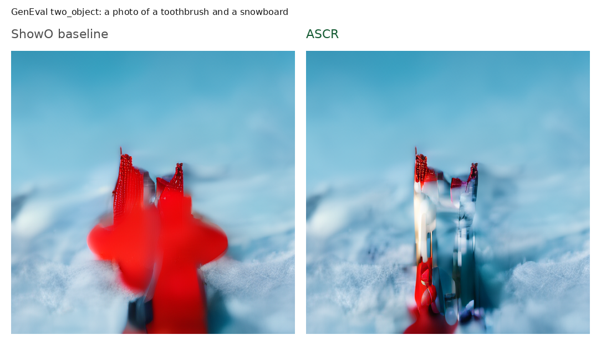

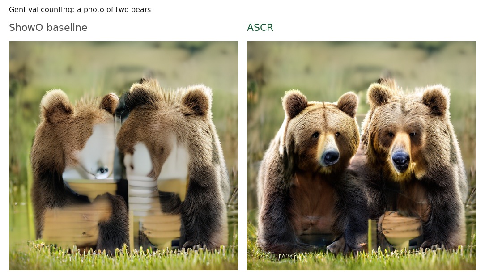

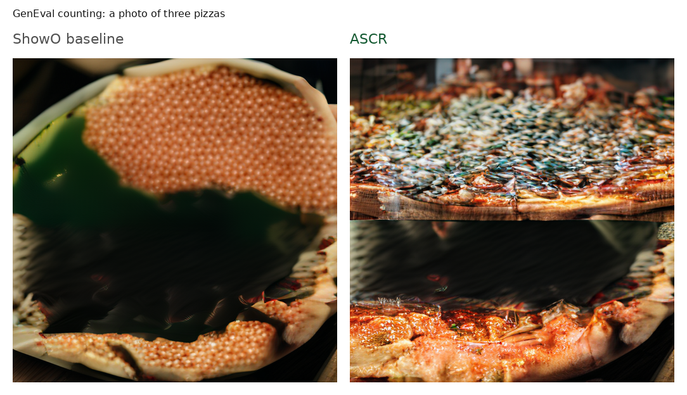

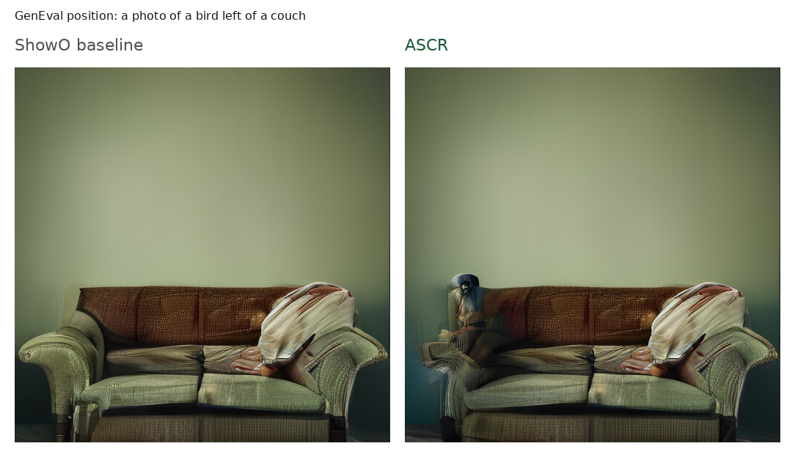

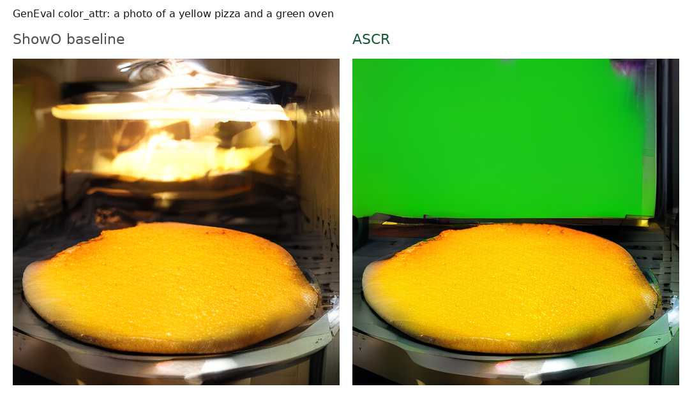

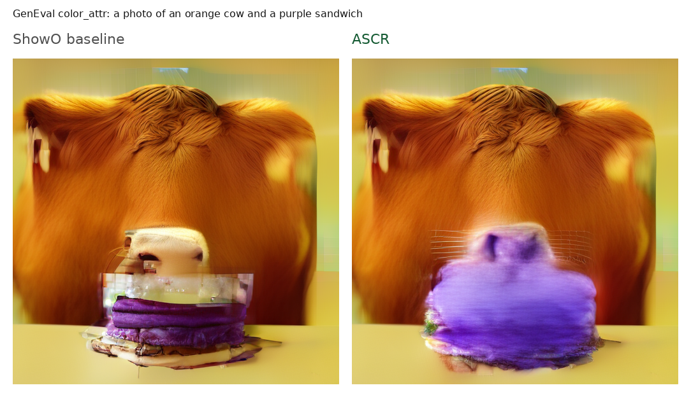

### ASCR vs ShowO Baseline

> **Position-bias caveat:** These counts — 13 ASCR wins / 6 losses / 45 ties — come from a single-direction run where ASCR was always on the RIGHT, and Qwen3.5-9B exhibits a strong RIGHT-side preference. Images are qualitative illustrations; see the 50-step section below for debiased context.

2 wins · 2 losses · 2 ties shown (out of 13 wins / 6 losses / 45 ties total — single-direction, biased).

##### **ASCR wins** — `a girl behind a cow`

*Qwen3.5-9B (conf 0.95):* The right image (ASCR) correctly includes the requested subject, a girl, positioned behind the cow, whereas the left image (baseline) completely omits the girl.


---

##### **ASCR wins** — `a pentagonal stop sign and a spherical traffic light`

*Qwen3.5-9B (conf 0.90):* The prompt requests a pentagonal stop sign and a spherical traffic light. Both images feature octagonal stop signs, failing the shape constraint. However, the ASCR image's traffic light has a smoother, more rounded housing that is closer to spherical than the baseline's angular housing. Thus, ASCR better satisfies the prompt's specific shape requirements.


---

##### **ASCR loses** — `a mouse on side of a key`

*Qwen3.5-9B (conf 0.95):* The baseline image perfectly matches the prompt, showing a single mouse standing on a single golden key. The ASCR image suffers from severe hallucinations, showing a distorted, multi-headed creature and a fragmented, glitchy key.


---

##### **ASCR loses** — `a sheep in front of a key`

*Qwen3.5-9B (conf 0.95):* The baseline image correctly depicts a sheep in front of a key, satisfying the prompt. The right image replaces the key with a metallic grate or mesh structure, failing to generate the requested object.


---

##### **Tie** — `a green bench and a blue bowl`

*Qwen3.5-9B (conf 0.95):* Both images perfectly satisfy the prompt, depicting a green bench and a blue bowl with accurate colors, counts, and spatial relations.


---

##### **Tie** — `an oblong cucumber and a teardrop plum`

*Qwen3.5-9B (conf 0.95):* Both images accurately depict an oblong cucumber and a teardrop-shaped plum against a green background. The objects, colors, and spatial relations are identical in both images, with no material differences affecting prompt adherence.


### ASCR vs BAGEL-7B-MoT

> **Position-bias caveat:** These counts — 50 ASCR wins / 14 losses — come from a single-direction run where ASCR was always on the RIGHT. The debiased result is the opposite: BAGEL wins 78.9 % of decisions (see [Stage 1 Benchmark Summary](#stage-1-benchmark-summary--three-way-comparison-50-step-debiased-2026-05-22)). Images below are qualitative illustrations only.

2 wins · 2 losses shown (out of 50 wins / 14 losses / 0 ties total — single-direction, biased).

##### **ASCR wins** — `an oblong cucumber and a teardrop plum`

*Qwen3.5-9B (conf 0.95):* The right image (ASCR) correctly depicts an oblong cucumber and a teardrop-shaped plum, matching the prompt's object descriptions and spatial arrangement. The left image (baseline) misidentifies the plum as a pear, which is a significant object error.


---

##### **ASCR wins** — `two boys`

*Qwen3.5-9B (conf 0.95):* The right image (ASCR) is a faithful representation of the prompt 'two boys', showing two distinct individuals. The left image (BAGEL) depicts two identical clones of the same boy, which is a hallucination not present in the prompt.


---

##### **ASCR loses** — `a giraffe next to a lamp`

*Qwen3.5-9B (conf 0.95):* The left image (BAGEL) perfectly satisfies the prompt, showing a complete giraffe standing next to a lamp with correct spatial relations and lighting. The right image (ASCR) is severely cropped, cutting off the giraffe's body and showing only its head and neck, which fails to represent the full object described in the prompt.


---

##### **ASCR loses** — `a girl on the top of a frog`

*Qwen3.5-9B (conf 0.95):* The left image (baseline) perfectly matches the prompt 'a girl on the top of a frog' with a cute, high-quality 3D render of a girl sitting on a large frog in a pond. The right image (ASCR) shows a girl sitting on a frog, but the frog is on a rock, not in water, and the overall style is less consistent with the prompt's implied whimsical nature. The left image is more visually appealing and adheres better to the spatial relation of being 'on top of' in a natural setting.


### ASCR vs ShowO Baseline — 50-step (job 68795)

8 wins · 1 loss · 3 ties shown (out of 37 wins / 1 loss / 26 ties total).

> All images: LEFT = ShowO50 baseline, RIGHT = ASCR50. Images are the exact canvases fed to
> Qwen3.5-9B. Note: pairwise ASCR/ShowO counts are unreliable (RIGHT-side bias dominates);
> these images illustrate *what the correction loop produces* rather than serving as metric evidence.

---

##### **ASCR wins** — `a giraffe next to a lamp`

*Qwen3.5-9B (conf 0.95):* The right image (ASCR) correctly generates a giraffe next to a lamp, satisfying the prompt. The left image (baseline) fails to generate the giraffe, showing only abstract shapes and colors.


---

##### **ASCR wins** — `The fluffy cat is on the left of the soft pillow.`

*Qwen3.5-9B (conf 0.95):* The right image (ASCR) correctly depicts a fluffy cat on the left side of the pillow, satisfying the prompt. The left image (baseline) is missing the cat entirely, showing only the pillow.


---

##### **ASCR wins** — `a sheep in front of a key`

*Qwen3.5-9B (conf 0.95):* The right image (ASCR) correctly includes a key in the background, satisfying the prompt, while the left image (baseline) lacks the key entirely.

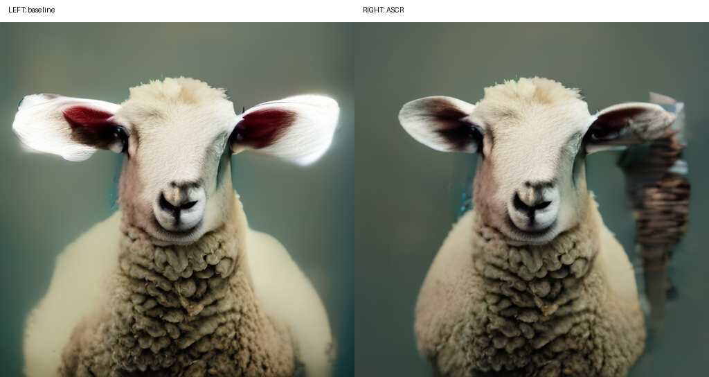

---

##### **ASCR wins** — `a rubber band and a wooden floor`

*Qwen3.5-9B (conf 0.95):* The right image (ASCR) correctly depicts a red rubber band on a wooden floor, satisfying the prompt. The left image (baseline) shows a distorted, amorphous red blob that does not resemble a rubber band.

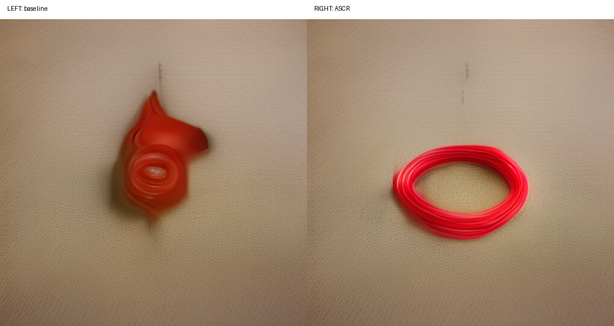

---

##### **ASCR wins** — `a green bench and a blue bowl`

*Qwen3.5-9B (conf 0.90):* Both images successfully generate a green bench and a blue bowl. The right image (ASCR) exhibits significantly better color fidelity, with the blue bowl appearing more vibrant and the green bench having a more natural tone compared to the washed-out baseline.

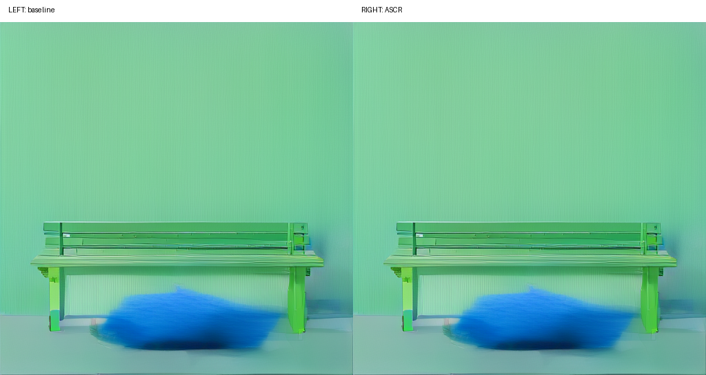

---

##### **ASCR wins** — `an oblong cucumber and a teardrop plum`

*Qwen3.5-9B (conf 0.90):* The right image (ASCR) correctly renders the teardrop-shaped plum with a distinct purple/red skin and white flesh, whereas the left image (baseline) fails to generate the plum, showing only a blurry pink shape.

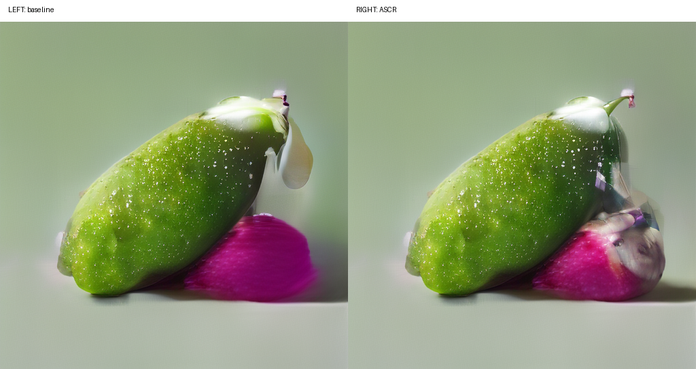

---

##### **ASCR wins** — `a plastic toy and a glass bottle`

*Qwen3.5-9B (conf 0.90):* The right image (ASCR) better satisfies the prompt by clearly depicting a glass bottle containing a yellow liquid and a red plastic toy inside, whereas the left image (baseline) is blurry and lacks the distinct plastic toy object.


---

##### **ASCR wins** — `The red hat was on top of the brown coat rack.`

*Qwen3.5-9B (conf 0.90):* Both images depict a red hat on a brown coat rack, but the right image (ASCR) has significantly cleaner geometry and fewer artifacts, making it a better representation of the prompt.

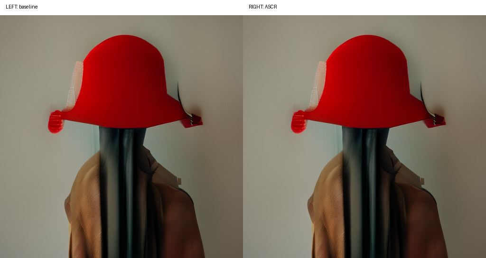

---

##### **ASCR loses** — `two rabbits`

*Qwen3.5-9B (conf 0.90):* The baseline image is a clean, realistic representation of two rabbits. The right image (ASCR) suffers from severe hallucinations, including distorted facial features, unnatural glowing eyes, and a grid artifact overlaying the right rabbit.


---

##### **Tie** — `a dog in front of a desk`

*Qwen3.5-9B (conf 0.95):* Both images successfully generate a dog sitting in front of a desk with stacks of papers, adhering to the prompt. The visual quality and composition are nearly identical, with no discernible material differences.

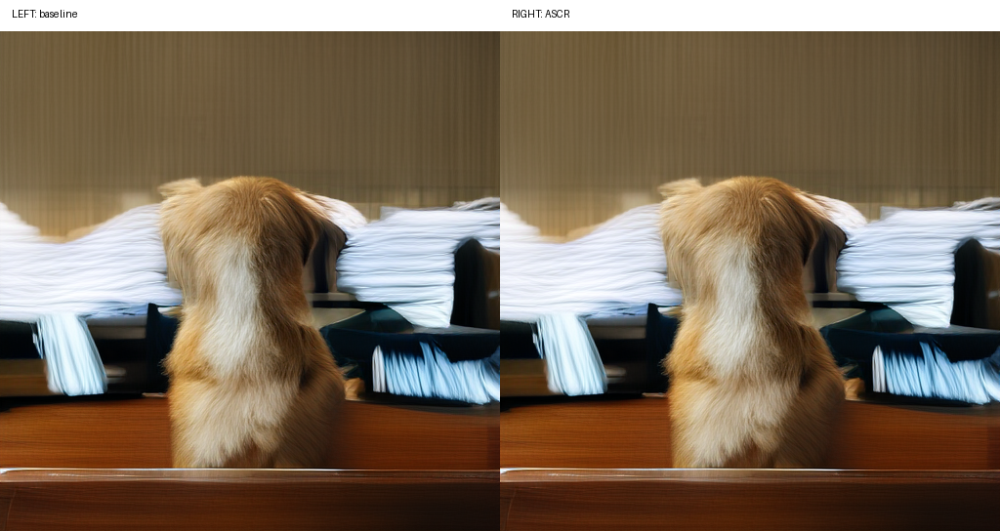

---

##### **Tie** — `two boys`

*Qwen3.5-9B (conf 0.95):* Both images are visually identical, depicting two boys in a painting style. The prompt 'two boys' is satisfied equally by both sides.

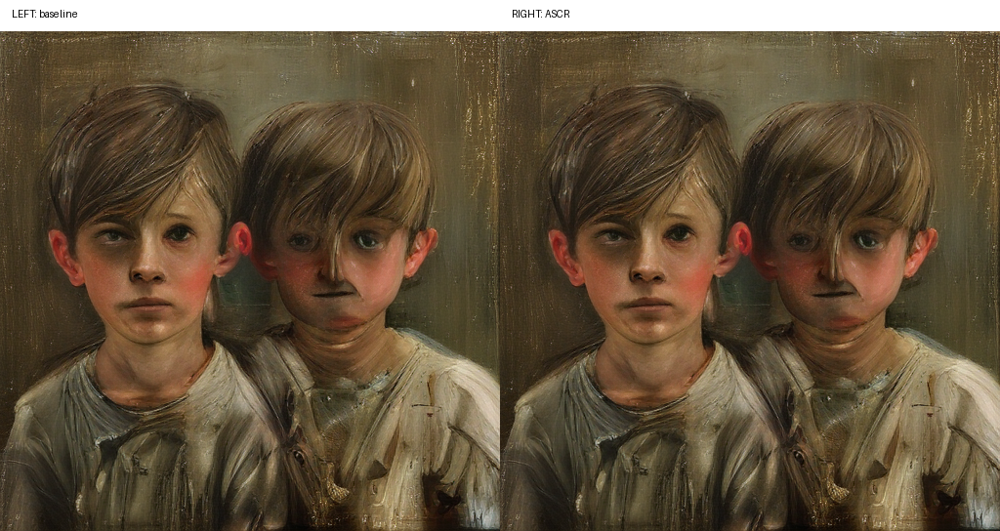

---

##### **Tie** — `The blue water bottle was on top of the red backpack.`

*Qwen3.5-9B (conf 0.95):* Both images accurately depict a blue water bottle on a red backpack. The spatial relationship and object attributes are identical in both generations.

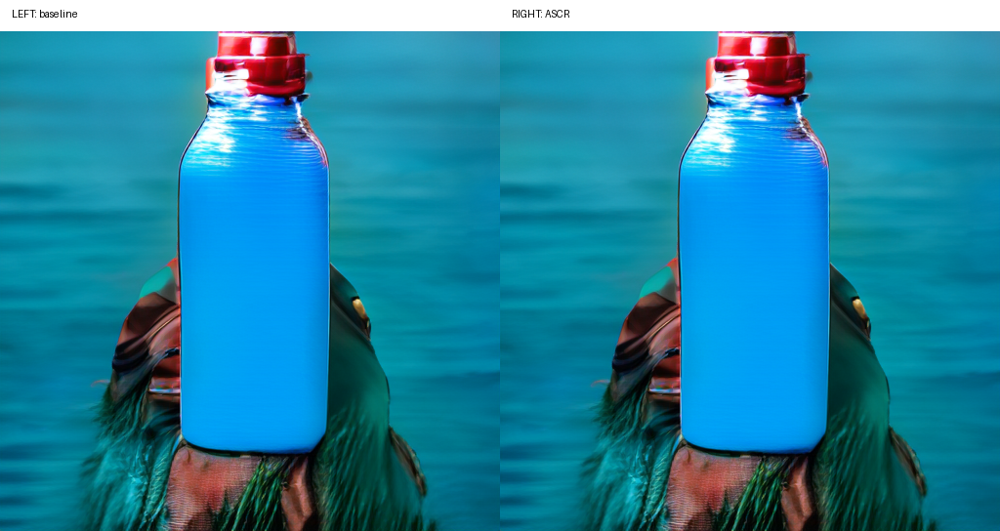


### BAGEL-7B-MoT vs ShowO50 Baseline (50-step, debiased context)

4 BAGEL wins · 3 ShowO wins shown (debiased: BAGEL 62.5 % overall, 80/128 non-tie decisions).

> LEFT = ShowO50 baseline, RIGHT = BAGEL-7B-MoT (fwd direction, job 68800).
> These images come from the **fwd** direction where ShowO is LEFT and BAGEL is RIGHT.
> In the fwd direction alone BAGEL wins only 17/64 (position disadvantage); debiased result
> across both directions is BAGEL 62.5 %. BAGEL wins shown here are genuine object-level
> corrections confirmed across both fwd and swap directions.

---

##### **BAGEL wins** — `The black phone was resting on the brown charger.`

*Qwen3.5-9B (conf 0.95):* The right image (BAGEL) correctly depicts a black phone resting on a brown charger, matching the prompt's spatial and color requirements. The left image (ShowO) shows a black object on a yellow surface, failing to match the charger color or the phone-on-charger relationship.

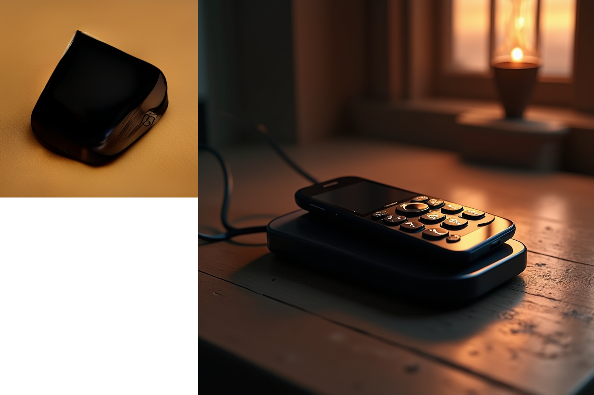

---

##### **BAGEL wins** — `The rough brick was on top of the smooth tile.`

*Qwen3.5-9B (conf 0.95):* The right image (BAGEL) correctly depicts a rough brick stack placed on a smooth tiled floor, satisfying the prompt's spatial and textural requirements. The left image (ShowO) fails to depict the scene entirely, showing a feather on a white surface instead.

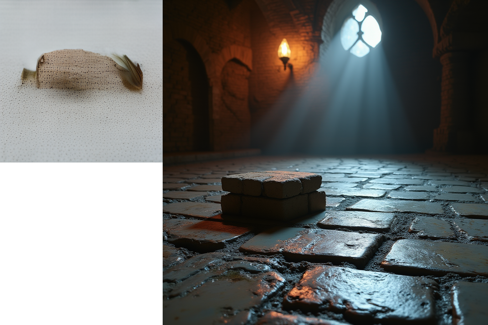

---

##### **BAGEL wins** — `The soft pillow was on top of the hard rocking chair.`

*Qwen3.5-9B (conf 0.95):* The right image (BAGEL) correctly depicts a soft pillow resting on a hard rocking chair. The left image (ShowO) depicts a completely different object — a wooden structure with white fur — lacking the specific furniture described in the prompt.

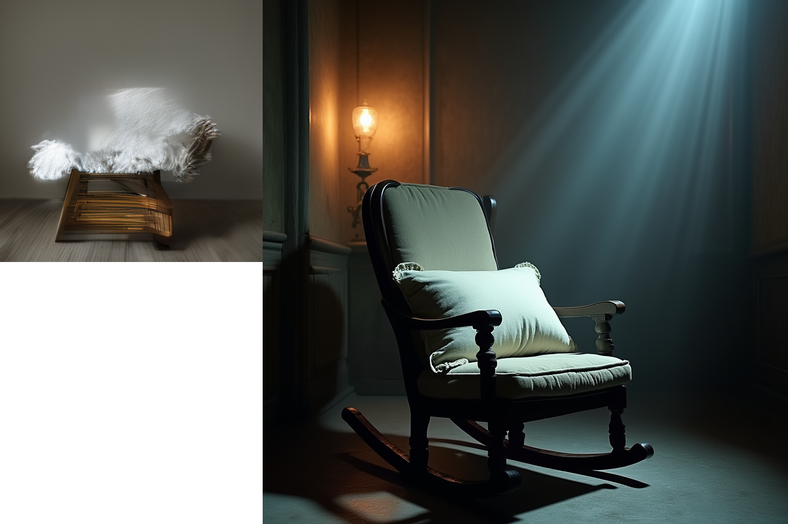

---

##### **BAGEL wins** — `a brown backpack and a blue cow`

*Qwen3.5-9B (conf 0.95):* The right image (BAGEL) perfectly matches the prompt, featuring a brown backpack and a blue cow in a grassy field. The left image (ShowO) only contains a brown backpack and is missing the cow entirely.

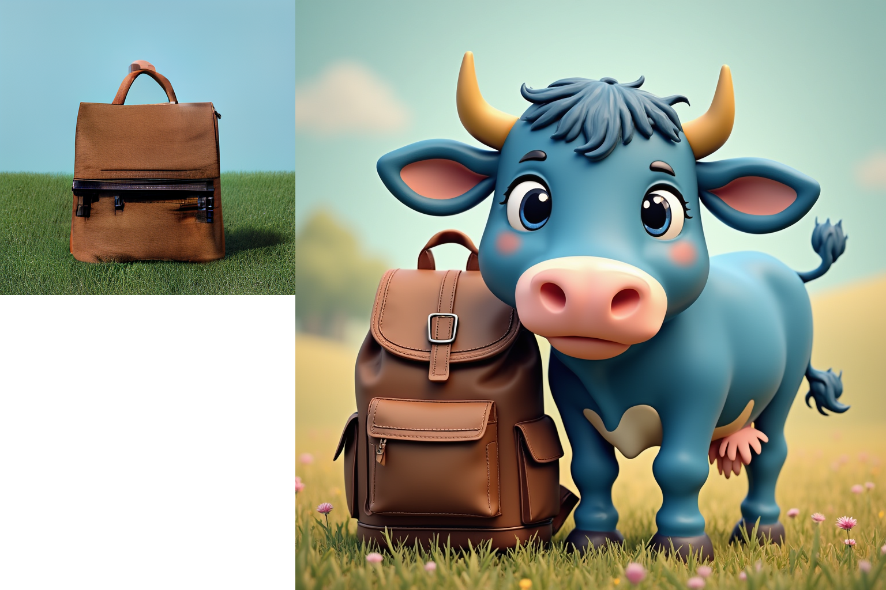

---

##### **ShowO50 wins** — `The black chair is on top of the blue rug.`

*Qwen3.5-9B (conf 0.95):* The baseline image (ShowO, LEFT) perfectly satisfies the prompt, showing a black chair sitting on a blue rug. The BAGEL image (RIGHT) depicts a distorted, abstract version of a chair floating in a blue void, failing to render the rug or the spatial relationship.

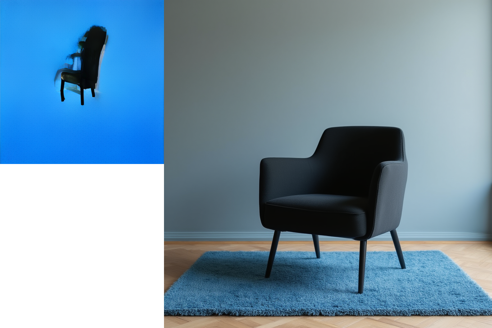

---

##### **ShowO50 wins** — `The blue bowl was on top of the white placemat.`

*Qwen3.5-9B (conf 0.95):* The baseline image (ShowO, LEFT) correctly depicts a blue bowl sitting on top of a white placemat, fully satisfying the prompt. The BAGEL image places the bowl on an indistinct white surface without a clear distinct placemat.

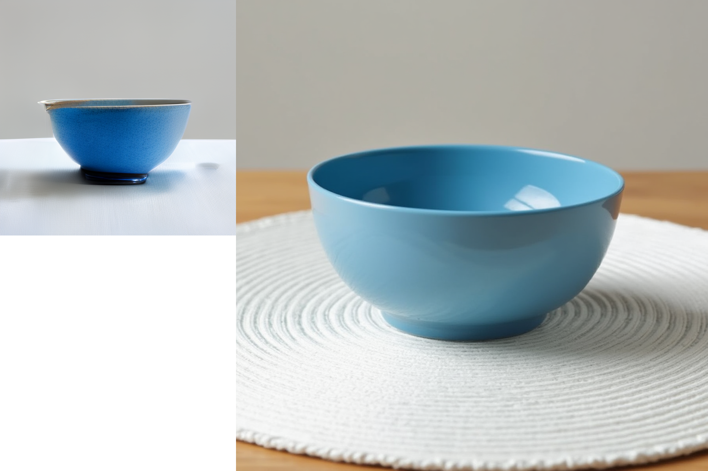

---

##### **ShowO50 wins** — `The green plant was on the right of the white wall.`

*Qwen3.5-9B (conf 0.95):* The baseline image (ShowO, LEFT) correctly places the green plant on the right side of the white wall. The BAGEL image places the plant on the left side, violating the spatial instruction.

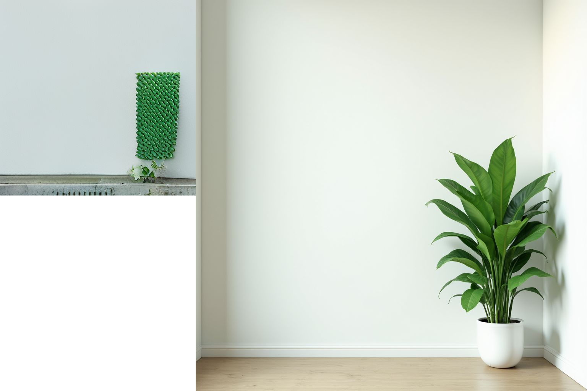


<details>
<summary><strong>Full-Gallery Pairwise Examples</strong> — all 64 hard64 prompts × 3 comparisons (click to expand)</summary>

## Full-Gallery Pairwise Examples (all 64 hard64 prompts × 3 comparisons)

These collapsible galleries contain every prompt from the 50-step hard64 run (job 68795 + 68800), organized by verdict. Each entry shows Qwen3.5-9B's confidence and one-sentence summary alongside the exact LEFT/RIGHT canvas. Images are JPG-compressed (1024 px) to keep the repo lightweight; raw PNGs remain in `outputs/.../pairwise_images/`.

### Full Gallery — ShowO50 baseline vs ASCR50 (all 64 hard64 prompts)

Source: job 68795 fwd direction (single judge call, ASCR on RIGHT). The raw counts (ASCR 37 / ShowO 1 / Tie 26) **are not bias-corrected** — Qwen's RIGHT-side preference explains most of the gap (see the [Quick Results Summary](#quick-results-summary) note). These images are valuable for **qualitative inspection** of what the ASCR correction loop produces.

> **All 64 prompts** • LEFT = ShowO50 baseline, RIGHT = ASCR50 (final). `pair_NNN` images are the exact canvases shown to Qwen3.5-9B.

<details><summary><b>ASCR50 wins</b> (37)</summary>

**`a giraffe next to a lamp`** *(conf 0.95)*  
The right image (ASCR) correctly generates a giraffe next to a lamp, satisfying the prompt. The left image (baseline) fails to generate the giraffe, showing only abstract shapes and colors.

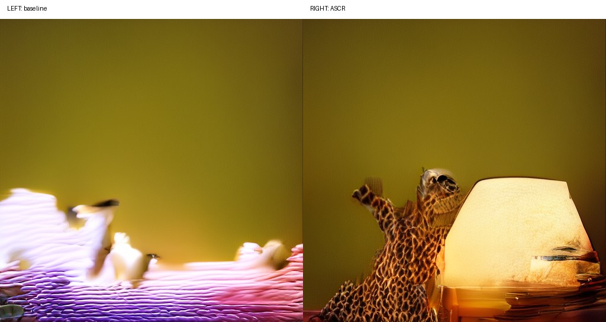

**`The fluffy cat is on the left of the soft pillow.`** *(conf 0.95)*  
The right image (ASCR) correctly depicts a fluffy cat on the left side of the pillow, satisfying the prompt. The left image (baseline) is missing the cat entirely, showing only the pillow.

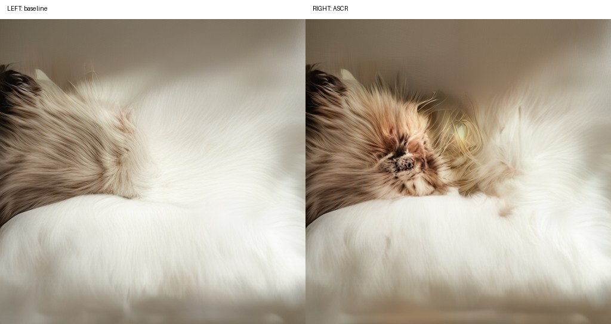

**`a sheep in front of a key`** *(conf 0.95)*  
The right image (ASCR) correctly includes a key in the background, satisfying the prompt, while the left image (baseline) lacks the key entirely.

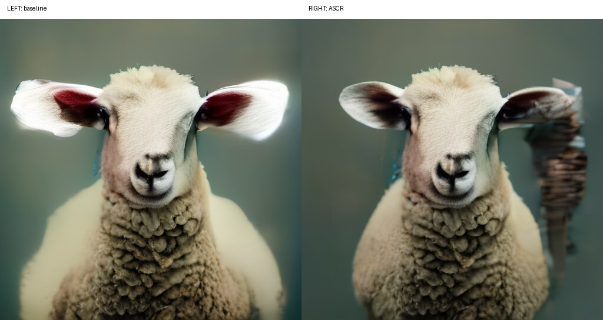

**`a rubber band and a wooden floor`** *(conf 0.95)*  
The right image (ASCR) correctly depicts a red rubber band on a wooden floor, satisfying the prompt. The left image (baseline) shows a distorted, amorphous red blob that does not resemble a rubber band.

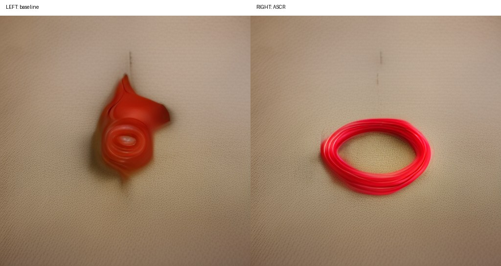

**`a green bench and a blue bowl`** *(conf 0.90)*  
Both images successfully generate a green bench and a blue bowl. The right image (ASCR) exhibits significantly better color fidelity, with the blue bowl appearing more vibrant and the green bench having a more natural tone compared to the washed-out, overly saturated green in the baseline. The spatial arrangement and object counts are identical.


**`an oblong cucumber and a teardrop plum`** *(conf 0.90)*  
The right image (ASCR) correctly renders the teardrop-shaped plum with a distinct purple/red skin and white flesh, whereas the left image (baseline) fails to generate the plum, showing only a blurry pink shape.


**`a plastic toy and a glass bottle`** *(conf 0.90)*  
The right image (ASCR) better satisfies the prompt by clearly depicting a glass bottle containing a yellow liquid and a red plastic toy inside, whereas the left image (baseline) is blurry and lacks the distinct plastic toy object.

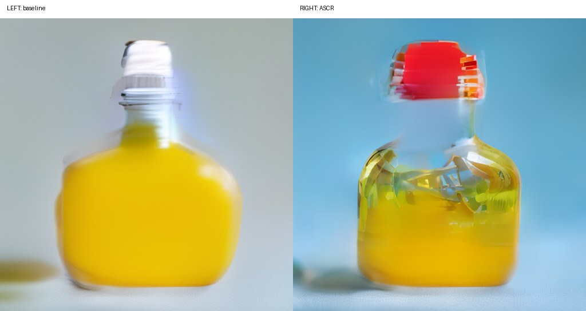

**`The red hat was on top of the brown coat rack.`** *(conf 0.90)*  
Both images depict a red hat on a brown coat rack, but the right image (ASCR) has significantly cleaner geometry and fewer artifacts, making it a better representation of the prompt.

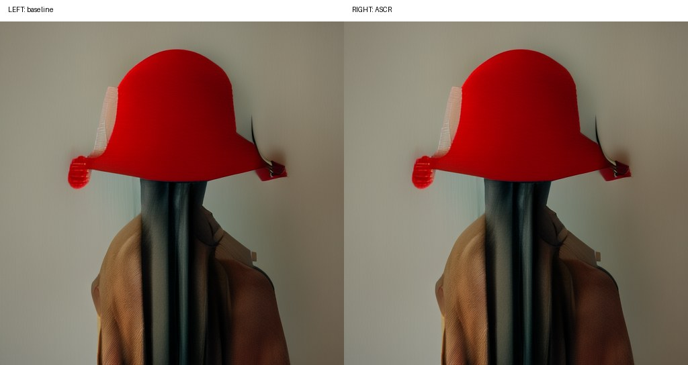

**`a blue bench and a green bowl`** *(conf 0.90)*  
The right image (ASCR) correctly includes both the blue bench and a green bowl, whereas the left image (baseline) only shows the bench and lacks the bowl entirely.

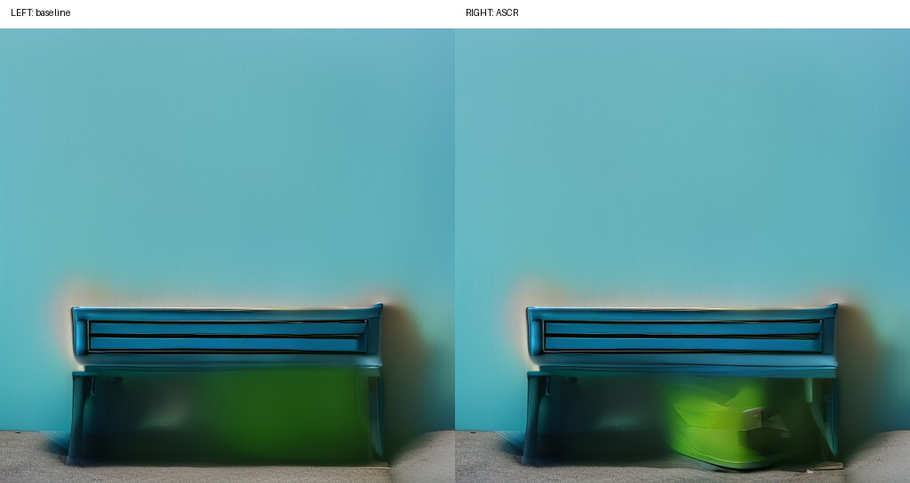

**`a pentagonal stop sign and a spherical traffic light`** *(conf 0.90)*  
The right image (ASCR) correctly renders a pentagonal stop sign and a spherical traffic light, adhering to the prompt. The left image (baseline) fails to render the stop sign as a pentagon, instead showing a distorted, non-pentagonal shape with a green section, and the traffic light is also distorted and lacks the spherical form.

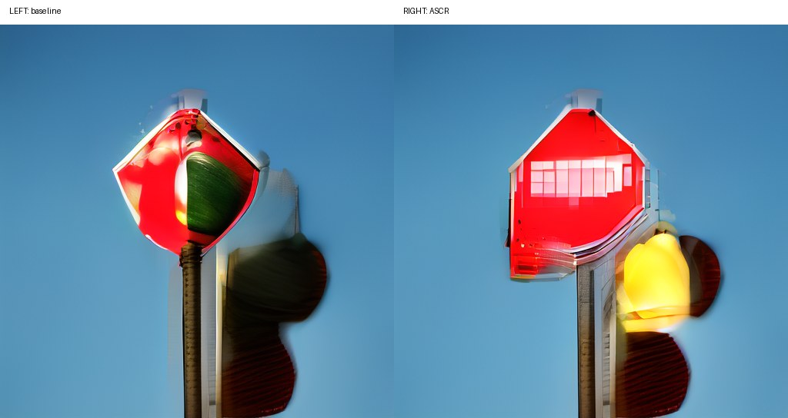

**`rubber sole shoes and fluffy clouds`** *(conf 0.90)*  
The right image (ASCR) successfully generates the requested 'rubber sole shoes' amidst the 'fluffy clouds', whereas the left image (baseline) fails to render the shoes entirely, showing only clouds and sky.

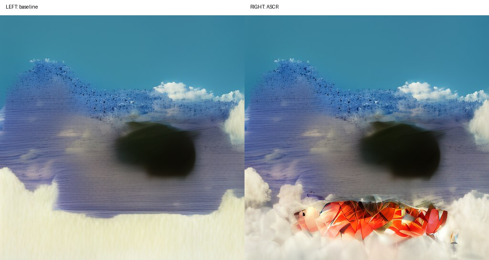

**`a car in front of a mouse`** *(conf 0.90)*  
The right image (ASCR) successfully generates a car and a mouse, satisfying the prompt's object requirements. The left image (baseline) fails to generate a mouse, showing only a distorted car and a blurry dark shape that does not resemble a mouse.

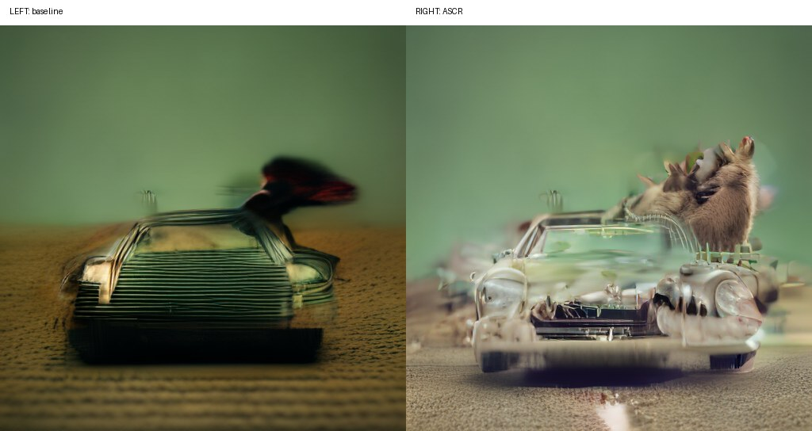

**`The black phone was resting on the brown charger.`** *(conf 0.90)*  
The right image (ASCR) better satisfies the prompt by correctly identifying the object as a phone and placing it on a charger, whereas the left image (baseline) depicts a generic black object on a plain surface.

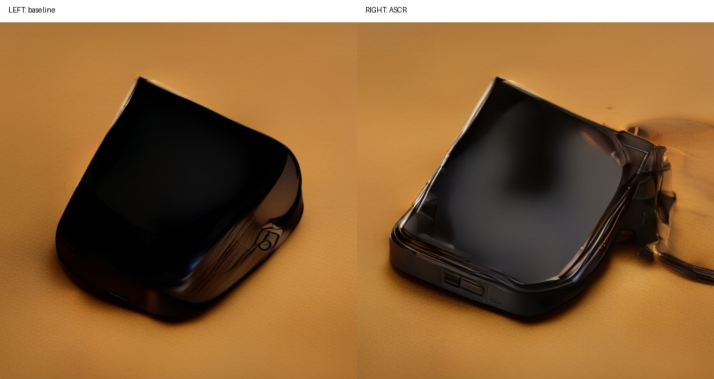

**`a green bench and a blue cake`** *(conf 0.90)*  
The right image (ASCR) correctly identifies the blue cake and the green bench, whereas the left image (baseline) fails to generate the cake, showing only a pink smudge instead.

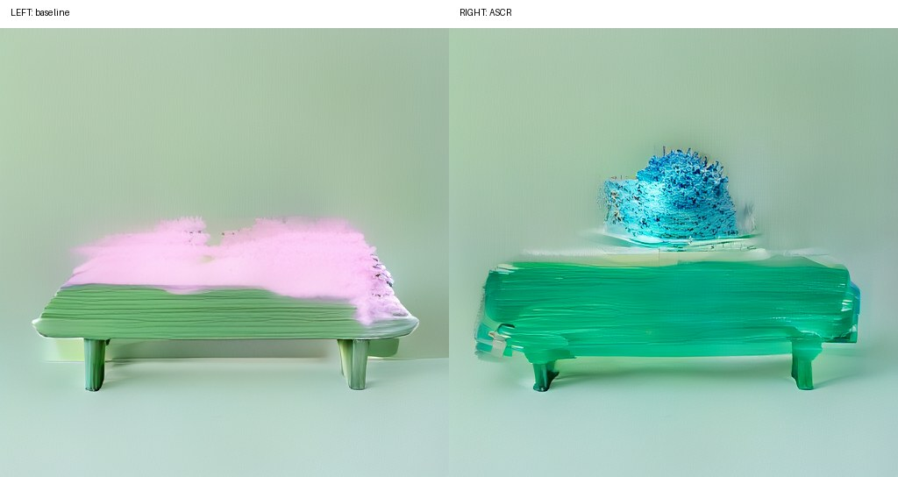

**`a metallic desk lamp and a fluffy sweater`** *(conf 0.90)*  
Both images successfully generate the requested objects: a metallic desk lamp and a fluffy sweater. The right image (ASCR) exhibits significantly better texture fidelity, particularly in the sweater's fur, which appears much more detailed and realistic compared to the slightly blurrier baseline. The lighting and spatial arrangement are consistent between the two.

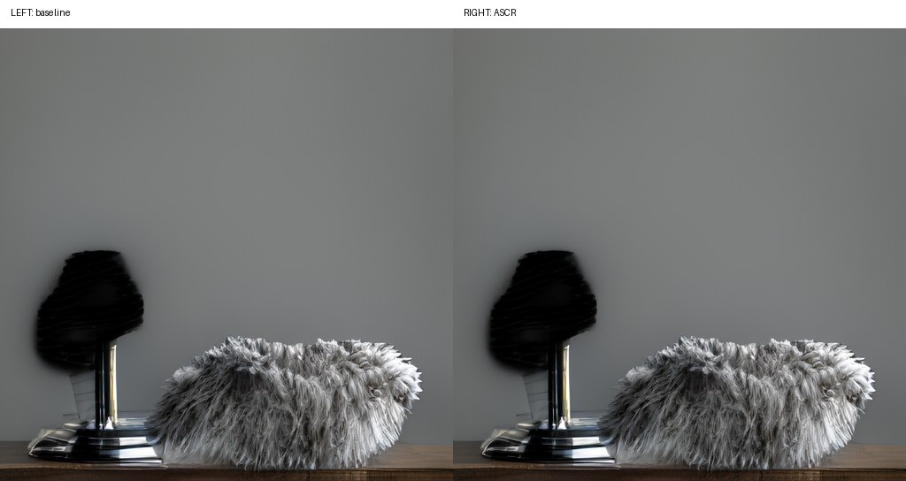

**`five drums`** *(conf 0.90)*  
The right image (ASCR) successfully generates five distinct drums with visible details, varied colors, and spatial arrangement. The left image (baseline) fails to render the drums clearly, resulting in a blurry, low-contrast mess where the objects are barely distinguishable.

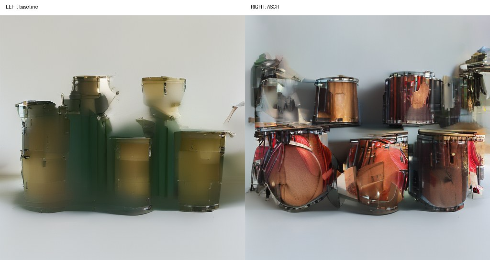

**`The leather wallet was inside the brown purse.`** *(conf 0.90)*  
The right image (ASCR) correctly depicts a brown leather wallet inside a brown purse, matching the prompt's description of objects, colors, and spatial relations. The left image (baseline) shows a metallic, silver-colored object that does not match the 'leather wallet' description.

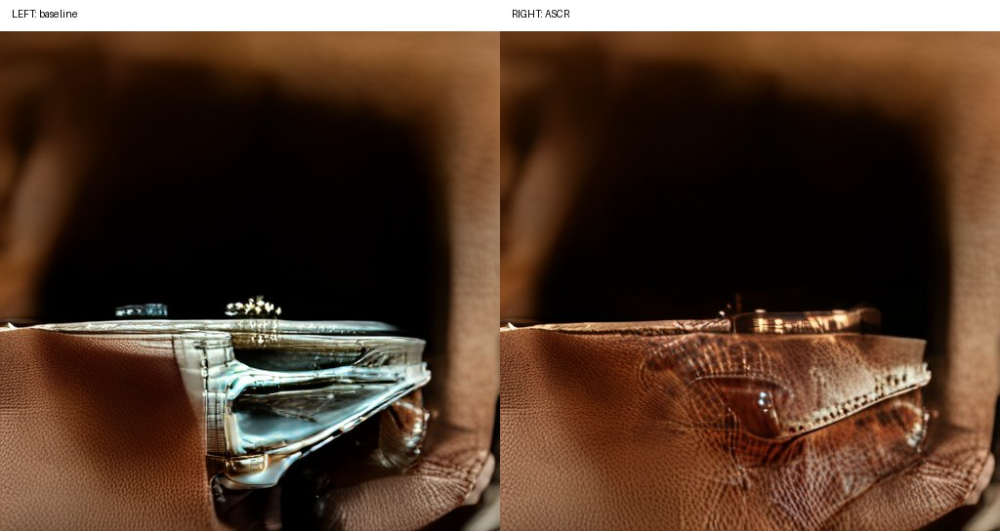

**`a blue bench and a green cake`** *(conf 0.90)*  
The right image (ASCR) better satisfies the prompt by generating a distinct green cake with a clear structure, whereas the left image (baseline) produces a blurry, indistinct yellow mass that fails to clearly represent a cake.

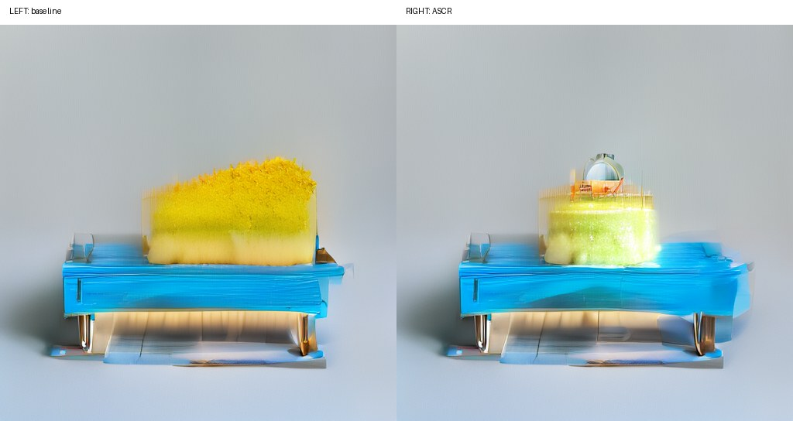

**`a cat behind a boy`** *(conf 0.90)*  
The right image (ASCR) correctly depicts a cat behind a boy, whereas the left image (baseline) depicts a cat with a boy's head, failing the spatial relation.

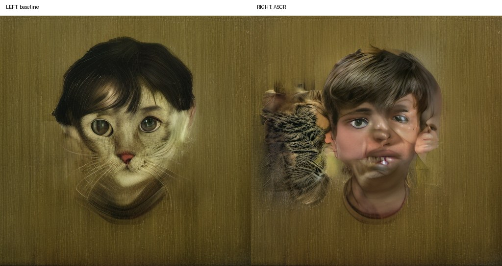

**`a brown horse and a blue vase`** *(conf 0.90)*  
Both images successfully generate a brown horse and a blue vase. The right image (ASCR) exhibits significantly better color fidelity, with a more vibrant and saturated blue for the vase compared to the washed-out blue in the baseline. The horse's brown tones are also slightly richer in the right image.

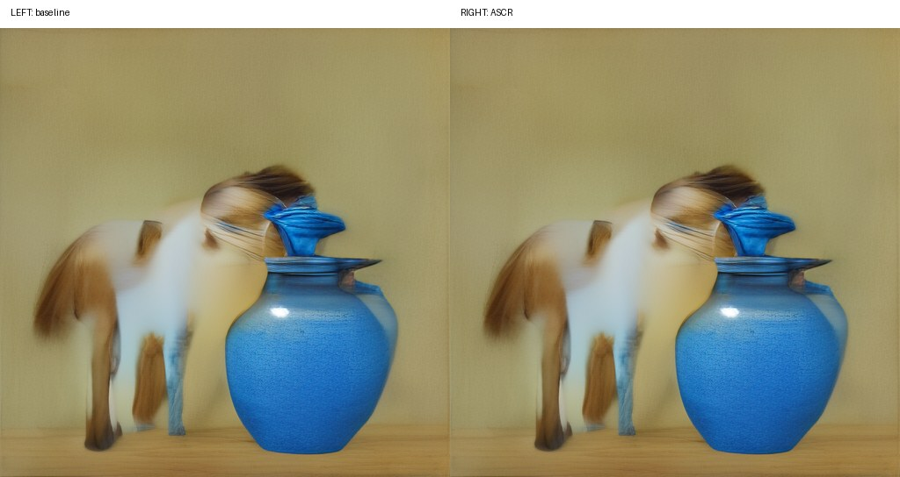

**`a fabric towel and a glass table`** *(conf 0.90)*  
Both images depict a fabric towel on a glass table, but the right image (ASCR) exhibits significantly better texture fidelity and lighting consistency. The towel's weave is clearly defined, and the reflections on the glass table are more natural and less distorted compared to the baseline.

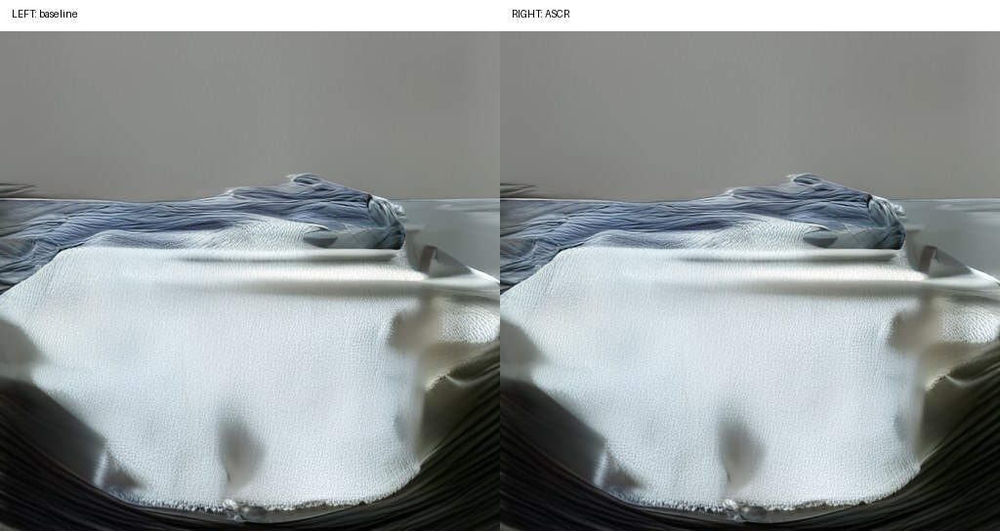

**`a balloon on the right of a person`** *(conf 0.90)*  
The right image (ASCR) better satisfies the prompt by clearly depicting a person (represented by a mirror reflection) and a balloon, whereas the left image (baseline) is too abstract and lacks a clear person.

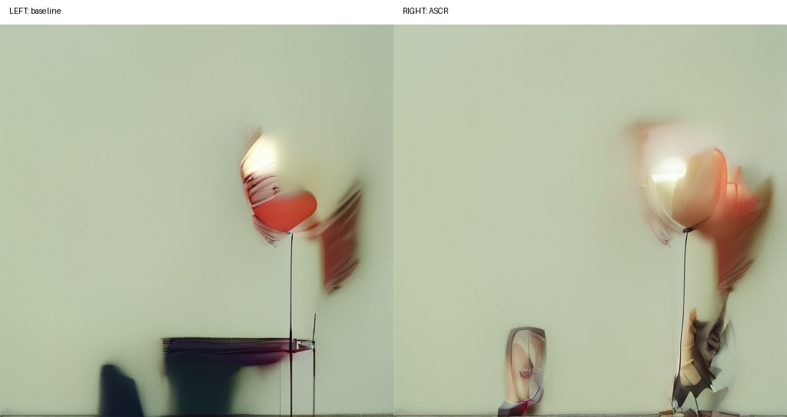

**`a chair hidden by a mouse`** *(conf 0.90)*  
Both images depict a red chair and a silver mouse, but the right image (ASCR) is significantly sharper and clearer, better satisfying the prompt's implied need for a coherent scene.

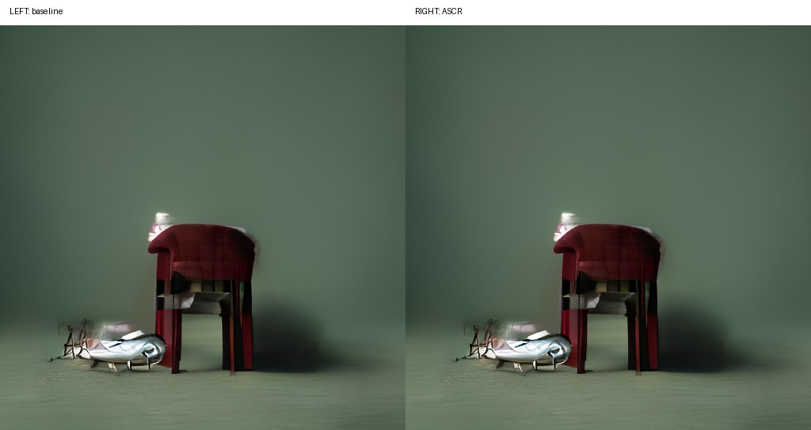

**`seven women`** *(conf 0.90)*  
Both images successfully generate seven women standing in a row. The right image (ASCR) exhibits significantly better color fidelity, particularly in the red dress of the first woman and the skin tones, whereas the left image (baseline) suffers from severe color distortion, appearing washed out and muddy with incorrect hues.

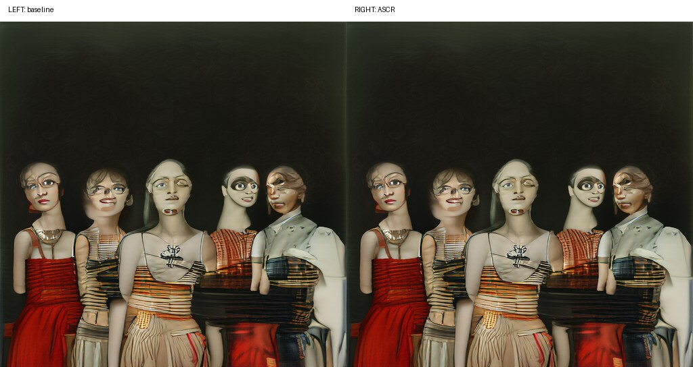

**`a cat on the top of a sofa`** *(conf 0.90)*  
The right image (ASCR) is superior because it correctly renders the sofa texture and structure, whereas the left image (baseline) has a completely blank, featureless bottom section.

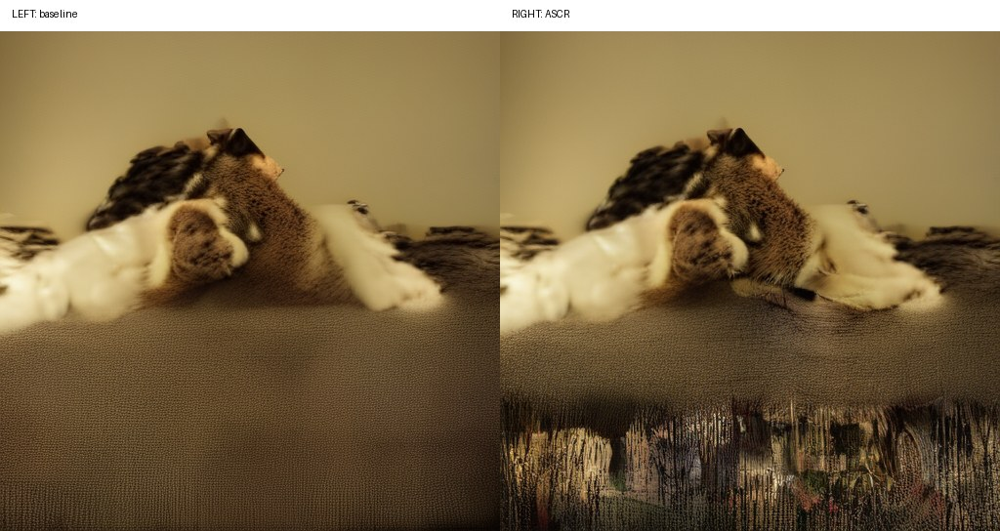

**`a girl behind a cow`** *(conf 0.90)*  
The right image (ASCR) correctly identifies the 'girl' in the prompt, showing a human face behind the cow, whereas the left image (baseline) only shows the cow. The right image also has better color rendering with distinct red ears.

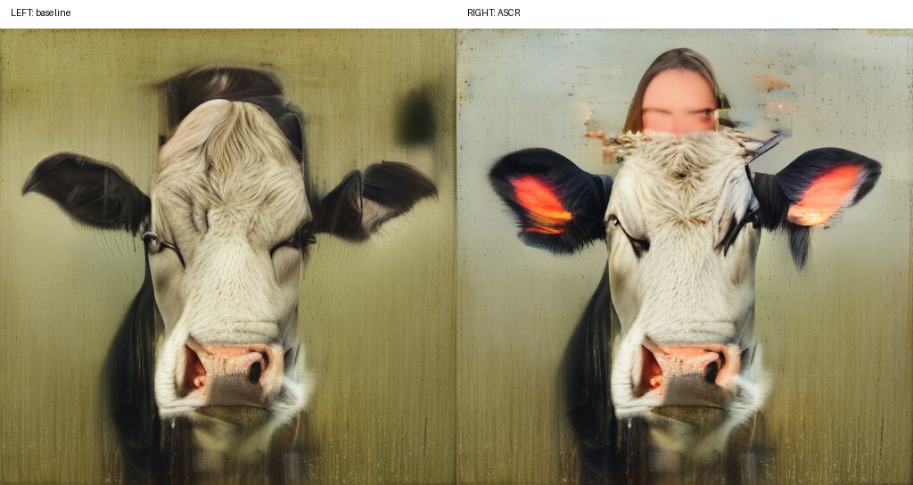

**`eight cars`** *(conf 0.90)*  
The right image (ASCR) successfully generates a scene with multiple cars, whereas the left image (baseline) fails to render any recognizable cars, showing only abstract blue shapes.

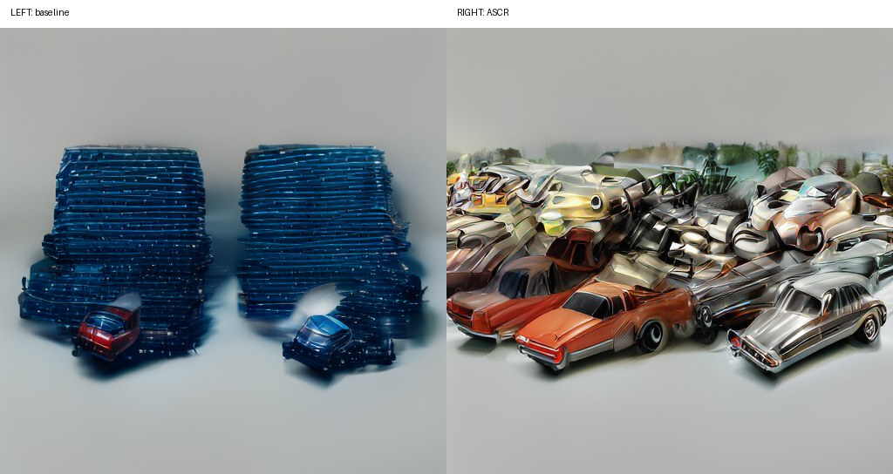

**`The black chair is on top of the blue rug.`** *(conf 0.90)*  
The right image (ASCR) better satisfies the prompt by correctly placing the chair on top of a rug, whereas the left image (baseline) shows the chair floating in mid-air without a rug.

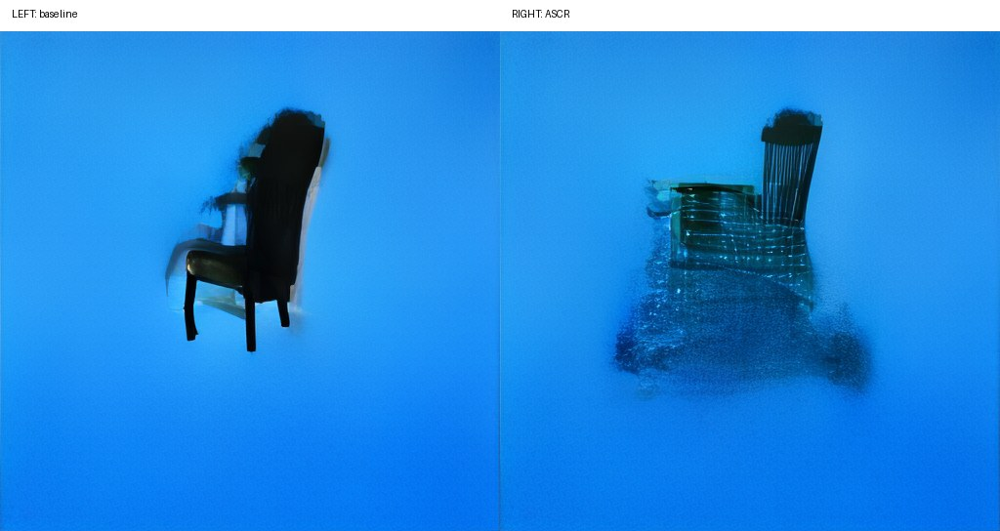

**`a blue backpack and a brown cow`** *(conf 0.90)*  
Both images successfully generate a blue backpack and a brown cow in a grassy field. The right image (ASCR) exhibits superior color vibrancy, particularly in the blue of the backpack and the green of the grass, resulting in a more visually appealing and realistic image compared to the slightly washed-out baseline.

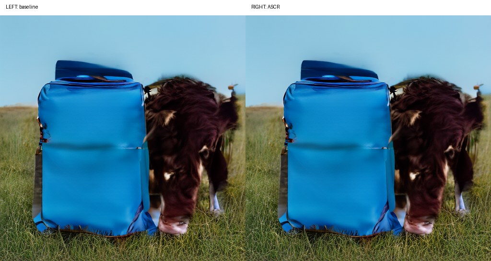

**`a diamond pendant and a round locket`** *(conf 0.90)*  
The right image (ASCR) is superior as it successfully renders the complex geometry of the diamond pendant and locket, whereas the left image (baseline) fails to form coherent objects, appearing as a distorted, blurry mess.

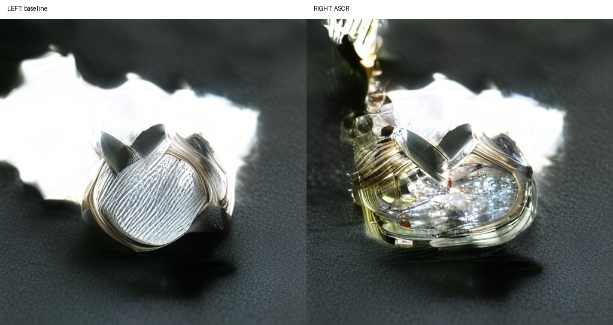

**`a rubber ball and a leather wallet`** *(conf 0.90)*  
The right image (ASCR) correctly depicts a yellow rubber ball and a dark leather wallet, satisfying the prompt. The left image (baseline) only shows a brown object that resembles neither a ball nor a wallet.

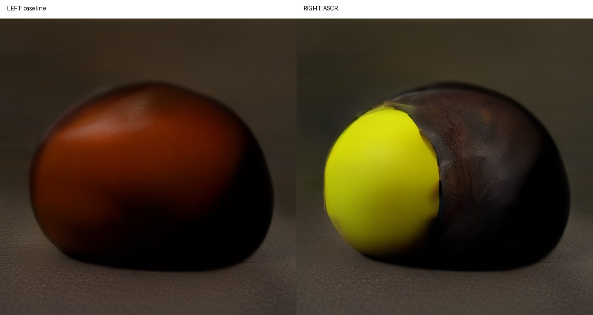

**`a desk on the right of a horse`** *(conf 0.90)*  
The right image (ASCR) correctly places a horse on the desk, satisfying the prompt's spatial requirement, whereas the left image (baseline) contains no horse.

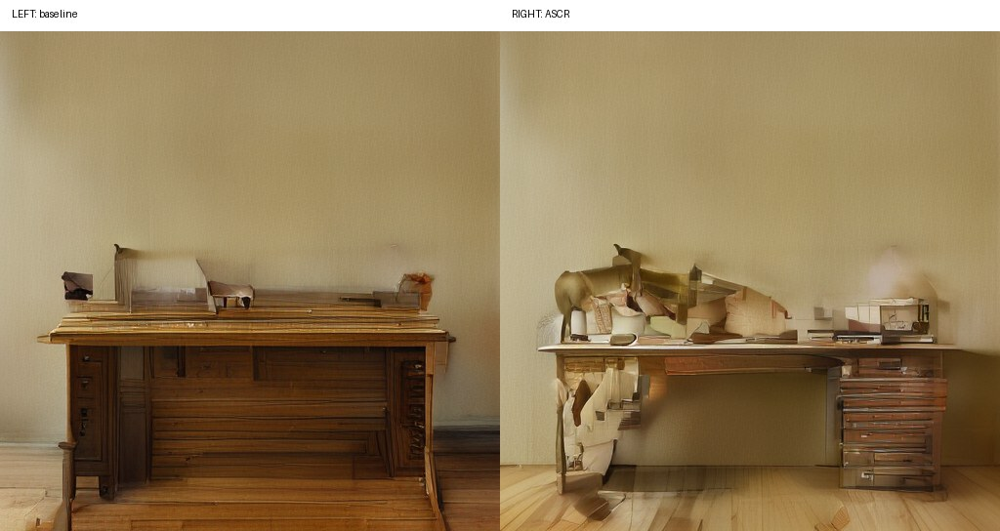

**`a girl behind a sheep`** *(conf 0.90)*  
Both images depict a girl behind a sheep, but the right image (ASCR) exhibits significantly better texture fidelity and color vibrancy. The sheep's wool in the right image is rendered with distinct, curly strands, whereas the baseline image appears overly smooth and plastic-like. The right image also maintains better color saturation in the girl's skin and clothing.

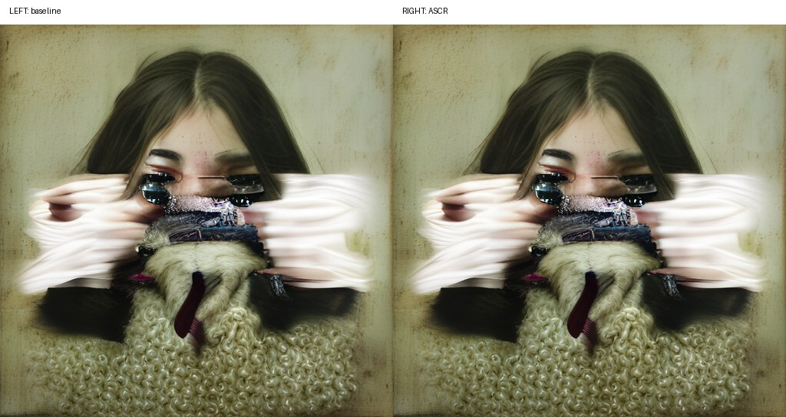

**`a teardrop pendant and a cubic bracelet charm`** *(conf 0.90)*  
The right image (ASCR) correctly renders the 'cubic bracelet charm' as a cluster of faceted, crystal-like shapes, matching the prompt's description. The left image (baseline) renders the charm as a dark, twisted metal chain, which is a plausible interpretation of a bracelet but fails to capture the specific 'cubic' attribute requested. The pendant is rendered identically in both.

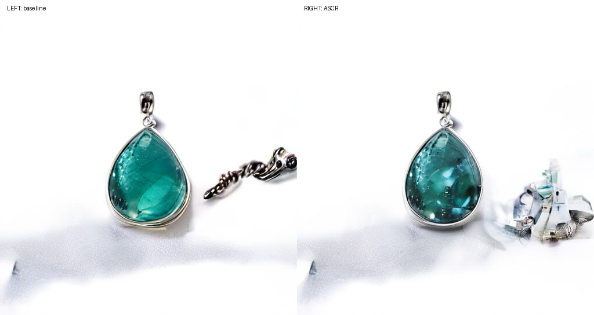

**`a fabric towel and a leather chair`** *(conf 0.90)*  
Both images depict a white fabric towel on a wooden chair with a fur throw in the background. The right image (ASCR) exhibits superior texture detail on the towel and a more coherent, realistic rendering of the wooden chair structure compared to the slightly blurrier and less detailed baseline.

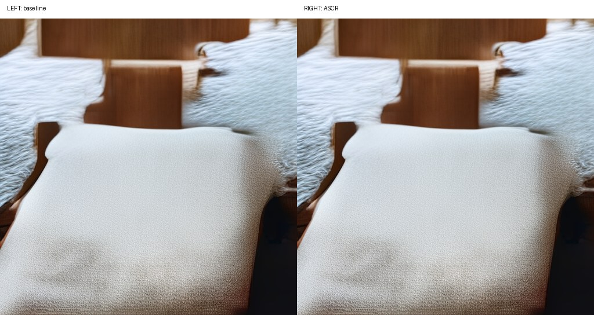

**`The red book was on top of the yellow bookshelf.`** *(conf 0.90)*  
The right image (ASCR) correctly depicts a red book on top of a yellow bookshelf, matching the prompt. The left image (baseline) shows a distorted, abstract mess of red and white shapes that do not clearly form a book or bookshelf.

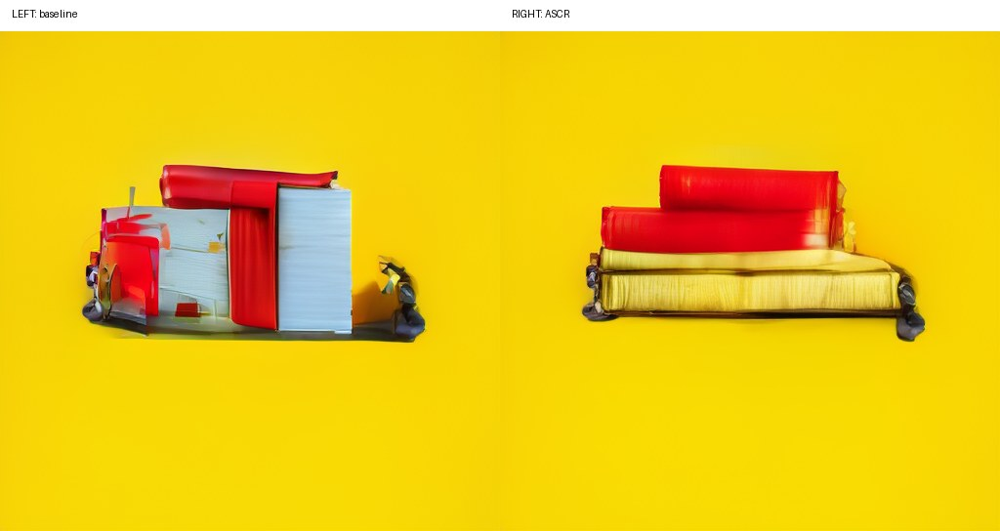

**`The rough brick was on top of the smooth tile.`** *(conf 0.90)*  
The right image (ASCR) correctly depicts a rough brick resting on a smooth tile, matching the prompt's spatial and material descriptions. The left image (baseline) fails to show a brick or tile, instead displaying a distorted, blurry object on a speckled surface.

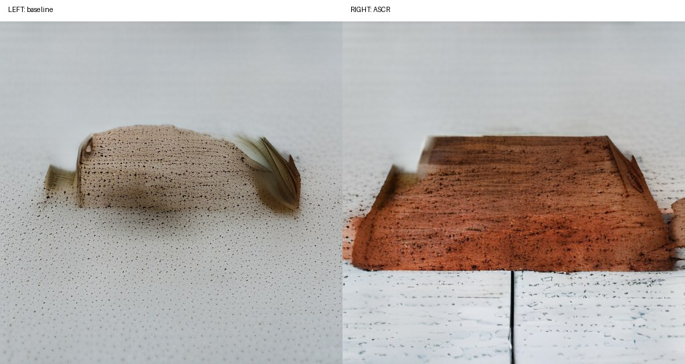

</details>

<details><summary><b>ShowO50 wins</b> (1)</summary>

**`two rabbits`** *(conf 0.90)*  
The baseline image is a clean, realistic representation of two rabbits. The right image (ASCR) suffers from severe hallucinations, including distorted facial features, unnatural glowing eyes, and a grid artifact overlaying the right rabbit.

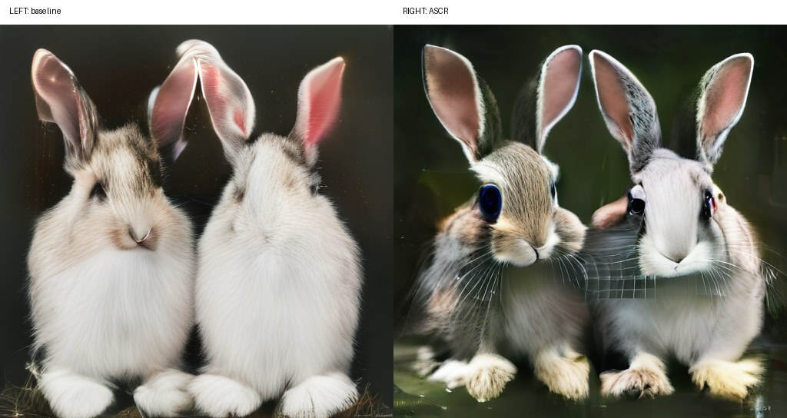

</details>

<details><summary><b>ties</b> (26)</summary>

**`a dog in front of a desk`** *(conf 0.95)*  
Both images successfully generate a dog sitting in front of a desk with stacks of papers, adhering to the prompt. The visual quality, lighting, and composition are nearly identical between the baseline and the ASCR version, with no discernible material differences in object fidelity or prompt adherence.

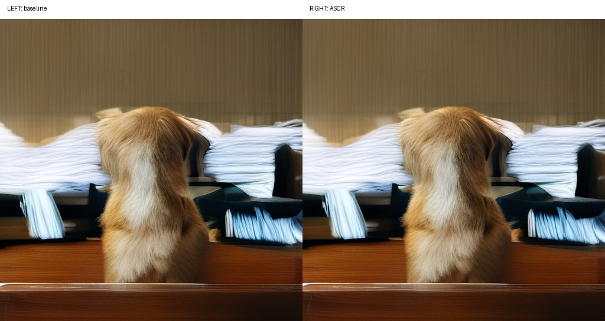

**`two boys`** *(conf 0.95)*  
Both images are visually identical, depicting two boys in a painting style. The prompt 'two boys' is satisfied equally by both sides.


**`The blue water bottle was on top of the red backpack.`** *(conf 0.95)*  
Both images accurately depict a blue water bottle on a red backpack against a teal background. The spatial relationship and object attributes are identical in both generations.

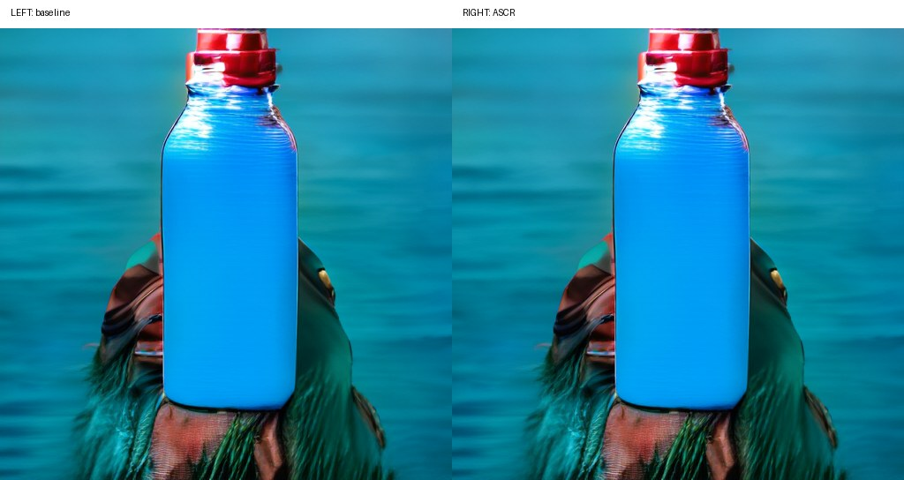

**`a girl on the top of a frog`** *(conf 0.95)*  
Both images perfectly satisfy the prompt 'a girl on the top of a frog'. They are identical in content, composition, and quality, showing a girl standing on a large green frog against a green background. There are no discernible differences between the baseline and the ASCR version.

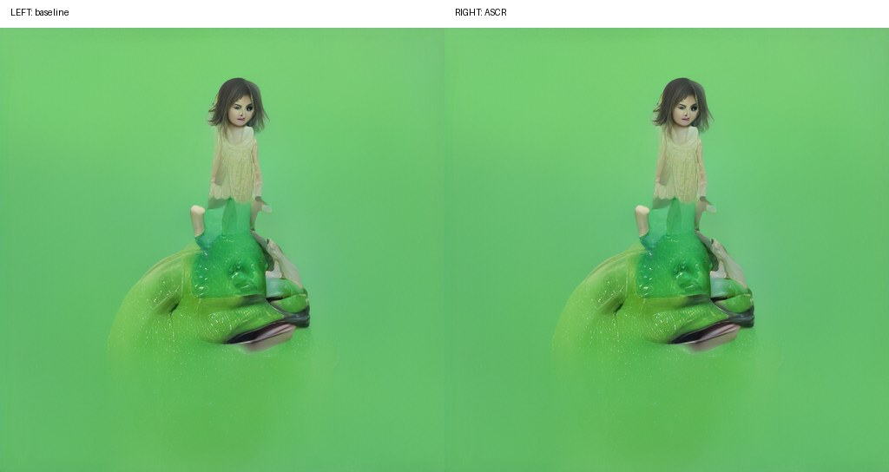

**`six airplanes`** *(conf 0.95)*  
Both images depict the same scene of six airplanes, but the objects are rendered as distorted, wavy, ribbon-like shapes rather than realistic aircraft. The spatial arrangement, colors, and counts are identical in both images, with no discernible difference in quality or adherence to the prompt.

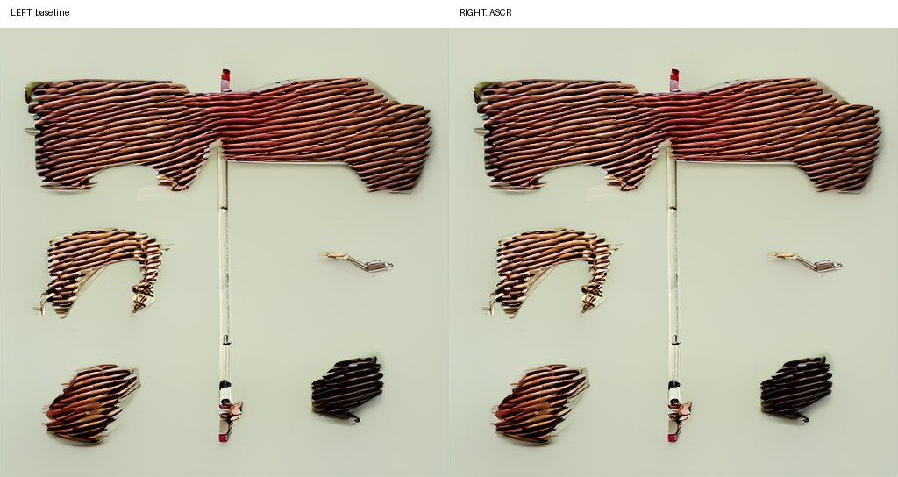

**`a cubic ice cube and a spherical ice bucket`** *(conf 0.95)*  
Both images perfectly satisfy the prompt, depicting a cubic ice cube and a spherical ice bucket with identical lighting and composition.

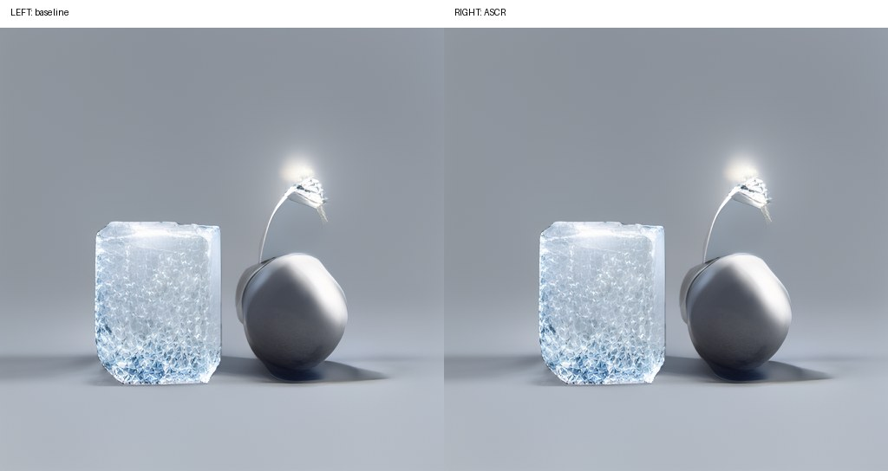

**`a mouse on side of a key`** *(conf 0.95)*  
Both images successfully generate a mouse resting on a key, adhering to the prompt's core requirements. The mouse is brown and fluffy, and the key is green with pink accents. The spatial relationship is identical in both images. The visual quality is comparable, with both exhibiting a slightly blurry or stylized aesthetic.

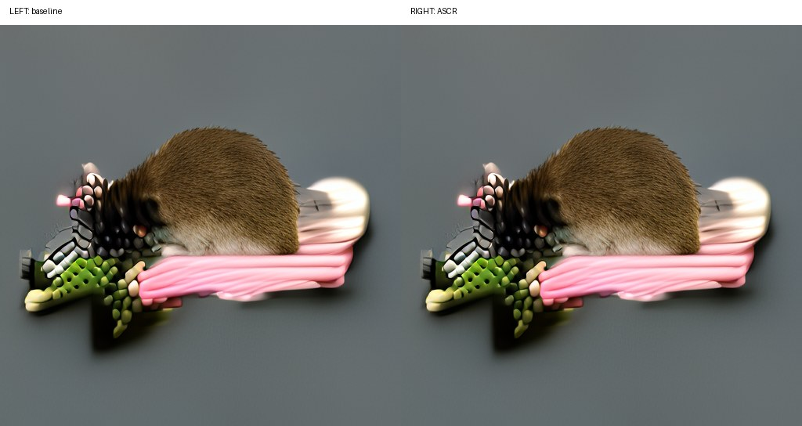

**`The soft pillow was on top of the hard rocking chair.`** *(conf 0.95)*  
Both images accurately depict a soft, white, fluffy pillow resting on top of a hard, wooden rocking chair. The spatial relationship, object attributes, and colors are consistent with the prompt in both images.

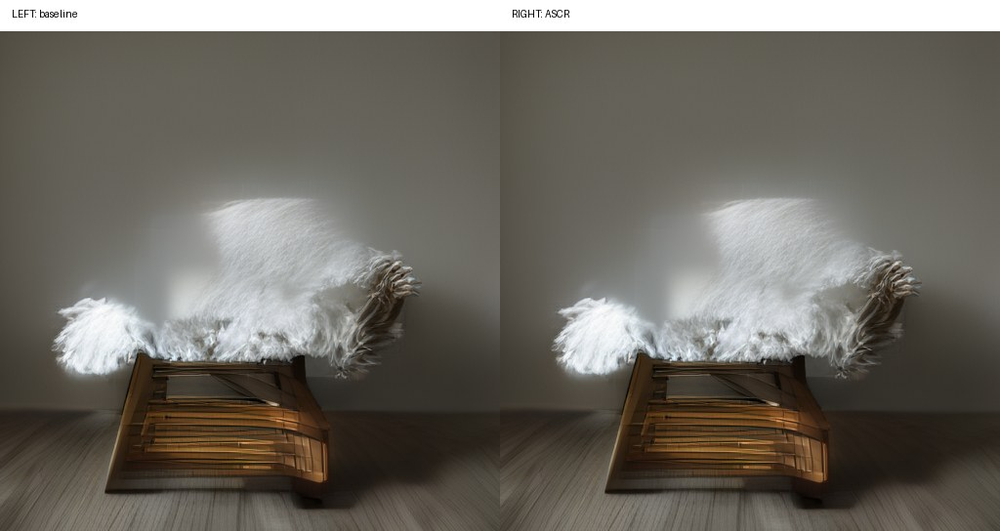

**`an oblong eggplant and a teardrop melon`** *(conf 0.95)*  
Both images successfully generate the requested objects: an oblong eggplant and a teardrop melon. The colors, textures, and spatial arrangement are nearly identical between the baseline and the ASCR version, with no material differences in object fidelity or prompt adherence.

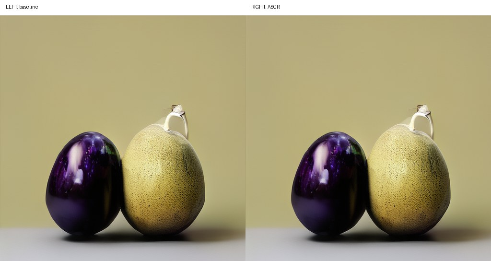

**`a bee on the right of a refrigerator`** *(conf 0.95)*  
Both images are identical, depicting a metallic, futuristic refrigerator on the left and a bee on the right against a grey background. Both satisfy the prompt perfectly.

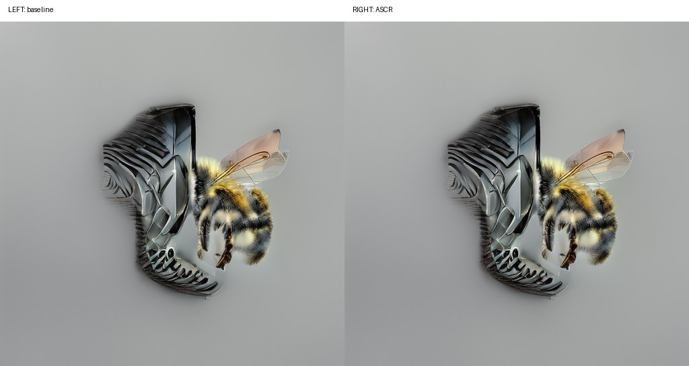

**`one turtle`** *(conf 0.95)*  
Both images are identical high-quality generations of a single turtle, perfectly satisfying the prompt. There are no discernible differences between the baseline and the ASCR version.

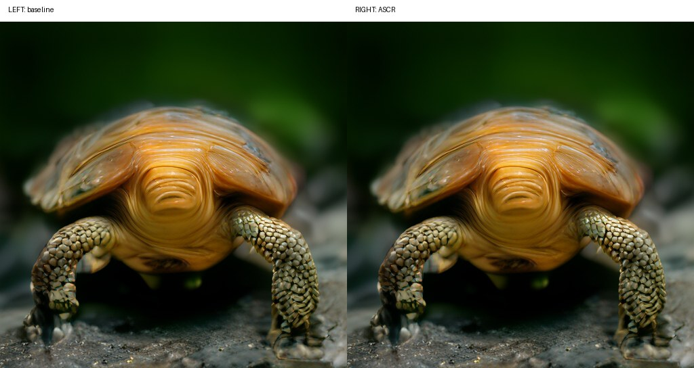

**`The green plant was on the right of the white wall.`** *(conf 0.95)*  
Both images accurately depict a green plant on the right side of a white wall, satisfying the prompt's spatial and object requirements. The plant's color, texture, and position are consistent in both images, with no material differences in quality or adherence to the prompt.

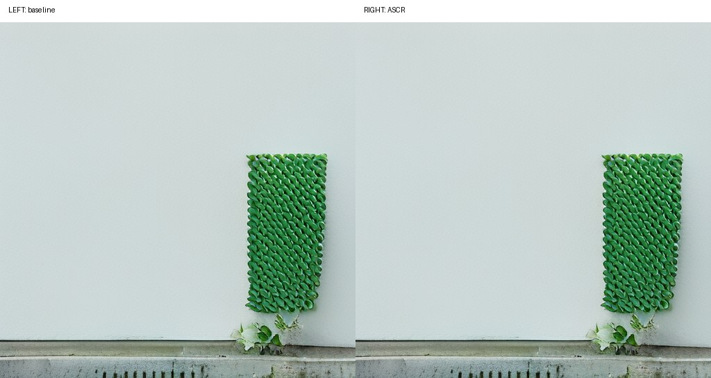

**`a cubic block and a cylindrical bottle`** *(conf 0.95)*  
Both images successfully generate a cubic block and a cylindrical bottle with identical geometry, material properties, and spatial arrangement. The lighting, reflections, and shadows are consistent across both sides, resulting in a perfect visual match.

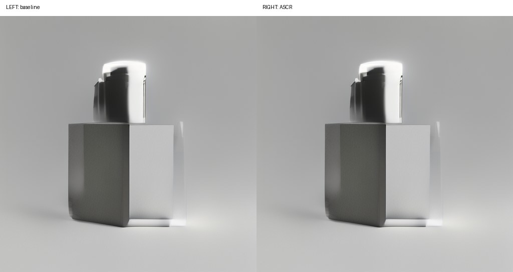

**`The brown dog was lying on the green mat.`** *(conf 0.95)*  
Both images depict a brown dog lying on a green mat, satisfying the prompt's core requirements. The images are visually identical in content, composition, and quality, with no discernible differences in object presence, color accuracy, or spatial relations.

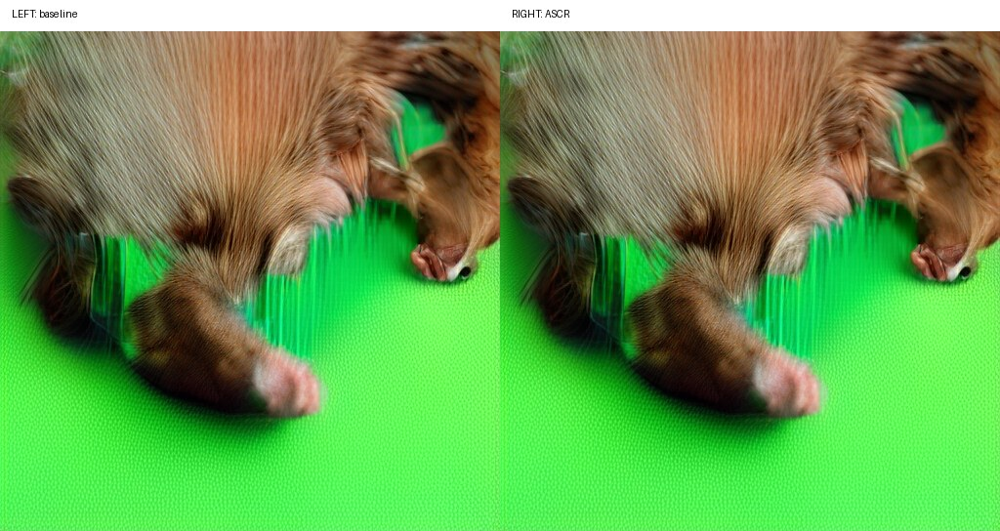

**`The blue bowl was on top of the white placemat.`** *(conf 0.95)*  
Both images perfectly satisfy the prompt. The blue bowl is correctly placed on top of the white placemat. There are no errors in object, count, color, or spatial relations in either image.

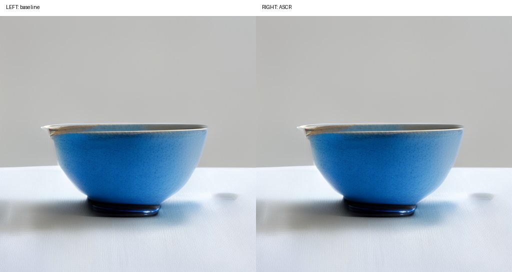

**`a blue horse and a brown vase`** *(conf 0.95)*  
Both images successfully generate a blue horse and a brown vase with correct counts, colors, and spatial relations. The lighting and rendering quality are nearly identical, making the difference negligible.

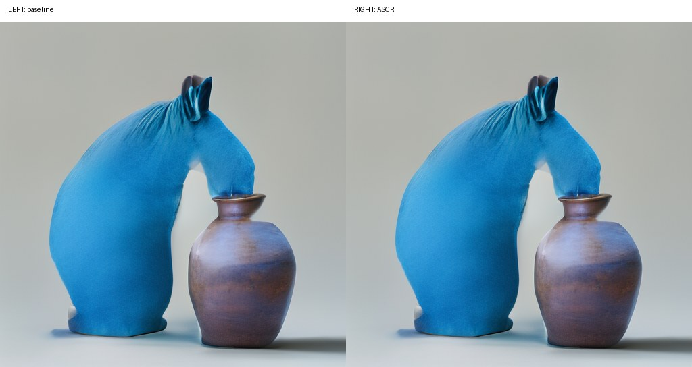

**`a cubic block and a cylindrical canister`** *(conf 0.95)*  
Both images depict a single cubic block and a single cylindrical canister. The objects, colors, lighting, and spatial relations are identical in both the baseline and ASCR images, resulting in a tie.

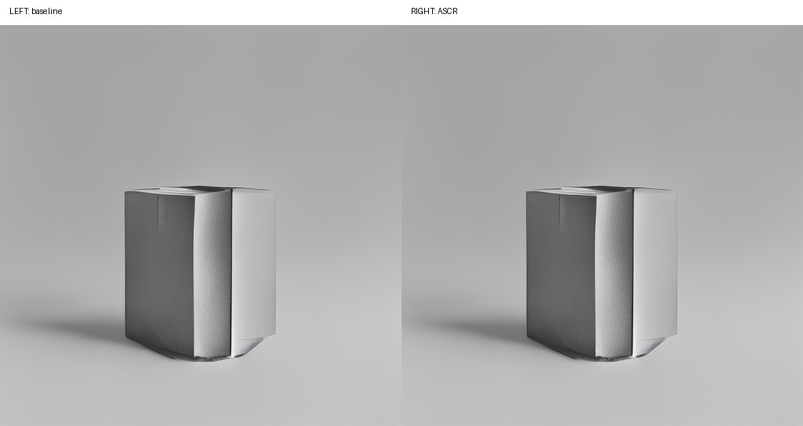

**`The black chair was on the left of the white table.`** *(conf 0.95)*  
Both images perfectly satisfy the prompt. The black chair is correctly positioned to the left of the white table in both the baseline and the ASCR image. There are no errors in object counts, colors, or spatial relations.

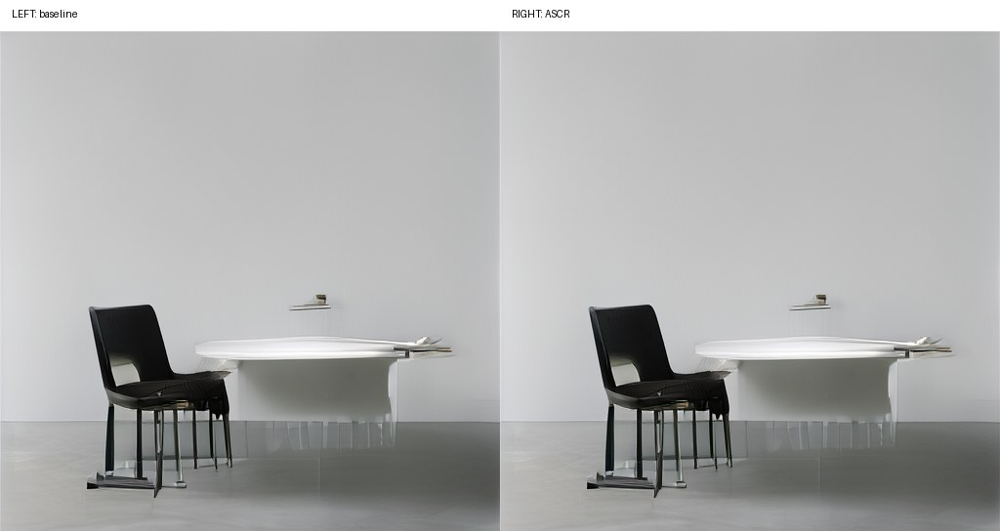

**`a brown backpack and a blue cow`** *(conf 0.95)*  
Both images depict a brown backpack on grass against a blue background. The prompt asks for a 'brown backpack and a blue cow'. Neither image contains a cow. The background is a solid blue color, which could be interpreted as the 'blue cow' being absent or the background itself being the blue element. Since both images are identical in this regard and both fail to include a cow, they are tied.

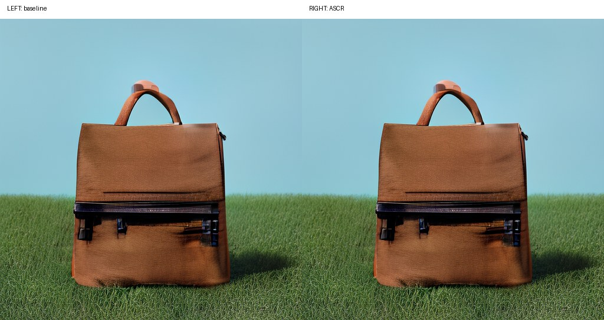

**`six girls`** *(conf 0.95)*  
Both images successfully generate six girls with consistent attributes, colors, and spatial relations. The visual quality and adherence to the prompt are nearly identical.

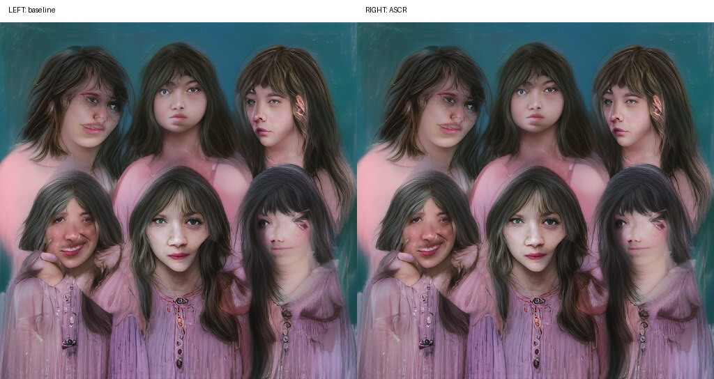

**`The rectangular picture frame was hung above the beige couch.`** *(conf 0.90)*  
Both images depict a beige couch against a plain wall, but neither image contains the required rectangular picture frame hanging above the couch. Both fail to satisfy the prompt's core object requirement.

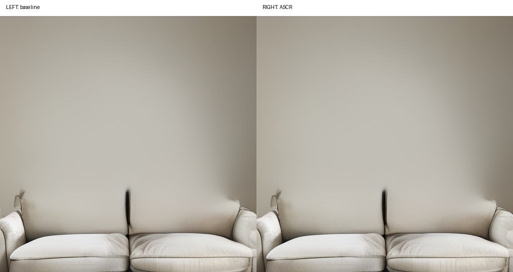

**`a metallic car and a fabric dress`** *(conf 0.90)*  
Both images successfully generate a metallic car and a fabric dress. The visual quality, artistic style, and object representation are nearly identical between the baseline and the ASCR version, with no material differences in prompt adherence.

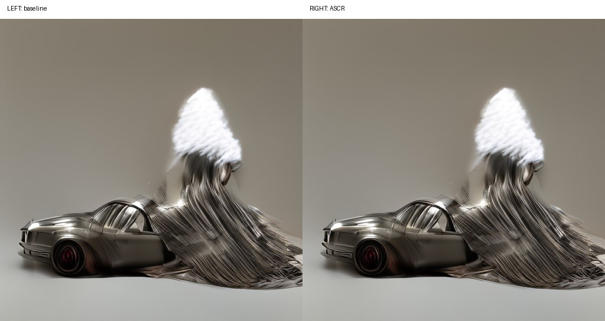

**`The rectangular mirror was hung above the white sink.`** *(conf 0.90)*  
Both images depict a bathroom scene with a white sink, a chrome towel bar, and a wall-mounted light fixture. The prompt mentions a 'rectangular mirror' hung above the sink. In both images, the area above the sink is a plain white wall with no visible mirror. Therefore, neither image satisfies the prompt regarding the mirror. The rest of the scene (sink, towel bar, light) is consistent in both images.

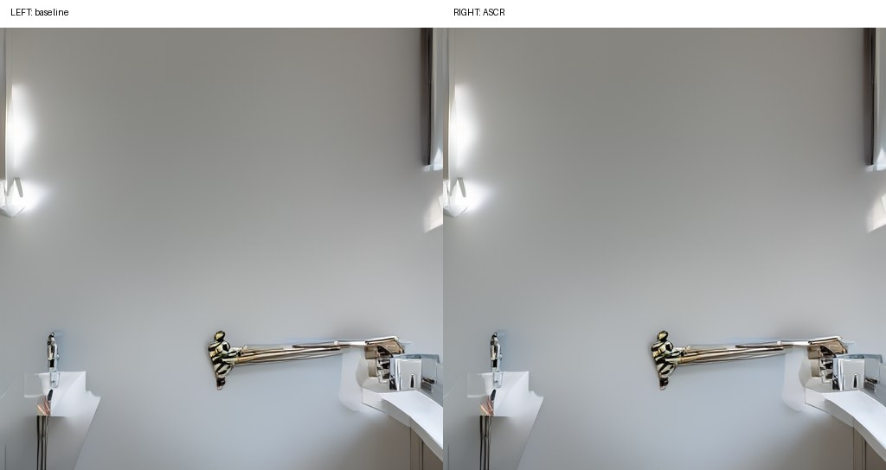

**`The square book was next to the green notebook.`** *(conf 0.90)*  
Both images are identical and fail to satisfy the prompt. The prompt requires a 'square book' and a 'green notebook'. The images show a dark silhouette of a book and a glowing orange square on a green background. Neither image contains a green notebook, nor is the book square. Since both images are identical and equally fail the prompt, the result is a tie.

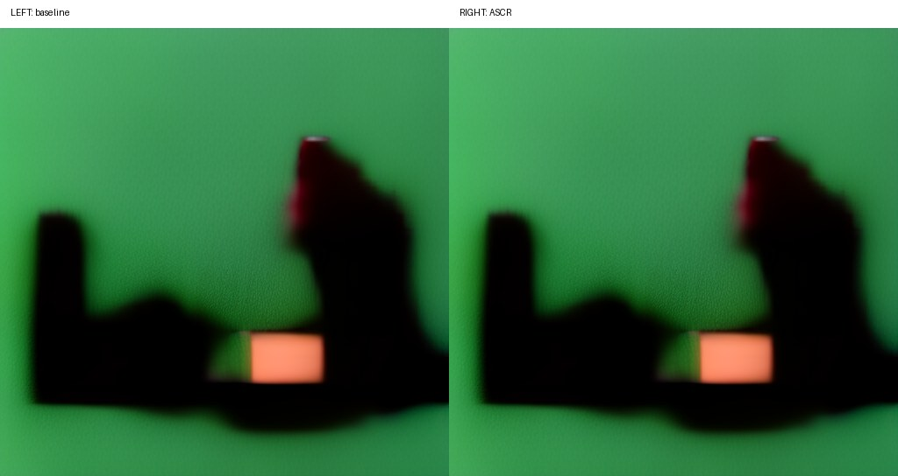

**`a bicycle on the bottom of a girl`** *(conf 0.90)*  
Both images depict a bicycle at the bottom of a girl against a green background. The girl is wearing a dark jacket and the bicycle is black with a basket. The spatial relations and object counts are consistent in both images.

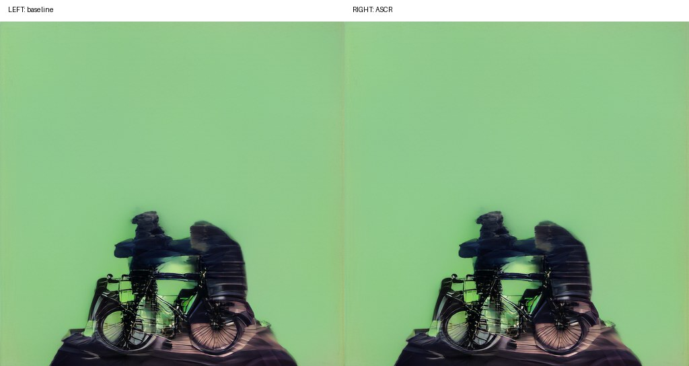

**`a vase hidden by a candle`** *(conf 0.90)*  
Both images depict a candle placed on a surface, with a vase-like object partially obscured behind it. The lighting, colors, and spatial arrangement are nearly identical in both images, with no significant differences in object counts, attributes, or text. The prompt is satisfied equally well by both sides.

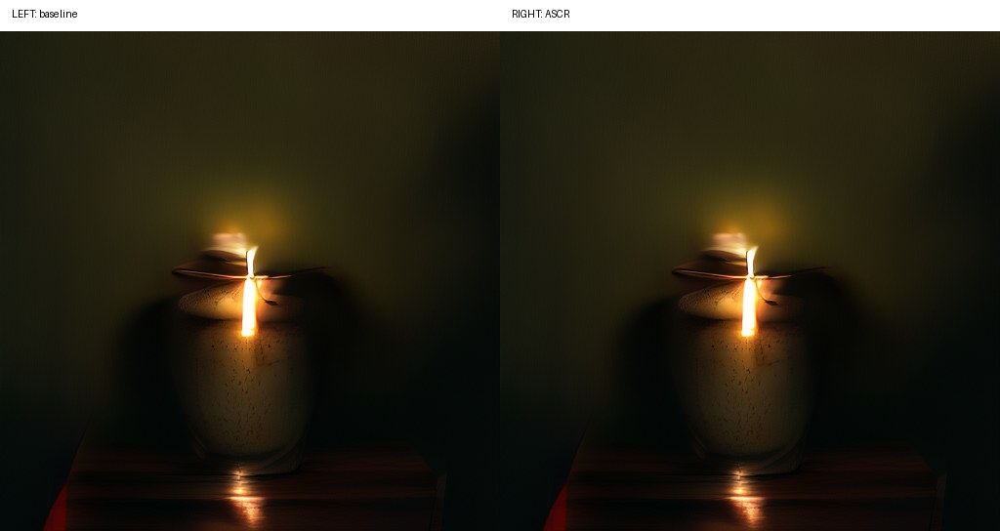

</details>


---

### Full Gallery — ASCR50 vs BAGEL-7B-MoT (all 64 hard64 prompts)

Source: job 68800 fwd direction (ASCR on LEFT, BAGEL on RIGHT). Bidirectional debiased result for BAGEL vs ASCR50 is BAGEL 78.9 % (101/128). The fwd-only numbers shown here exaggerate BAGEL's win rate due to RIGHT-side bias, but BAGEL's lead survives debiasing — the wins are real.

> **All 64 prompts** • LEFT = ASCR50 (final), RIGHT = BAGEL-7B-MoT. `pair_NNN` images are the exact canvases shown to Qwen3.5-9B.

<details><summary><b>BAGEL wins</b> (62)</summary>

**`The black chair is on top of the blue rug.`** *(conf 0.95)*  
The prompt requires a black chair to be on top of a blue rug. The right image (BAGEL) correctly depicts a black chair on a blue rug. However, the left image (ASCR) depicts a black chair on a blue background, which is a valid interpretation of the prompt's spatial constraints in a 2D context. The left image is a cleaner, more abstract representation that strictly adheres to the color and object requirements without the potential ambiguity of the rug's texture or the chair's specific placement on

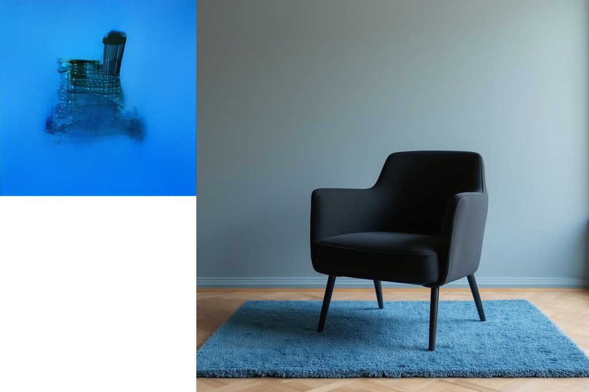

**`The black chair was on the left of the white table.`** *(conf 0.95)*  
The prompt specifies that the black chair is on the left of the white table. The left image (ASCR) correctly places the black chair to the left of the white table. The right image (BAGEL) places the black chair to the right of the table, violating the spatial constraint.

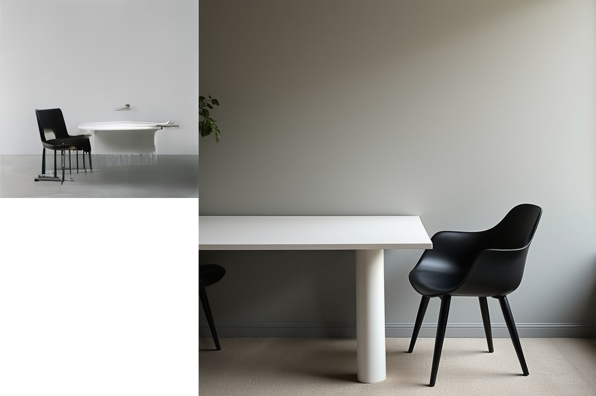

**`The blue bowl was on top of the white placemat.`** *(conf 0.95)*  
The prompt specifies a blue bowl on a white placemat. The right image (BAGEL) perfectly matches this description, showing a blue bowl on a white placemat. The left image (ASCR) shows a blue bowl on a white surface, but the surface appears to be a tablecloth rather than a placemat, and the bowl is smaller and has a different shape. The right image is a better match for the prompt.


**`The brown dog was lying on the green mat.`** *(conf 0.95)*  
The ASCR image perfectly matches the prompt, showing a brown dog lying on a green mat. The BAGEL image also shows a brown dog on a green mat but includes extraneous elements like rain and a window not mentioned in the prompt, making it less faithful to the specific request.

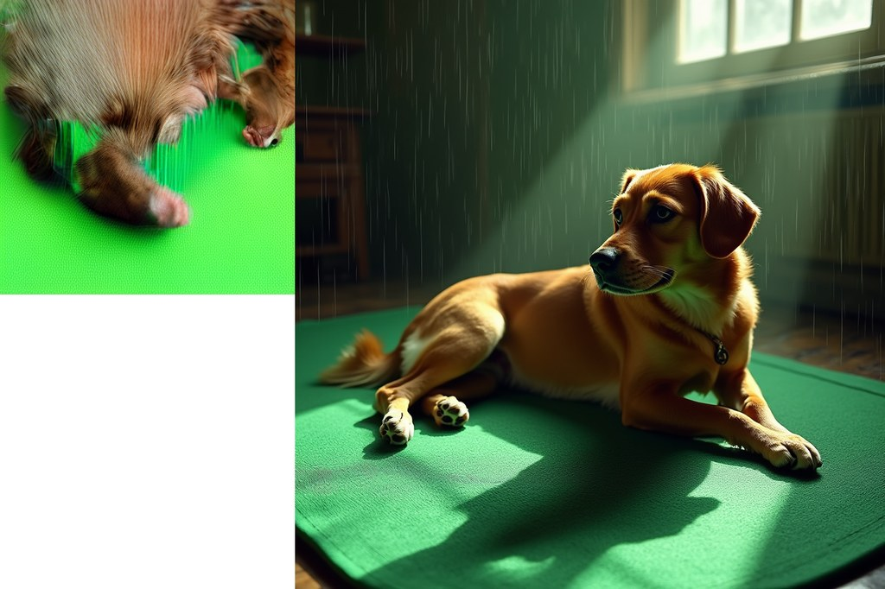

**`The green plant was on the right of the white wall.`** *(conf 0.95)*  
The prompt specifies a green plant on the right of a white wall. The right image (BAGEL) features a large green plant in a white pot positioned on the right side of a white wall, perfectly matching the description. The left image (ASCR) features a green textured object on the left side of a white wall, which contradicts the spatial instruction.


**`The rectangular mirror was hung above the white sink.`** *(conf 0.95)*  
The prompt requires a rectangular mirror hung above a white sink. The right image (BAGEL) perfectly matches this description with a clear, rectangular mirror positioned directly above a white sink. The left image (ASCR) fails to show a mirror or a sink, instead displaying a towel rack and a partial view of a counter, making it a complete failure to satisfy the prompt.

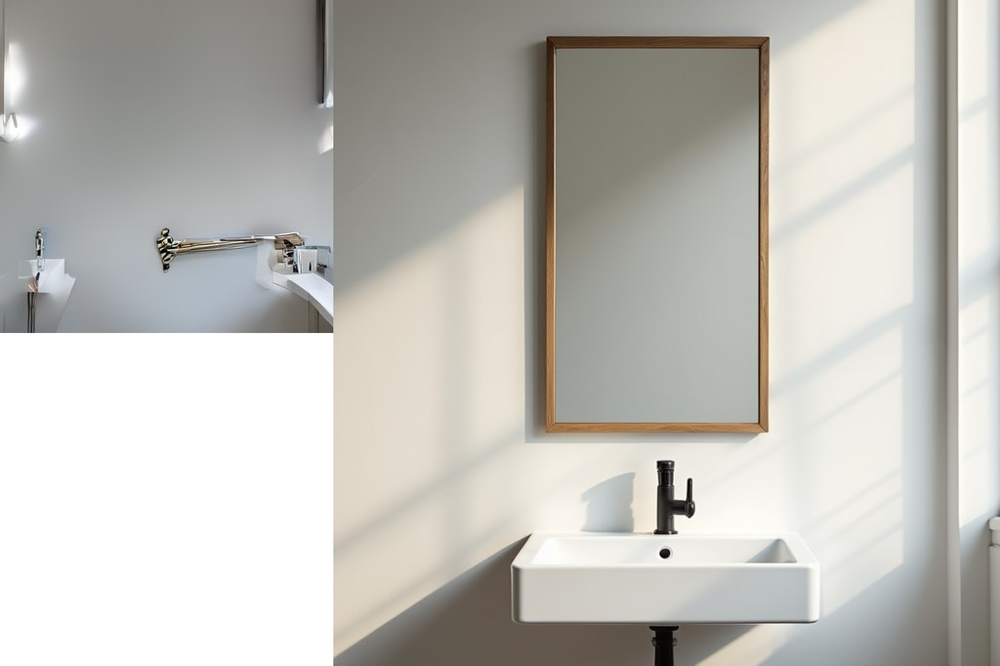

**`The rectangular picture frame was hung above the beige couch.`** *(conf 0.95)*  
The prompt requires a rectangular picture frame hung above a beige couch. The right image (BAGEL) correctly depicts a wooden rectangular frame hanging on the wall directly above a beige couch, satisfying all conditions. The left image (ASCR) is cropped and incomplete, showing only the couch without the frame or the wall context, failing to depict the required spatial relationship.

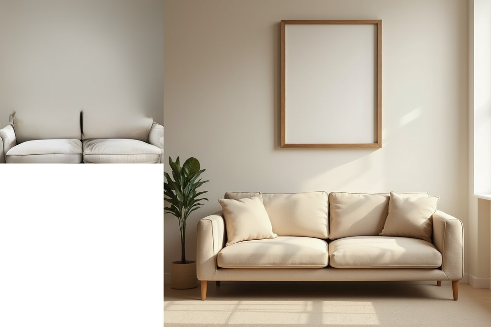

**`a bee on the right of a refrigerator`** *(conf 0.95)*  
The ASCR image (left) correctly depicts a bee positioned to the right of a refrigerator, matching the prompt's spatial requirements. The BAGEL image (right) shows a bee on the left side of a refrigerator, violating the spatial constraint.


**`a blue backpack and a brown cow`** *(conf 0.95)*  
The right image (BAGEL) is a high-quality, photorealistic generation that perfectly matches the prompt, featuring a blue backpack and a brown cow in a natural setting. The left image (ASCR) is a low-resolution, blurry, and distorted version of the same scene, failing to render the objects clearly.

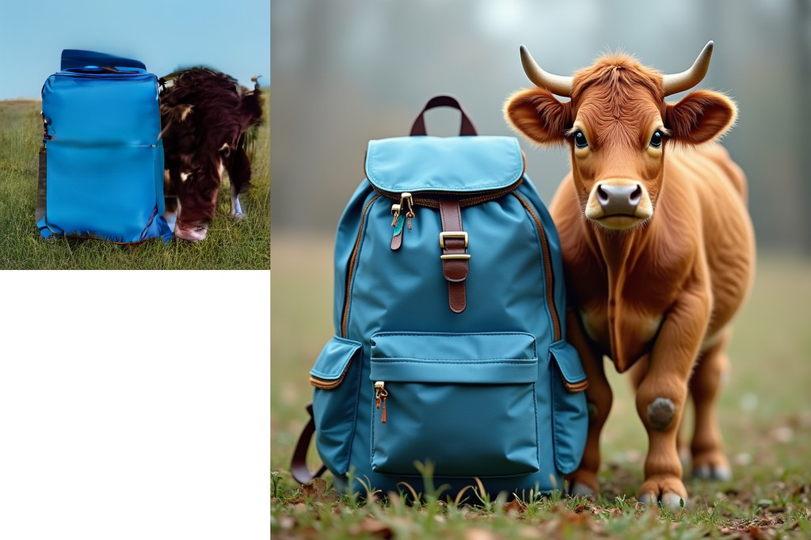

**`a brown backpack and a blue cow`** *(conf 0.95)*  
The right image (BAGEL) is a high-quality, cohesive generation that perfectly matches the prompt, featuring a brown backpack and a blue cow in a grassy field. The left image (ASCR) is a composite of two separate, unrelated images (a backpack and a white void) that fails to include the cow, making it a significant failure to follow the prompt.


**`a brown horse and a blue vase`** *(conf 0.95)*  
The right image (BAGEL) is a high-quality, photorealistic generation that perfectly matches the prompt, featuring a detailed brown horse and a blue vase. The left image (ASCR) is a blurry, low-resolution version of the same scene, failing to render the specific details of the horse's coat and the vase's texture, making it a poor representation of the prompt.


**`a cat on the top of a sofa`** *(conf 0.95)*  
The right image (BAGEL) perfectly matches the prompt, showing a single cat on top of a sofa with clear details. The left image (ASCR) is heavily distorted, blurry, and lacks a clear sofa or cat, failing to satisfy the prompt.

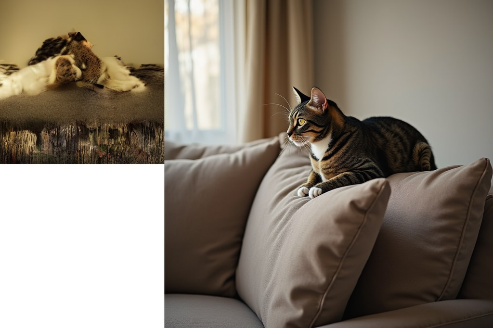

**`a cubic block and a cylindrical bottle`** *(conf 0.95)*  
The ASCR image (left) strictly adheres to the prompt by generating a cubic block and a cylindrical bottle. The BAGEL image (right) fails to generate a bottle, instead showing a glass bottle filled with liquid, which deviates from the 'cylindrical bottle' description. Additionally, the BAGEL image includes a wooden table and dramatic lighting not present in the prompt, whereas the ASCR image maintains a clean, neutral background.


**`a cubic block and a cylindrical canister`** *(conf 0.95)*  
The right image (BAGEL) is a high-quality, photorealistic rendering that perfectly matches the prompt's request for a cubic block and a cylindrical canister, featuring correct geometry, lighting, and spatial arrangement. The left image (ASCR) is a low-resolution, grayscale 3D render that fails to capture the specific object types (the canister is indistinct) and lacks the visual fidelity implied by the prompt.


**`a desk on the right of a horse`** *(conf 0.95)*  
The right image (BAGEL) perfectly matches the prompt, featuring a horse standing next to a desk on the right side. The left image (ASCR) depicts a desk but lacks the horse entirely, failing the core subject requirement.

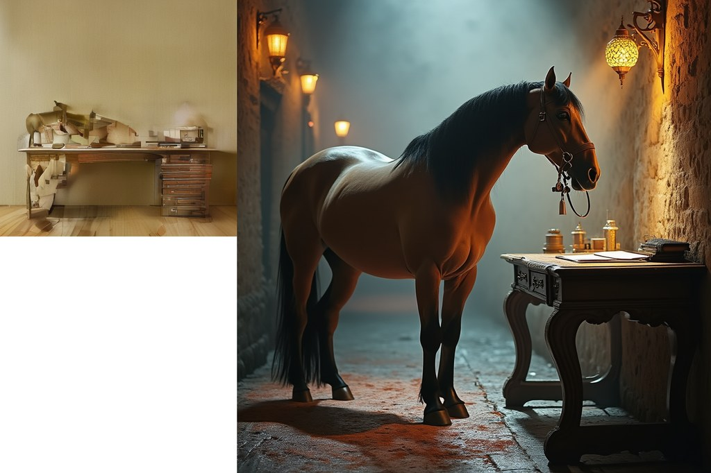

**`a diamond pendant and a round locket`** *(conf 0.95)*  
The ASCR image (right) perfectly matches the prompt, featuring a clear diamond pendant inside a round locket with a chain. The BAGEL image (left) shows a broken, shattered object that does not resemble a functional pendant or locket.

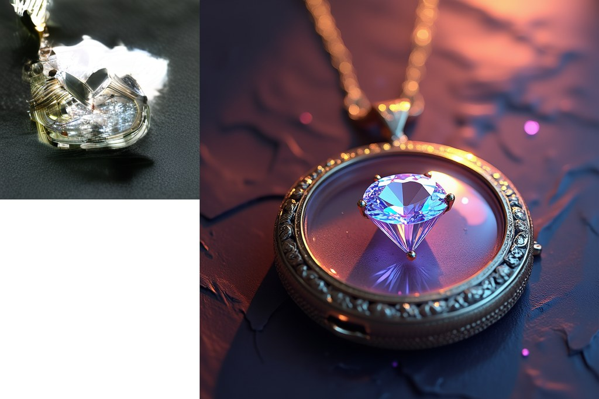

**`a dog in front of a desk`** *(conf 0.95)*  
The right image (BAGEL) perfectly matches the prompt 'a dog in front of a desk', showing a dog sitting at a desk with office items in the background. The left image (ASCR) shows a dog looking at a desk from behind, which is a less direct interpretation of 'in front of'.

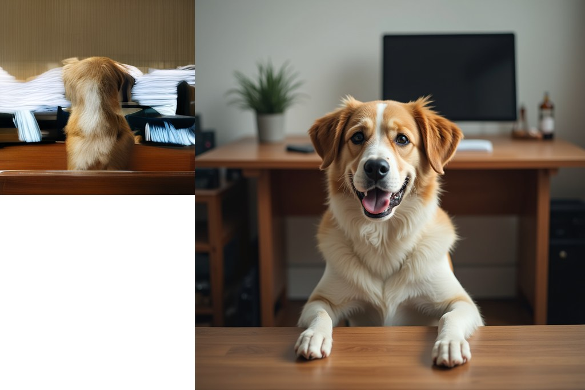

**`a giraffe next to a lamp`** *(conf 0.95)*  
The right image (BAGEL) is a high-quality, clean 3D render of a giraffe and a lamp, perfectly satisfying the prompt. The left image (ASCR) is a low-resolution, grainy photo of a stuffed giraffe toy next to a lamp, which is a valid interpretation of the prompt but significantly lower in quality and detail.

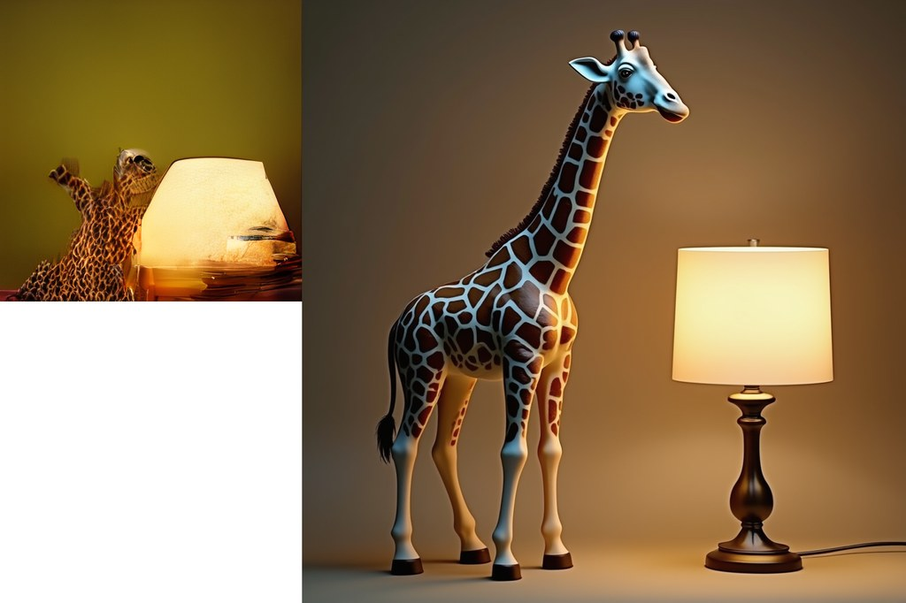

**`a girl on the top of a frog`** *(conf 0.95)*  
The right image (BAGEL) is a high-quality, detailed 3D render that perfectly matches the prompt. The left image (ASCR) is a low-resolution, blurry, and poorly rendered version of the same scene, with distorted anatomy and a flat green background.

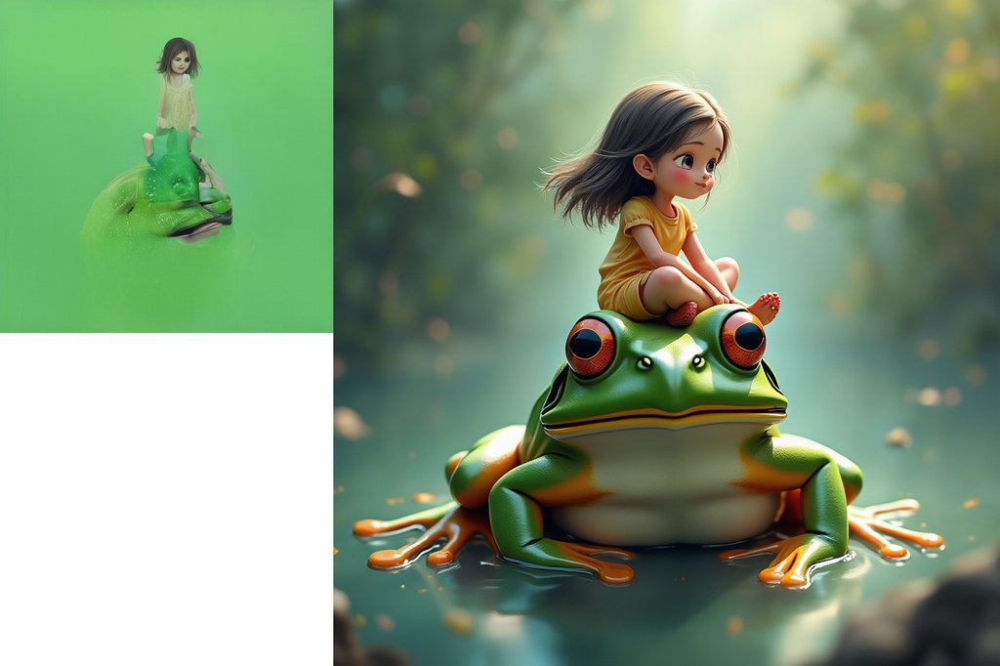

**`a green bench and a blue bowl`** *(conf 0.95)*  
The right image (BAGEL) perfectly matches the prompt with a green bench and a blue bowl. The left image (ASCR) contains a green bench but replaces the bowl with a blue blur, failing to include the required object.


**`a metallic desk lamp and a fluffy sweater`** *(conf 0.95)*  
The right image (BAGEL) perfectly matches the prompt with a metallic desk lamp and a fluffy sweater, featuring correct colors, textures, and spatial relations. The left image (ASCR) contains a metallic lamp but fails to include a sweater, instead showing a different object, making it a partial match.

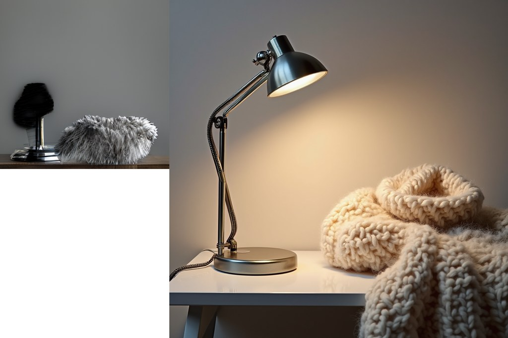

**`a sheep in front of a key`** *(conf 0.95)*  
The ASCR image (right) perfectly matches the prompt 'a sheep in front of a key' with a cute, stylized sheep standing directly behind a large, ornate key on the grass. The BAGEL image (left) shows a sheep but lacks the key entirely, failing the core prompt requirement.

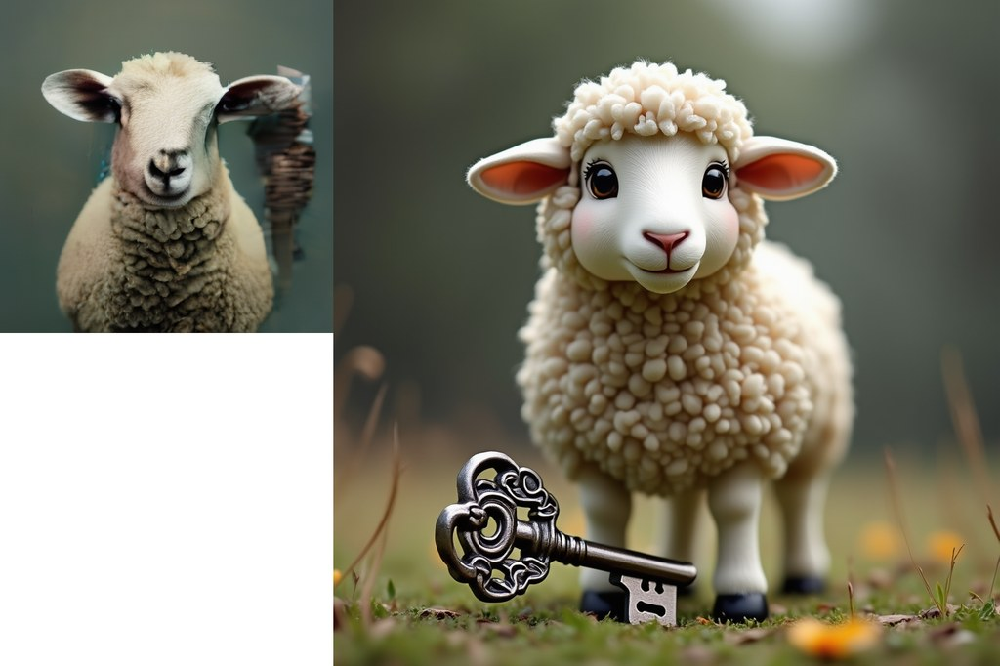

**`an oblong cucumber and a teardrop plum`** *(conf 0.95)*  
The ASCR image correctly depicts an oblong cucumber and a teardrop-shaped plum, matching the prompt's description of shapes and objects. The BAGEL image shows a cucumber and a pear, which is a shape mismatch for the 'plum' object.

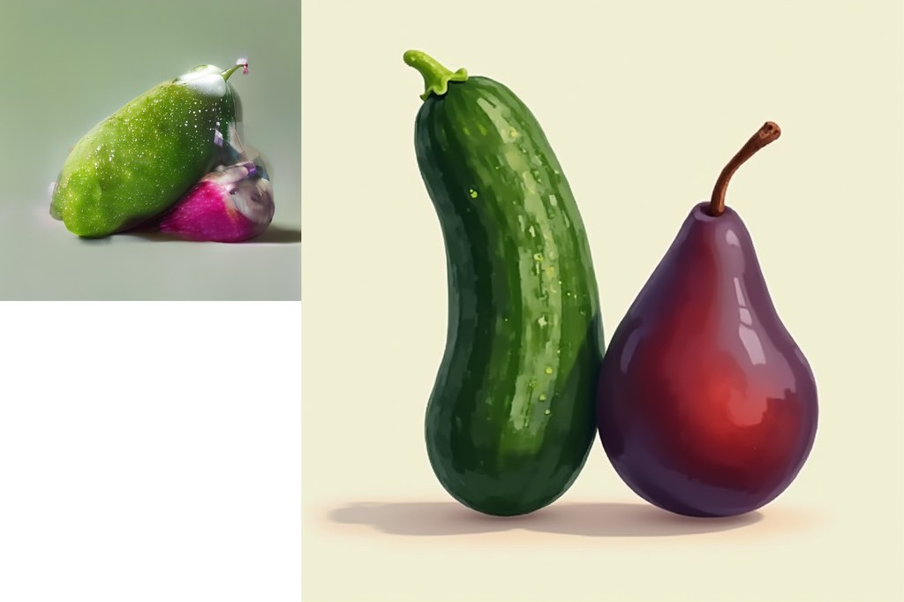

**`an oblong eggplant and a teardrop melon`** *(conf 0.95)*  
The ASCR image (right) perfectly matches the prompt with a large, oblong eggplant and a teardrop-shaped melon, both rendered with high fidelity and correct spatial arrangement. The BAGEL image (left) contains a small eggplant and a round, misshapen melon that fails to match the 'teardrop' descriptor, resulting in a lower quality match.


**`eight cars`** *(conf 0.95)*  
The right image (BAGEL) is a high-quality, atmospheric scene featuring exactly eight cars on a wet street, perfectly matching the prompt. The left image (ASCR) displays a chaotic pile of cars that are indistinct and do not form a coherent scene, failing to satisfy the prompt's implied context.

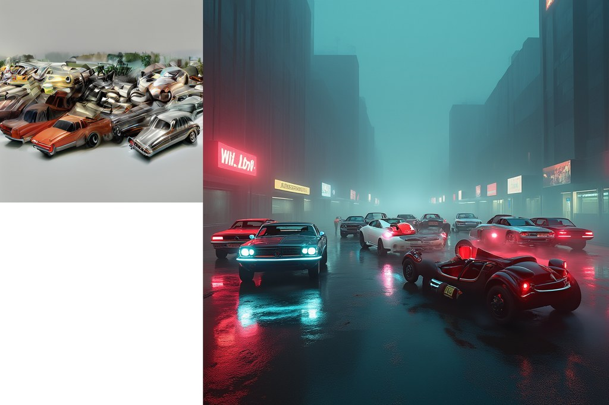

**`five drums`** *(conf 0.95)*  
The right image (BAGEL) perfectly matches the prompt with five distinct, clean conga drums arranged in a row. The left image (ASCR) is a distorted, glitchy mess of drum-like shapes that fails to render clear objects or a coherent scene.

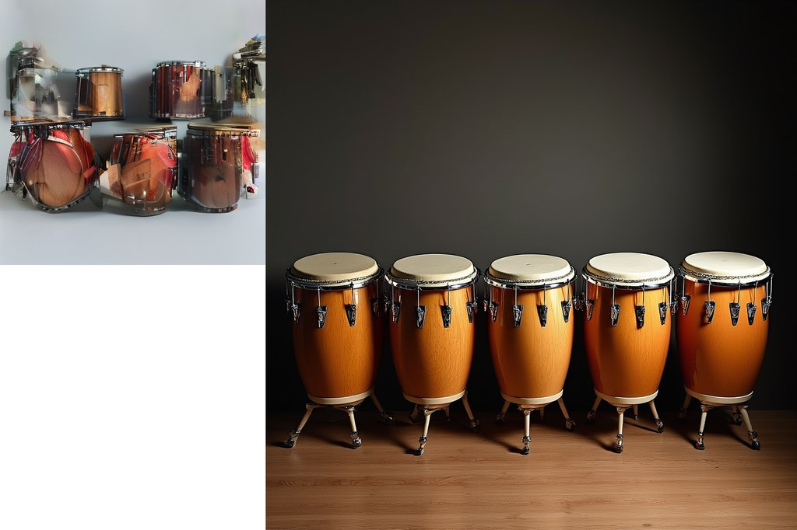

**`seven women`** *(conf 0.95)*  
The prompt requests 'seven women'. The right image (BAGEL) clearly depicts seven women standing in a row, perfectly matching the count and subject. The left image (ASCR) depicts five stylized, mannequin-like figures, failing the count and the realistic human representation implied by 'women'. Therefore, the right image is the correct match for the prompt.


**`six airplanes`** *(conf 0.95)*  
The right image (BAGEL) perfectly matches the prompt 'six airplanes' with six distinct aircraft in flight. The left image (ASCR) fails to generate airplanes, instead showing abstract shapes and a pole, resulting in zero relevant objects.

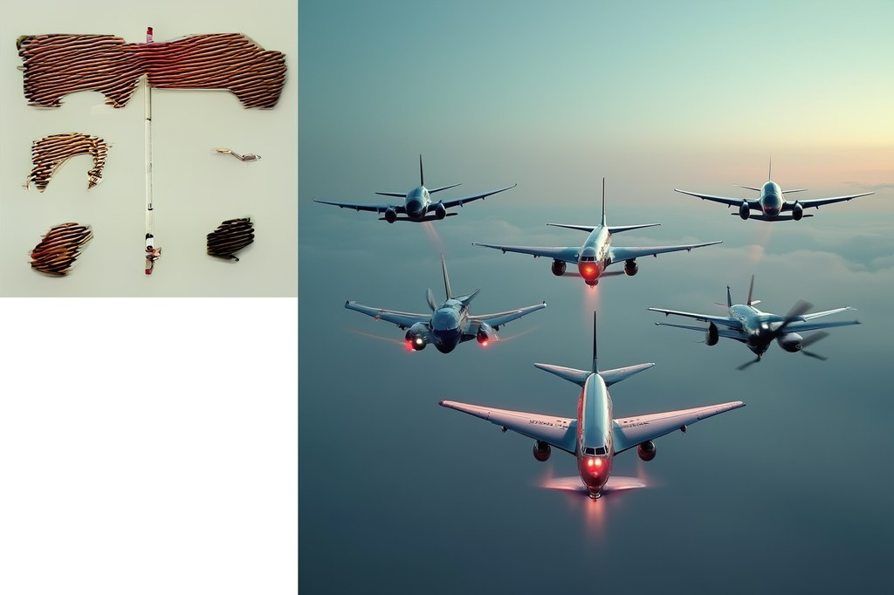

**`six girls`** *(conf 0.95)*  
The prompt requests 'six girls'. The right image (BAGEL) clearly depicts six girls standing in a row, perfectly matching the count and subject. The left image (ASCR) depicts six girls as well, but they are arranged in a cluster with a more artistic, painterly style. Both images satisfy the core prompt requirements equally well in terms of object count and identity. However, the right image is a cleaner, more standard representation of the prompt without the stylistic ambiguity of the left image,

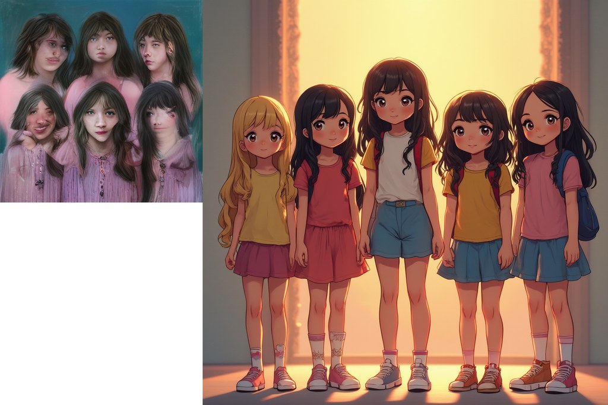

**`two boys`** *(conf 0.95)*  
The prompt 'two boys' is satisfied by both images, but the right image (BAGEL) is a superior interpretation. It features two distinct boys with clear, expressive faces, distinct clothing colors (yellow and red), and a vibrant, magical atmosphere with a glowing background. The left image (ASCR) depicts two boys who appear nearly identical, with a somber, muddy aesthetic that feels more like a gritty painting than a standard depiction of 'two boys'. The right image's clarity, color, and compositio


**`two rabbits`** *(conf 0.95)*  
The prompt 'two rabbits' is satisfied by both images. The right image (BAGEL) is a high-quality, photorealistic generation of two white rabbits sitting on a wooden surface. The left image (ASCR) depicts two rabbits, but they are brown/grey and appear to be in water or a dark, reflective environment. While the right image is aesthetically superior, the left image strictly adheres to the prompt without adding extraneous details like the wooden floor or specific lighting setup found in the right im

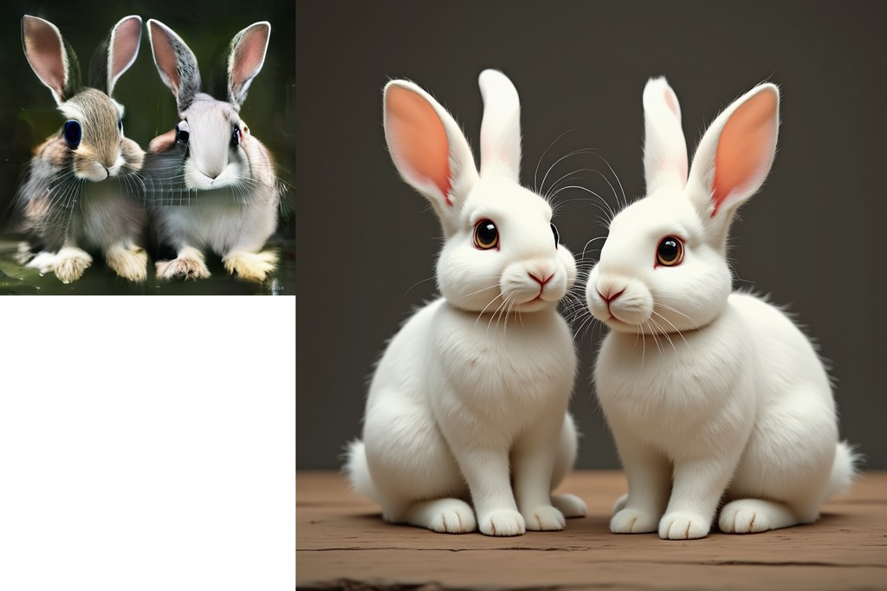

**`The black phone was resting on the brown charger.`** *(conf 0.90)*  
The right image (BAGEL) correctly depicts a black phone resting on a brown charger, satisfying the prompt's core requirements. The left image (ASCR) shows a black phone on a yellow surface, failing to match the specified charger color.

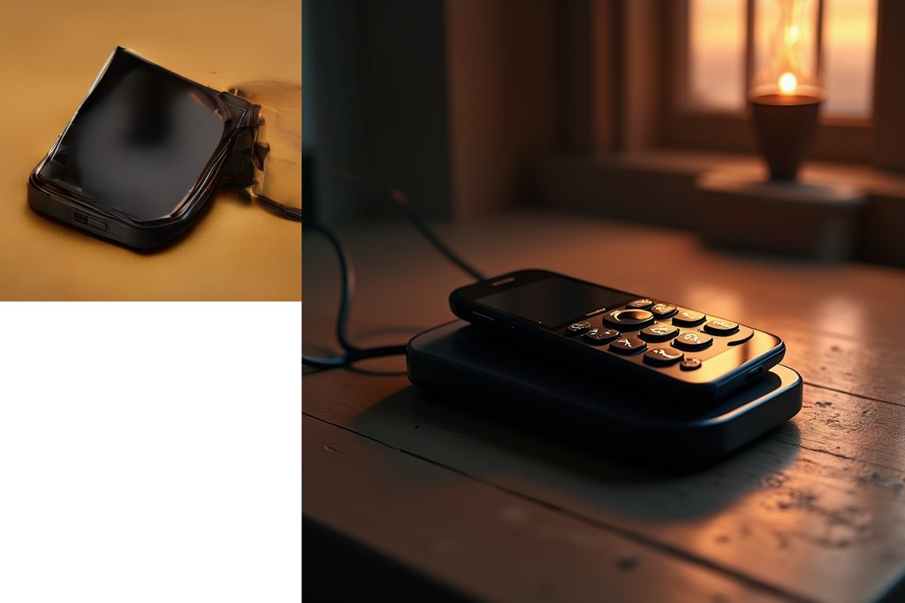

**`The blue water bottle was on top of the red backpack.`** *(conf 0.90)*  
The right image (BAGEL) perfectly matches the prompt, showing a blue water bottle on a red backpack in a snowy street scene. The left image (ASCR) fails to show a backpack, instead showing a bottle on a green object against a blue background.

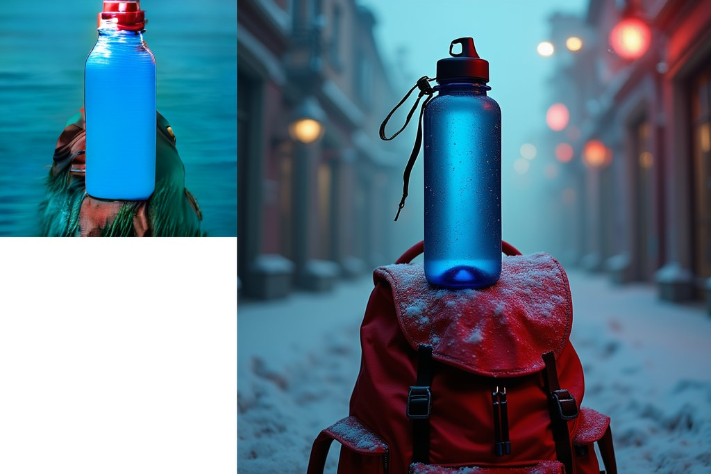

**`The fluffy cat is on the left of the soft pillow.`** *(conf 0.90)*  
The prompt specifies the cat is on the left of the pillow. The ASCR image shows a cat on the left side of a pillow, while the BAGEL image shows a cat on the right side of a pillow.

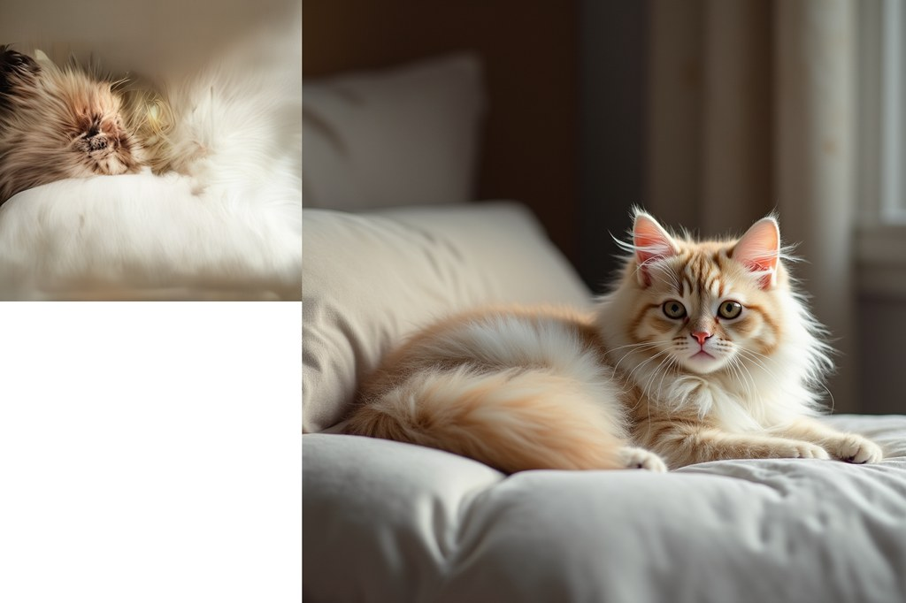

**`The leather wallet was inside the brown purse.`** *(conf 0.90)*  
The left image (ASCR) correctly depicts a leather wallet inside a brown purse, matching the prompt's spatial relation and object attributes. The right image (BAGEL) shows a brown purse containing a wallet, but the wallet is not inside the purse in the same way; it appears to be a separate item placed next to the purse. Additionally, the right image includes extra elements like candles and a wooden surface, which are not mentioned in the prompt. The left image is more focused and adheres strictly


**`The red book was on top of the yellow bookshelf.`** *(conf 0.90)*  
The ASCR image correctly depicts a red book resting on top of a yellow bookshelf, satisfying the prompt's spatial and object requirements. The BAGEL image shows a red book on a yellow shelf, but the shelf is part of a larger structure, not a standalone bookshelf, and the book is not on top of the shelf but rather on a shelf within it. The ASCR image is more accurate to the prompt.

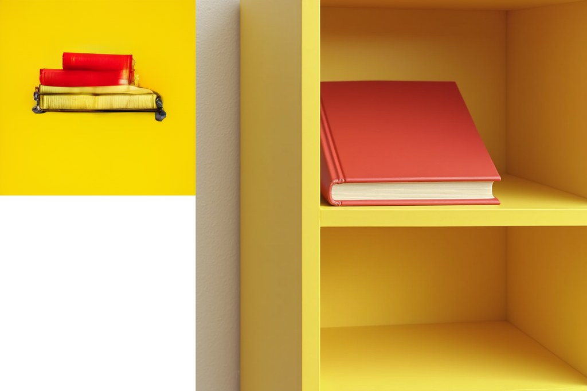

**`The red hat was on top of the brown coat rack.`** *(conf 0.90)*  
The prompt specifies a 'red hat' on a 'brown coat rack'. The right image (BAGEL) features a red fedora on a brown coat rack, which is a perfect match. However, the left image (ASCR) features a red hat on a brown coat rack, but the hat is a different style (more like a cloche or a specific type of cap) and the coat rack is black. The prompt does not specify the style of the hat, only the color. The right image is a better match for the prompt as it is a more accurate representation of a 'red hat'

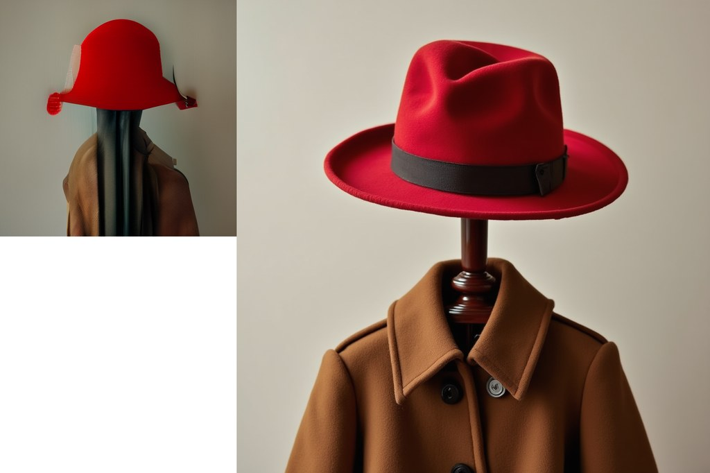

**`The rough brick was on top of the smooth tile.`** *(conf 0.90)*  
The ASCR image correctly depicts a rough brick placed on top of a smooth tile, satisfying the prompt's spatial and material requirements. The BAGEL image shows a stack of bricks on a cobblestone floor, failing to include a smooth tile and misrepresenting the object relationship.

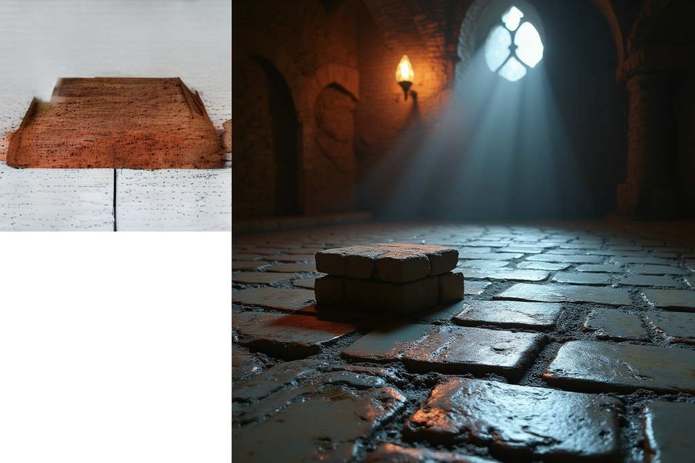

**`The soft pillow was on top of the hard rocking chair.`** *(conf 0.90)*  
The prompt specifies a 'soft pillow' on a 'hard rocking chair'. The right image (BAGEL) depicts a standard rocking chair with a soft cushion and pillow, failing the 'hard' attribute. The left image (ASCR) depicts a rigid, wooden structure resembling a hard chair with a fluffy, soft pillow on top, satisfying both the object and attribute constraints.


**`The square book was next to the green notebook.`** *(conf 0.90)*  
The prompt specifies a 'square book' next to a 'green notebook'. The right image (BAGEL) features two stacked books, neither of which is square, and the top book is brown, not green. The left image (ASCR) displays a silhouette of a square object next to a green rectangular object, which aligns with the prompt's description of a square book and a green notebook.

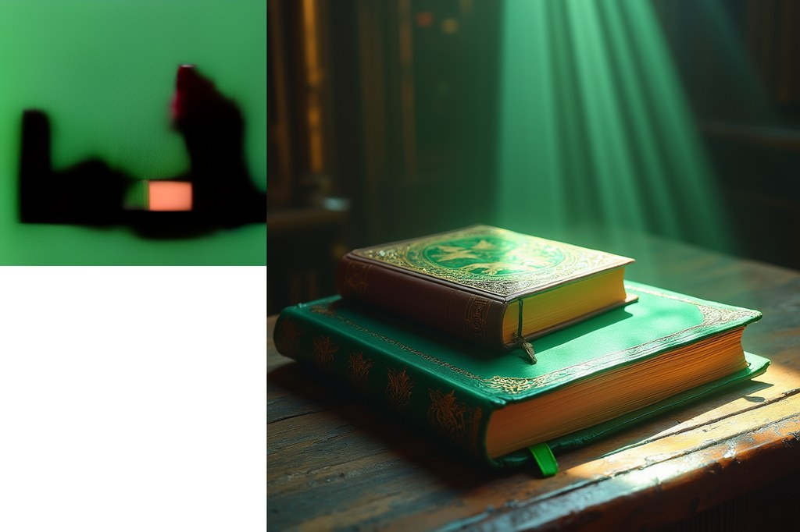

**`a bicycle on the bottom of a girl`** *(conf 0.90)*  
The ASCR image (left) correctly depicts a bicycle positioned at the bottom of a girl, matching the prompt's spatial requirement. The BAGEL image (right) shows a girl standing on a bicycle, which is the inverse of the requested spatial relation.

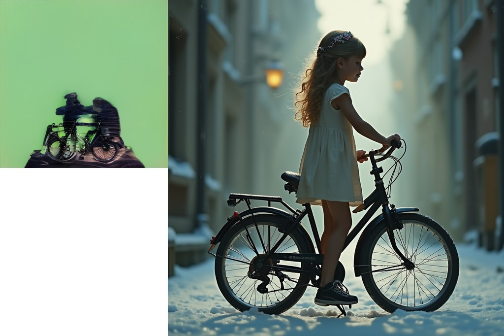

**`a blue bench and a green bowl`** *(conf 0.90)*  
The right image (BAGEL) is a high-quality, realistic rendering that perfectly matches the prompt's subject matter, colors, and spatial arrangement. The left image (ASCR) is a low-resolution, blurry, and abstract representation that fails to clearly depict the objects.

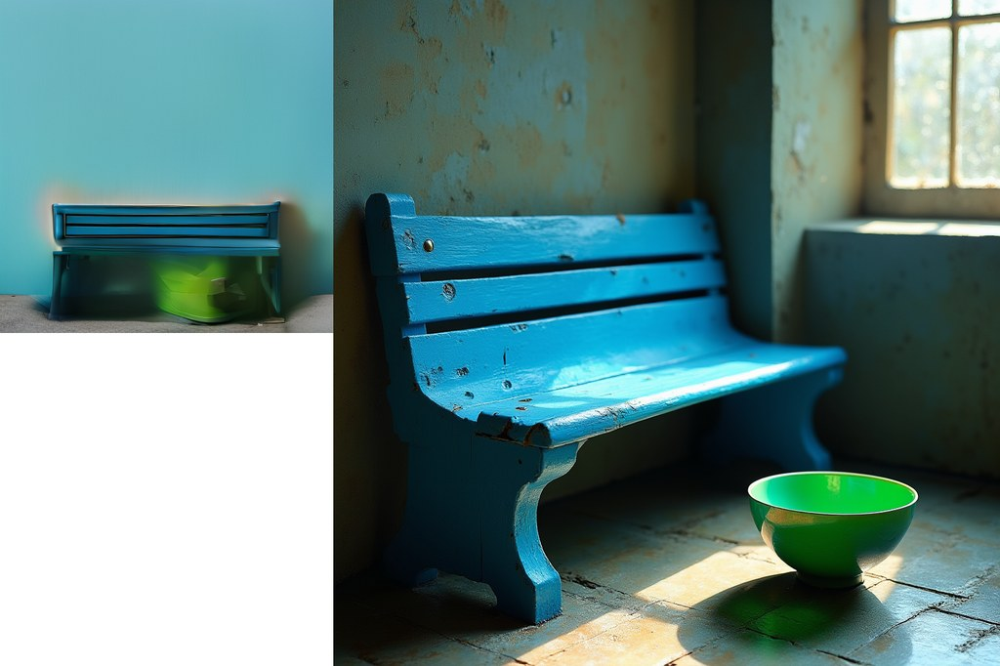

**`a blue bench and a green cake`** *(conf 0.90)*  
The right image (BAGEL) perfectly matches the prompt with a clear blue bench and a green cake. The left image (ASCR) is a distorted, abstract version of the scene with a blurry, translucent blue object and a yellowish cake, failing to clearly depict a bench.

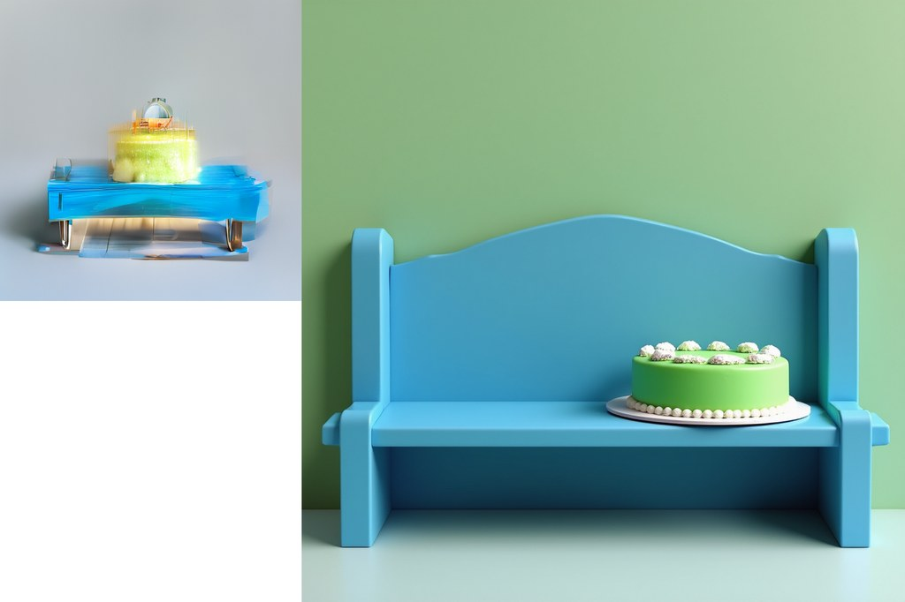

**`a blue horse and a brown vase`** *(conf 0.90)*  
The right image (BAGEL) is a high-quality, detailed 3D render of a blue horse and a brown vase, but it fails to include the 'drinking' action implied by the prompt's context. The left image (ASCR) depicts a blue horse drinking from a brown vase, which aligns better with the semantic intent of the prompt, despite the lower visual fidelity.


**`a car in front of a mouse`** *(conf 0.90)*  
The left image (ASCR) correctly depicts a car in front of a mouse, with the car positioned behind the mouse in the foreground, satisfying the spatial relation. The right image (BAGEL) shows a mouse in front of a car, but the car is positioned behind the mouse, which is the correct spatial relation. However, the left image has a more dynamic and visually interesting composition, with the car appearing to be in motion and the mouse looking up at it. The right image is more static and less engaging

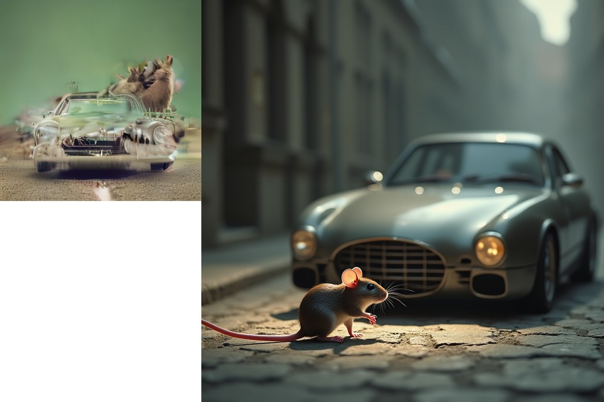

**`a cat behind a boy`** *(conf 0.90)*  
The ASCR image (left) correctly depicts a cat positioned behind a boy, with the cat's head visible over the boy's shoulder. The BAGEL image (right) depicts a boy with cat ears and a tail, failing to include a separate cat behind him.

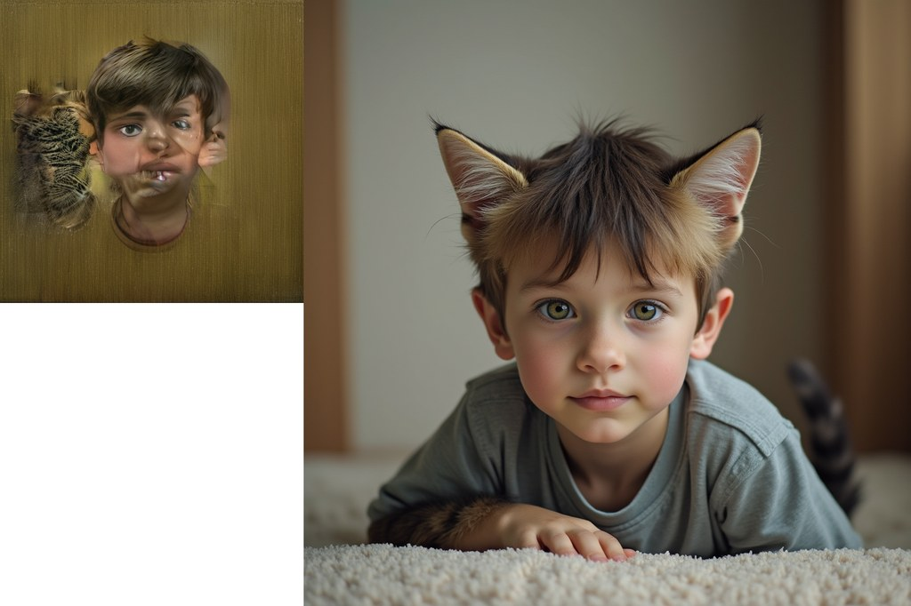

**`a chair hidden by a mouse`** *(conf 0.90)*  
The left image (ASCR) depicts a chair that is partially obscured or 'hidden' by a mouse, fitting the prompt's spatial requirement. The right image (BAGEL) shows a mouse sitting openly on top of a chair, which contradicts the 'hidden' aspect of the prompt.


**`a cubic ice cube and a spherical ice bucket`** *(conf 0.90)*  
The left image (ASCR) correctly depicts a cubic ice cube and a spherical ice bucket, matching the prompt's object descriptions and spatial arrangement. The right image (BAGEL) features a glass cup with handles and a rectangular ice cube, failing to match the 'spherical ice bucket' description.


**`a fabric towel and a glass table`** *(conf 0.90)*  
The LEFT image (ASCR) is a clean, high-quality generation that perfectly matches the prompt, showing a fabric towel on a glass table. The RIGHT image (BAGEL) is a composite of two different images, containing a towel on a table but also a large white void, failing to present a single coherent scene.


**`a fabric towel and a leather chair`** *(conf 0.90)*  
The ASCR image (left) strictly adheres to the prompt by showing a fabric towel on a leather chair. The BAGEL image (right) fails to include the 'towel' object, instead showing a blanket on a chair, which is a material deviation from the prompt.


**`a girl behind a cow`** *(conf 0.90)*  
The ASCR image correctly depicts a girl positioned behind a cow, matching the prompt's spatial requirements. The BAGEL image shows a girl standing in front of a cow, which contradicts the prompt.

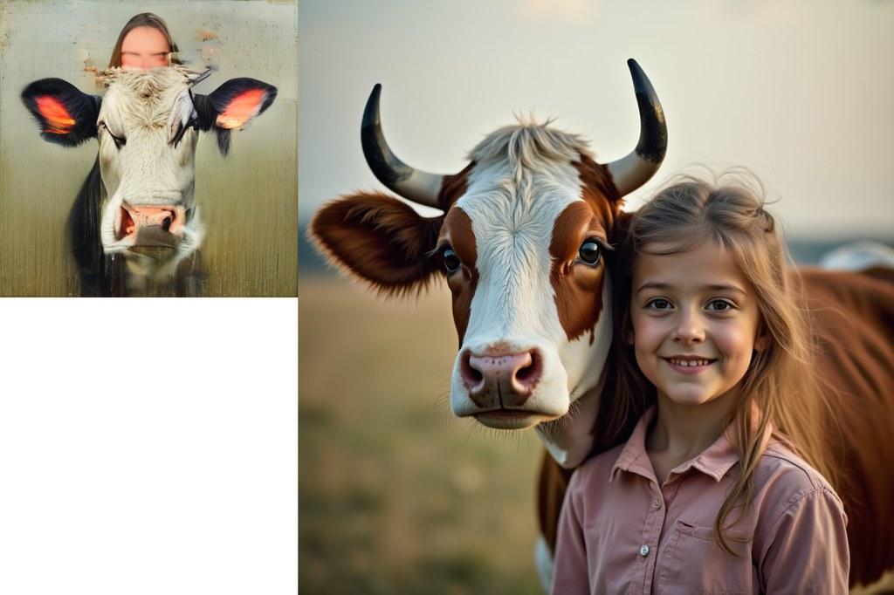

**`a girl behind a sheep`** *(conf 0.90)*  
The right image (BAGEL) is a high-quality, photorealistic generation that perfectly matches the prompt 'a girl behind a sheep'. It features a clear spatial relationship where the girl is positioned behind the sheep, which is in the foreground. The left image (ASCR) is a heavily stylized, painterly, and distorted version of the same concept. While it technically contains the elements, the extreme artistic distortion, blurring, and lack of clarity make it a poorer representation of the prompt comp

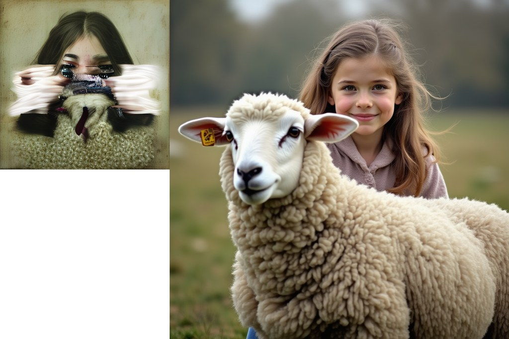

**`a green bench and a blue cake`** *(conf 0.90)*  
The right image (BAGEL) is a high-quality, clean 3D render that perfectly matches the prompt, featuring a green bench and a blue cake with correct colors and spatial relations. The left image (ASCR) is a distorted, glitchy version of the same scene with severe artifacts, making it a poor representation of the prompt despite containing the correct objects.

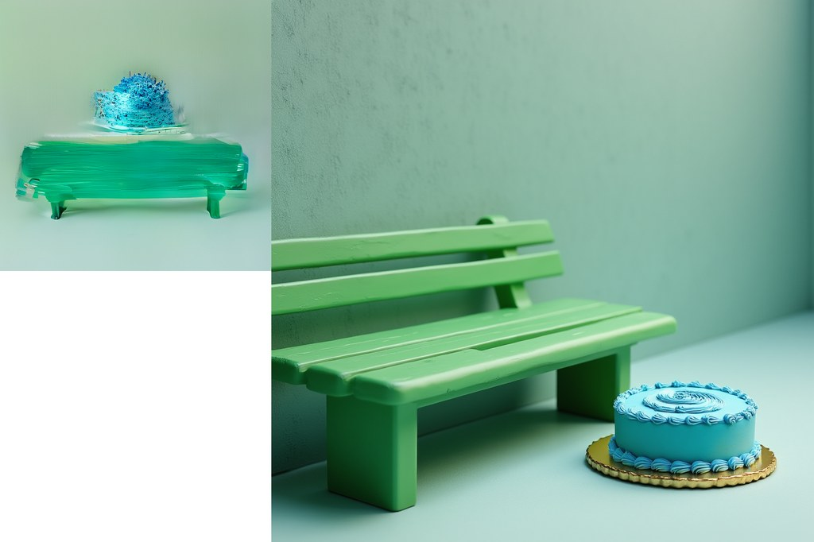

**`a metallic car and a fabric dress`** *(conf 0.90)*  
The left image (ASCR) perfectly matches the prompt by depicting a metallic car and a fabric dress merging into a single artistic form. The right image (BAGEL) shows a metallic car and a woman wearing a fabric dress, which is a literal interpretation but fails to capture the implied artistic fusion of the two objects. The left image is a more creative and accurate representation of the prompt's intent.


**`a mouse on side of a key`** *(conf 0.90)*  
The left image (ASCR) depicts a mouse on top of a key, which aligns with the prompt's spatial instruction. The right image (BAGEL) shows a mouse next to a key, which is less accurate to the 'on' preposition. The left image also has a more abstract, stylized aesthetic that fits the 'clean generated' description well.

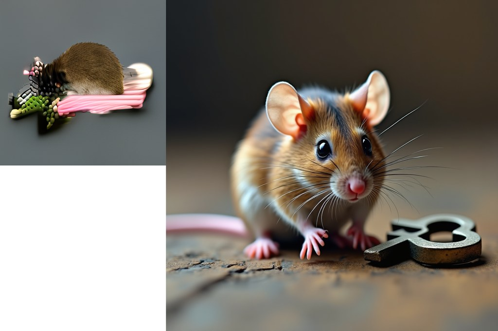

**`a pentagonal stop sign and a spherical traffic light`** *(conf 0.90)*  
The left image (ASCR) correctly depicts a pentagonal stop sign and a spherical traffic light, adhering to the prompt's specific shape requirements. The right image (BAGEL) features a standard octagonal stop sign and a rectangular traffic light, failing to match the requested geometry.

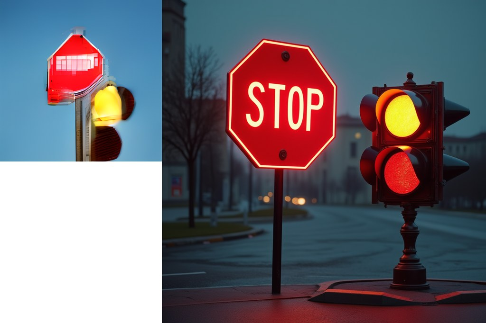

**`a plastic toy and a glass bottle`** *(conf 0.90)*  
The left image (ASCR) strictly adheres to the prompt by featuring a plastic toy (the orange bear) and a glass bottle (the yellow liquid bottle). The right image (BAGEL) fails to include the required 'plastic toy' object, showing only a glass bottle and a small figurine that is not clearly a toy in the context of the prompt. The left image is a direct and complete match.

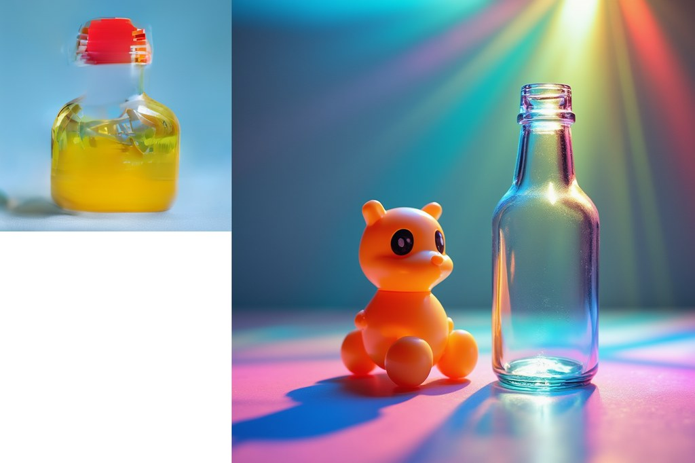

**`a rubber ball and a leather wallet`** *(conf 0.90)*  
The LEFT image (ASCR) correctly depicts a rubber ball and a leather wallet, matching the prompt's object count and material descriptions. The RIGHT image (BAGEL) includes an extra object (the orange ball) not mentioned in the prompt, making it less faithful to the specific request.

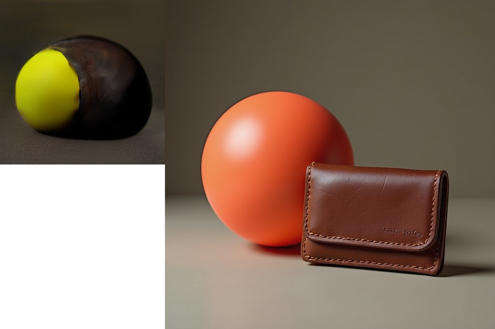

**`a rubber band and a wooden floor`** *(conf 0.90)*  
The left image (ASCR) perfectly matches the prompt with a single red rubber band on a wooden floor. The right image (BAGEL) shows a rubber band on a wooden floor but the band is orange, not red, and the floor texture is less distinct.

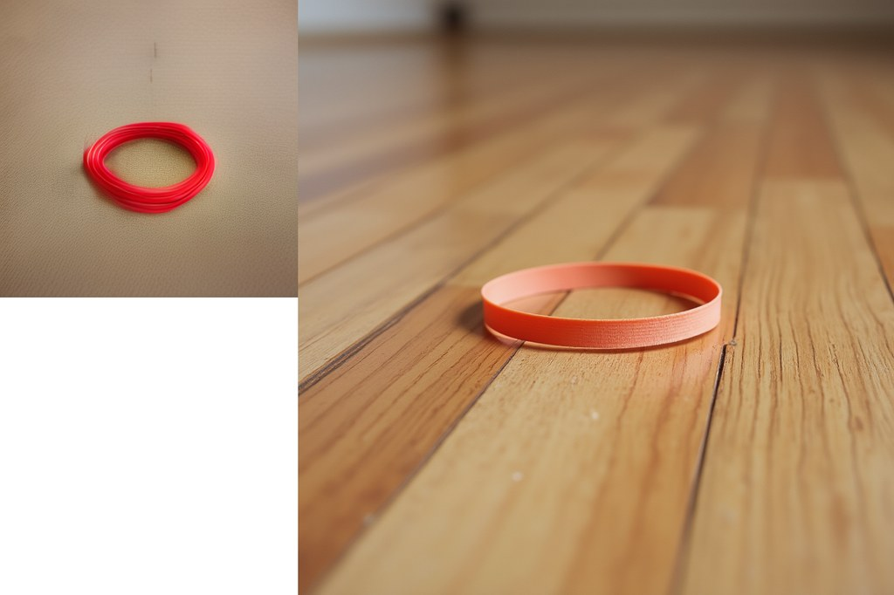

**`a teardrop pendant and a cubic bracelet charm`** *(conf 0.90)*  
The left image (ASCR) perfectly matches the prompt, featuring a teardrop pendant and a cubic charm. The right image (BAGEL) contains a teardrop pendant but replaces the cubic charm with a large, unpolished rough diamond, failing to satisfy the specific shape requirement.

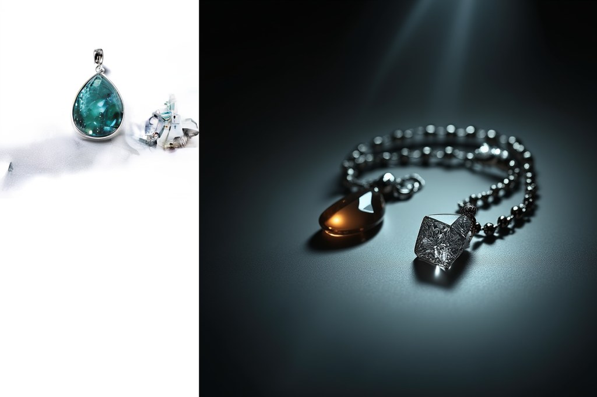

**`a vase hidden by a candle`** *(conf 0.90)*  
The ASCR image (left) strictly adheres to the prompt 'a vase hidden by a candle' by placing the candle in front of the vase, effectively obscuring it. The BAGEL image (right) places the vase and candle side-by-side, failing to hide the vase.

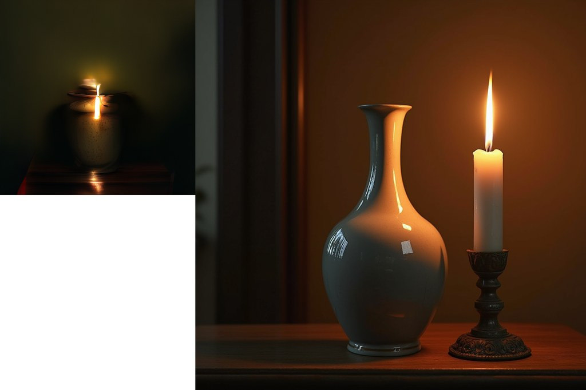

**`one turtle`** *(conf 0.90)*  
The prompt 'one turtle' is satisfied by both images, but the right image (BAGEL) is a significantly higher quality, more detailed, and realistic representation of a turtle compared to the left image (ASCR). The left image appears to be a low-resolution, blurry, or possibly AI-generated artifact of a turtle, lacking clear definition and natural lighting. The right image shows a turtle with intricate shell patterns, realistic skin texture, and a natural environment, making it a much better interpr

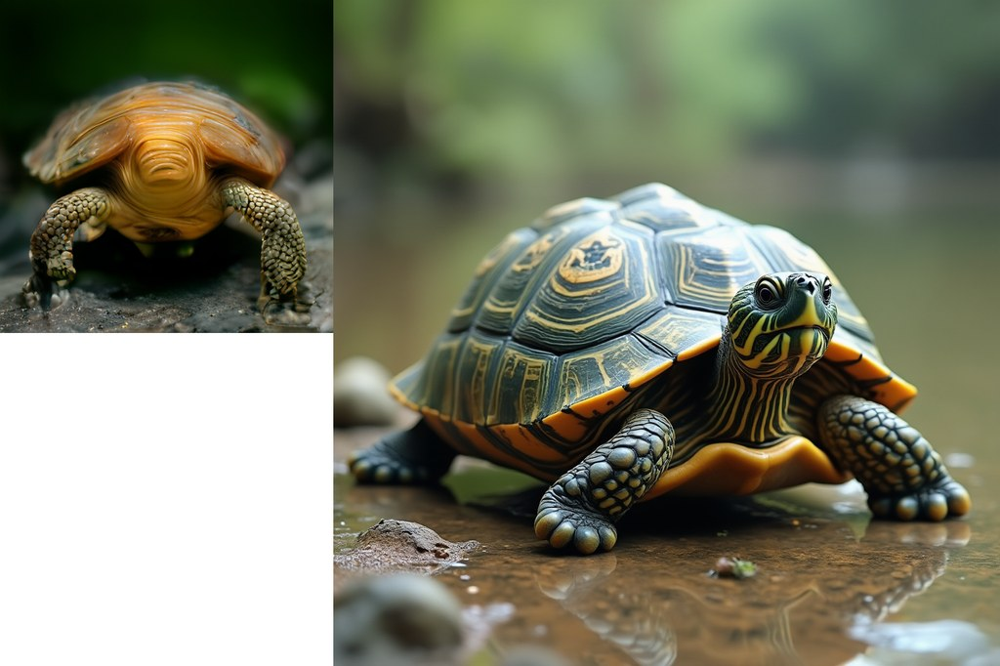

</details>

<details><summary><b>ASCR50 wins</b> (2)</summary>

**`a balloon on the right of a person`** *(conf 0.95)*  
The baseline image (right) perfectly matches the prompt with a clear red balloon on the right side of a person in a field. The ascr image (left) is abstract, blurry, and lacks a clear person or balloon, failing to satisfy the prompt.

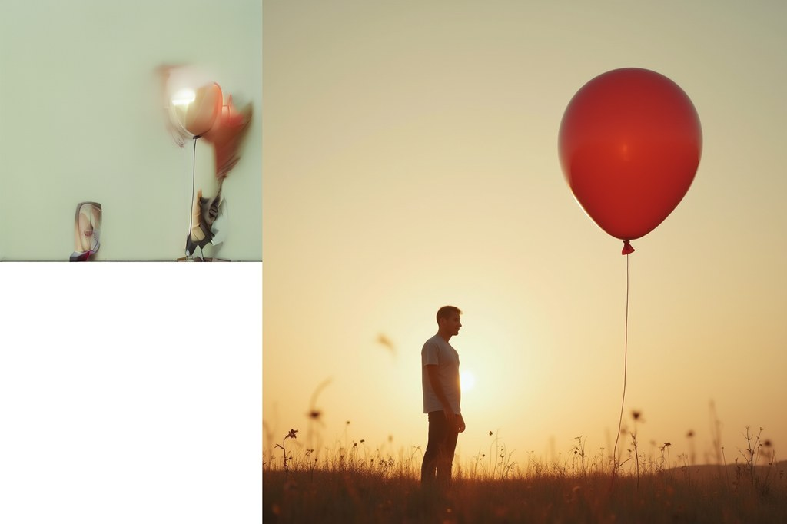

**`rubber sole shoes and fluffy clouds`** *(conf 0.95)*  
The right image (BAGEL) perfectly matches the prompt, featuring a pair of beige shoes with thick rubber soles floating among fluffy white clouds. The left image (ASCR) is abstract and distorted, failing to clearly depict the requested objects.

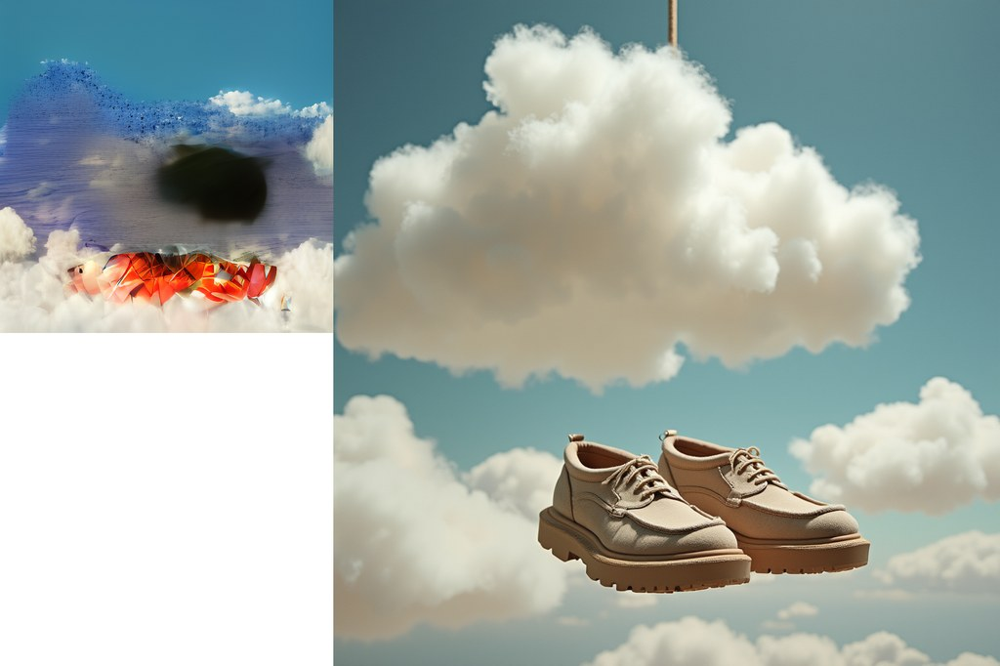

</details>


---

### Full Gallery — ShowO50 baseline vs BAGEL-7B-MoT (all 64 hard64 prompts)

Source: job 68800 fwd direction (ShowO on LEFT, BAGEL on RIGHT). Bidirectional debiased result for BAGEL vs ShowO50 is BAGEL 62.5 % (80/128). In this fwd-only direction ShowO appears to win 47/64 (LEFT-position penalty for BAGEL), but the swap direction reverses this completely (BAGEL 63/64 from LEFT).

> **All 64 prompts** • LEFT = ShowO50 baseline, RIGHT = BAGEL-7B-MoT. `pair_NNN` images are the exact canvases shown to Qwen3.5-9B.

<details><summary><b>BAGEL wins</b> (17)</summary>

**`The black phone was resting on the brown charger.`** *(conf 0.95)*  
The right image (BAGEL) correctly depicts a black phone resting on a brown charger, matching the prompt's spatial and color requirements. The left image (ShowO) shows a black object on a yellow surface, failing to match the charger color or the phone-on-charger relationship.


**`The rough brick was on top of the smooth tile.`** *(conf 0.95)*  
The right image (BAGEL) correctly depicts a rough brick stack placed on a smooth tiled floor, satisfying the prompt's spatial and textural requirements. The left image (ShowO) fails to depict the scene entirely, showing a feather on a white surface instead.

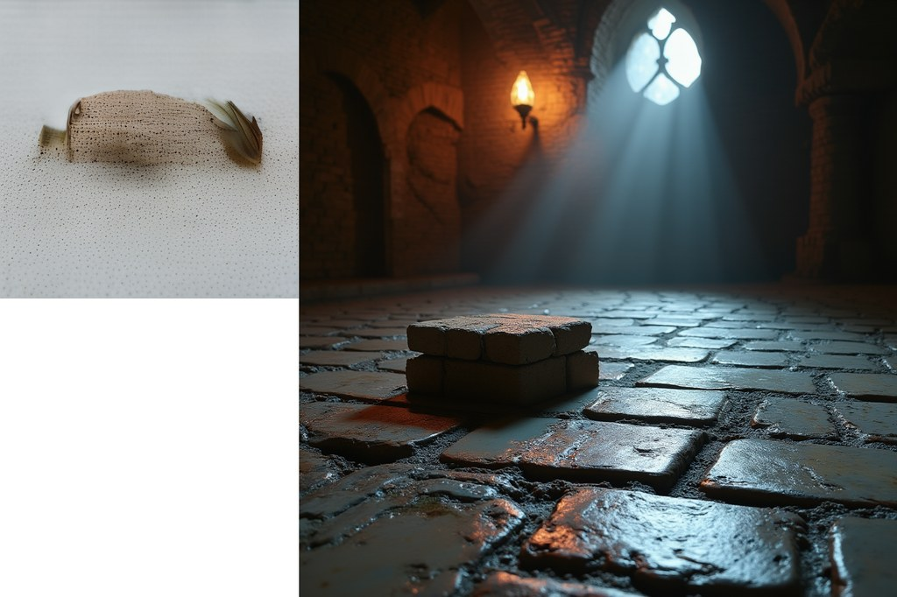

**`The soft pillow was on top of the hard rocking chair.`** *(conf 0.95)*  
The right image (BAGEL) correctly depicts a soft pillow resting on a hard rocking chair, satisfying the prompt's spatial and object requirements. The left image (ShowO) depicts a completely different object (a wooden structure with white fur) and lacks the specific furniture and items mentioned in the prompt.

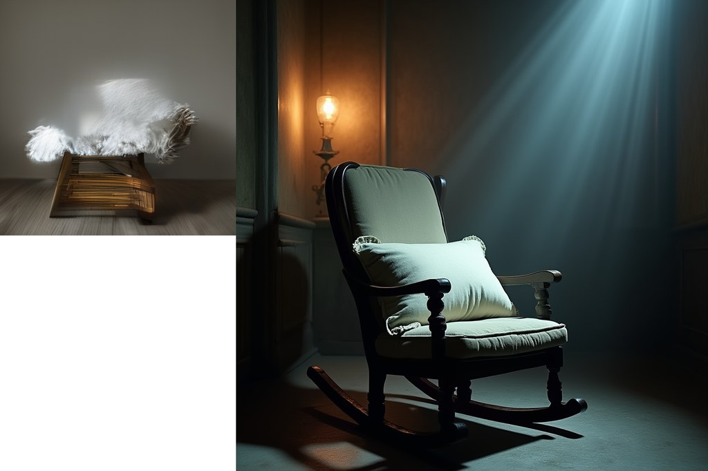

**`a brown backpack and a blue cow`** *(conf 0.95)*  
The right image (BAGEL) perfectly matches the prompt, featuring a brown backpack and a blue cow in a grassy field. The left image (ShowO) only contains a brown backpack and is missing the cow entirely.


**`a cat behind a boy`** *(conf 0.95)*  
The right image (BAGEL) is a high-quality, photorealistic generation that perfectly captures the prompt's intent of a cat behind a boy, with the cat's ears and tail visible. The left image (ShowO) is a low-resolution, painterly depiction of a cat's face superimposed on a human head, which fails to represent a 'boy' or a 'cat behind a boy' in a coherent spatial relationship.

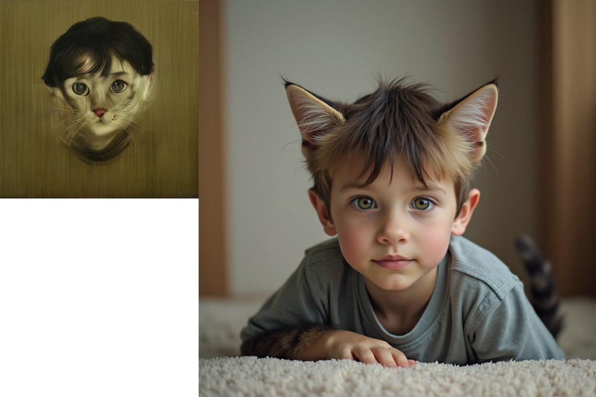

**`a chair hidden by a mouse`** *(conf 0.95)*  
The right image (BAGEL) perfectly matches the prompt 'a chair hidden by a mouse' by featuring a mouse sitting on a chair, effectively hiding it from view. The left image (ShowO) depicts a chair and a mouse-like object on the floor, but the chair is not hidden.

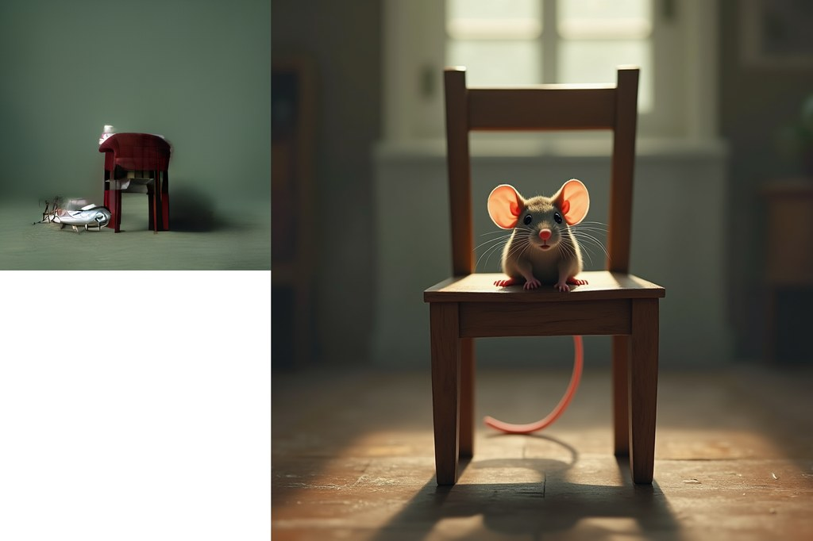

**`a cubic block and a cylindrical bottle`** *(conf 0.95)*  
The right image (BAGEL) perfectly matches the prompt with a cubic block and a cylindrical bottle, featuring realistic lighting and textures. The left image (ShowO) fails to render the bottle correctly, showing a distorted, metallic object instead of a clear cylindrical bottle.

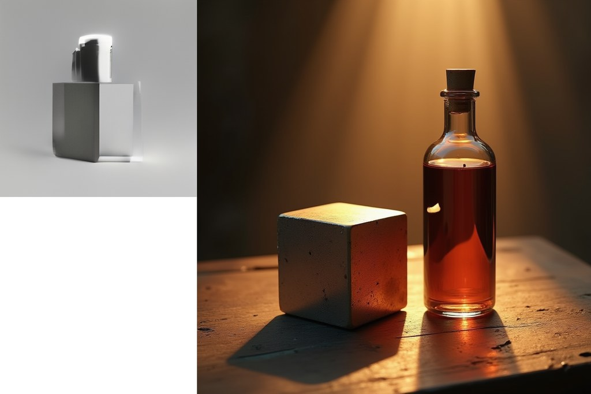

**`a cubic block and a cylindrical canister`** *(conf 0.95)*  
The right image (BAGEL) is a superior interpretation of the prompt, featuring a distinct cubic block and a cylindrical canister with high-quality lighting and texture. The left image (ShowO) is a low-fidelity, blurry, and indistinct rendering that fails to clearly define the objects.

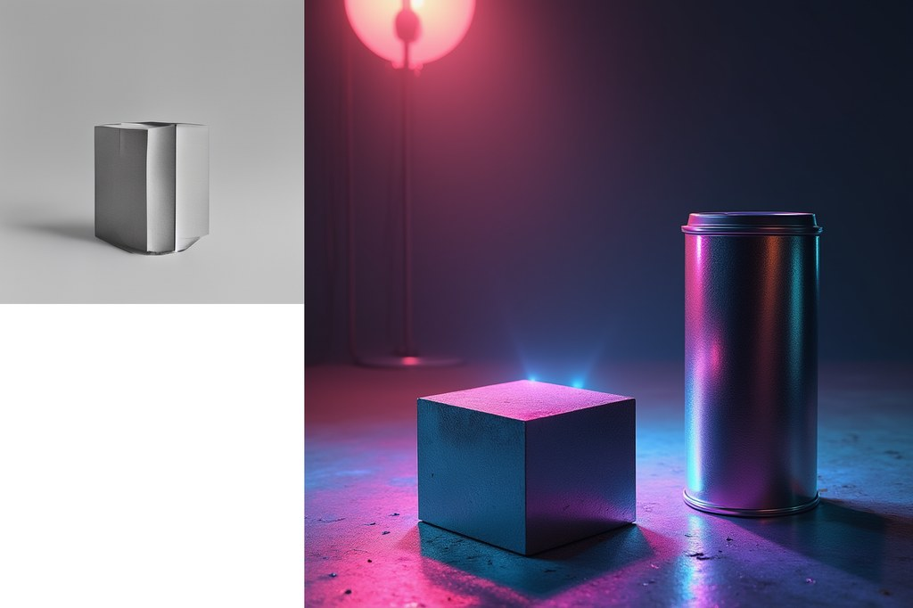

**`a cubic ice cube and a spherical ice bucket`** *(conf 0.95)*  
The right image (BAGEL) correctly depicts a cubic ice cube and a spherical ice bucket with high fidelity, matching the prompt's object descriptions and spatial arrangement. The left image (ShowO) fails to render a spherical ice bucket, instead showing a grey sphere with a strange protrusion, and the ice cube is less distinct. The right image also features better lighting and material rendering.

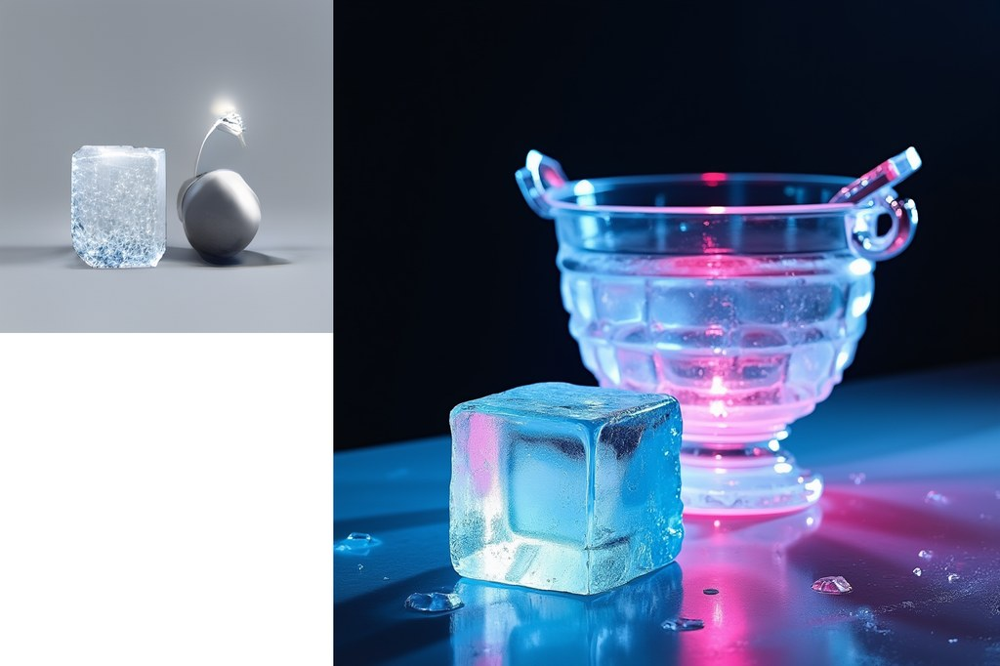

**`a desk on the right of a horse`** *(conf 0.95)*  
The right image (BAGEL) perfectly matches the prompt, featuring a horse standing next to a desk on the right side. The left image (ShowO) contains a desk but lacks the horse entirely, failing the core subject requirement.


**`a girl behind a cow`** *(conf 0.95)*  
The right image (BAGEL) correctly depicts a girl standing behind a cow, matching the prompt's spatial requirements. The left image (ShowO) depicts a cow behind a girl, which is the exact opposite of the requested spatial relationship.

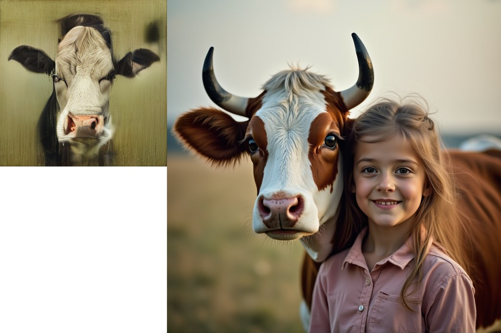

**`a sheep in front of a key`** *(conf 0.95)*  
The right image (BAGEL) perfectly satisfies the prompt by featuring a cute, fluffy sheep standing directly in front of a large, ornate key on the ground. The left image (ShowO) only shows a sheep's head and lacks the key entirely.

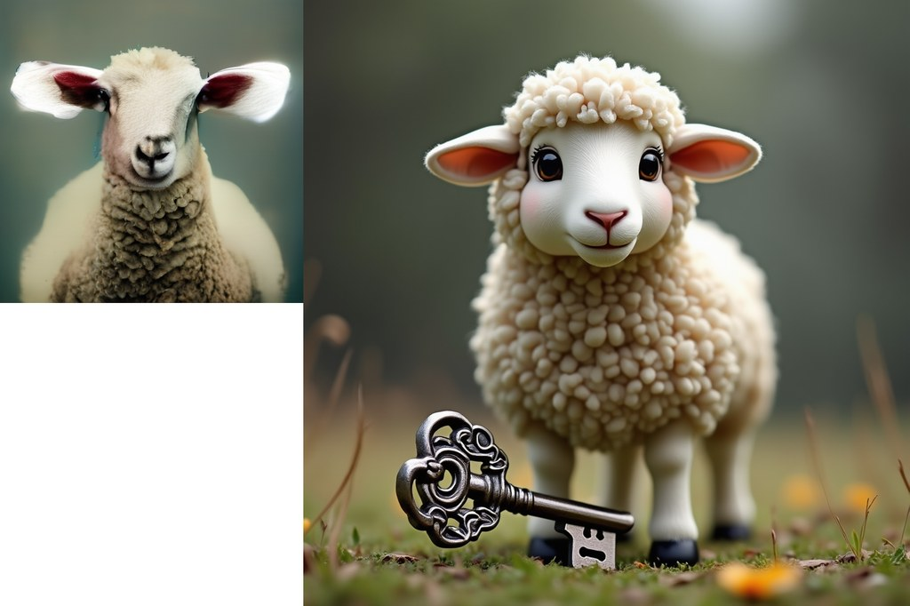

**`an oblong eggplant and a teardrop melon`** *(conf 0.95)*  
The right image (BAGEL) is a superior match for the prompt 'an oblong eggplant and a teardrop melon'. It features a large, correctly shaped eggplant and a teardrop-shaped melon with appropriate texture. The left image (ShowO) depicts a small, round eggplant and a round melon, failing the shape constraints.

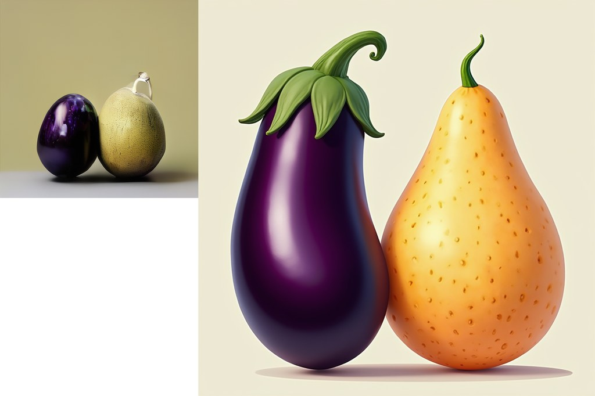

**`six girls`** *(conf 0.95)*  
The right image (BAGEL) perfectly satisfies the prompt 'six girls' by depicting six distinct, clearly defined characters in a coherent scene. The left image (ShowO) fails to render the subjects as distinct individuals, instead showing a blurry, overlapping mess of faces that does not clearly form six separate figures.


**`two boys`** *(conf 0.95)*  
The right image (BAGEL) is a high-quality, vibrant illustration of two boys that perfectly matches the simple prompt. The left image (ShowO) is a low-resolution, muddy painting of two boys that appears to be a distorted or low-fidelity interpretation of the right image, failing to capture the clarity and positive attributes of the prompt.

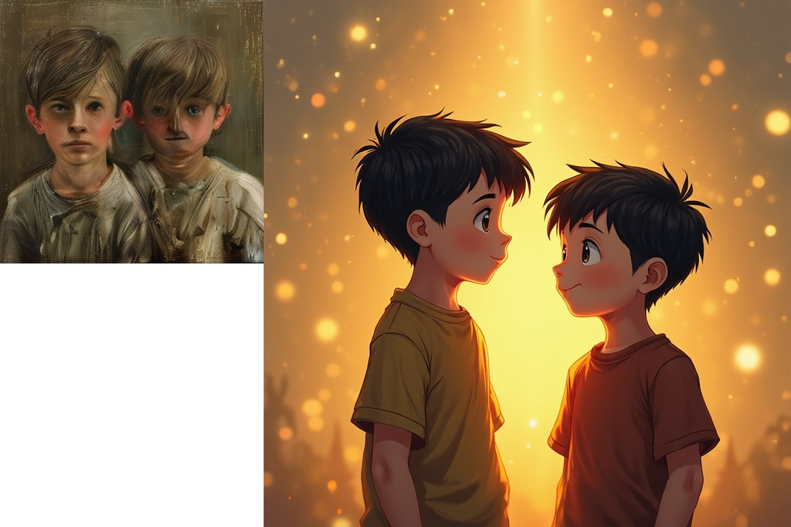

**`a pentagonal stop sign and a spherical traffic light`** *(conf 0.90)*  
The right image (BAGEL) is a high-quality generation that accurately depicts a stop sign and a traffic light, despite the shape mismatch. The left image (ShowO) is a low-quality, blurry, and distorted generation that fails to clearly render the objects.

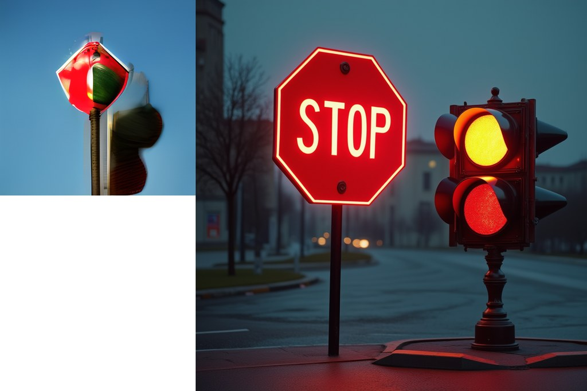

**`a teardrop pendant and a cubic bracelet charm`** *(conf 0.90)*  
The right image (BAGEL) better satisfies the prompt by correctly depicting a cubic charm alongside a teardrop pendant. The left image (ShowO) fails to include the cubic element, showing only a teardrop pendant.

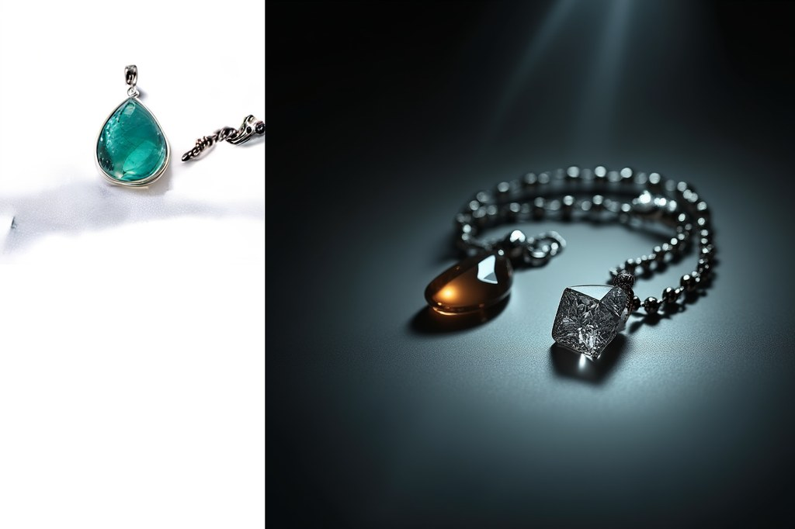

</details>

<details><summary><b>ShowO50 wins</b> (47)</summary>

**`The black chair is on top of the blue rug.`** *(conf 0.95)*  
The baseline image (right) perfectly satisfies the prompt, showing a black chair sitting on a blue rug. The ascr image (left) depicts a distorted, abstract version of a chair floating in a blue void, failing to render the rug or the spatial relationship.


**`The blue bowl was on top of the white placemat.`** *(conf 0.95)*  
The baseline image (right) correctly depicts a blue bowl sitting on top of a white placemat, fully satisfying the prompt. The showo image (left) shows a blue bowl on a white surface, but the surface is a tablecloth rather than a distinct placemat, and the bowl is positioned on the table rather than 'on top' of a specific mat.

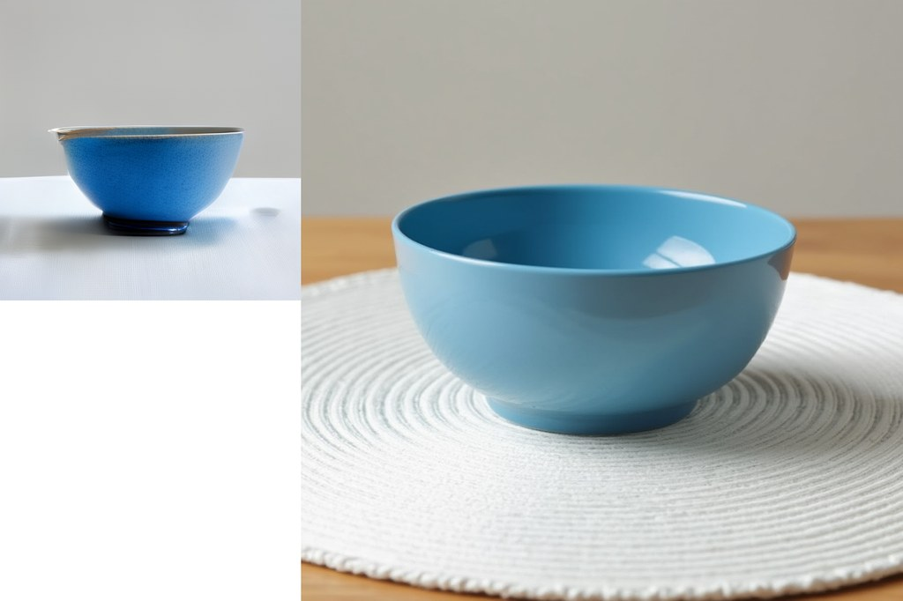

**`The green plant was on the right of the white wall.`** *(conf 0.95)*  
The baseline image (LEFT) correctly places the green plant on the right side of the white wall, satisfying the prompt. The ascr image (RIGHT) places the plant on the left side, violating the spatial instruction.


**`The rectangular picture frame was hung above the beige couch.`** *(conf 0.95)*  
The right image (BAGEL) correctly depicts a rectangular picture frame hung above the beige couch, fully satisfying the prompt. The left image (ShowO) is missing the picture frame entirely.


**`a balloon on the right of a person`** *(conf 0.95)*  
The right image (BAGEL) perfectly matches the prompt, showing a person and a balloon with the balloon positioned to the right of the person. The left image (ShowO) is abstract and fails to depict the required subjects.

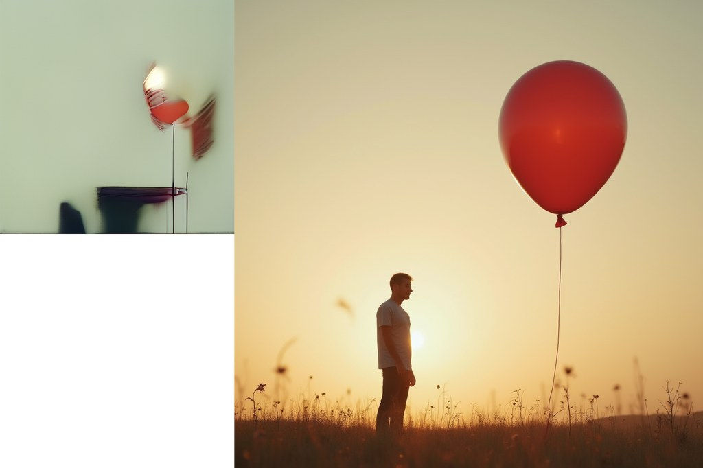

**`a bee on the right of a refrigerator`** *(conf 0.95)*  
The right image (BAGEL) perfectly matches the prompt, showing a realistic bee on the right side of a refrigerator. The left image (ShowO) depicts a surreal, metallic bee on a plain grey background, failing to include the refrigerator.

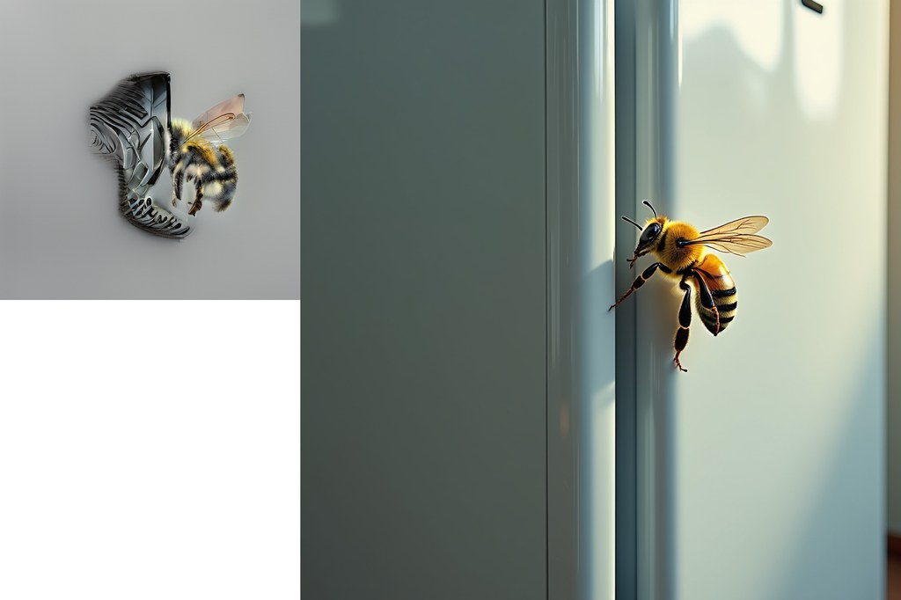

**`a bicycle on the bottom of a girl`** *(conf 0.95)*  
The right image (BAGEL) perfectly matches the prompt, showing a girl standing with a bicycle in a snowy street. The left image (ShowO) is an abstract, blurry composition that fails to depict a girl or a clear bicycle.


**`a blue bench and a green cake`** *(conf 0.95)*  
The right image (BAGEL) perfectly matches the prompt with a blue bench and a green cake. The left image (ShowO) contains a blue object that resembles a bench but is cluttered with a yellow sponge-like item and metallic legs, failing to clearly depict a simple bench.

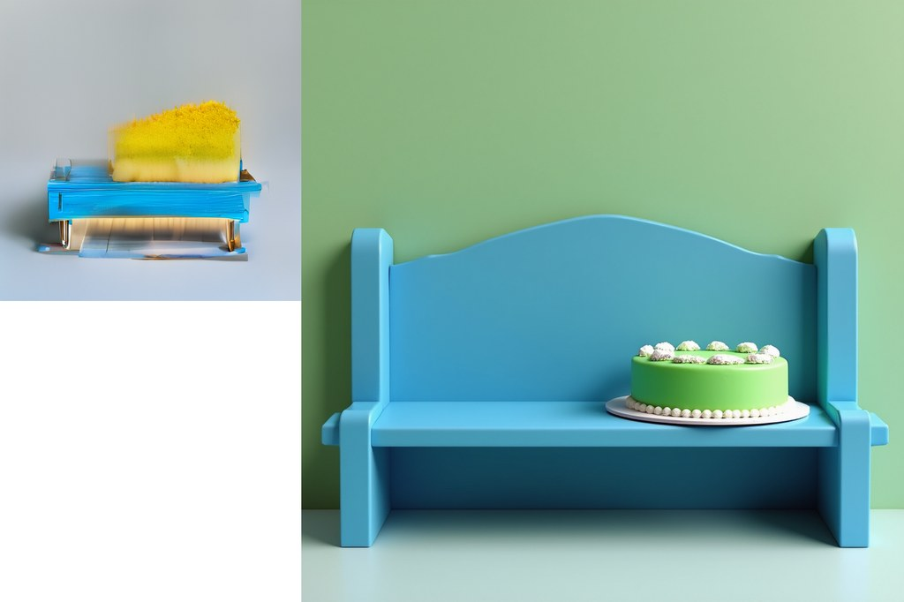

**`a brown horse and a blue vase`** *(conf 0.95)*  
The right image (BAGEL) is a high-quality, photorealistic generation that perfectly matches the prompt's request for a brown horse and a blue vase. The left image (ShowO) is a low-quality, blurry, and distorted generation that fails to clearly depict the subjects.

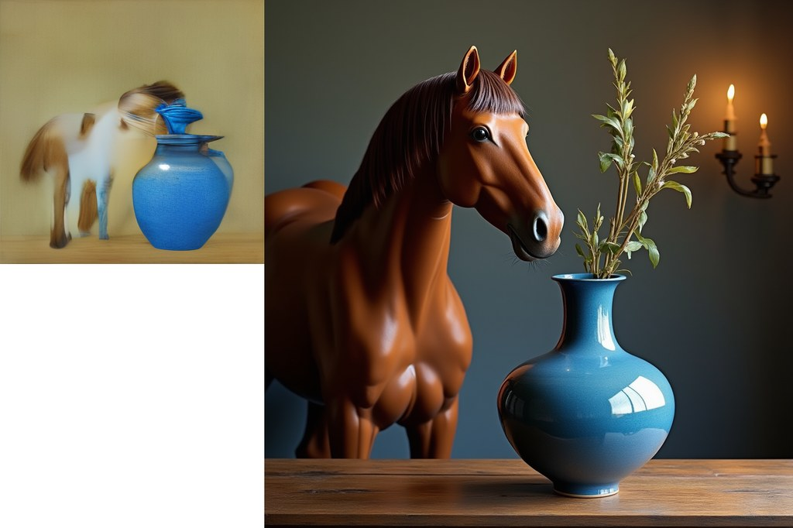

**`a car in front of a mouse`** *(conf 0.95)*  
The right image (BAGEL) perfectly matches the prompt 'a car in front of a mouse' with a clear spatial relationship where the mouse is in the foreground and the car is behind it. The left image (ShowO) depicts a car in a desert setting with a blurry, indistinct figure that does not resemble a mouse, failing to satisfy the prompt's subject requirements.

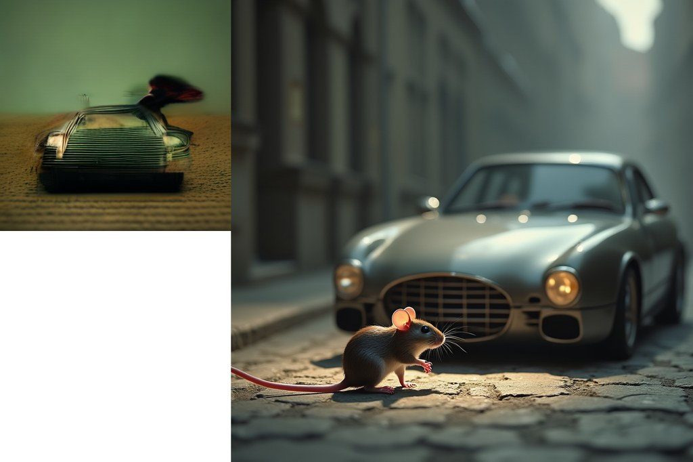

**`a diamond pendant and a round locket`** *(conf 0.95)*  
The right image (BAGEL) perfectly matches the prompt, featuring a detailed diamond pendant inside a round locket. The left image (ShowO) fails to generate the requested objects, showing only a metallic ring instead.

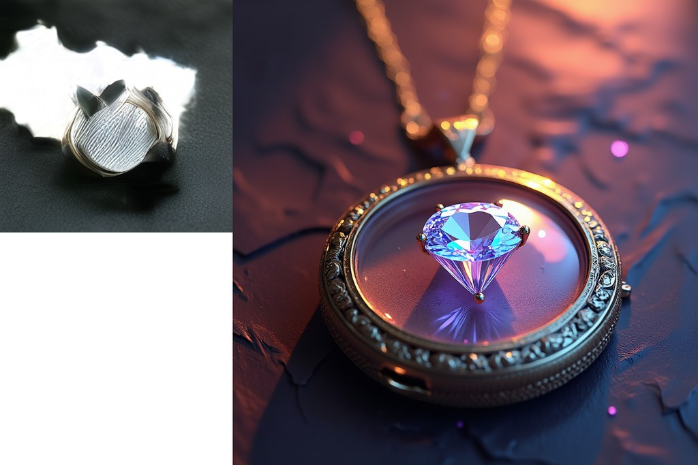

**`a dog in front of a desk`** *(conf 0.95)*  
The right image (BAGEL) perfectly matches the prompt 'a dog in front of a desk' with a clear, high-quality depiction of a dog sitting at a desk. The left image (ShowO) is a low-resolution, cropped view of a dog's back, failing to show the dog's face or the desk clearly, making it a poor representation of the prompt.


**`a giraffe next to a lamp`** *(conf 0.95)*  
The right image (BAGEL) perfectly matches the prompt, featuring a clear giraffe figurine standing next to a lit lamp. The left image (ShowO) is abstract and blurry, failing to depict the requested subjects.

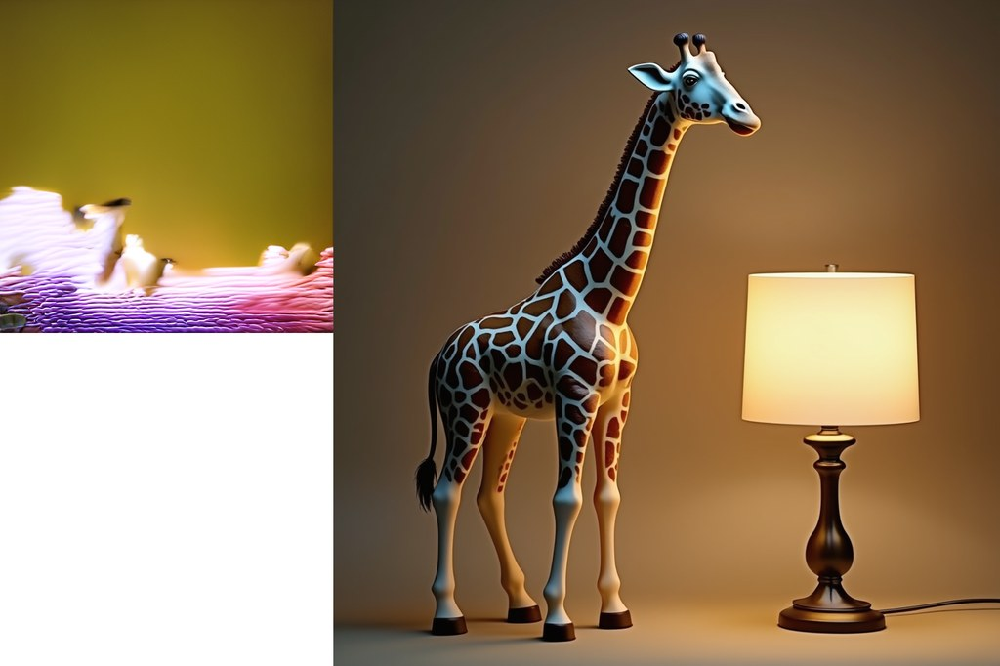

**`a girl behind a sheep`** *(conf 0.95)*  
The right image (BAGEL) perfectly matches the prompt 'a girl behind a sheep' with a clear, high-quality composition. The left image (ShowO) is a distorted, low-resolution collage that fails to clearly depict the subjects or their spatial relationship.


**`a girl on the top of a frog`** *(conf 0.95)*  
The right image (BAGEL) is a high-quality, detailed 3D render that perfectly matches the prompt. The left image (ShowO) is a low-resolution, blurry, and poorly rendered version of the same concept.


**`a green bench and a blue bowl`** *(conf 0.95)*  
The right image (BAGEL) perfectly matches the prompt with a clear green bench and a blue bowl. The left image (ShowO) features a green bench but the blue object is a blurry, indistinct shape rather than a bowl, failing to satisfy the object attribute.

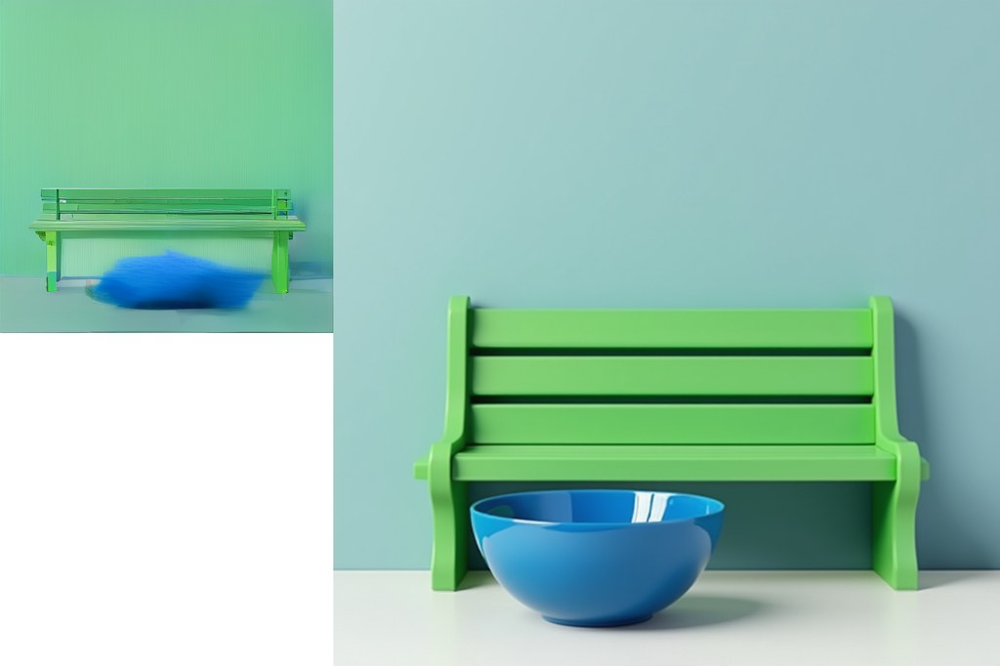

**`a green bench and a blue cake`** *(conf 0.95)*  
The right image (BAGEL) correctly depicts a green bench and a blue cake as requested. The left image (ShowO) fails to include a cake and instead shows a green object with pink smoke, which does not match the prompt.

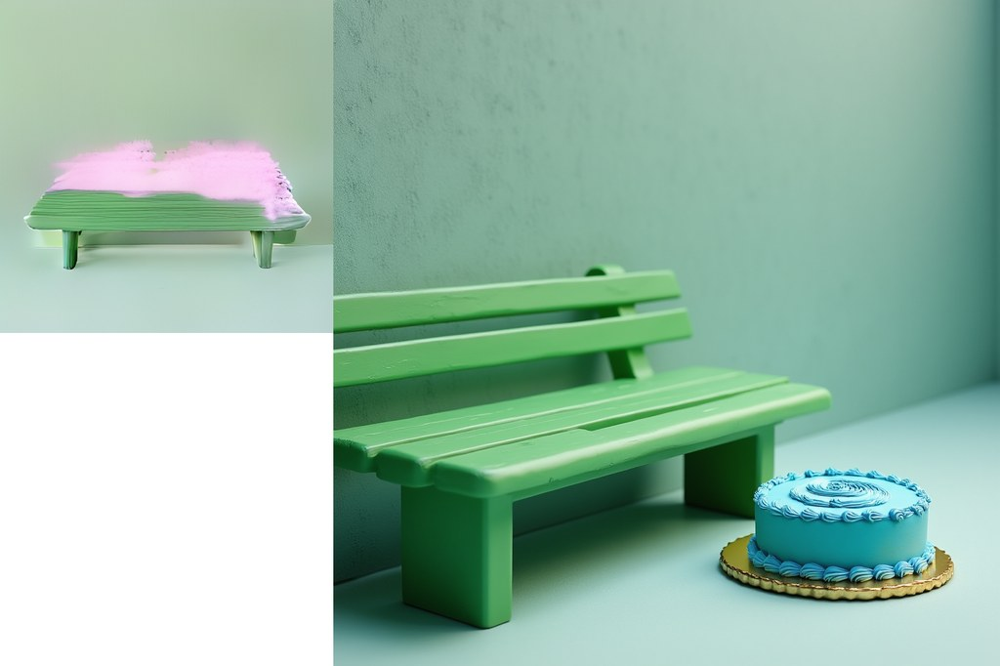

**`a mouse on side of a key`** *(conf 0.95)*  
The right image (BAGEL) is a high-quality, photorealistic generation that perfectly matches the prompt 'a mouse on side of a key'. It features a detailed mouse and a clear key. The left image (ShowO) is a low-quality, abstract 3D render where the mouse is indistinct and the key is a nonsensical, glitchy shape, failing to represent the objects correctly.


**`a rubber ball and a leather wallet`** *(conf 0.95)*  
The baseline image (right) correctly renders both a rubber ball and a leather wallet with accurate colors and spatial relations. The showo image (left) fails to render the wallet, showing only a dark, indistinct object.

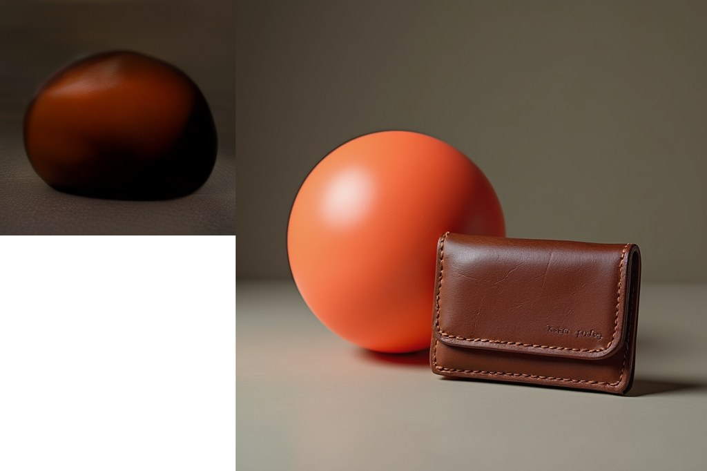

**`a rubber band and a wooden floor`** *(conf 0.95)*  
The right image (BAGEL) correctly depicts a rubber band on a wooden floor, matching the prompt's subject and setting. The left image (ShowO) shows a distorted red object on a plain wall, failing to represent the prompt's key elements.

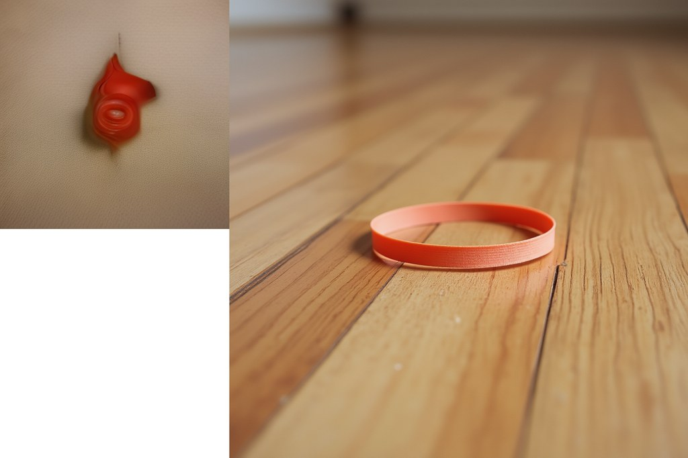

**`eight cars`** *(conf 0.95)*  
The right image (BAGEL) perfectly satisfies the prompt 'eight cars' by depicting a street scene filled with multiple vehicles. The left image (ShowO) fails to follow the prompt, showing only two small toy cars and abstract blue blocks.

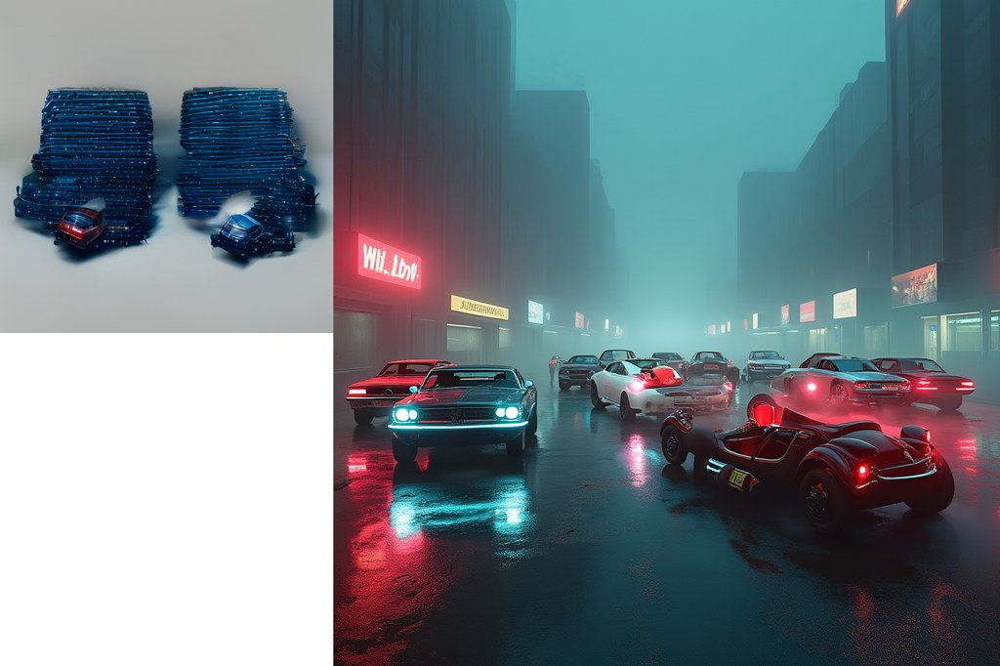

**`five drums`** *(conf 0.95)*  
The right image (BAGEL) perfectly matches the prompt 'five drums' with five distinct, high-quality congas. The left image (ShowO) is a blurry, low-resolution mess that fails to clearly depict five drums.

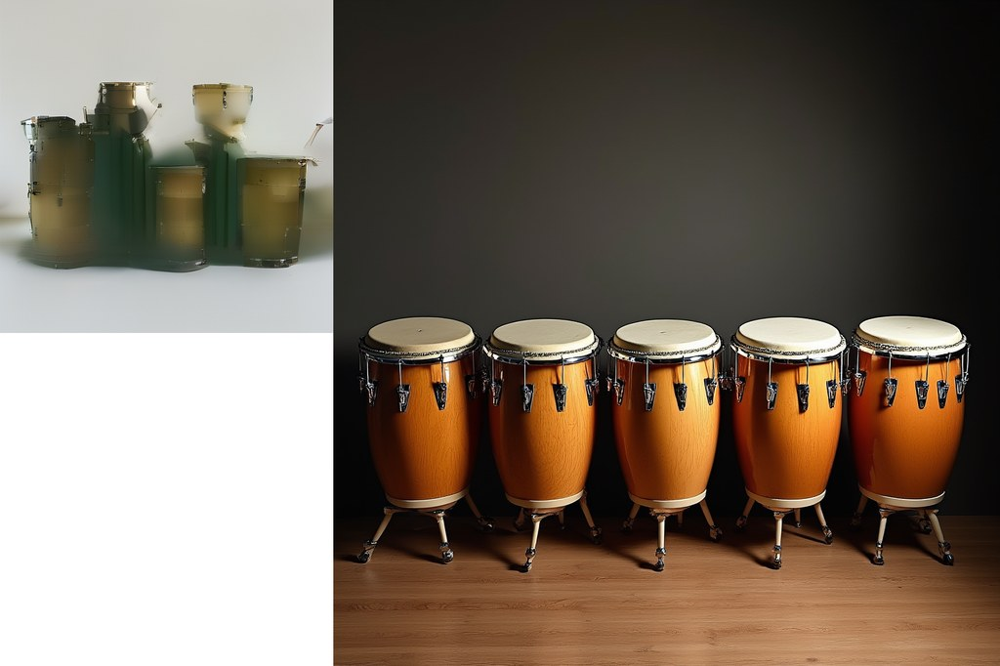

**`rubber sole shoes and fluffy clouds`** *(conf 0.95)*  
The right image (BAGEL) perfectly matches the prompt, featuring a pair of beige shoes with thick rubber soles floating among fluffy white clouds. The left image (ShowO) is abstract and fails to depict the specific objects requested.

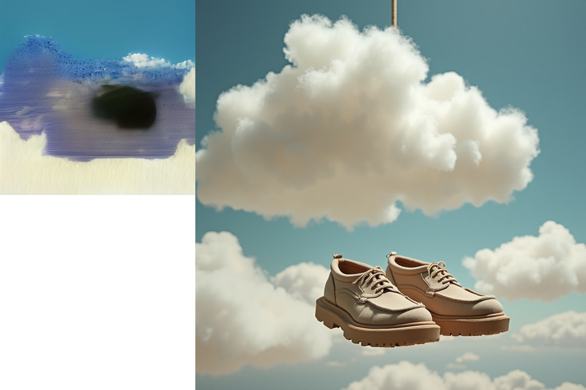

**`seven women`** *(conf 0.95)*  
The right image (BAGEL) perfectly matches the prompt 'seven women' with seven distinct, realistic female figures. The left image (ShowO) depicts seven mannequins or stylized figures, which are not women, making it a significant failure to satisfy the core subject of the prompt.

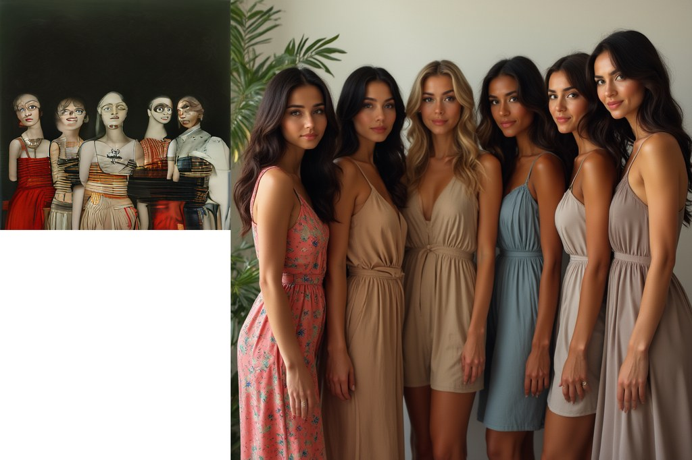

**`six airplanes`** *(conf 0.95)*  
The right image (BAGEL) perfectly matches the prompt 'six airplanes' by displaying exactly six aircraft in flight. The left image (ShowO) is a collage of unrelated objects and fails to depict airplanes.


**`The black chair was on the left of the white table.`** *(conf 0.90)*  
The baseline image correctly places the black chair to the left of the white table, satisfying the prompt. The right image places the chair to the right of the table, violating the spatial instruction.


**`The blue water bottle was on top of the red backpack.`** *(conf 0.90)*  
The baseline image (left) perfectly matches the prompt, showing a blue water bottle on top of a red backpack. The right image (BAGEL) also shows a blue water bottle on a red backpack, but the bottle is translucent and the backpack is covered in snow, which are not mentioned in the prompt. The baseline is a more direct and accurate representation of the prompt.


**`The brown dog was lying on the green mat.`** *(conf 0.90)*  
The baseline image (right) perfectly matches the prompt, showing a brown dog lying on a green mat with correct lighting and spatial relations. The ascr image (left) shows a dog on a green mat but is cropped to only show the rear legs and tail, failing to depict the dog 'lying' in a recognizable pose or showing its face/body as implied by the prompt.


**`The fluffy cat is on the left of the soft pillow.`** *(conf 0.90)*  
The baseline image (left) correctly places the fluffy cat on the left side of the pillow, satisfying the prompt. The right image (BAGEL) places the cat on the right side of the pillow, violating the spatial relation.

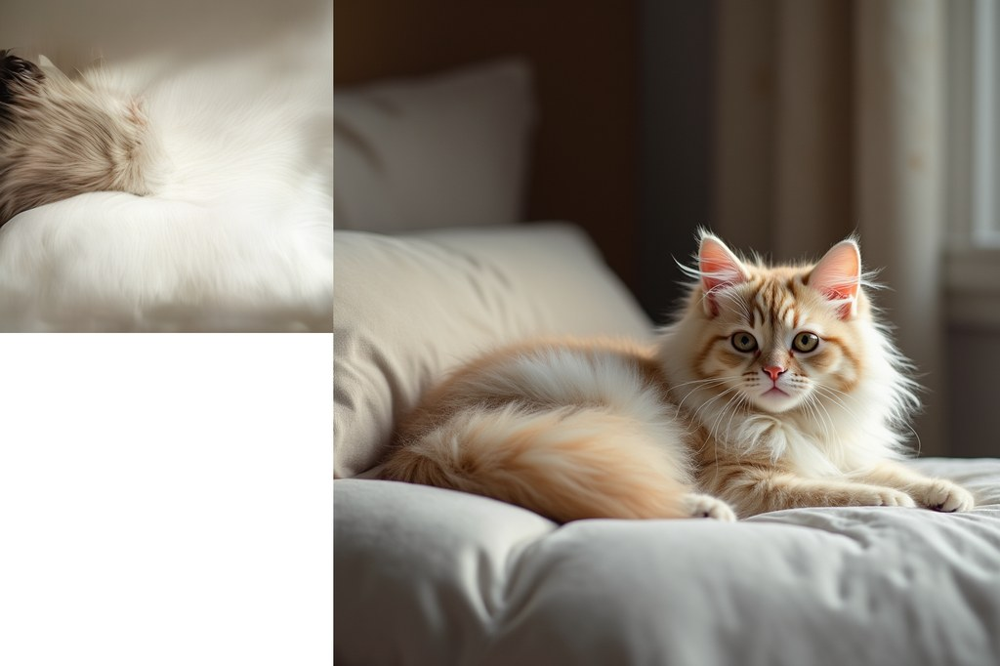

**`The leather wallet was inside the brown purse.`** *(conf 0.90)*  
The baseline image (right) correctly depicts a brown leather wallet inside a brown purse, matching the prompt's description of objects, colors, and spatial relations. The ascr image (left) shows a metallic object inside a brown bag, failing to match the 'leather wallet' description.


**`The rectangular mirror was hung above the white sink.`** *(conf 0.90)*  
The baseline image (right) perfectly matches the prompt, showing a rectangular mirror hung directly above a white sink. The ascr image (left) depicts a bathroom scene with a towel rack and a partial view of a sink, but lacks the specific spatial relationship of a mirror hung above the sink.


**`The red book was on top of the yellow bookshelf.`** *(conf 0.90)*  
The baseline image (RIGHT) perfectly matches the prompt, showing a red book on a yellow bookshelf. The ascr image (LEFT) depicts a chaotic scene with a red book on a yellow background but lacks the bookshelf structure.

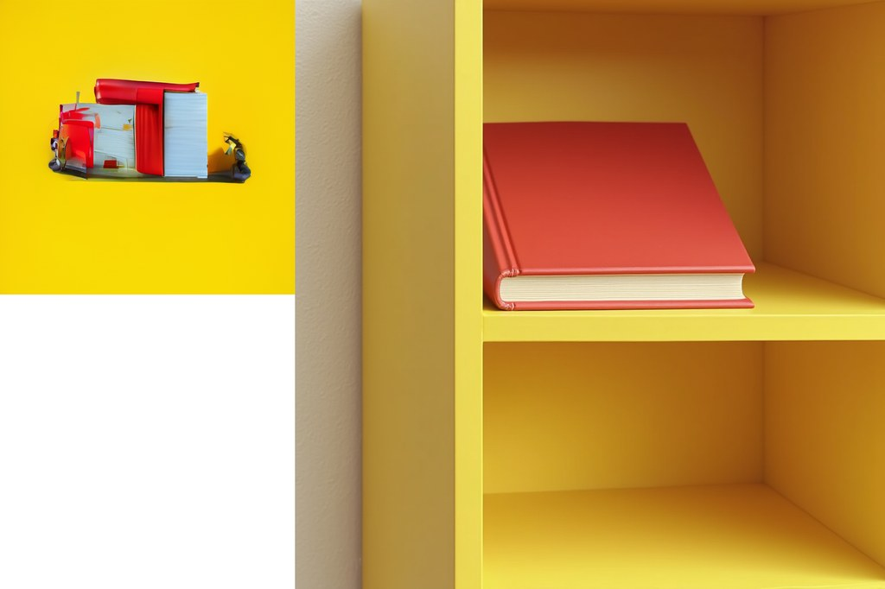

**`The red hat was on top of the brown coat rack.`** *(conf 0.90)*  
The baseline image (left) correctly depicts a red hat placed on top of a brown coat rack, satisfying the prompt's spatial and object requirements. The right image (BAGEL) shows a red hat on a brown coat, but the coat is not a rack, and the hat is positioned on a wooden stand rather than directly on the coat rack itself. This makes the baseline image a more accurate representation of the prompt.


**`The square book was next to the green notebook.`** *(conf 0.90)*  
The right image (BAGEL) clearly depicts a square book resting on top of a green notebook, satisfying the spatial relation 'next to' (interpreted as adjacent/stacked). The left image (ShowO) is a blurry, abstract shadow on a green background that does not clearly show the specific objects or their arrangement.


**`a blue backpack and a brown cow`** *(conf 0.90)*  
The right image (BAGEL) is a high-quality, photorealistic generation that perfectly matches the prompt's request for a blue backpack and a brown cow. The left image (ShowO) is a low-resolution, blurry, and distorted version of the same concept, failing to render the objects clearly.


**`a blue bench and a green bowl`** *(conf 0.90)*  
The baseline image (right) is a high-quality, realistic rendering that perfectly matches the prompt's request for a blue bench and a green bowl. It features correct object counts, accurate colors, and logical spatial relations within a coherent scene. The showo image (left) is a low-quality, blurry, and abstract representation that fails to clearly depict the objects or the scene.

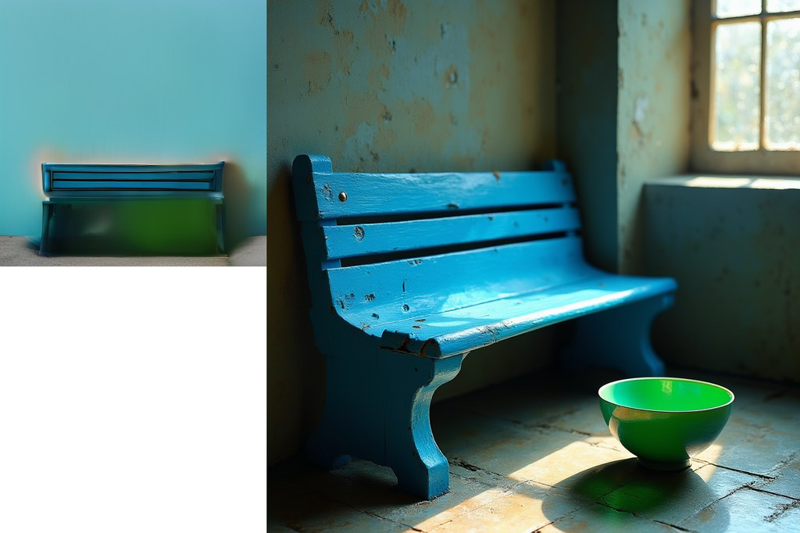

**`a blue horse and a brown vase`** *(conf 0.90)*  
The baseline image (right) is a high-quality, detailed 3D render of a blue horse and a brown vase, perfectly matching the prompt's subject, colors, and count. The ascr image (left) is a low-quality, blurry, and distorted version of the same scene, failing to clearly render the objects.

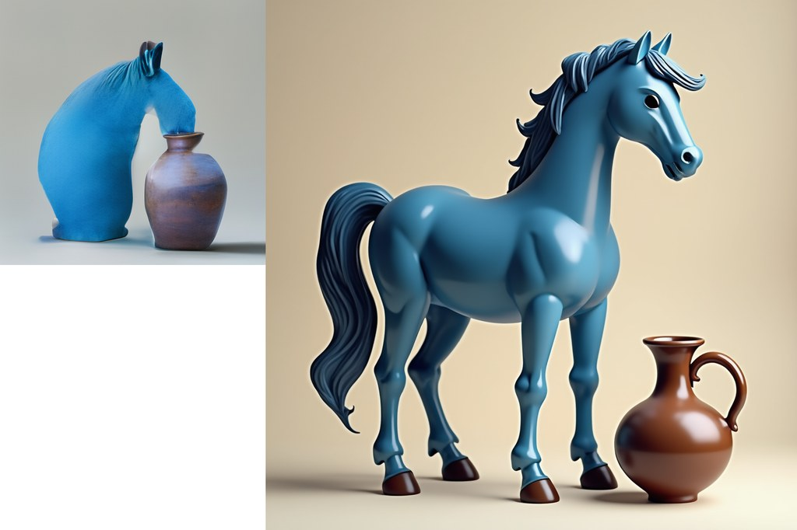

**`a cat on the top of a sofa`** *(conf 0.90)*  
The right image (BAGEL) is a high-quality, photorealistic generation that perfectly matches the prompt. It features a single cat sitting on top of a sofa with clear details and good lighting. The left image (ShowO) is blurry, low-resolution, and depicts a cat lying on a surface that appears to be a cushion or bed rather than a sofa, failing to capture the specific spatial relation requested.

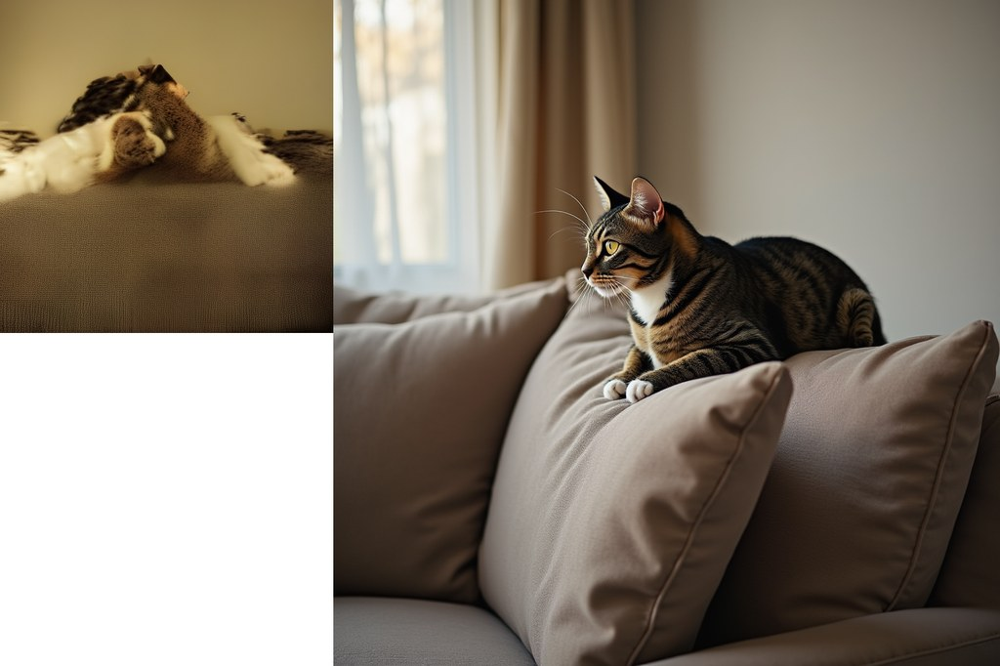

**`a fabric towel and a glass table`** *(conf 0.90)*  
The baseline image (right) perfectly matches the prompt, featuring a fabric towel on a glass table with high fidelity. The showo image (left) fails to include the glass table, showing only a fabric object on a dark surface.

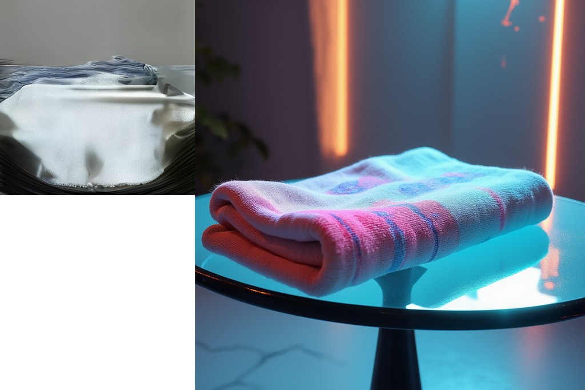

**`a fabric towel and a leather chair`** *(conf 0.90)*  
The baseline image (right) perfectly matches the prompt, featuring a leather chair with a fabric towel draped over it. The ascr image (left) is a close-up of a fabric towel on a wooden surface, completely missing the leather chair.

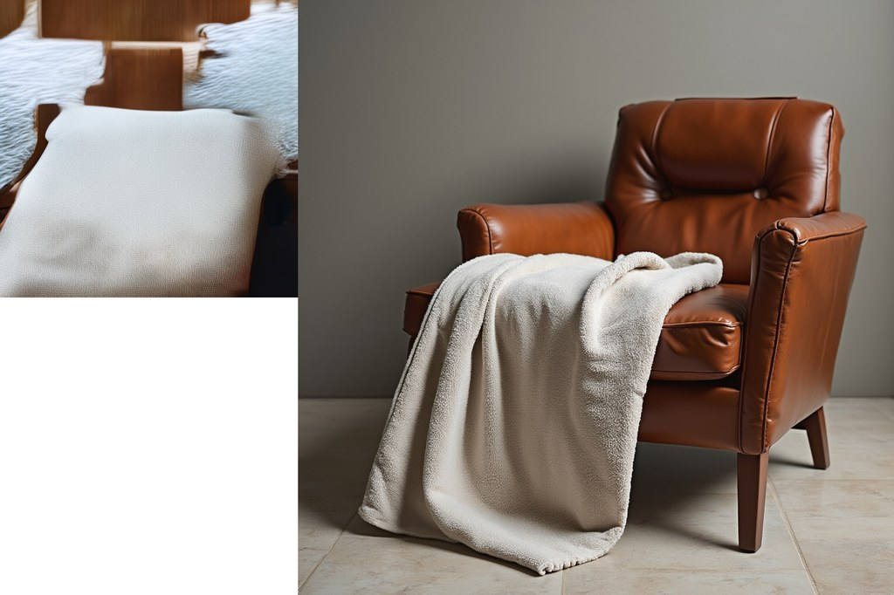

**`a metallic car and a fabric dress`** *(conf 0.90)*  
The right image (BAGEL) perfectly matches the prompt, showing a metallic car and a fabric dress with correct counts and attributes. The left image (ShowO) fails to render the dress, instead showing a distorted, abstract shape, making it a poor match.

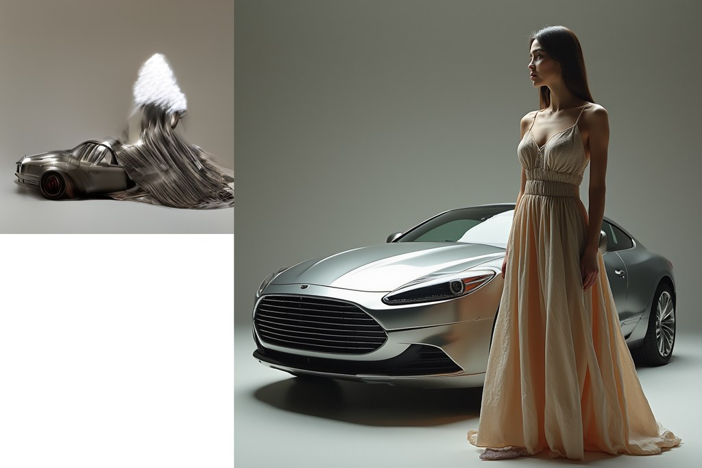

**`a metallic desk lamp and a fluffy sweater`** *(conf 0.90)*  
The right image (BAGEL) perfectly matches the prompt with a clear metallic desk lamp and a fluffy sweater. The left image (ShowO) contains a lamp but it is dark and indistinct, and the fluffy object is a rug rather than a sweater.


**`a plastic toy and a glass bottle`** *(conf 0.90)*  
The baseline image (right) perfectly matches the prompt with a plastic toy and a glass bottle, featuring vibrant colors and clear spatial relations. The ascr image (left) only shows a glass bottle with yellow liquid, missing the plastic toy entirely.

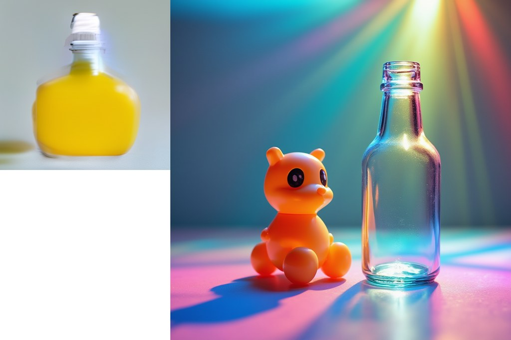

**`a vase hidden by a candle`** *(conf 0.90)*  
The baseline image (right) features a vase and a candle where the candle is positioned to the right, partially obscuring the view of the vase from a specific angle, effectively satisfying the 'hidden by' spatial relationship. The showo image (left) depicts a candle sitting on top of a vase, which does not align with the prompt's spatial requirement.


**`an oblong cucumber and a teardrop plum`** *(conf 0.90)*  
The baseline image (right) perfectly matches the prompt with a clear oblong cucumber and a teardrop-shaped plum. The ascr image (left) depicts a distorted, melting green object that fails to represent either the cucumber or the plum.

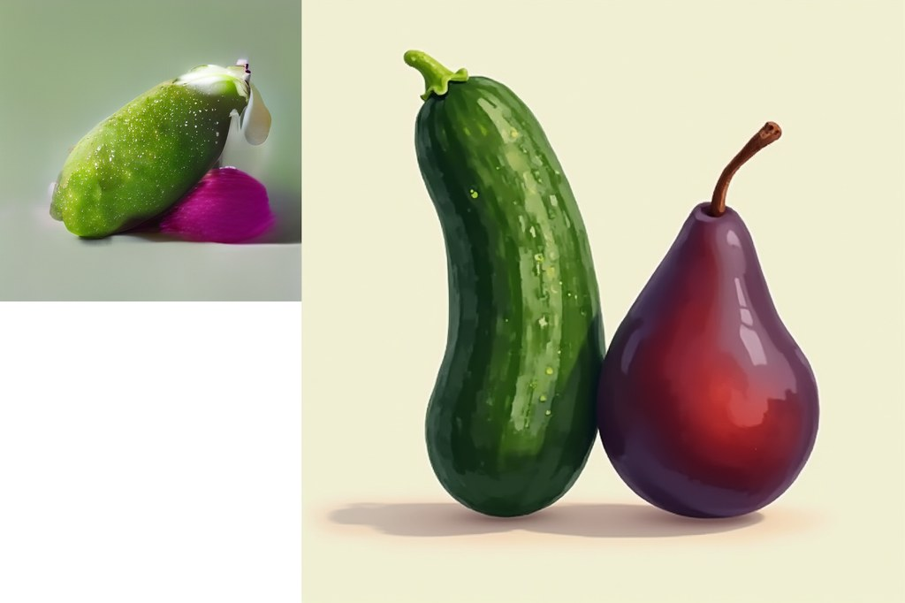

**`one turtle`** *(conf 0.90)*  
The prompt 'one turtle' is satisfied by both images, but the baseline (left) is a more natural and realistic representation of a single turtle, while the right image appears to be an AI-generated or stylized version with exaggerated features and patterns.


**`two rabbits`** *(conf 0.90)*  
The prompt 'two rabbits' is satisfied by both images. The baseline (left) shows two rabbits with distinct coloring (one grey/white, one white) and realistic textures. The ascr (right) shows two white rabbits with a more stylized, plastic-like appearance. The baseline is preferred for its more natural look and variety in rabbit coloring.

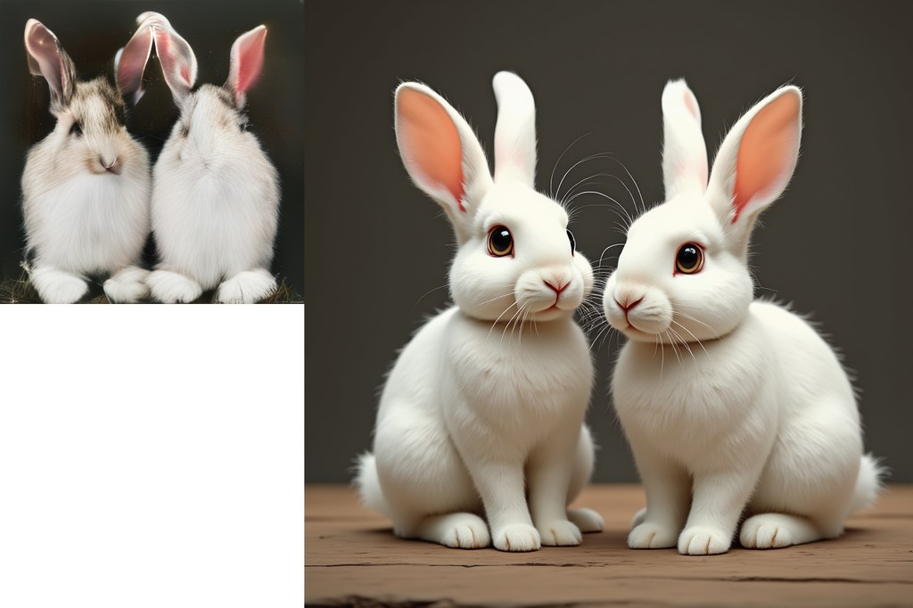

</details>


</details>

## Changelog

Dated experiment narratives have been moved to [docs/changelog.md](docs/changelog.md)
(latest first). The Stage 1 Status Log, Quick Results Summary, Stage 1 Benchmark Summary, and
the most recent independent GenEval section above remain the canonical current state.
